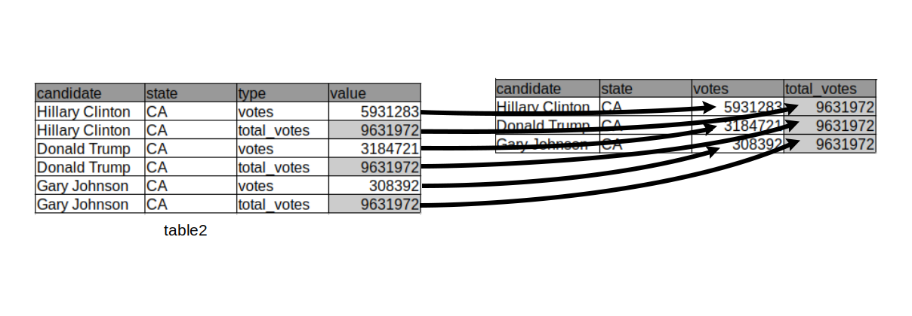
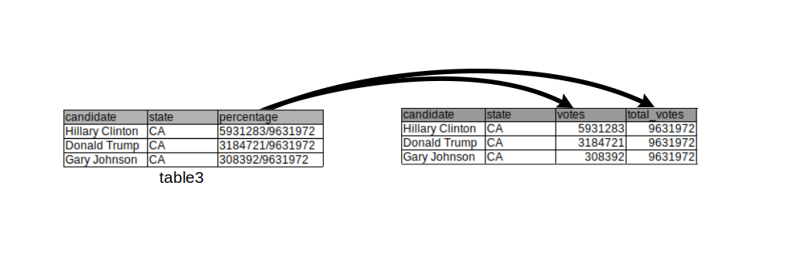
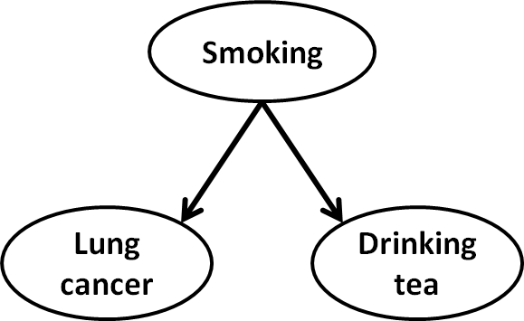
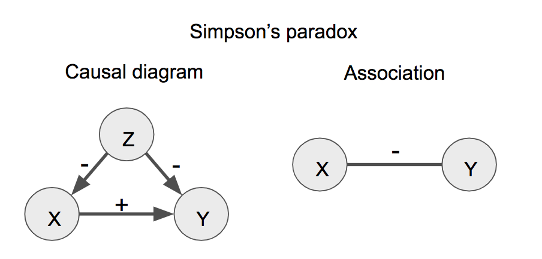
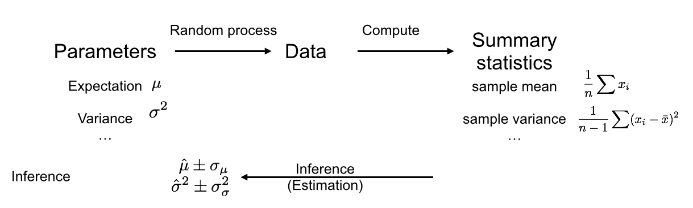
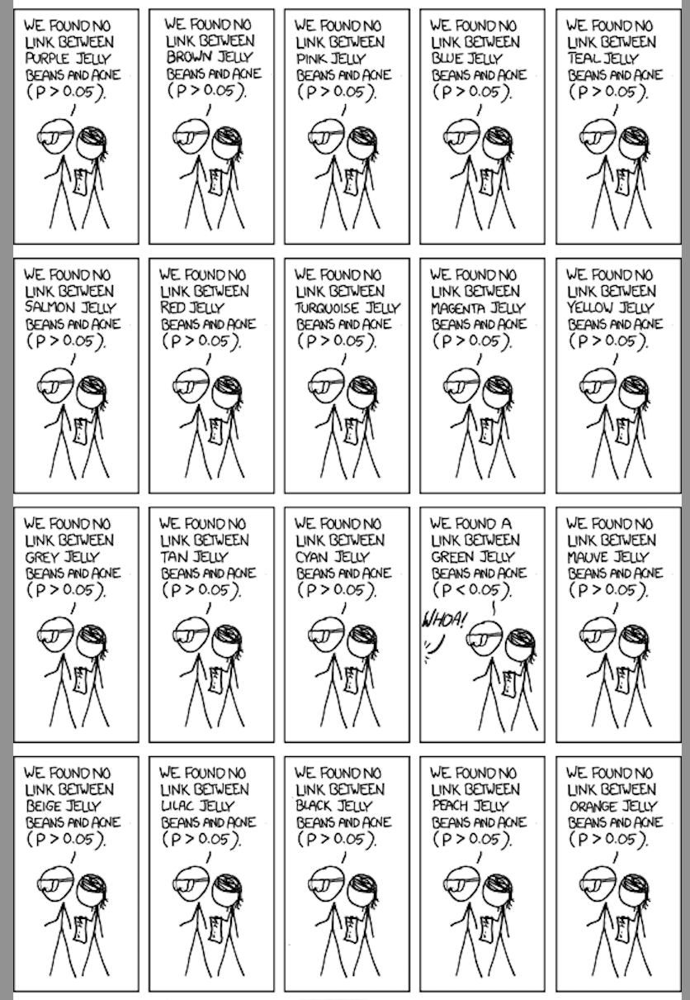
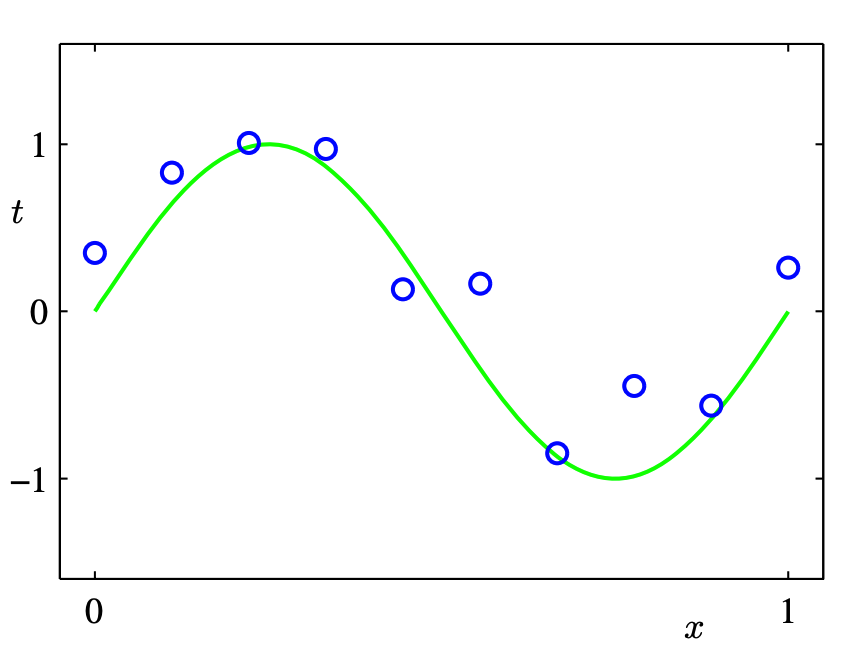
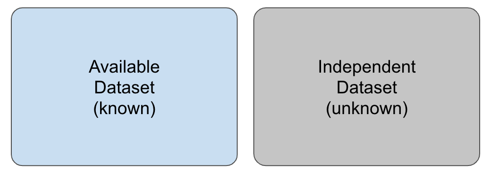
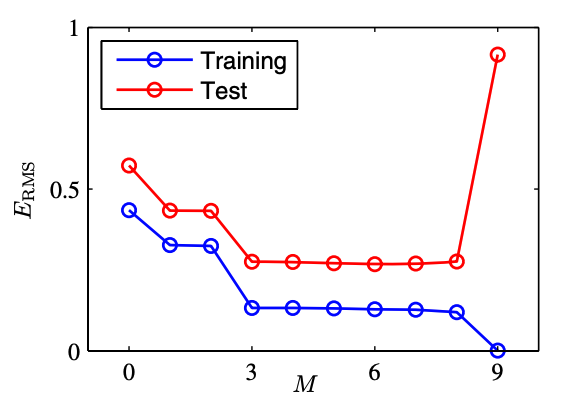

--- 
title: "Data Analysis and Visualization in R (IN2339)"
author: |
  | Chair of Computational Molecular Medicine
  | Technical University of Munich
date: "`r Sys.Date()`"
output:
  html_document:
    df_print: paged
documentclass: krantz
bibliography:
- book.bib
- packages.bib
biblio-style: apalike
link-citations: yes
colorlinks: yes
lot: no
lof: no
graphics: yes
urlcolor: blue
geometry: left=1.5in, right=1.5in, top=1.25in, bottom=1.25in
description: TODO This book introduces concepts and skills that can help you tackle
  real-world data analysis challenges. It covers concepts from probability, statistical
  inference, linear regression and machine learning and helps you develop skills such
  as R programming, data wrangling with dplyr, data visualization with ggplot2, file
  organization with UNIX/Linux shell, version control with GitHub, and reproducible
  document preparation with R markdown.
site: bookdown::bookdown_site
header-includes: \usepackage{float} \floatplacement{figure}{H}
always_allow_html: yes
subtitle: A practical introduction to Data Science
---
```{r include=FALSE, cache=FALSE}
rm(list = ls(all = TRUE))
# library(maps)## load maps first to avoid map conflict with purrr
# library(MASS) ## load MASS and matrixStats first to avoid select and count conflict
# library(matrixStats) 
# library(tidyverse)
# library(dslabs)
# ds_theme_set()
# 
# ## Adapted from Hadley Wickham and Garrett Grolemund's r4ds
# options(digits = 3, width = 72, formatR.indent = 2)
# 
# knitr::opts_chunk$set(
#   comment = "#>",
#   collapse = TRUE,
#   cache = TRUE,
#   width = 72,
#   tidy.opts=list(width.cutoff=72, tidy=TRUE),
#   out.width = "70%",
#   fig.align = 'center',
#   fig.width = 6,
#   fig.height = 3.708,  # width * 1 / phi
#   fig.show = "hold")
# 
# options(dplyr.print_min = 5, dplyr.print_max = 5)
```


```{r include=FALSE}
# automatically create a bib database for R packages
knitr::write_bib(c(
  .packages(), 'bookdown', 'knitr', 'rmarkdown'), 'packages.bib')
```

# Preface {-}

This is the lecture script of the module Data Analysis and Visualization in R (IN2339).

This work is licensed under the [Creative Commons Attribution-NonCommercial-ShareAlike 4.0 International (CC BY-NC-SA 4.0)](https://creativecommons.org/licenses/by-nc-sa/4.0)

# Acknowledgments {-}

This script has been first put together in the winter semester 2020/2021 by Felix Brechtmann, Alexander Karollus, Daniela Klaproth-Andrade, Pedro Silva, and Julien Gagneur with help from Xueqi Cao, Laura Martens, Ines Scheller, Vangelis Theodorakis, and Vicente Yépez.

We leveraged work from colleagues who helped creating lecture slides since 2017: Žiga Avsec, Ines Assum, Daniel Bader, Jun Cheng, Bašak Eraslan, Mathias Heinig, Jan Krumsieck, Christian Mertes, and Georg Stricker.


# Prerequisites {-}
Basics in probabilities are required. Chapters 13-15 ("Introduction to Statistics with R", "Probability" and "Random variables") of the Book "Introduction to Data Science" https://rafalab.github.io/dsbook/ make a good refresher. Make sure all concepts are familiar to you. Check your knowledge by trying the exercises. 

# Feedback {-}
For improvement suggestions, reporting errors and typos, please use the online document [here](https://docs.google.com/document/d/1tdWmtkDaNUnQLkG_cNfJ2KLHwnaldtQwZh6pUQh8Mpc/edit?usp=sharing).


<!--chapter:end:index.Rmd-->

```{r include=FALSE, cache=FALSE}
rm(list = ls(all = TRUE))
# library(maps)## load maps first to avoid map conflict with purrr
# library(MASS) ## load MASS and matrixStats first to avoid select and count conflict
# library(matrixStats) 
# library(tidyverse)
# library(dslabs)
# ds_theme_set()
# 
# ## Adapted from Hadley Wickham and Garrett Grolemund's r4ds
# options(digits = 3, width = 72, formatR.indent = 2)
# 
# knitr::opts_chunk$set(
#   comment = "#>",
#   collapse = TRUE,
#   cache = TRUE,
#   width = 72,
#   tidy.opts=list(width.cutoff=72, tidy=TRUE),
#   out.width = "70%",
#   fig.align = 'center',
#   fig.width = 6,
#   fig.height = 3.708,  # width * 1 / phi
#   fig.show = "hold")
# 
# options(dplyr.print_min = 5, dplyr.print_max = 5)
```
# Introduction {-}

## Data Science: What and why? {-}

Data science is an interdisciplinary field about processes and systems to extract knowledge or insights from data.
The goals of Data Science include discovering new phenomena or trends from data, enabling decisions based on facts derived from data, and communicating findings from data. It is a continuation of some of the data analysis fields such as statistics, data mining, and predictive analytics.

Data Science is at the heart of the scientific method, which starts with making data-driven observations to formulate testable hypotheses. It furthermore comes into play to visualize and assess experimental results. Data science skills are therefore necessary to any field of scientific research. Data science is the main tools of epidemiology, the study of health and disease in populations, which largely relies on observational data. Moreover data science is important in the industry, to understand operational process, and in business analytics, to understand a particular market. Hence, with the rise of big data in all areas of society, data science skills are some of the most demanded skills on the job market. Last, but not least, in an era of fake news, data science skills are important for citizens of modern societies. 

## What you will learn and not learn {-}

The goal of this course is to provide you with general analytic techniques to extract knowledge, patterns, and connections between samples and variables, and how to communicate these in an intuitive and clear way.

This course focuses on front-end data science. This means, it teaches practical skills to analyse data. We will focus on tidy data, visualizations, and data manipulation in R. To only then dive into the math required to understand and interpret analysis results.

This course does not teach back-end data science, i.e. it does not teach how to develop your own statistical or machine learning models, nor how to develop scalable data processing software.

Other courses offered by the faculty of Informatics cover data science back-end skills. 

## The R language {-}

R is a statistical programming language designed for data analytics. It is a great language for front-end data science, i.e. to rapidly manipulate, visualize and come to raising interesting hypotheses. 

Seen from a software developer point of view (i.e. from a back-end data science point of view), R can be seen cumbersome and not using memory and computing resources efficiently. The purpose of the R language is to reduce time spent in coding to maximize user's brain time on looking at the data and thinking about it, rather than reducing computer's running time. Of course, there are ways to develop efficient R software, notably by relying on implementation in lower languages such as C. This course does not cover such R developer skills. 

Another advantage of R is that it offers a very large set of libraries from many application areas.


## Course overview {-}

The lecture is structured into three main parts covering the major steps of data analysis:

1. **Get the data**: After basic introduction to R, learn how to fetch and manipulate real-world datasets. How to structure them to most conveniently work with them (tidy data).

2. **Look at the data**: Basic and advanced visualization techniques allows navigating large and complex datasets, identifying interesting signal, and formulating hypotheses. Typical sources of confounding are discussed. Recommendation to present an analysis in compelling fashion are also given. 

3. **Conclude**: Concepts of hypothesis testing will allow concluding about the statistical robustness of discovered associations. Also, methods from supervised learning will allow to model data and build accurate predictors.

The chapters of this script corresponds to individual lectures. Appendices provide further technical details as well as R tricks and tips. 

## Complementary reading {-}

These books offer complementary information to this script:

- Introduction to Data Science, Rafael A. Irizarry [https://rafalab.github.io/dsbook/]

- R for Data Science, Garrett Grolemund and Hadley Wickham [https://r4ds.had.co.nz/]

- Statistical Inference via Data Science, Chester Ismay and Albert Y. Kim [https://moderndive.com/]

- Fundamentals of Data Visualization, Claus O. Wilke [https://clauswilke.com/dataviz/] 

- Advanced R, Hadley Wickham [https://adv-r.hadley.nz/]


<!--chapter:end:../topic00_Introduction/script/script_00.Rmd-->

---
output:
  pdf_document: default
  html_document: default
---
```{r include=FALSE, cache=FALSE}
rm(list = ls(all = TRUE))
# library(maps)## load maps first to avoid map conflict with purrr
# library(MASS) ## load MASS and matrixStats first to avoid select and count conflict
# library(matrixStats) 
# library(tidyverse)
# library(dslabs)
# ds_theme_set()
# 
# ## Adapted from Hadley Wickham and Garrett Grolemund's r4ds
# options(digits = 3, width = 72, formatR.indent = 2)
# 
# knitr::opts_chunk$set(
#   comment = "#>",
#   collapse = TRUE,
#   cache = TRUE,
#   width = 72,
#   tidy.opts=list(width.cutoff=72, tidy=TRUE),
#   out.width = "70%",
#   fig.align = 'center',
#   fig.width = 6,
#   fig.height = 3.708,  # width * 1 / phi
#   fig.show = "hold")
# 
# options(dplyr.print_min = 5, dplyr.print_max = 5)
```
# (PART) Get {-}
# R basics
This chapter provides a quick introduction to the programming language R and to using the software RStudio. 

## Rstudio
Rstudio is a software that allows to program in R and interactively analyse data with R. It succinctly organizes your session into 4 panels each set up for you to do certain tasks: Edit and write code (source panel), run and execute code (console panel), list objects that you have in your environment and have a history of your past commands (environment/history panel), and a panel to show your folders' structure, see plots, install/load packages, and read the documentation of functions (files/plots/packages/help panel).

<!-- <!-- {#id .class width=600px height=400px} --> 
```{r, out.width = "900px", echo=FALSE}
 knitr::include_graphics( "assets/img/RStudio.png")
```

* the main script section, for writing scripts [top left section] (Ctrl+1 to focus)
* the console tab, for typing R commands directly [bottom left section as tab] (Ctrl+2 to focus)
* the terminal tab, for direct access to your system shell [bottom left section] (Shift+Alt+T to focus)
* the plot tab, where you see the last plot generated [bottom right section as tab]
* the help tab, with useful documentation of R functions [bottom right section as tab] (F1 on the name of a function or Ctrl+3)
* the history tab, with the list of the R commands used [top right section as tab]
* the environment tab, with the created variables and functions loaded [top right section as tab]
* and the packages tab, with the available/loaded R packages [bottom right section as tab]

Check the View menu to find out the rest of useful shortcuts!


## First steps with R
This section is largely borrowed from the book Introduction to Data Science by Rafael Irizarry (https://rafalab.github.io/dsbook).

### Objects

Suppose a high school student asks us for help to solve several quadratic equations of the form $ax^2+bx+c = 0$. The quadratic formula gives us the solutions:

$$
\frac{-b - \sqrt{b^2 - 4ac}}{2a}\,\, \mbox{ and } \frac{-b + \sqrt{b^2 - 4ac}}{2a}
$$
which of course change depending on the values of $a$, $b$, and $c$. One advantage of programming languages is that we can define variables and write expressions with these variables, similar to how we do so in math, but obtain a numeric solution. We will write out general code for the quadratic equation below, but if we are asked to solve $x^2 + x -1 = 0$, then we define:

```{r}
a <- 1
b <- 1
c <- -1
```

which stores the values for later use. We use `<-` to assign values to the variables. 

We can also assign values using `=` instead of `<-`, but we recommend against using `=` to avoid confusion.

Copy and paste the code above into your console to define the three variables. Note that R does not print anything when we make this assignment. This means the objects were defined successfully. Had you made a mistake, you would have received an error message. 

To see the value stored in a variable, we simply ask R to evaluate `a` and it shows the stored value:

```{r}
a
```

A more explicit way to ask R to show us the value stored in `a` is using `print` like this:

```{r}
print(a)
```

We use the term _object_ to describe stuff that is stored in R. 
<!--
Variables are examples, but objects can also be more complicated entities such as functions, which are described later.
-->


### The workspace

As we define objects in the console, we are actually changing the _workspace_. You can see all the variables saved in your workspace by typing:

```{r}
ls()
```

In RStudio, the variables of the environment are displayed in the _Environment_ tab.

We should see  `a`, `b`, and `c`. If you try to recover the value of a variable that is not in your workspace, you receive an error. For example, if you type `x` you will receive the following message: `Error: object 'x' not found`.

Now since these values are saved in variables, to obtain a solution to our equation, we use the quadratic formula:  

```{r}
(-b + sqrt(b^2 - 4*a*c) ) / ( 2*a )
(-b - sqrt(b^2 - 4*a*c) ) / ( 2*a )
```


### Functions 

Once you define variables, the data analysis process can usually be described as a series of _functions_ applied to the data. R includes several predefined functions and most of the analysis pipelines we construct make extensive use of these. 

We already used the `print`, and `ls` functions. We also used the function `sqrt` to solve the quadratic equation above. There are many more prebuilt functions and even more can be added through packages. These functions do not appear in the workspace because you did not define them, but they are available for immediate use.

In general, we need to use parentheses to evaluate a function. If you type `ls`, the function is not evaluated and instead R shows you the code that defines the function. If you type `ls()` the function is evaluated and, as seen above, we see objects in the workspace.

Unlike `ls`, most functions require one or more _arguments_. Below is an example of how we assign an object to the argument of the function `log`. Remember that we earlier defined `a` to be 1:

```{r}
log(8)
log(a) 
```

You can find out what the function expects and what it does by reviewing the very useful manuals included in R. You can get help by using the `help` function like this:

```{r, eval=FALSE}
help("log")
```

For most functions, we can also use this shorthand:

```{r, eval=FALSE}
?log
```

The help page will show you what arguments the function is expecting. For example, `log` needs `x` and `base` to run. Some arguments are required and others are optional. You can determine which arguments are optional by noting in the help document that a default value is assigned with `=`. Defining these is optional. For example, the base of the function `log` defaults to `base = exp(1)` making `log` the natural log by default. 

If you want a quick look at the arguments without opening the help system, you can type:

```{r}
args(log)
```

You can change the default values:

```{r}
log(8, base = 2)
```

Note that we have not been specifying the argument `x` as such:
```{r}
log(x = 8, base = 2)
```

The above code works, but we can save ourselves some typing: if no argument name is used, R assumes you are entering arguments in the order shown in the help file or by `args`. So by not using the names, it assumes the arguments are `x` followed by `base`:

```{r}
log(8,2)
```

If we use the arguments' names, then we can include them in whatever order we want:

```{r}
log(base = 2, x = 8)
```

To specify arguments, we must use `=`, and cannot use `<-`.

There are some exceptions to the rule that functions need the parentheses to be evaluated. Among these, the most commonly used are the arithmetic and relational operators. For example:

```{r}
2 ^ 3
```

You can see the arithmetic operators by typing:

```{r, eval = TRUE}
help("+") 
```

or 

```{r, eval = TRUE}
?"+"
```

and the relational operators by typing: 

```{r, eval = TRUE}
help(">") 
```

or 

```{r}
?">"
```

### Other prebuilt objects

There are several datasets that are included for users to practice and test out functions. You can see all the available datasets by typing:

```{r}
data()
```

This shows you the object name for these datasets. These datasets are objects that can be used by simply typing the name. For example, if you type:

```{r, eval=FALSE}
co2
```
R will show you Mauna Loa atmospheric CO2 concentration data.

Other prebuilt objects are mathematical quantities, such as the constant $\pi$ and $\infty$:
 
```{r}
pi
Inf+1
```

### Variable names

We have used the letters `a`, `b`, and `c` as variable names, but variable names can be almost anything. Some basic rules in R are that variable names have to start with a letter, can't contain spaces, and should not be variables that are predefined in R. For example, don't name one of your variables `install.packages` by typing something like 
`install.packages <- 2`.

A nice convention to follow is to use meaningful words that describe what is stored, use only lower case, and use underscores as a substitute for spaces. For the quadratic equations, we could use something like this:

```{r}
solution_1 <- (-b + sqrt(b^2 - 4*a*c)) / (2*a)
solution_2 <- (-b - sqrt(b^2 - 4*a*c)) / (2*a)
```

For more advice, we highly recommend studying Hadley Wickham's style guide^[http://adv-r.had.co.nz/Style.html].

<!-- ### Saving your workspace -->

<!-- Values remain in the workspace until you end your session or erase them with the function `rm`. But workspaces also can be saved for later use. In fact, when you quit R, the program asks you if you want to save your workspace. If you do save it, the next time you start R, the program will restore the workspace.  -->

<!-- We actually recommend against saving the workspace this way because, as you start working on different projects, it will become harder to keep track of what is saved. Instead, we recommend you assign the workspace a specific name. You can do this by using the function `save` or `save.image`. To load, use the function `load`. When saving a workspace, we recommend the suffix `rda` or `RData`. In RStudio, you can also do this by navigating to the _Session_ tab and choosing _Save Workspace as_. You can later load it using the _Load Workspace_ options in the same tab. -->
<!-- You can read the help pages on  `save`, `save.image`, and  `load` to learn more.  -->


### Reusing scripts

To solve another equation such as $3x^2 + 2x -1$, we can copy and paste the code above and then redefine the variables and recompute the solution:

```{r, eval=FALSE}
a <- 3
b <- 2
c <- -1
(-b + sqrt(b^2 - 4*a*c)) / (2*a)
(-b - sqrt(b^2 - 4*a*c)) / (2*a)
```

By creating and saving a script with the code above, we would not need to retype everything each time and, instead, simply change the variable names. Try writing the script above into an editor and notice how easy it is to change the variables and receive an answer.

### Commenting your code 

If a line of R code starts with the symbol `#`, it is not evaluated. We can use this to write reminders of why we wrote particular code. For example, in the script above we could add:


```{r, eval=FALSE}
## Code to compute solution to quadratic equation of the form ax^2 + bx + c
## define the variables
a <- 3 
b <- 2
c <- -1
## now compute the solution
(-b + sqrt(b^2 - 4*a*c)) / (2*a)
(-b - sqrt(b^2 - 4*a*c)) / (2*a)
```


## Data types

Variables in R can be of different types. For example, we need to distinguish numbers from character strings and tables from simple lists of numbers. The function `class` helps us determine what type of object we have:

```{r}
a <- 2
class(a)
```

To work efficiently in R, it is important to learn the different types of variables and what we can do with these.

### Data frames {#data-frames}

Up to now, the variables we have defined are just one number. We might be interested in storing more complex data. The most common way of storing a dataset in R is in a _data frame_. Conceptually, we can think of a data frame as a table with rows representing observations and the different variables reported for each observation defining the columns. Data frames are particularly useful for datasets because we can combine different data types into one object. 

A large proportion of data analysis challenges start with data stored in a data frame.<!--For example, we stored the data for our motivating example in a data frame.-->You can access this dataset by loading the __dslabs__ library and loading the `murders` dataset using the `data` function:

```{r}
library(dslabs)
data(murders)
```

To see that this is in fact a data frame, we type:

```{r}
class(murders)
```

### Examining an object

The function `str` is useful for finding out more about the structure of an object:

```{r, echo=FALSE}
# change str to make sure it stays within margins
str <- function(x) utils::str(x, strict.width = 'wrap')
```

```{r}
str(murders)
```

```{r, echo=FALSE}
# remove str we defined
rm(str)
```

This tells us much more about the object. We see that the table has 51 rows (50 states plus DC) and five variables (stored as columns). We can show the first six lines using the function `head`:

```{r}
head(murders)  # same as murders[1:6]
```

In this dataset, each state is considered an observation and five variables are reported for each state.

Before we go any further in answering our original question about different states, let's learn more about the components of this object.

### The accessor: `$`

For our analysis, we will need to access the different variables represented by columns included in this data frame. To do this, we use the accessor operator `$` in the following way:

```{r}
murders$population
```

But how did we know to use `population`? Previously, by applying the function `str` to the object `murders`, we revealed the names for each of the five variables stored in this table. We can quickly access the variable names using:

```{r}
names(murders)
```

It is important to know that the order of the entries in `murders$population` preserves the order of the rows in our data table. 

<!--
This will later permit us to manipulate one variable based on the results of another. For example, we will be able to order the state names by the number of murders.
-->

**Tip**: R comes with a very nice auto-complete functionality that saves us the trouble of typing out all the names. Try typing `murders$p` then hitting the _tab_ key on your keyboard. This functionality and many other useful auto-complete features are available when working in RStudio.

### Vectors: numerics, characters, and logical

The object `murders$population` is not one number but several. We call these types of objects _vectors_. A single number is technically a vector of length 1, but in general we use the term vectors to refer to objects with several entries. The function `length` tells you how many entries are in the vector:

```{r}
pop <- murders$population
length(pop)
```

This particular vector is _numeric_ since population sizes are numbers:

```{r}
class(pop)
```
In a numeric vector, every entry must be a number. 

To store character strings, vectors can also be of class _character_. For example, the state names are characters:

```{r}
class(murders$state)
```

As with numeric vectors, all entries in a character vector need to be a character.

Another important type of vectors are _logical vectors_. These must be either `TRUE` or `FALSE`. 

```{r}
z <- 3 == 2
z
class(z)
```

Here the `==` is a relational operator asking if 3 is equal to 2. In R, if you just use one `=`, you actually assign a variable, but if you use two `==` you test for equality. 

You can see the other _relational operators_ by typing:

```{r, eval=FALSE}
?Comparison
```

In future sections, you will see how useful relational operators can be.

**Advanced**: Mathematically, the values in `pop` are integers and there is an integer class in R. However, by default, numbers are assigned class numeric even when they are round integers. For example, `class(1)` returns numeric. You can turn them into class integer with the `as.integer()` function or by adding an `L` like this: `1L`. Note the class by typing: `class(1L)`


### Factors {#factors}

In the `murders` dataset, we might expect the region to also be a character vector. However, it is not:

```{r}
class(murders$region)
```

It is a _factor_. Factors are useful for storing categorical data. We can see that there are only 4 regions by using the `levels` function:


```{r}
levels(murders$region)
```

In the background, R stores these _levels_ as integers and keeps a map to keep track of the labels. This is more memory efficient than storing all the characters. 

Note that the levels have an order that is different from the order of appearance in the factor object. The default in R is for the levels to follow alphabetical order. However, often we want the levels to follow a different order. You can specify an order through the `levels` argument when creating the factor with the `factor` function. For example, in the murders dataset regions are ordered from east to west.  The function `reorder` lets us change the order of the levels of a factor variable based on a summary computed on a numeric vector. We will demonstrate this with a simple example, and will see more advanced ones in the Data Visualization part of the book. 


Suppose we want the levels of the region by the total number of murders rather than alphabetical order. If there are values associated with each level, we can use the `reorder` and specify a data summary to determine the order. The following code takes the sum of the total murders in each region, and reorders the factor following these sums.

```{r}
region <- murders$region
value <- murders$total
region <- reorder(region, value, FUN = sum)
levels(region)
```

The new order is in agreement with the fact that the Northeast has the least murders and the South has the most.

**Warning**: Factors can be a source of confusion since sometimes they behave like characters and sometimes they do not. As a result, confusing factors and characters are a common source of bugs.  

### Lists

Data frames are a special case of _lists_. Lists are useful because they can store any combination of different types. You can create a list using the `list` function like this:

```{r}
record <- list(name = "John Doe",
             student_id = 1234,
             grades = c(95, 82, 91, 97, 93),
             final_grade = "A")
```

The function `c` is described in Section \@ref(vectors).

This list includes a character, a number, a vector with five numbers, and another character.

```{r}
record
class(record)
```


As with data frames, you can extract the components of a list with the accessor `$`. 

```{r}
record$student_id
```

We can also use double square brackets (`[[`) like this:

```{r}
record[["student_id"]]
```

You should get used to the fact that in R, there are often several ways to do the same thing, such as accessing entries.

You might also encounter lists without variable names.

```{r,}
record2 <- list("John Doe", 1234)
record2
```

If a list does not have names, you cannot extract the elements with `$`, but you can still use the brackets method and instead of providing the variable name, you provide the list index, like this:

```{r}
record2[[1]]
```

<!--
We won't be using lists until later, but you might encounter one in your own exploration of R. For this reason, we show you some basics here. 
-->

### Matrices {#matrices}

Matrices are another very common object type in R. Matrices are similar to data frames in that they are two-dimensional: they have rows and columns. However, like numeric, character and logical vectors, entries in matrices have to be all the same type. For this reason data frames are much more useful for storing data, since we can have characters, factors, and numbers in them. 

Yet matrices have a major advantage over data frames: we can perform matrix algebra operations, a powerful type of mathematical technique. We do not describe these operations in this book, but much of what happens in the background when you perform a data analysis involves matrices. 

<!-- We cover matrices in more detail in Chapter \@ref(matrix-algebra) but describe them briefly here since some of the functions we will learn return matrices.  -->

We can define a matrix using the `matrix` function. We need to specify the number of rows and columns.

```{r}
mat <- matrix(1:12, nrow = 4, ncol = 3)
mat
```

You can access specific entries in a matrix using square brackets (`[`). If you want the second row, third column, you use:

```{r}
mat[2, 3]
```

If you want the entire second row, you leave the column spot empty:

```{r}
mat[2, ]
```

Notice that this returns a vector, not a matrix.

Similarly, if you want the entire third column, you leave the row spot empty:

```{r}
mat[, 3]
```

This is also a vector, not a matrix.

You can access more than one column or more than one row if you like. This will give you a new matrix.

```{r}
mat[, 2:3]
```

You can subset both rows and columns:

```{r}
mat[1:2, 2:3]
```

We can convert matrices into data frames using the function `as.data.frame`:

```{r}
as.data.frame(mat)
```

You can also use single square brackets (`[`) to access rows and columns of a data frame:

```{r}
data("murders")
murders[25, 1]
murders[2:3, ]
```


##  Vectors {#vectors}

In R, the most basic objects available to store data are _vectors_. As we have seen, complex datasets can usually be broken down into components that are vectors. For example, in a data frame, each column is a vector. Here we learn more about this important class.

### Creating vectors

We can create vectors using the function `c`, which stands for _concatenate_. We use `c` to concatenate entries in the following way:

```{r}
codes <- c(380, 124, 818)
codes
```

We can also create character vectors. We use the quotes to denote that the entries are characters rather than variable names.

```{r}
country <- c("italy", "canada", "egypt")
```

In R you can also use single quotes:

```{r}
country <- c('italy', 'canada', 'egypt')
```

But be careful not to confuse the single quote ' with the _back quote_ `. 
By now you should know that if you type:
```{r, eval=FALSE}
country <- c(italy, canada, egypt)
```
you receive an error because the variables `italy`, `canada`, and `egypt` are not defined. If we do not use the quotes, R looks for variables with those names and returns an error.

### Names

Sometimes it is useful to name the entries of a vector. For example, when defining a vector of country codes, we can use the names to connect the two:

```{r}
codes <- c(italy = 380, canada = 124, egypt = 818)
codes
```

The object `codes` continues to be a numeric vector:
```{r}
class(codes)
```
but with names:
```{r}
names(codes)
```

If the use of strings without quotes looks confusing, know that you can use the quotes as well:

```{r}
codes <- c("italy" = 380, "canada" = 124, "egypt" = 818)
codes
```

There is no difference between this function call and the previous one. This is one of the many ways in which R is quirky compared to other languages.

We can also assign names using the `names` functions:

```{r}
codes <- c(380, 124, 818)
country <- c("italy","canada","egypt")
names(codes) <- country
codes
```

### Sequences

Another useful function for creating vectors in sequences is `seq`:

```{r}
seq(1, 10)
```

The first argument defines the start, and the second defines the end which is included. The default is to go up in increments of 1, but a third argument lets us tell it how much to jump by:

```{r}
seq(1, 10, 2)
```

If we want consecutive integers, we can use the following shorthand:

```{r}
1:10
```

When we use these functions, R produces integers, not numerics, because they are typically used to index something:

```{r}
class(1:10)
```

However, if we create a sequence including non-integers, the class changes:

```{r}
class(seq(1, 10, 0.5))
```

### Subsetting

We use square brackets to access specific elements of a vector. For the vector `codes` we defined above, we can access the second element using:
```{r}
codes[2]
```

You can get more than one entry by using a multi-entry vector as an index:
```{r}
codes[c(1,3)]
```

The sequences defined above are particularly useful if we want to access, say, the first two elements:

```{r}
codes[1:2]
```

If the elements have names, we can also access the entries using these names. Below are two examples.

```{r}
codes["canada"]
codes[c("egypt","italy")]
```

## Coercion

In general, _coercion_ is an attempt by R to be flexible with data types. When an entry does not match the expected, some of the prebuilt R functions try to guess what was meant before throwing an error. This can also lead to confusion. Failing to understand _coercion_ can drive programmers crazy when attempting to code in R since it behaves quite differently from most other languages in this regard. Let's learn about it with some examples.

We said that vectors must be all of the same type. So if we try to combine, say, numbers and characters, you might expect an error:

```{r}
x <- c(1, "canada", 3)
```

But we don't get one, not even a warning! What happened? Look at `x` and its class:

```{r}
x
class(x)
```

R _coerced_ the data into characters. It guessed that because you put a character string in the vector, you meant the 1 and 3 to actually be character strings `"1"` and "`3`". The fact that not even a warning is issued is an example of how coercion can cause many unnoticed errors in R. 

R also offers functions to change from one type to another. For example, you can turn numbers into characters with:

```{r}
x <- 1:5
y <- as.character(x)
y
```

You can turn it back with `as.numeric`:

```{r}
as.numeric(y)
```
 
This function is actually quite useful since datasets that include numbers as character strings are common. 

### Not availables (NA)

When a function tries to coerce one type to another and encounters an impossible case, it usually gives us a warning and turns the entry into a special value called an `NA` for "not available".  For example:

```{r}
x <- c("1", "b", "3")
as.numeric(x)
```

R does not have any guesses for what number you want when you type `b`, so it returns `NA`.

As a data scientist you will encounter the `NA`s often as they are generally used for missing data, a common problem in real-world datasets.


## Sorting

Now that we have mastered some basic R knowledge, let's try to gain some insights into the safety of different states in the context of gun murders. 

### `sort` 

Say we want to rank the states from least to most gun murders. The function `sort` sorts a vector in increasing order. We can therefore see the largest number of gun murders by typing:

```{r}
library(dslabs)
data(murders)
sort(murders$total)
```

However, this does not give us information about which states have which murder totals. For example, we don't know which state had `r max(murders$total)`.

### `order`

The function `order` is closer to what we want. It takes a vector as input and returns the vector of indexes that sorts the input vector. This may sound confusing so let's look at a simple example. We can create a vector and sort it:

```{r}
x <- c(31, 4, 15, 92, 65)
sort(x)
```

Rather than sorting the input vector, the function `order` returns the indexes that sort the input vector:

```{r}
index <- order(x)
x[index]
```

This is the same output as that returned by `sort(x)`. If we look at this index, we see why it works:
```{r}
x
order(x)
```

The second entry of `x` is the smallest, so `order(x)` starts with `2`. The next smallest is the third entry, so the second entry is `3` and so on. 

How does this help us order the states by murders? First, remember that the entries of vectors you access with `$` follow the same order as the rows in the table. For example, these two vectors containing state names and abbreviations, respectively, are matched by their order:

```{r}
murders$state[1:6]
murders$abb[1:6]
```

This means we can order the state names by their total murders. We first obtain the index that orders the vectors according to murder totals and then index the state names vector:

```{r}
ind <- order(murders$total)
murders$abb[ind] 
```

According to the above, California (CA) had the most murders.

### `max` and `which.max`

If we are only interested in the entry with the largest value, we can use `max` for the value:

```{r}
max(murders$total)
```

and `which.max` for the index of the largest value:

```{r}
i_max <- which.max(murders$total)
murders$state[i_max]
```

For the minimum, we can use `min` and `which.min` in the same way.

Does this mean California is the most dangerous state? In an upcoming section, we argue that we should be considering rates instead of totals. Before doing that, we introduce one last order-related function: `rank`.

### `rank`

Although not as frequently used as `order` and `sort`, the function `rank` is also related to order and can be useful.
For any given vector it returns a vector with the rank of the first entry, second entry, etc., of the input vector. Here is a simple example:

```{r}
x <- c(31, 4, 15, 92, 65)
rank(x)
```


### Beware of recycling

Another common source of unnoticed errors in R is the use of _recycling_. We saw that vectors are added element-wise. So if the vectors don't match in length, it is natural to assume that we should get an error. But we don't. Notice what happens:

```{r, warning=TRUE}
x <- c(1,2,3)
y <- c(10, 20, 30, 40, 50, 60, 70)
x+y
```
We do get a warning, but no error. For the output, R has recycled the numbers in `x`. Notice the last digit of numbers in the output. 

## Vector arithmetics

California had the most murders, but does this mean it is the most dangerous state? What if it just has many more people than any other state? We can quickly confirm that California indeed has the largest population:

```{r}
library(dslabs)
data("murders")
murders$state[which.max(murders$population)]
```

with over `r floor(max(murders$population)/10^6)` million inhabitants. It is therefore unfair to compare the totals if we are interested in learning how safe the state is. What we really should be computing is the murders per capita (murders per 100,000 as the unit). To compute this quantity, the powerful vector arithmetic capabilities of R come in handy.

### Rescaling a vector

In R, arithmetic operations on vectors occur _element-wise_. For a quick example, suppose we have height in inches:

```{r}
inches <- c(69, 62, 66, 70, 70, 73, 67, 73, 67, 70)
```
and want to convert to centimeters. Notice what happens when we multiply `inches` by 2.54:

```{r}
inches * 2.54
```
 
In the line above, we multiplied each element by 2.54.  Similarly, if for each entry we want to compute how many inches taller or shorter than 69 inches, the average height for males, we can subtract it from every entry like this:

```{r}
inches - 69
```


### Two vectors

If we have two vectors of the same length, and we sum them in R, they will be added entry by entry as follows:

$$
\begin{pmatrix}
a\\
b\\
c\\
d
\end{pmatrix}
+
\begin{pmatrix}
e\\
f\\
g\\
h
\end{pmatrix}
=
\begin{pmatrix}
a +e\\
b + f\\
c + g\\
d + h
\end{pmatrix}
$$

The same holds for other mathematical operations, such as `-`, `*` and `/`.

This implies that to compute the murder rates we can simply type:

```{r}
murder_rate <- murders$total / murders$population * 100000
```

Once we do this, we notice that California is no longer near the top of the list. In fact, we can use what we have learned to order the states by murder rate:

```{r}
murders$abb[order(murder_rate)]
```

## Indexing

R provides a powerful and convenient way of indexing vectors. We can, for example, subset a vector based on properties of another vector. In this section, we continue working with our US murders example, which we can load like this:

```{r}
library(dslabs)
data("murders")
```

### Subsetting with logicals

We have now calculated the murder rate using:

```{r}
murder_rate <- murders$total / murders$population * 100000 
```

Imagine you are moving from Italy where, according to an ABC news report, the murder rate is only 0.71 per 100,000. You would prefer to move to a state with a similar murder rate. Another powerful feature of R is that we can use logicals to index vectors. If we compare a vector to a single number, it actually performs the test for each entry. The following is an example related to the question above:

```{r}
ind <- murder_rate < 0.71
```

If we instead want to know if a value is less or equal, we can use:

```{r}
ind <- murder_rate <= 0.71
```

Note that we get back a logical vector with `TRUE` for each entry smaller than or equal to 0.71. To see which states these are, we can leverage the fact that vectors can be indexed with logicals.

```{r}
murders$state[ind]
```

In order to count how many are TRUE, the function `sum` returns the sum of the entries of a vector and logical vectors get _coerced_ to numeric with `TRUE` coded as 1 and `FALSE` as 0. Thus we can count the states using:

```{r}
sum(ind)
```


### Logical operators

Suppose we like the mountains and we want to move to a safe state in the western region of the country. We want the murder rate to be at most 1. In this case, we want two different things to be true. Here we can use the logical operator _and_, which in R is represented with `&`. This operation results in `TRUE` only when both logicals are `TRUE`. To see this, consider this example:

```{r}
TRUE & TRUE
TRUE & FALSE
FALSE & FALSE
```

For our example, we can form two logicals:

```{r}
west <- murders$region == "West"
safe <- murder_rate <= 1
```

and we can use the `&`  to get a vector of logicals that tells us which states satisfy both conditions:

```{r}
ind <- safe & west
murders$state[ind]
```

### `which`

Suppose we want to look up California's murder rate. For this type of operation, it is convenient to convert vectors of logicals into indexes instead of keeping long vectors of logicals. The function `which` tells us which entries of a logical vector are TRUE. So we can type:

```{r}
ind <- which(murders$state == "California")
murder_rate[ind]
```


### `match`

If instead of just one state we want to find out the murder rates for several states, say New York, Florida, and Texas, we can use the function `match`. This function tells us which indexes of a second vector match each of the entries of a first vector:

```{r}
ind <- match(c("New York", "Florida", "Texas"), murders$state)
ind
```

Now we can look at the murder rates:

```{r}
murder_rate[ind]
```

### `%in%`


If rather than an index we want a logical that tells us whether or not each element of a first vector is in a second, we can use the function `%in%`. Let's imagine you are not sure if Boston, Dakota, and Washington are states. You can find out like this:

```{r}
c("Boston", "Dakota", "Washington") %in% murders$state
```

Note that we will be using `%in%` often throughout the book.

**Advanced**: There is a connection between `match` and `%in%` through `which`. To see this, notice that the following two lines produce the same index (although in different order): 

```{r}
match(c("New York", "Florida", "Texas"), murders$state)
which(murders$state%in%c("New York", "Florida", "Texas"))
```

## R programming

We teach R because it greatly facilitates data analysis. By coding in R, we can efficiently perform exploratory data analysis, build data analysis pipelines, and prepare data visualization to communicate results. However, R is not just a data analysis environment but a programming language. Advanced R programmers can develop complex packages and even improve R itself, but we do not cover advanced programming. Nonetheless, in Appendix \@ref(appendix-r-programming), we introduce three key programming concepts: conditional expressions, for-loops, and functions. These are not just key building blocks for advanced programming, but are sometimes useful during data analysis.

\pagebreak


<!--chapter:end:../topic01_R_Basics/script/script_01.Rmd-->

---
output:
  html_document: default
  pdf_document: default
---
```{r include=FALSE, cache=FALSE}
rm(list = ls(all = TRUE))
# library(maps)## load maps first to avoid map conflict with purrr
# library(MASS) ## load MASS and matrixStats first to avoid select and count conflict
# library(matrixStats) 
# library(tidyverse)
# library(dslabs)
# ds_theme_set()
# 
# ## Adapted from Hadley Wickham and Garrett Grolemund's r4ds
# options(digits = 3, width = 72, formatR.indent = 2)
# 
# knitr::opts_chunk$set(
#   comment = "#>",
#   collapse = TRUE,
#   cache = TRUE,
#   width = 72,
#   tidy.opts=list(width.cutoff=72, tidy=TRUE),
#   out.width = "70%",
#   fig.align = 'center',
#   fig.width = 6,
#   fig.height = 3.708,  # width * 1 / phi
#   fig.show = "hold")
# 
# options(dplyr.print_min = 5, dplyr.print_max = 5)
```
# Data wrangling

```{r include=F}
DATADIR <- file.path('extdata')
```

Data wrangling refers to the task of processing raw data into useful formats.
This Chapter introduces basic data wrangling operations in R using `data.tables`.

## Data.tables
### Overview

`data.table` objects are a modern implementation of tables containing variables stored in columns and observations stored in rows. Base R provides a similar structure called `data.frame`. However, we will exclusively use `data.table` in this course because `data.frame` objects are a lot slower and often a little more complicated to use.

A `data.table` is a memory efficient and faster implementation of `data.frame`. It is more efficient because it operates on its columns by reference. In contrast modifying a `data.frame` leads R to copy the entire `data.frame`. 
 
Like a `data.frame`, each column can have a different type. Unlike a `data.frame`, it doesn't have row names. It accepts all `data.frame` functions to ensure compatibility, but it has a shorter and more flexible syntax. This may be not so straightforward in the beginning but pays off and saves time on two fronts:

* programming (easier to code, read, debug and maintain)
* computing (fast and memory efficient)

The general basic form of the data.table syntax is:

    DT[ i,  j,  by ] #
        |   |   |
        |   |    -------> grouped by what?
        |    -------> what to do with the columns?
         ---> on which rows?
         
The way to read this out loud is: "Take `DT`, subset rows by `i`, then compute `j` grouped by `by`". 

We will now describe some basic usage examples expanding on this definition. First of all, let us create and inspect some `data.tables` to get a first impression.

### Creating and loading tables {#creating-and-loading-tables}

To create a `data.table`, we just name its columns and populate them. All the columns have to have the same length. If vectors of different lengths are provided upon creation of a `data.table`, R automatically recycles the values of the shorter vectors. Here is an example:

```{r}
# install.packages("data.table")
library(data.table)
DT <- data.table(x = rep(c("a","b","c"), each = 3), y = c(1, 3, 6), v = 1:9)
DT # note how column y was recycled
```

If we want to convert any other R object to a `data.table`, all we have to do is to call the `as.data.table()` function. This is typically done for `data.frame` objects.

```{r}
# This way we can for example convert any built-in dataset
# coming as a data.frame into a data.table:
titanic_dt <- as.data.table(Titanic)
class(titanic_dt)
```

Here you can see that the class function informs us that `titanic_dt` is both a `data.table` and a `data.frame` as `data.table` inherits
from `data.frame`.

Alternatively, we can read files from disk and process them using `data.table`. The easiest way to do so is to use the function `fread()`. Here is an example using a subset of the Kaggle flight and airports dataset that is limited to flights going in or to the Los Angeles airport. We refer to the description Kaggle flights and airports challenge for more details [https://www.kaggle.com/tylerx/flights-and-airports-data]. 

To run the following code, save the comma-separated value file `flightsLAX.csv` into a local folder of your choice and replace the string `"path_to_file"` with the actual path to your `flightsLAX.csv` file. For example `"path_to_file"` could be substituted with `"/Users/samantha/mydataviz_folder/extdata"`. See Appendix I "Importing data" for more details.

```{r, eval=FALSE}
flights <- fread('path_to_file/flightsLAX.csv')
```

```{r, echo=FALSE}
flights <- fread(file.path(DATADIR, 'flights/flightsLAX.csv'))
flights <- flights[, .(YEAR, MONTH, DAY, DAY_OF_WEEK, AIRLINE, FLIGHT_NUMBER, TAIL_NUMBER, ORIGIN_AIRPORT,
                        DESTINATION_AIRPORT, DEPARTURE_TIME, AIR_TIME, DISTANCE, ARRIVAL_TIME)]
```

Typing the name of the newly created `data.table` (`flights`) in the console displays its first and last rows. We observe that reading the file was successful.
```{r}
flights
```

### Inspecting tables

A first step in any analysis should involve inspecting the data we just read in. This often starts by looking the first and last rows of the table as we did above. The next information we are often interested in is the size of our data set. We can use the following commands to obtain it:
```{r}
ncol(flights)   # nrow(flights) for number of rows
dim(flights)    # returns nrow and ncol
```

<!-- ### Technical details -->

<!-- The structure of the `data.table` is essentially a list of lists. To get the dimensions of our `data.table` we can either use the `dim()` function to get the dimensions of our data.table (M rows x N columns) or to use the `ncol()` `nrow()` functions: -->

<!-- ```{r} -->
<!-- class(DT) -->
<!-- is.list(DT) -->
<!-- nrow(DT)   # ncol(DT) -->
<!-- dim(DT) -->
<!-- ``` -->


Next, we are often interested in basic statistics on the columns. To obtain this information we can call the `summary()` function on the table.

```{r}
summary(flights[,1:6])

```

This provides us already a lot of information about our data. We can for example see that all data is from 2015 as all values in the YEAR column are 2015. But for categorical data this is not very insightful, as we can see for the AIRLINE column.

To investigate categorical columns we can have a look at their unique elements using:
```{r}
flights[, unique(AIRLINE)]

```
This command provided us the airline identifiers present in the dataset. Another valuable information for categorical variables is how often each category occurs. This can be obtained using the following commands:
```{r}
flights[, table(AIRLINE)]
```


## Row subsetting
As mentioned, the general basic form of the data.table syntax is:

    DT[ i,  j,  by ] #
        |   |   |
        |   |    -------> grouped by what?
        |    -------> what to do with the columns?
        ---> on which rows?

Let us first look at the `i` argument, i.e. row indexing. The parameter `i` can be any vector of integers, corresponding to the row indices to select, or some logical vectors indicating which rows to select. Here are some typical examples.  

### Subsetting rows by indices

If we want to see the second element of the table, we can do the following:

```{r}
flights[2, ]   # Access the 2nd row (also flights[2] or flights[i = 2])
```

A shorter writing allows leaving out the comma:
```{r}
flights[2]   # Access the 2nd row (also flights[2] or flights[i = 2])
```


For accessing multiple consecutive rows we can use the `start:stop` syntax as for example:
```{r}
flights[1:3]   
```

Accessing multiple rows that are not necessarily consecutive can be done by creating an index vector with `c()`:
```{r}
flights[c(3, 5)]
```

### Subsetting rows by logical conditions

Often, a more useful way to subset rows is using logical conditions, using for `i` a logical vector. We can create such logical vectors using the following binary operators:

* `==`
* `<` 
* `>`
* `!=`
* `%in%`

For example, entries of flights operated by "AA" (American Airlines) can be extracted using:

```{r}
flights[AIRLINE == "AA"]
```

Alternatively, if we are interested in all flights from any destination to the airports in NYC ("JFK" and "LGA"), we can subset the rows using the following command:
```{r}
flights[DESTINATION_AIRPORT %in% c("LGA", "JFK")]
```

Additionally, we can concatenate multiple conditions using the logical OR `|` or the logical AND `&` operator. For instance, if we want to inspect all flights departing between 6am and 7am operated by American Airlines we can use the following statement:

```{r}
flights[AIRLINE == "AA" & DEPARTURE_TIME > 600 & DEPARTURE_TIME < 700]
```


## Column operations

You may have wondered why R correctly runs code such as `flights[AIRLINE == "AA"]` although `AIRLINE` is not a variable of the environment but a column of the `data.table` `flights`. Such a call would not execute properly with a `data.frame`. The reason is that code entered inside the ``[]`` brackets of a `data.table` is interpreted using the `data.table` environment. Inside this environment, columns are seen as variables already. This makes the syntax very light and readable for row subsetting as we just saw. It becomes particularly powerful for column operations. We now look at this.

Although feasible, it is not advisable to access a column by its number since the ordering or number of columns can easily change. Also, if you have a data set with a large number of columns (e.g. 50), how do you know which one is column 18? Therefore, **use the column name instead**. Using column names prevents bugs.  

### Working with columns
Accessing columns by name also makes the code more readable: `flights[, TAIL_NUMBER]` instead of `flights[, 7]`.

```{r}
flights[1:10, TAIL_NUMBER]    # Access column x (also DT$x or DT[j=x]). 
```

For accessing a specific cell (i.e. specific column and specific row), we can use the following syntax:
```{r}
flights[4, TAIL_NUMBER]   # Access a specific cell.
```

This command for accessing multiple columns would return a vector:
```{r}
flights[1:2, c(TAIL_NUMBER, ORIGIN_AIRPORT)]  
```

However, when accessing many columns, we probably want to return a `data.table` instead of a vector. For that, we need to provide R with a list, so we use ``list(colA, colB)`` or its simplified version ``.(colA, colB)``:

```{r}
flights[1:2, list(TAIL_NUMBER, ORIGIN_AIRPORT)]

# Same as before.
flights[1:2, .(TAIL_NUMBER, ORIGIN_AIRPORT)]
```


### Column operations

We already saw that inside the ``[]`` environment, columns are seen as variables, so we can apply functions to them.
```{r}
# Similar to mean(flights[, AIR_TIME])
flights[, mean(AIR_TIME, na.rm=TRUE)]   
flights[AIRLINE == "OO", mean(AIR_TIME, na.rm=TRUE)]
```

To compute operations in multiple columns, we must provide a list (unless we want the result to be a vector).

```{r}
# Same as flights[, .(mean(AIR_TIME), median(AIR_TIME))]
flights[, list(mean(AIR_TIME, na.rm=TRUE), median(AIR_TIME, na.rm=TRUE))]
```

To give meaningful names to the computations from before, we can use the following command:
```{r}
flights[, .(mean_AIR_TIME = mean(AIR_TIME, na.rm=TRUE), median_AIR_TIME = median(AIR_TIME, na.rm=TRUE))] 
```

Any operation can be applied to the columns, just as with variables. This code computes the average speed as the ratio of `AIR_TIME` over `DISTANCE` for the 5 first entries of the table `flights`:

```{r}
flights[1:5,AIR_TIME/DISTANCE]
```

### Advanced commands: *apply() over columns

The columns of a `data.table` are exposed as a list to the environment. Therefore functions applying to a list can be applied to them, including those of the `*apply` family such as sapply()`. For example:

```{r, linewidth=80, error=TRUE}
sapply(flights, class)   # Try the same with lapply
```

```{r}

# Note that we can access columns stored as variables by setting with=F.
# In this case, `colnames(iris_dt)!="Species"` returns a logical vector and `
# iris_dt` is subsetted by the logical vector

# Same as sapply(iris_dt[, 1:4], sum)
#sapply(iris_dt[, colnames(iris_dt)!="Species", with = F], sum) 
```

## The 'by' option

The ``by`` option allows executing the `j` command by groups. For example, we can use``by = `` to compute the mean flight time per airline:

```{r}
flights[, .(mean_AIRTIME = mean(AIR_TIME, na.rm=TRUE)), by = AIRLINE]
```

This way we can easily spot that one airline conducts on average shorter flights. Moreover, we can compute the mean and standard deviation of the air time of every airline:

```{r}
flights[, .(mean_AIRTIME = mean(AIR_TIME, na.rm=TRUE), sd_AIR_TIME = sd(AIR_TIME, na.rm=TRUE)), by = AIRLINE]
```

Although we could write ``flights[i = 5, j = AIRLINE]``, we usually omit the ``i =`` and ``j =`` from the syntax, and write ``flights[5, AIRLINE]`` instead. However, for clarity we usually include the ``by =`` in the syntax.

## Counting occurences with `.N`

The ``.N`` is a special in-built variable that counts the number observations within a table. Evaluating ``.N`` alone is equal to `nrow()` of a table.
```{r}
flights[, .N]
nrow(flights)
```

But the ``.N`` command becomes a lot more powerful when used with grouping or conditioning. We already saw earlier how we can use it to count the number of occurrences of elements in categorical columns. For instance, we can get the number of flights for each airline:

```{r}
flights[, .N, by = 'AIRLINE']
```

Remembering the `data.table` definition: "Take **DT**, subset rows using **i**, then select or calculate **j**, grouped by **by**",
we can build even more powerful statements using all three elements. For example, we can, for each airline, get the number of flights arriving to the airport JFK:

```{r}
flights[DESTINATION_AIRPORT == "JFK", .N, by = 'AIRLINE']
```

## Extending tables
### Creating new columns (the := command)

The ``:=`` operator updates the `data.table` we are working in place, so writing `DT <- DT[,... := ...]` is redundant. This operator, plus all ``set`` functions (e.g. `setnames` for column name renaming, `setcolorder` for changing the positions in which the columns positioned are inside the `DT`, etc), change their input by *reference*. No copy of the object is made, which makes the operation faster and less memory-consuming.

As an example, we can add a new column called `SPEED` (in miles per hour) whose value is the `DISTANCE` divided by `AIR_TIME` times 60:
```{r}
flights[, SPEED := DISTANCE / AIR_TIME * 60]
head(flights)
```

Having computed a new column using the ``:=`` operator, we can use it for further analyses. For instance, we can compute the average speed, air time and distance for each airline:

```{r}
flights[, .(mean_AIR_TIME = mean(AIR_TIME, na.rm=TRUE), 
            mean_SPEED = mean(SPEED, na.rm=TRUE),
            mean_DISTANCE = mean(DISTANCE, na.rm=TRUE)
            ), by=AIRLINE] 
```

Now we can see that the flights by the carrier "OO" are not just shorter, but also slow.  This could for example lead us to the hypothesis, that "OO" is a small regional carrier, which operates slower planes.

Additionally we can use the ``:=`` operator to remove columns. If we for example observe that tail numbers are not important for our analysis we can remove them with the following statement:
```{r}
flights[, TAIL_NUMBER := NULL]
head(flights)
```
Here we observe, that the tail numbers are gone from the `data.table`.

### Advanced: Multiple assignments

With the following syntax we can assign multiple new columns at once. We the base R dataset `iris` ^[https://en.wikipedia.org/wiki/Iris_flower_data_set], which we first transform into a `data.table`.

```{r}
# load the Iris data table
iris_dt <- as.data.table(iris)
# Add columns with sepal and petal area. Note the syntax of multiple assignment.
iris_dt[, `:=` (Sepal.Area = Sepal.Length * Sepal.Width,
               Petal.Area = Petal.Length * Petal.Width)][1:3]
```

You can also delete columns by using the ``:=`` command.

```{r}

# Let's assume setosa flowers are orange, versicolor purple and virginica pink.
# Add a column with these colors.
iris_dt[Species == "setosa", color := "orange"]
iris_dt[Species == "versicolor", color := "purple"]
iris_dt[Species == "virginica", color := "pink"]
unique(iris_dt[, .(Species, color)])

# We can delete this new column by setting it to NULL
iris_dt[, color := NULL]
colnames(iris_dt)
```

### Copying tables

What do we mean when we say that `data.table` modifies columns *by reference*? 

It means that no new copy of the object is made in the memory, unless we actually create one using ``copy()``.

```{r}
or_dt <- data.table(a = 1:10, b = 11:20)
# No new object is created, both new_dt and or_dt point to the same memory chunk.
new_dt <- or_dt   
new_dt[, ab := a*b]
colnames(or_dt)   # or_dt was also affected by changes in new_dt

or_dt <- data.table(a = 1:10, b = 11:20)
copy_dt <- copy(or_dt)   # By creating a copy, we have 2 objects in memory
copy_dt[, ab := a*b]
colnames(or_dt)    # Changes in the copy don't affect the original
```


## Summary

By now, you should be able to answer the following questions:

* How to subset by rows or columns? Remember: DT[i, j, by].
* How to add columns?
* How to make operations with different columns?

## Data.table resources

The help page for `data.table`.

<https://cran.r-project.org/web/packages/data.table/>

<https://s3.amazonaws.com/../assets.datacamp.com/img/blog/data+table+cheat+sheet.pdf>

<http://r4ds.had.co.nz/relational-data.html>

<http://adv-r.had.co.nz/Environments.html>

\pagebreak

<!--chapter:end:../topic02_Data_Wrangling/script/script_02.Rmd-->

---
output:
  html_document: default
  pdf_document: default
---
```{r include=FALSE, cache=FALSE}
rm(list = ls(all = TRUE))
# library(maps)## load maps first to avoid map conflict with purrr
# library(MASS) ## load MASS and matrixStats first to avoid select and count conflict
# library(matrixStats) 
# library(tidyverse)
# library(dslabs)
# ds_theme_set()
# 
# ## Adapted from Hadley Wickham and Garrett Grolemund's r4ds
# options(digits = 3, width = 72, formatR.indent = 2)
# 
# knitr::opts_chunk$set(
#   comment = "#>",
#   collapse = TRUE,
#   cache = TRUE,
#   width = 72,
#   tidy.opts=list(width.cutoff=72, tidy=TRUE),
#   out.width = "70%",
#   fig.align = 'center',
#   fig.width = 6,
#   fig.height = 3.708,  # width * 1 / phi
#   fig.show = "hold")
# 
# options(dplyr.print_min = 5, dplyr.print_max = 5)
```
# Tidy data and combining tables

## Introduction
### Motivation
Without good practices, much of the time of a data analyst can be wasted in data wrangling rather than visualization or analysis. The concept of tidy data [@Wickham2014] addresses this issue by offering a standard representation of data, that is easy to manipulate, model and visualize. This chapter introduces the notion of tidy data and operations for tidying up messy datasets. Moreover, we describe how to easily concatenate tables with the same format and merge tables with common variables. This will set us ready for data visualization and analytics.

This chapter is partially adopted from "Introduction to Data Science" by Rafael A. Irizarry (https://rafalab.github.io/dsbook/) and uses concepts and material introduced by the developers of the `tidyr` package.

### Datasets used in this chapter

The following code chunks load libraries and tables used throughout this chapter.

```{r, echo=TRUE, warning=FALSE}
  library(data.table) # melt, dcast, ...
  library(tidyr) # separate, unite, ...
```

```{r, echo=TRUE, warning=FALSE}
DATADIR <- "extdata"

election_results <- fread(
  file.path(DATADIR, "US-pres16results.csv"), 
  na.strings=c("NULL", "NA"), encoding = "UTF-8", sep = ","
  )

election_results <- election_results[
  is.na(county) & st != "US",
  .(cand, st, votes, total_votes)
  ]

setnames(election_results, "cand", "candidate")
setnames(election_results, "st", "state")

table1 <- fread(
  file.path(DATADIR, "table1_alternate.csv"), 
  na.strings=c("NULL", "NA"), encoding = "UTF-8", sep = ","
  ) 

table2 <- fread(
  file.path(DATADIR, "table2_alternate.csv"), 
  na.strings=c("NULL", "NA"), encoding = "UTF-8", sep = ","
  ) 

table3 <- fread(
  file.path(DATADIR, "table3_alternate.csv"), 
  na.strings=c("NULL", "NA"), encoding = "UTF-8", sep = ","
  )

table4 <- fread(
  file.path(DATADIR, "table4_alternate.csv"), 
  na.strings=c("NULL", "NA"), encoding = "UTF-8", sep = ","
  ) 

table5 <- fread(
  file.path(DATADIR, "table5_alternate.csv"), 
  na.strings=c("NULL", "NA"), encoding = "UTF-8", sep = ","
  ) 
```

## Tidy and untidy data

### Definition of tidy data


We say that a data table is in  _tidy_ format if:
  
1. Each **variable** has its own **column**.
2. Each **observation** has its own **row**.
3. Each **value** has its own **cell**.

The following dataset from the 2016 US presidential vote^[https://www.kaggle.com/stevepalley/2016uspresidentialvotebycounty?select=pres16results.csv] is an example of a tidy dataset:


```{r, echo=TRUE, warning=FALSE}
head(election_results)
```

Each row represents a state and a candidate with each of the four values related to these states stored in the four variables: candidate, state, votes, and total_votes.

### Advantages of tidy data

Organizing data in a tidy fashion reduces the burden to frequently reorganize the data. In particular, the advantages are:

* Easier manipulation using `data.table` commands such as sub-setting by rows and columns, as well as `by` operations
* Vectorized operations become easier to use
* Many other tools work better with tidy data, including plotting functions, hypothesis testing functions, and modeling functions such as linear regression. These advantages will become striking in the following chapters.

### Common signs of untidy datasets

Often, untidy datasets can be identified by one or more of the following issues [@Wickham2014]:
  
* Column headers are values, not variable names
* Multiple variables are stored in one column
* Variables are stored in both rows and columns
* A single observational unit is stored in multiple tables

@Wickham2014 furthermore mentions "Multiple types of observational units stored in the same table" as a sign of untidy data.
This point is discussed in Section \@ref(tidy-not-unique). 

<!-- We will show this advantages with the following example: -->

<!-- ```{r, echo = FALSE} -->
<!-- dt <- table1 -->
<!-- ``` -->
<!-- ```{r} -->
<!-- head(dt) -->
<!-- ``` -->

<!-- As stated before, tidy data can be easily manipulated. For example in the table above we can easily compute the percentage of votes given to a candidate in a particular state using the following commands: -->

<!--   ```{r} -->
<!-- # Compute percentage -->
<!-- dt[, percentage := votes / total_votes * 100] # vectorized operations; dt is modified -->
<!-- head(dt) -->

<!-- # Compute total votes per candidate -->
<!-- dt[, .(votes = sum(votes)), by = candidate] # note that this does not modify dt -->
<!-- ``` -->
<!-- ```{r, echo = FALSE} -->
<!-- dt_simple <- dt[candidate%in%c("Hillary Clinton", "Donald Trump") & state%in%c("CA", "FL")] -->
<!-- ``` -->

<!-- this would raise many questions, not the simplest plot, ggplot is complicated, etc. Also, a bit political. -->

<!-- Additionally, tidy data works better with many packages like ggplot2 which we are going to use in this course. -->
<!-- For the sake of simplicity of the plot we use data for the top candidates in selected states (California and Florida).  -->
<!-- ```{r leture05-ggplot-tidy-data-alternate} -->
<!-- ggplot(dt_simple, aes(state, votes, fill=candidate)) +  -->
<!--      geom_bar(position="dodge", stat="identity") -->
<!-- ``` -->

## Tidying up datasets

In this part of the chapter, we show how to transform untidy datasets into tidy ones. To this end, we will present some of the most often encountered untidy formats and present specific solutions to each of them.

### Melting (wide to long)

One of the most used operations to obtain tidy data is to transform a wide table into a long table. This operation, which transforms a wide table into a long table is called melting, by analogy with melting a piece of metal. It is useful in particular when data is untidy because column headers are values, and not variable names.

As an example, consider the table below which reports vote counts for two US states, California and Florida. In this table, the column names CA and FL are values of the variable *state*. Therefore, we can say that this table is in an untidy format:

```{r}
table4
```


This can be achieved by using the __data.table__ function `melt()`:

```{r}
melt(table4,
     id.vars = "candidate",
     measure.vars = c("CA", "FL"),
     variable.name = "state",
     value.name = "votes")
```

We remark that the previous chunk of code would work as well without specifying either `measure.vars` OR `id.vars`. However, specifying neither will not work.

When melting, all values in the columns specified by the `measure.vars` argument are gathered into one column whose name can be specified using the `value.name` argument. Additionally, a new column, which can be named using the argument `variable.name`, is created containing all values which were previously stored in the column names. 

Now we have a table in a tidy format where a row represents the number of votes for a candidate in a state. The new table also makes clear that the quantities are numbers of votes thanks to the column name.

### Casting (long to wide)

The other way around also happens frequently. It is helpful when multiple variables are stored in one column. In the table below, multiple values, namely the number of votes for a candidate and the total number of votes, are reported in one column. It is not easy to compute the percentage of votes given to a candidate in this format. To tidy up this table we have to separate those values into two columns:

```{r}
table2
```




This operation, which transforms a long table into a wide table is called casting, following up with the metal forging analogy employed with the term "melting".

Data table casting can be achieved using the `dcast()` function whose most frequent usage is:
  ```{r, eval=FALSE}
dcast(data, formula, value.var = guess(data))
```

Casting requires specifying which column contains the categories by which the new columns should be created. This is provided via the `formula` argument. Setting `formula` to be `... ~ type` instructs `dcast` to create new columns in the table containing the categories named in the column "type" and that all other columns will get rearranged accordingly. Furthermore, we force the argument `value.var`, which refers to which column the values have to be extracted from, to be "value" rather than letting `dcast` guessing as by default. The call is then:  

```{r}
dcast(table2, ... ~ type,  value.var = "value")
```

The function `dcast` has many more arguments. Also the formula can allow for more sophisticated ways to handle the columns. We refer to the "datatable-reshape" vignette (see section Resources) and the help of `dcast()` for more details. 

### Separating columns

Sometimes single variables can be spread across multiple columns as in the following table.

```{r}
## One column contains multiple variables
print(table3)
```

The number of votes per candidate is displayed in the numerator of the `proportion` column and the total number in the denominator.

We can solve both problems using the `separate()` function from the `tidyr` package. The code below splits up the `proportion` column into two columns, one containing the votes and the other one containing the total votes. By default, columns are separated by any non-alphanumerical character (such as ",", ";", "/",...).

```{r}
separate(table3, col = proportion,
         into = c("votes", "total_votes"))
```


The drawing above visualizes the operation performed above.

### Uniting columns

In this example the first and last names are separated columns without a real need for it (we will not be interested in computing any statistics over all Hillary's):

```{r}
table5
```

We unite multiple variables into a single variable with the function `unite()` from the `tidyr` package: 

```{r}
unite(table5, col = candidate, name, surname, sep = " ")
```

The `sep` argument defines the separating character(s) used to unite the different column values into one.


<!-- ### A short remark on the pipe operator -->

<!-- You may have noticed that we used the pipe `%>%` operator in a chunk of code above. This operator is provided by the magrittr. The operator forwards a value, or the result of an expression, into the next function call or expression. For example, the following commands will complete exactly the same task: -->

<!-- ```{r, echo=T, eval=F} -->
<!-- library(magrittr)  # for pipe operator %>%  -->

<!-- ## First assignment with pipe operator -->
<!-- separate(table3, col = proportion,  -->
<!--         into = c("votes", "total_votes")) %>% class -->


<!-- ## Second assignment without pipe operator -->
<!-- class(separate(table3, col = proportion, -->
<!--          into = c("votes", "total_votes")) ) -->
<!-- ``` -->

<!-- When performing several (nested) functions, the advantage of the pipe operator becomes particularly notable, since it allows clearer code readability and prevents bugs.  -->

### Advanced: Columns containing sets of values

Kaggle, a machine learning platform, conducts a yearly survey among its users. Below are a few columns of the answers from the 2017 survey. In those columns, we observe another type of untidy data. In this survey, multiple choice questions were asked from which multiple answers could be selected. For each individual the selected answers are concatenated into a string.

```{r}
options(width = 60)
survey <- fread('extdata/kaggle-survey-2017/multipleChoiceResponses.csv')
survey[, .(LanguageRecommendationSelect, LearningPlatformSelect, PastJobTitlesSelect)]
```

<!-- Assume that we want to find out how many of the survey participants acquired their data science skills in college or university. For this, we need to search within the string containing all answers of a participant. -->

<!-- A simple command to search within strings is `grep(pattern, x)`. We can use it for any pattern of characters within a string `x`. -->

<!-- For example: -->
<!-- ```{r} -->
<!-- grep('College', 	'Blogs,College/University,Conferences,Friends network') -->
<!-- ``` -->
<!-- ```{r} -->
<!-- grep('Online courses', 	'Blogs,College/University,Conferences,Friends network') -->
<!-- ``` -->

<!-- We can use this directly in our selection of rows, to obtain all rows containing a certain course format. -->

<!-- ```{r} -->
<!-- survey[grep("College/University", LearningPlatformSelect), .N] -->
<!-- ``` -->

<!-- This way we can see that over 3300 of all survey participants answered in the survey that they acquired their data science skills in "College/University". -->


<!-- #### Melting columns with variable length -->

Below is one solution of how the `LearningPlatformSelect` column could be transformed into a tidy format.
```{r}
survey_split <- survey[,tstrsplit(LearningPlatformSelect, ',')]
survey_split[, individual := 1:nrow(survey)]
LearningPlatformMelt <- melt(survey_split, 
                             id.vars = 'individual',
                             na.rm = TRUE)[, variable := NULL]

LearningPlatformMelt[order(individual)] %>% head(n=5)
```


## Concatenating tables

One frequently has to concatenate (i.e. append) tables with a same format. Such tables may already be loaded into a list or shall be read from multiple files.

For instance, assume a service generates a new file of data per day in a given directory. One is interested in analyzing the files of multiple days jointly. This requires to list all files of the directory, to read each file and to concatenate them into one.

Here is an example with daily COVID-19 data. We first get all file names of the directory into a vector called `files`:

```{r, show = TRUE, eval=FALSE}
files <- list.files('path_to_your_directory')
```
```{r, show = FALSE, echo=TRUE}
files <- list.files('extdata/cov_concatenate', full.names = TRUE)
head(files)
```


Next, we load all file contents with `fread` using `lapply`,  which passes the function `fread` to every element in the list `files` and returns a list of data.tables called `tables`. 
```{r}
# name the list elements by the filenames 
names(files) <- basename(files)

# read all files at once into a list of data.tables
tables <- lapply(files, fread)
```

Let us now look at the first table: 
```{r}
head(tables[[1]])
```

We notice that the variable `date` is only encoded in the file path so that we additionally need to introduce a  new variable in the new table, which defines, from which list the original table came from. We do this to avoid losing information. In this manner, we can state which case / population numbers came from which country.

To do so, we can use the `data.table` function `rbindlist()` which gives us the option to introduce a new column `idcol` containing the list names:

```{r}
# bind all tables into one using rbindlist, 
# keeping the list names (the filenames) as an id column. 
dt <- rbindlist(tables, idcol = 'filepath')
head(dt)
```


## Merging tables

Merging two data tables into one by common column(s) is frequently needed. This can be achieved using the `merge` function whose core signature is:

```{r, eval=FALSE}
merge(
  x, y,                                  # tables to merge
  by = NULL, by.x = NULL, by.y = NULL,   # by which columns
  all = FALSE, all.x = all, all.y = all  # types of merge
)
```

The four types of merges (also commonly called joins) are:

* **Inner (default)**: consider only rows with matching values in the `by` columns.
* **Outer or full (all)**: return all rows and columns from `x` and `y`. If there are no matching values, return NAs.
* **Left (all.x)**: consider all rows from `x`, even if they have no matching row in `y`.
* **Right (all.y)**: consider all rows from `y`, even if they have no matching row in `x`.

We now provide examples of each type using the following made up tables: 

```{r}
dt1 <- data.table(p_id = c("G008", "F027", "L051"), 
                  value = rnorm(3)) 
dt1

dt2 <- data.table(p_id = c("G008", "F027", "U093"), 
                  country = c("Germany", "France", "USA")) 
dt2
```

### Inner merge

An inner merge returns only rows with matching values in the `by` columns and discards all other rows:
```{r}
# Inner merge, default one, all = FALSE
m <- merge(dt1, dt2, by = "p_id", all = FALSE)
m   
```

Note that the row order got changed after the merging. To prevent this and, therefore, to keep the original ordering we can use the argument `sort` and set it to `FALSE`: 

```{r}
m <- merge(dt1, dt2, by = "p_id", all = FALSE, sort = FALSE)
m
```

Note that the column order is preserved after merging.

### Outer (full) merge
An outer merge returns all rows and columns from `x` and `y`. If there are no matching values in `p_id`, it yields missing values (`NA`):
```{r}
# Outer (full) merge, all = TRUE
merge(dt1, dt2, by = "p_id", all = TRUE)
```

### Left merge
Returns all rows from `x`, even if they have no matching row in `y`. Rows from `x` with no matching `p_id` in `y` lead to missing values (`NA`).
```{r}
# Left merge, all.x = TRUE
merge(dt1, dt2, by = "p_id", all.x = TRUE)
```
 
### Right merge
Returns all rows from `y`, even if they have no matching row in `x`. Rows from `y` with no matching `p_id` in `x` lead to missing values (`NA`).
```{r}
# Right, all.y = TRUE
merge(dt1, dt2, by = "p_id", all.y = TRUE)
```

### Merging by several columns
Merging can also be done using several columns. Here are two made-up tables to illustrate this use case:

```{r}
dt1 <- data.table(firstname = c("Alice", "Alice", "Bob"), 
                  lastname = c("Coop", "Smith", "Smith"), x=1:3)
dt1

dt2 <- data.table(firstname = c("Alice", "Bob", "Bob"), 
                  lastname = c("Coop", "Marley", "Smith"),
                  y=LETTERS[1:3])
dt2
```

We merge now `dt1` and `dt2` by first name and last name:
```{r}
merge(dt1, dt2, by=c("firstname", "lastname"))
```

Notice that merging by first name only gives a different result (as expected):

```{r}
merge(dt1, dt2, by="firstname")
```

Also notice that in this case the merge tables has a column lastname.x and a column lastname.y. This is because the two original data tables have a column named the same way ("lastname"), but this column was not part of the "by" argument. Hence, it is assumed that they do not necessarily correspond to the same variable. Hence, they receive distinct names in the returned table. 

## Tidy representations are not unique {#tidy-not-unique}
While untidy data should be avoided, there can be multiple tidy representations for a particular dataset. We explain this regarding i) alternative forms of a single table and ii) the practical utility of non-normalized representations (i.e. with redundant information). 

### Alternative tidy forms of a table
There can be alternative tidy representations for a same table.
Here is an example based on Fisher's Iris dataset. This classic dataset contains measurements of 4 different attributes for 150 iris flowers from 3 different species. See <https://en.wikipedia.org/wiki/Iris_flower_data_set>.

```{r echo=F, fig.show = "hold", out.width = "40%", fig.align = "center", fig.pos='H'}
knitr::include_graphics("assets/img/lec03_iris.png")
```

```{r, echo = F}
iris_dt <- data.table(Flower = paste0("F_",1:nrow(iris)), as.data.table(iris))
iris_melt <- melt(
  iris_dt, id.vars =c("Flower","Species"), variable.name = "Attribute",
  measure.vars = c("Sepal.Length", "Sepal.Width", "Petal.Length", "Petal.Width")
)
```

Here is one tidy representation where each row represents one flower:
```{r, echo = T, results = T}
# Iris dataset, usual representation
iris_dt[1:3,]
```

Here is another tidy representation where each row represents one measurement:
```{r, echo = T, results = T}
# Another tidy representation
iris_melt[1:3,]
```

Both representations are tidy and can be more or less useful depending on the downstream analysis. For instance the first wide representation is handy to assess the relationship between sepal length and sepal width, say by plotting one against the other one or by computing their correlations. The second, long, representation can be useful to compute means by attributes or by attributes and species. In the wide form, computing those group means would require to select columns by names which is tedious and leads to not-easily maintainable code. The decisive criteria between using one or the other tidy representation is the definition on what is considered as an observation in the use case.


### On multiple types of observational units in the same table

Another important remark for handling tidy data in practice relates to the last common sign of messy datasets according to @Wickham2014, i.e. "Multiple types of observational units are stored in the same table". Applying this criteria actually depends on the context.

Consider the following table which combines product and customer data:  
```{r, echo = F, results = T}
prod_dt <- data.table(
  productCode = c("p018", "p030", "p018"),
  productName = c("dryer", "phone", "dryer"),
  customerNumber = c("c001", "c001", "c002"),
  customerName = c("Smith", "Smith", "Lewis"),
  price = c(450, 600, 450),
  state = c("CA", "CA", "AZ"),
  quantOrdered = c(1,2,1)
  )
prod_dt[, .(productCode, quantOrdered, price, customerNumber, customerName, state)]
```

This table is tidy. Each row corresponds to an order. The columns are variables. However, it contains repetitive information: the product code, product name and its price on the one hand, the customer number, name and state on the other hand. The information could be stored in separate tables without data repetitions, namely:

* a consumer table:
```{r, echo = F, results = T}
unique(prod_dt[, .(customerNumber, customerName, state)])
```

* a product table:
```{r, echo = F, results = T}
unique(prod_dt[, .(productCode, price)])
```

* an order table:
```{r, echo = F, results = T}
unique(prod_dt[, .(productCode, customerNumber, quantOrdered)])
```

The three-table representation, where each table has unique entries is called a normalized representation. Normalized representations ensure that no multiple types of observational units are stored in the same table. It is a good habit to have normalized representations for database back-ends because it facilitates maintenance of the data consistency by reducing redundancy. One should not enter all customer details at each order but do it one central place and link the information with a customer number.

However, on the data analysis side  (front-end), we are not interested in maintaining a database (back-end), rather in having the desired data in a ready-to-use format which depends on our needs. To this end, the merge table is very handy and can be the common denominator of multiple analyses like:
```{r}
# vectorized operations e.g. total price of each order
prod_dt[, totalPrice := quantOrdered * price]

# group by operations, e.g. number of products per states 
prod_dt[, N_prod := .N, by = state]
```

Hence, the choice of the representation (normalized or not) depends on the context: back-end or front-end.

## Summary
By now, you should be able to:

* define what a tidy dataset is
* recognize untidy data
* perform the operations of melting and casting
* perform the operations of uniting and splitting
* append tables with the same format by rows
* understand and perform the 4 merging operations

## Tidy data resources
Tidy data:
H. Wickham, Journal of Statistical Software, 2014, Volume 59, Issue 10 <https://www.jstatsoft.org/v59/i10/paper>

Melt and cast:
<https://cran.r-project.org/web/packages/data.table/vignettes/datatable-reshape.html>

<!-- Stringr, A complementary package for string manipulations: -->
<!-- <https://github.com/rstudio/cheatsheets/raw/master/strings.pdf> -->

<!-- ### Advantages of non-tidy data -->

<!-- * Performance advantage using certain functions -->
<!--   + `colSums()` or `heatmap()` on matrices -->

<!-- * Field convention -->

<!-- * Memory efficiency -->

<!--   + don't worry, you should be fine with tidy-data in `data.table` -->

<!-- Interesting blog post: -->

<!--   * <http://simplystatistics.org/2016/02/17/non-tidy-data/> -->


<!--chapter:end:../topic03_Tidy_Data/script/script_03.Rmd-->

---
output:
  pdf_document: default
  html_document: default
---
```{r include=FALSE, cache=FALSE}
rm(list = ls(all = TRUE))
# library(maps)## load maps first to avoid map conflict with purrr
# library(MASS) ## load MASS and matrixStats first to avoid select and count conflict
# library(matrixStats) 
# library(tidyverse)
# library(dslabs)
# ds_theme_set()
# 
# ## Adapted from Hadley Wickham and Garrett Grolemund's r4ds
# options(digits = 3, width = 72, formatR.indent = 2)
# 
# knitr::opts_chunk$set(
#   comment = "#>",
#   collapse = TRUE,
#   cache = TRUE,
#   width = 72,
#   tidy.opts=list(width.cutoff=72, tidy=TRUE),
#   out.width = "70%",
#   fig.align = 'center',
#   fig.width = 6,
#   fig.height = 3.708,  # width * 1 / phi
#   fig.show = "hold")
# 
# options(dplyr.print_min = 5, dplyr.print_max = 5)
```
\pagebreak
# (PART) Look {-}
# Low dimensional visualizations

````{r global_options, include=FALSE, cache=F}
library(data.table)
library(gridExtra)
library(ggplot2)
library(magrittr)


# data
ind <- fread('extdata/CPI_HDI.csv')

mysize <- 15
mytheme <- theme(
    axis.title = element_text(size=mysize), 
    axis.text = element_text(size=mysize),
    legend.title = element_text(size=mysize),
    legend.text = element_text(size=mysize)
    ) + theme_bw()


options(knitr.package.unnamed.chunk.label="lecture-02")
```

## Why plotting?

Plotting is crucial to data science because:

* It facilitates making new observations by discovering associations or patterns in the data (the initial step of the scientific method ^[https://en.wikipedia.org/wiki/Scientific_method]). The human brain is  particularly good at detecting patterns in images, this what we evolved for. Visual display, over starring at table of numbers is very effective

* It facilitates communicating findings

* Only relying on summary statistics (mean, correlation, etc.) is dangerous. Summary statistics reduce data to a single number, therefore carry much less information than 2D representations. Section \@ref(plot-vs-stat) provide examples

* It helps debugging either the code by visually checking whether particular operations performed as expected on the data, or by identifying "bugs in the data" such as wrong entries or outliers. Section \@ref(plot-debug) provides an example


### Plotting versus summary statistics {#plot-vs-stat}
What do those 13 datasets have in common?

```{r, out.width = "400px", echo=FALSE}
knitr::include_graphics("assets/img/missleading-data-1.png")
```

```{r, out.width = "200px", echo=FALSE}
knitr::include_graphics("assets/img/missleading-data-2.png")
```

All those plots, including the infamous datasaurus share the same following statistics:

* X mean: 52.26
* Y mean: 47.83
* X standard deviation: 16.76
* Y standard deviation: 29.93
* Pearson correlation: -0.06

When only looking at the statistics, we would have probably wrongly assumed that the datasets were identical. This example highlights why it is important to visualize data and not just rely on summary statistics. See [https://github.com/lockedata/datasauRus] or Anscombe's quartet [https://en.wikipedia.org/wiki/Anscombe%27s_quartet] for more examples.

### Plotting helps finding bugs in the data {#plot-debug}
Consider the following vector `height` containing (hypothetical) height measurements for 500 adults:

```{r echo=F}
set.seed(0)
height_dt <- data.table(height=c(rnorm(499, mean=1.73, sd=0.045), 165))
```

```{r, echo=TRUE}
head(height_dt, n=5)
```

Calculating the mean height returns the following output:

```{r, echo=TRUE}
height_dt[, mean(height)]
```

There is something obviously wrong. We can plot the data to investigate.

```{r, fig.show='hold',  warning=FALSE, message=FALSE}
# You can adjust the number of bins with the bins parameter
ggplot(height_dt , aes(height)) + geom_histogram() + mytheme
```

There is an outlier (height=165). One particular value has probably been entered in centimeters rather than meters. As a result, the mean is inflated.

A quick way to fix our dataset is to remove the outlier, for instance with: 

```{r, echo=TRUE}
height_dt <- height_dt[height < 3]
```

Now our plotted data seems more realistic and the mean height makes sense.

```{r, echo=TRUE}
height_dt[, mean(height)]
```

```{r, fig.show='hold',  warning=FALSE, message=FALSE}
ggplot(height_dt , aes(height)) + geom_histogram() + mytheme
```

While developing analysis scripts, we recommend to frequently visualize the data to make sure no mistake in the input or during the processing occurred.

## Grammar of graphics
The grammar of graphics is a visualization theory developed by Leland Wilkinson in 1999. It has influenced the development of graphics and visualization libraries alike. It is based on 3 key principles:

* Separation of data from aesthetics (e.g. x and y-axis, color-coding)
* Definition of common plot/chart elements (e.g. scatter plots, box-plots, etc.)
* Composition of these common elements (one can combine elements as layers)


The library `ggplot2` is a powerful implementation of the grammar of graphics. It has become widely used by R programmers. 

Here is a sophisticated motivating example. The plot shows the relationship between per-capita gross domestic product (GDP) and life expectancy at birth for the years 1997 and 2007 from the dataset `gapminder`:

```{r lec02_plt1,  warning=FALSE, message=FALSE}
#install.packages('gapminder')
library(gapminder)
gm_dt <- as.data.table(gapminder)[year %in% c(1977, 2007)]

ggplot(data=gm_dt, aes(x=gdpPercap, y=lifeExp)) + 
  geom_point(aes(color=continent, size=pop)) +
  facet_grid(~year) + scale_x_log10() +
  labs(y="Life expectancy at birth", x="per-capita GDP", size = 'Population') + mytheme
```

We may, for instance, use such visualization to find differences in the life expectancy of each country and each continent.

The following section shows how to create such a sophisticated plot step by step.

## Components of the layered grammar
Grammar of graphics composes plots by combining layers. The major layers are:

* **Always used**:

**Data:** `data.table` (or `data.frame`) object where columns correspond to variables

**Aesthetics:** mapping of data to visual characteristics - what we will see on the plot (`aes`)
 - position (x,y), color, size, shape, transparency

**Geometric objects:** geometric representation defining the type of the plot data (`geom_`)
 - points, lines, boxplots, ...

* **Often used**:

**Scales:** for each aesthetic, describes how a visual characteristic is converted to display values (`scale_`)
 - log scales, color scales, size scales, shape scales, ...

**Facets:** describes how data is split into subsets and displayed as multiple sub graphs (`facet_`)

* **Useful, but with care**:

**Stats:** statistical transformations that typically summarize data (`stat`)
 - counts, means, medians, regression lines, ...

* **Domain-specific usage**:

**Coordinate system:** describes 2D space that data is projected onto (`coord_`)
 - Cartesian coordinates, polar coordinates, map projections, ...


### Components of the grammar of graphics

The following components are considered in the context of the grammar of graphics:

**Data:** `data.table` (or `data.frame`) object where columns correspond to variables

**Aesthetics:** visual characteristics that represent data (`aes`)
 - e.g. position, size, color, shape, transparency, fill

**Layers:** geometric objects that represent data (`geom_`)
 - e.g. points, lines, polygons, ...

**Scales:** for each aesthetic, describes how visual characteristic is converted to display values (`scale_`)
 - e.g. log scales, color scales, size scales, shape scales, ...

**Facets:** describes how data is split into subsets and displayed as multiple subgraphs (`facet_`)

**Stats:** statistical transformations that typically summarize data (`stat`)
 - e.g. counts, means, medians, regression lines, ...
 
**Coordinate system:** describes 2D space that data is projected onto (`coord_`)
 - e.g. Cartesian coordinates, polar coordinates, map projections, ...


<!-- The following illustration represents the abstraction of grammar of graphics:  -->

<!-- ```{r, out.width = "500px", echo=FALSE} -->
<!-- knitr::include_graphics("assets/img/pyramid-of-graphics.png") -->
<!-- ``` -->

### Defining the data and layers

In our example, we consider the `gapminder` dataset, which serves as the data component of our visualization. We want to plot the variable `lifeExp` against the variable `gdpPercap`. First, we have a look at the first lines of the dataset:

```{r lec02_plt}
head(gm_dt[, .(country, continent, gdpPercap, lifeExp, year)])
```

For starting with the visualization we initiate a `ggplot` object which generates a plot with background:

```{r}
ggplot()
```

Next, we can define the data to be plotted, which needs to be a `data.table` (or `data.frame`) object and the `aes()` function. This `aes()` function defines which columns in the `data.table` object map to `x` and `y` coordinates and if they should be colored or have different shapes and sizes based on the values in a different column. These elements are called “aesthetic” elements, which we observe in the plot. 

```{r,  warning=FALSE}
ggplot(data = gm_dt, aes(x=gdpPercap, y=lifeExp))  
```

As we can see, we obtain a plot with labeled axes and ranges. We want to visualize the data with a simple **scatter plot**. In a scatter plot, the values of two variables are plotted along two axes. Each pair of values is represented as a point. In R, a scatter plot can be plotted with `ggplot2` using the function `geom_point`. We want to construct a scatter plot containing the `gdpPercap` on the x-axis and the `lifeExp` on the y-axis. For this we combine the function `geom_point()` to the previous line of code with the operator `+`:

```{r,  warning=FALSE}
ggplot(data = gm_dt, aes(x=gdpPercap, y=lifeExp)) + geom_point()
```

One of the advantages of plotting with `ggplot` is that it returns an object which can be stored (e.g. in a variable called `p`). The stored object can be further edited.


```{r,  warning=FALSE}
p <- ggplot(data = gm_dt, aes(x=gdpPercap, y=lifeExp)) + geom_point()
```

We can inspect the names of elements of the stored object with `names()`:

```{r}
names(p)
```

We can also save the `ggplot` object with the help of the function `saveRDS()`. We can read the saved object again in a future R session with the help of the function `readRDS()`. Here is an example where we save a ggplot object, then load it, and finally add a horizontal line at `y=50` to it:

```{r,  warning=FALSE, eval=FALSE}
saveRDS(p, "your/favorite/path/my_first_plot.rds") # save to disk
p2 <- readRDS("your/favorite/path/my_first_plot.rds") # load from disk (can be in another session)
p2 + geom_hline(yintercept = 50)
```


```{r,  warning=FALSE, echo=FALSE}
p + geom_hline(yintercept = 50)
```


### Mapping of aesthetics

#### Mapping of color, shape and size

We can easily map variables to different colors, sizes or shapes depending on the value of the specified variable. To assign each point to its corresponding continent, we can define the variable `continent` as the `color` attribute in `aes()` as follows:

```{r,  warning=FALSE}
ggplot(data = gm_dt, aes(x=gdpPercap, y=lifeExp, color=continent)) + geom_point()
```

American `color` or British `colour` are both acceptable as the argument specification.

Instead of color, we can also use different shapes for characterizing the different continents in the scatter plot. For this we specify the `shape` argument in `aes()` as follows:

```{r,  warning=FALSE}
ggplot(data = gm_dt, aes(x=gdpPercap, y=lifeExp, shape=continent)) + geom_point()
```

Additionally, we distinguish the population of each country by giving a size to the points in the scatter plot: 

```{r,  warning=FALSE}
ggplot(data = gm_dt, aes(x=gdpPercap, y=lifeExp, color=continent, size=pop)) +
  geom_point()
```


#### Global versus individual mapping

Mapping of aesthetics in `aes()` can be done globally or at individual layers.

In the previous plot we defined the variables `gdpPercap` and `lifeExp` in the `aes()` function inside `ggplot()` for a **global** definition. Global mapping is inherited by default to all geom layers (`geom_point` in the previous example), while mapping at **individual** layers is only recognized at that layer. For example, we define the `aes(x=gdpPercap, y=lifeExp)` globally, but the color attributes only locally for the layer `geom_point`:

```{r,  warning=FALSE}
ggplot(data = gm_dt, aes(x=gdpPercap, y=lifeExp)) + 
  geom_point(aes(color=continent, size=pop))
```

Note that individual layer mapping cannot be recognized by other layers. For instance, we can add another layer for smoothing with `stat_smooth()`.

```{r, error=TRUE,  warning=FALSE, message=FALSE}
# this doesn't work as stat_smooth didn't know aes(x , y)
ggplot(data = gm_dt) + 
  geom_point(aes(x=gdpPercap, y=lifeExp)) +
  stat_smooth()

# this works but is redundant
ggplot(data = gm_dt) + 
  geom_point(aes(x=gdpPercap, y=lifeExp)) +
  stat_smooth(aes(x=gdpPercap, y=lifeExp))


# the common aes(x, y) shared by all the layers can be put in the ggplot()
ggplot(data = gm_dt, aes(x=gdpPercap, y=lifeExp, color=continent)) + 
  geom_point(aes(size=pop)) +
  stat_smooth()
```


### Facets, axes and labels

For comparing the data from the year 1977 with the data from 2007, we can add a facet with `facet_wrap()`:

```{r,  warning=FALSE}
ggplot(data = gm_dt, aes(x=gdpPercap, y=lifeExp, color=continent, size=pop)) + 
  geom_point() + facet_wrap(~year)
```


For a better visualization of the data points, we can consider log scaling, which we will describe more in detail later. Finally, we can adapt the axes labels of the plot with `labs()` and define a theme of our plot:

```{r,  warning=FALSE}
mysize <- 15
mytheme <- theme(
    axis.title = element_text(size=mysize), 
    axis.text = element_text(size=mysize),
    legend.title = element_text(size=mysize),
    legend.text = element_text(size=mysize)
    ) + theme_bw()

ggplot(data=gm_dt, aes(x=gdpPercap, y=lifeExp)) + geom_point(aes(color=continent, size=pop)) +
  facet_grid(~year) + scale_x_log10() +
  labs(x="per-capita GDP", y="Life expectancy at birth", size = 'Population') + mytheme
```

We remark here that `ggplot2` allows many further adaptions to plots, such as specifying axis breaks and limits. Some of these are covered in the appendix at the end of this script. 

<!-- #### Simple plotting example: human development vs. corruption perception -->

<!-- Here is a simple example for analyzing the Human Development Index (HDI from http://hdr.undp.org/) versus the Corruption Perception Index (CPI from http://www.transparency.org/) from the year 2014: -->


<!-- We can first start to visualize the data with a simple **scatter plot**. In a scatter plot, the values of two variables are plotted along two axes. Each pair of values is represented as a point. In R, a scatter plot can be plotted with `ggplot2` using the function `geom_ponit`. We want to construct a scatter plot containing the `CPI` on the x-axis and the `HDI` on the y-axis.  -->

<!-- ```{r lec02_plt3} -->
<!-- ggplot(ind, aes(CPI, HDI)) + geom_point() -->
<!-- ``` -->

<!-- One of the advantages of plotting with `ggplot` is that it returns an object which can be stored (e.g. in a variable called `p`). The stored object can be further edited in the future. -->

<!-- ```{r lec02_plt7} -->
<!-- p <- ggplot(ind, aes(CPI, HDI)) + geom_point() -->
<!-- p -->
<!-- ``` -->

<!-- For instance, we can inspect the names of elements of the stored object with `names()`: -->

<!-- ```{r} -->
<!-- names(p) -->
<!-- ``` -->

<!-- We can also save the `ggplot` object with the help of the function `saveRDS()`. Then, we can read the saved object again with the help of the function `readRDS()` and add a horizontal line at `y=0.7` to the plot: -->


<!-- ### Mapping of aesthetics -->

<!-- #### Global versus individual mapping -->

<!-- Mapping of aesthetics in `aes()` can be done globally or at individual layers. -->

<!-- For instance, we can define the variables `CPI` and `HDI` in the `aes()` function inside `ggplot()` for a **global** definition. -->
<!-- ```{r lec02_plt4} -->
<!-- ggplot(ind, aes(CPI, HDI)) + -->
<!--   geom_point(size=0.5) + -->
<!--   geom_text(aes(label = wbcode), size=1, vjust=0) -->
<!-- ``` -->

<!-- Global mapping is inherited by default to all layers (`geom_point` and `geom_text` in the previous example), while mapping at **individual** layers is only recognized at that layer. For example, we define the `aes(CPI, HDI)` information separately for each layer `geom_point` and `geom_text`: -->

<!-- ```{r lec02_plt5} -->
<!-- ggplot(ind) + -->
<!--   geom_point(aes(CPI, HDI), size=0.2) + -->
<!--   geom_text(aes(CPI, HDI, label = wbcode), size=1.5, vjust=0) -->
<!-- ``` -->

<!-- It is important to remark that individual layer mapping cannot be recognized by other layers. -->

<!-- ```{r lec02_plt6, error=TRUE} -->
<!-- # this doesn't work as geom_text didn't know aes(x = CPI, y = HDI) -->
<!-- ggplot(ind) + -->
<!--   geom_point(aes(x = CPI, y = HDI), size=0.2) + -->
<!--   geom_text(aes(label = wbcode), size=1.5, vjust=0) -->

<!-- # this would work but too rebundant -->
<!-- ggplot(ind) + -->
<!--   geom_point(aes(x = CPI, y = HDI), size=0.2) + -->
<!--   geom_text(aes(x = CPI, y = HDI, label = wbcode), size=1.5, vjust=0) -->

<!-- # the common aes(x = CPI, y = HDI) shared by all the layers can be put in the ggplot() -->
<!-- ggplot(ind, aes(x = CPI, y = HDI)) + -->
<!--   geom_point(size=0.2) + -->
<!--   geom_text(aes(label = wbcode), size=1.5, vjust=0) -->
<!-- ``` -->

<!-- #### Mapping of color, shape and size -->

<!-- We can easily map variables to different colors, sizes or shapes depending on the value of the specified variable. -->

<!-- For instance, we can color the points in the previous scatter plot depending on the `region` variable by defining it in the `color` argument of `aes()`: -->

<!-- ```{r lec02_plt9} -->
<!-- ggplot(data = ind) +  -->
<!--   geom_point(aes(CPI, HDI, color = region)) -->
<!-- ``` -->

<!-- American `color` or British `colour` are both acceptable as the argument specification. -->

<!-- Instead of color, we can also use different shapes for characterizing the region of the different points in the scatter plot. For this we specify the `shape` argument in `aes()` as follows: -->

<!-- ```{r lec02_plt10} -->
<!-- ggplot(data = ind) +  -->
<!--   geom_point(aes(CPI, HDI, shape = region)) -->
<!-- ``` -->

<!-- Aesthetic mappings can also be supplied in individual layers. For example, directly in the `geom_point` layer: -->

<!-- ```{r lec02_plt11} -->
<!-- ggplot(ind, aes(CPI, HDI)) +  -->
<!--   geom_point(aes(color = region)) -->
<!-- ``` -->

<!-- ### Scales and labels -->

<!-- TODO -->

## Different types of one- and two-dimensional plots 

In the previous examples, we had a look at scatter plots which are suitable for plotting the relationship between two continuous variables. However, there are many more types of plots (e.g. histograms, boxplots) which can be used for plotting in different scenarios. Mainly, we distinguish between plotting one or two variables and whether the variables are continuous or discrete. 

### Plots for one single continuous variable

#### Histograms

A histogram represents the frequencies of values of a variable bucketed into ranges. It takes as input numeric variables only. A histogram is similar to a bar plot but the difference is that it groups the values into continuous ranges. Each bar in a histogram represents the height of the number of values present in that range. Each bar of the histogram is called a bin.

We can construct a histogram of the Human Development Index (HDI) in the `ind` dataset with the function `geom_histogram()`:

```{r, warning=FALSE, message=FALSE}
ggplot(ind, aes(HDI)) + geom_histogram() + mytheme
```

By default, the number of bins in `ggplot2` is 30. We can simply change this by defining the number of desired bins in the `bins` argument of the `geom_histogram()` function:

```{r, warning=FALSE, message=FALSE}
ggplot(ind, aes(HDI)) + geom_histogram(bins=10) + mytheme
```

#### Density plots

Histograms are sometimes not optimal to investigate the distribution of a variable due to discretization effects during the binning process. A variation of histograms is given by density plots. They are used to represent the distribution of a numeric variable. These distribution plots are typically obtained by kernel density estimation to smoothen out the noise. Thus, the plots are smooth across bins and are not affected by the number of bins, which helps create a more defined distribution shape. 

As an example, we can visualize the distribution of the Human Development Index (HDI) in the `ind` dataset by means of a density plot with `geom_density()`:

```{r, warning=FALSE, message=FALSE}
ggplot(ind, aes(HDI)) + geom_density() + mytheme
```

The `bw` argument of the `geom_density()` function allows to tweak the bandwidth of a density plot manually. The default option is a bandwidth rule, which is usually a good choice.

Setting a small bandwidth on the previous plot has a huge impact on the plot:

```{r}
ggplot(ind, aes(HDI)) + geom_density(bw=0.01) + ggtitle('Small bandwidth') +
  mytheme
```

Setting a large bandwidth has also a huge impact on the plot:

```{r}
ggplot(ind, aes(HDI)) + geom_density(bw=1) + ggtitle('Large bandwidth') +
  mytheme
```

Thus, we should be careful when changing the bandwidth, since we can get a wrong impression from the distribution of a continuous variable.

#### Boxplots

Boxplots can give a good graphical insight into the distribution of the data. They show the median, quartiles, and how far the extreme values are from most of the data.

Five values are essential for constructing a boxplot:

* the median: the center of the data, middle value of a sorted list, 50% quartile of the data
* the first quartile (Q1):  25% quartile of the data
* the third quartile (Q3): 75% quartile of the data
* the interquartile range (IQR): the distance between Q1 and Q3

Every boxplot has lines at Q1, the median, and Q3, which together build the box of the boxplot. The other major feature of a boxplot is its whiskers. The whiskers are determined with the help of the IQR. Here, we compute 1.5 × IQR below Q1 and 1.5 × IQR above Q3. Anything outside of this range is called an outlier. We then draw lines at the smallest and largest point within this subset (Q1 - 1.5 × IQR to Q3 + 1.5 × IQR) from the dataset. These lines define our whiskers which reach the most extreme data point within $\pm  1.5\times IQR$.

```{r, out.width = "400px", echo=FALSE}
knitr::include_graphics("assets/img/lec06_07_plotting/lec06_Boxplot_vs_PDF.png")
```

It is possible to not show the outliers in boxplots, as seen in the visualization before. However, we strongly recommend keeping them. Outliers can reveal interesting data points (discoveries "out of the box") or bugs in data preprocessing. 

```{r, out.width = "400px", echo=FALSE}
knitr::include_graphics("assets/img/lec05-box_explained.png")
```

For instance, we can plot the distribution of a variable `x` with a histogram and visualize the corresponding boxplot:

```{r,  echo=F, fig.height = 4, fig.width = 4}
set.seed(0)
xl <- c(0,5)
par(mfrow=c(1,2), mar=c(2,2,2,2)) 
dt <- data.table(x=rlnorm(1000,meanlog=0,sdlog=0.5), group='x')
p1 <- ggplot(dt, aes(x)) + geom_histogram(bins=30) + mytheme
p2 <- ggplot(dt, aes(group, x)) + geom_boxplot() + coord_flip() + mytheme
grid.arrange(p1, p2, ncol=1)
```

Boxplots are particularly suited for plotting non-Gaussian symmetric and non-symmetric data and for plotting exponentially distributed data. However, boxplots are not well suited for bimodal data, since they only show one mode (the median). In the following example, we see a bimodal distribution in the histogram and the corresponding boxplot, which does not properly represent the distribution of the data. 

```{r echo=FALSE}
set.seed(100)
```
```{r lec05_boxplot3,  echo=FALSE, out.width=c('220px', '220px'), fig.show='hold'}
x = c(rnorm(100,1), rnorm(100,1)+5)
hist(x)
boxplot(x)
```

### Plots for two variables: one continuous, one discrete

#### Barplots

Barplots are often used to highlight individual quantitative values per category. Bars are visual heavyweights compared to dots and lines. In a barplot, we can combine two attributes of 2-D location and line length to encode quantitative values. In this manner, we can focus the attention primarily on individual values and support the comparison of one to another.

For creating a barplot with `ggplot2` we can use the function `geom_bar()`. In the next example, we visualize the number of countries (defined in the `y` axis) per continent (defined in the `x` axis).

```{r, echo = F}
countries_dt <- data.table(Continent = c("North America", "South America",
                                         "Africa", "Asia", "Europe", "Oceania"), 
                           Number_countries = c(23, 12, 54, 49, 50, 16))
```

```{r}
ggplot(countries_dt, aes(Continent, Number_countries)) + 
  geom_bar(stat = 'identity', width = .7) + mytheme
```

#### Barplots with errorbars

Visualizing uncertainty is important, otherwise, barplots with bars as a result of an aggregation can be misleading. One way to visualize uncertainty is with error bars.

As error bars, we can consider the standard deviation (SD) and the standard error of the mean (SEM). We remark that SD and SEM are completely different concepts. On the one hand, SD indicates the variation of quantity in the sample. On the other hand, SEM represents how well the mean is estimated.
  
The central limit theorem implies that: $SEM = SD / \sqrt{(n)}$ , where $n$ is the sample size (number of observations). With large $n$, SEM tends to 0.

In the following example, we plot the average highway miles per gallon `hwy` per vehicle class `class` including error bars computed as the average plus/minus standard deviation of `hwy`: 

```{r}
as.data.table(mpg) %>% 
  .[, .(mean = mean(hwy),
        sd = sd(hwy)),
    by = class] %>% 
  ggplot(aes(class, mean, ymax=mean+sd, ymin=mean-sd)) + 
  geom_bar(stat='identity') +
  geom_errorbar(width = 0.3) + mytheme
```

#### Boxplots by category

As illustrated before, boxplots are well suited for plotting one continuous variable. However, we can also use boxplots to show distributions of continuous variables with respect to some categories. This can be particularly interesting for comparing the different distributions of each category.

For instance, we want to visualize the highway miles per gallon `hwy` for every	one of the 7 vehicle classes	(compact, SUV, minivan, etc.). For this, we define the categorical `class` variable on the `x` axis and the continuous variable `hwy` on the `y` axis. 

```{r, warning=F}
ggplot(mpg, aes(class, hwy)) +
  geom_boxplot() + mytheme
```


We can also add dots (or points) to a boxplot using the functions `geom_dotplot()` or `geom_jitter()`:

```{r,  warning=F, message=F}
p <- ggplot(mpg, aes(class, hwy)) + geom_boxplot() + mytheme
p + geom_dotplot(binaxis='y', stackdir='center', dotsize=0.3)
p + geom_jitter()
```


#### Violin plots 

A violin plot is an alternative to the boxplot for visualizing one continuous variable (grouped by categories). An advantage of the violin plot over the boxplot is that it also shows the entire distribution of the data. This can be particularly interesting when dealing with multimodal data. 

For a direct comparison, we show a violin plot for the `hwy` grouped by `class` as before with the help of the function `geom_violin()`:

```{r}
ggplot(mpg, aes(class, hwy)) +
  geom_violin() + mytheme
```

#### Beanplots 

Another alternative to the popular boxplot is the beanplot. A beanplot has the advantage that the individual observations are shown as small lines in a one-dimensional scatter plot. Moreover, the estimated density of the distributions is visible in a beanplot. It is easy to compare different groups of data in a beanplot and to see if a group contains enough observations to make the group interesting from a statistical point of view. 

For creating beanplots in R, we can use the package `ggbeeswarm`. We use the function `geom_besswarm()` to create a beanplot to visualize once again the `hwy` grouped by `class`: 

```{r}
# install.packages("ggbeeswarm")
library(ggbeeswarm)
ggplot(mpg, aes(class, hwy)) + 
  geom_beeswarm() + mytheme
```

We remark that beanplots are useful only up to a certain number of data points. The creation of beanplots for larger datasets may become too expensive.


### Plots for two continuos variables

#### Scatter plots

Scatter plots are a useful plot type for easily visualizing the relationship between two continuous variables. Here, dots are used to represent pairs of values corresponding to the two considered variables. The position of each dot on the horizontal (`x`) and vertical (`y`) axis indicates values for an individual data point.

In the next example, we analyze the relationship between the engine displacement in liters `displ` and the highway miles per gallon `hwy` from the `mpg` dataset: 

```{r}
ggplot(mpg, aes(displ, hwy)) + geom_point() + mytheme
```

We can modify the previous plot by coloring the points depending on the vehicle class:

```{r}
ggplot(mpg, aes(displ, hwy, color=class)) + geom_point() + mytheme
```

Sometimes, too many colors can be hard to distinguish. In such cases, we can use `facet` to separate them into different plots:

```{r, out.width='600px', fig.height = 3, fig.width = 5}
ggplot(mpg, aes(displ, hwy)) + geom_point() + facet_wrap(~class) + mytheme
```

##### Text labeling

For labeling the individual points in a scatter plot, `ggplot2` offers the function `geom_text()`. However, these labels tend to overlap. To avoid this, we can use the library `ggrepel` which offers a better text labeling through the function `geom_text_repel()`.

We first show the output of the classic text labeling with `geom_text()` for a random subset of 40 observations of the dataset `mpg`. Here we plot the engine displacement in liters `displ` vs. the highway miles per gallon `hwy` and label by `manufacturer`: 

```{r}
set.seed(12)
mpg_subset <- mpg[sample(1:nrow(mpg), 30, replace=FALSE),] 
ggplot(mpg_subset, aes(displ, hwy, label=manufacturer)) + geom_point() +
  geom_text() + mytheme
```

As seen in the previous illustration, the text labels overlap. This complicates understanding the plot. Therefore, we exchange the function `geom_text()` by `geom_text_repel()` from the library `ggrepel`:

```{r}
library(ggrepel)

ggplot(mpg_subset, aes(displ, hwy, label=manufacturer)) + 
  geom_point() + geom_text_repel() + mytheme
```


##### Log scaling

We consider another example where we want to plot the weights of the brain and body of different animals using the dataset `Animals`. This is what we obtain after creating a scatterplot.

```{r}
library(MASS) # to access Animals data sets
animals_dt <- as.data.table(Animals)

ggplot(animals_dt, aes(x = body, y = brain)) + geom_point() + mytheme
```

We can clearly see that there are a few points which are notably larger than most of the points. This makes it harder to interpret the relationships between most of these points. In such cases, we can consider **logarithmic** transformations and/or scaling. More precisely, a first idea would be to manually transform the values into a logarithmic space and plot the transformed values instead of the original values:

```{r}
animals_dt[, c('log_body', 'log_brain') := list(log10(body), log10(brain)) ]

ggplot(animals_dt, aes(x = log_body, y = log_brain)) + geom_point() + mytheme
```

Alternatively, `ggplot2` offers to simply scale the data without the need to transform. This can be done with the help of the functions `scale_x_log10()` and `scale_y_log10()` which allow appropriate scaling and labeling of the axes:

```{r}
ggplot(animals_dt, aes(x = body, y = brain)) + geom_point() +
  scale_x_log10() + scale_y_log10() + mytheme
```

#### Density plots in 2D

Using scatterplots can become problematic when dealing with a huge number of points. This is due to the fact that points may overlap and we cannot clearly see how many points are at a certain position. In such cases, a 2D density plot is particularly well suited. This plot counts the number of observations within a particular area of the 2D space.

The function `geom_hex()` can be used for creating 2D density plots in R:

```{r}
x <- rnorm(10000); y=x+rnorm(10000)
data.table(x, y) %>% ggplot(aes(x, y)) +
  geom_hex() + mytheme
```

#### Line plots


A line plot can be considered for connecting a series of individual data points or to display the trend of a series of data points.
This can be particularly useful to show the shape of data as it flows and changes from point to point. We can also show the strength of the movement of values up and down through time. 

As an example we show the connection between the individual datapoints of unemployment rate over the years:

```{r}
ggplot(economics, aes(date, unemploy / pop)) +
  geom_line() + mytheme
```


## Further plots for low dimensional data

### Plot matrix

A so-termed plot matrix is useful for exploring the distributions and correlations of a few variables in a matrix-like representation. Here, for each pair of considered variables, a scatterplot is created and the correlation coefficient is computed. For every single variable, a density plot is created for showing the respective distribution. 

We can use the function `ggpairs()` from the library `GGally` for constructing plot matrices. As an example, we analyze the variables `displ`, `cyl`, `cty` and `hwy`from the dataset `mpg`:

```{r, message=F, warning=F}
library(GGally)
ggpairs(mpg, columns = c("displ","cyl","cty","hwy")) + mytheme
```

We remark that this plot is not well suited for comparing more than a few variables.

### Correlation plot

A correlation plot is a graphical representation of a correlation matrix. It is useful to highlight the most correlated variables in a dataset. In this plot, correlation coefficients are colored according to the value. A correlation matrix can be also reordered according to the degree of association between variables.

Correlation plots are also called "corrgrams" or "correlograms". As an example, we visualize the correlation between the variables of the dataset `mtcars` with the help of the function `ggcorr()` from the library `GGally`:

```{r}
ggcorr(mtcars, geom = 'circle') 
```


## Summary

This first chapter of data visualization covered the basics of the grammar of graphics and `ggplot2` to plot low dimensional data. We introduced the different types of plots such as histograms, boxplots or barplots and discussed when to use which plot. 

## Resources 
<!-- * Boxplots https://en.wikipedia.org/wiki/Box_plot -->
* The ggplot book: https://ggplot2-book.org/

* Plotting libraries:
  * http://www.r-graph-gallery.com/portfolio/ggplot2-package/
  * http://ggplot2.tidyverse.org/reference/
  * https://plot.ly/r/
  * https://plot.ly/ggplot2/
  
* Udacity's Data Visualization and D3.js
  * https://www.udacity.com/courses/all

* Graphics principles
  * https://onlinelibrary.wiley.com/doi/full/10.1002/pst.1912
  * https://graphicsprinciples.github.io/


<!--chapter:end:../topic04_Plotting-I/script/script_04.Rmd-->

---
output:
  pdf_document: default
  html_document: default
---
```{r include=FALSE, cache=FALSE}
rm(list = ls(all = TRUE))
# library(maps)## load maps first to avoid map conflict with purrr
# library(MASS) ## load MASS and matrixStats first to avoid select and count conflict
# library(matrixStats) 
# library(tidyverse)
# library(dslabs)
# ds_theme_set()
# 
# ## Adapted from Hadley Wickham and Garrett Grolemund's r4ds
# options(digits = 3, width = 72, formatR.indent = 2)
# 
# knitr::opts_chunk$set(
#   comment = "#>",
#   collapse = TRUE,
#   cache = TRUE,
#   width = 72,
#   tidy.opts=list(width.cutoff=72, tidy=TRUE),
#   out.width = "70%",
#   fig.align = 'center',
#   fig.width = 6,
#   fig.height = 3.708,  # width * 1 / phi
#   fig.show = "hold")
# 
# options(dplyr.print_min = 5, dplyr.print_max = 5)
```

\newcommand{\bs}{\boldsymbol} 
\newcommand{\m}{\mathbf}

\newcommand{\w}{\m w} 
\newcommand{\x}{\m x}

\newcommand{\X}{\m X} 

\newcommand{\Var}{\operatorname{Var}} 

```{r global_options2, include=FALSE, cache=F}
library(data.table)
library(gridExtra)
library(ggplot2)
library(magrittr)
mysize <- 15
mytheme <- theme(
    axis.title = element_text(size=mysize), 
    axis.text = element_text(size=mysize),
    legend.title = element_text(size=mysize),
    legend.text = element_text(size=mysize)
    ) + theme_bw()
```

# High dimensional visualizations

In this chapter, we turn our attention to the visualization of high-dimensional data with the aim to discover interesting patterns. We cover heatmaps, i.e., image representation of data matrices, and useful re-ordering of their rows and columns via clustering methods. To scale up visualization to very high-dimensional data, we furthermore introduce Principal Component Analysis as a dimension reduction technique.

## Notations
Lower cases are used for scalars (e.g. $x$), bold lower cases for vectors (e.g. $\x$) and bold upper cases for matrices (e.g. $\X$). The transpose of a matrix or of a vector is denoted with a T-superscript (e.g. $\X^\top$). The Euclidean norm of vector $\x$ is denoted $||\x||$.

Methods of this chapter assume numeric variables. If encountered, categorical variables can be transformed to numeric variables by one-hot encoding ^[https://deepai.org/machine-learning-glossary-and-terms/one-hot-encoding].

We denote $n$ the number of observations, $p$ the number of variables, and $\X$ the $n \times p$ data matrix.

## Data matrix preparation
We use a subset of the base R `mtcars` dataset consisting of 10 rows (cars) and four selected variables. We store this data into the numeric matrix `mat`. For ease, we give full names (rather than abbreviations) to the columns and keep the row names (car names).

```{r}
library(data.table)
mat <- as.matrix(mtcars[1:10, c("mpg", "carb", "hp", "wt")])
rownames(mat) <- rownames(mtcars)[1:10]
colnames(mat) <- c("Miles.per.gallon", "Carburetor", "Horsepower", "Weight")
head(mat) # A look at the first rows
```

## Heatmaps
Beyond 5 to 10 variables, matrix scatterplots cannot be rendered with enough resolution to be useful. However, **heatmaps** which simply display data matrices as an image by color-coding its entries, become handy. Heatmaps allow visualization of data matrices of up to ca. 1,000 rows and columns (order of magnitude), i.e the pixel resolution of your screen (and maybe of your eyes!).  

To draw heatmaps, we recommend using the library `pheatmap` (pretty heatmaps), which offers convenient functionalities in particular for clustering (See Section \@ref(hclust)).

Here is a basic call to `pheatmap` on our data matrix `mat`:
```{r lec-07-heatmap222, fig.height=4, fig.width=5}
library(pheatmap) ## pretty heatmap
pheatmap(mat, cluster_rows=FALSE, 
         cluster_cols=FALSE)
```

Strikingly, the horsepower variable saturates the color scale because horsepower lives in  a different scale than the other variables. Consequently, we barely see variations in the other variables.    

### Centering and scaling variables
Bringing variables to a common scale is useful for visualization but also for computational and numerical reasons. Moreover, it makes analysis independent of the units chosen. For instance the `mtcars` dataset provide car weights in 1,000 pounds and gas consumption in miles per gallon. We would certainly want our analysis to be the same if these variables were expressed with the metric system.

The widely used operations to bring variables to a same scale are:

* **centering**: subtracting the mean

* **standard scaling** or **Z-score normalization**: centering then dividing by the standard deviation

These operations are implemented in the base R function `scale()` and are often offered as parameters of other functions. Scaling is usually done for variables (data matrix columns). However, in some application contexts, row-scaling can be considered as well.  

<!--- consider here illustrating with boxplots --->

With `pheatmap` we can also scale the data by rows or columns by setting the argument `scale` accordingly. We do it here in the classical way, by column:

```{r scaled-heatmap, fig.height=4, fig.width=5, fig.cap="Scaled heatmap."}
pheatmap(mat, cluster_rows=FALSE, cluster_cols=FALSE, 
         scale='column')
```

Scaling allows us to appreciate the variation for all variables. The default color scale is centered on 0. Because each column is centered, we find positive (red-ish) and negative (blue-ish) values in each column. 

## Clustering

While all data are rendered in the Figure \@ref(fig:scaled-heatmap), it is hard to see a pattern emerging. Which cars are similar to each others? Which variables are similar to each other? Clustering is the task of grouping observations by similarities. Clustering helps finding patterns in data matrices. Clustering can also be applied to variables, by simply applying clustering methods on the transpose of the data matrix. 

There are several clustering algorithms. In the following sections, we explain two widely used clustering methods: K-means clustering and hierarchical clustering. 


### K-Means clustering
#### Objective
<!-- we use big K and not small k like in the book because we can have small k for the cluster indices-->

K-Means clustering aims to partition the observations into $K$ non-overlapping clusters. The number of clusters $K$ is predefined. The clusters $C_1,...C_K$ define a partition of the observations, i.e., every observation belongs to one and only one cluster. To this end, one makes use of so-called cluster centroids, denoted $\bs\mu_1, ..., \bs\mu_K$, and associates each observation to its closest centroid (Figure \@ref(fig:K-means-aim)). 

```{r K-means-aim, echo=FALSE, fig.height=3, fig.width=4, fig.cap="K-means clustering partitions observations into K clusters (here K=3) by associating each observation to its closest centroids (crosses)."}
library(mvtnorm)
set.seed(0)
K <- 3
nk <- 8
mu <- matrix(c(0,0,-5,5,7,3),nc=2, byrow = TRUE)
xy <- do.call(
  rbind,
  lapply(1:K, function(k) rmvnorm(nk, mean=mu[k,]))
)
dt <- data.table(
  Cluster = paste0("C", rep(1:K, each=nk)),
  x = xy[,1],
  y = xy[,2]
)

mu_dt <- data.table(
  Cluster = paste0("C", 1:K),
  x = mu[,1],
  y = mu[,2],
  label = paste0("mu[", 1:K, "]")
)

dt  %>% ggplot(aes(x=x,y=y,col=Cluster)) + geom_point() + mytheme +
  geom_point(data=mu_dt, aes(x=x, y=y, col=Cluster), shape=4, size=3,show.legend = FALSE) 
```

Formally, one aims to determine the clusters $C_1,...,C_K$ and the centroids $\bs\mu_1,...,\bs\mu_K$ in order to minimize the within-cluster sum of squares:

\begin{align}
\min_{C_1,...,C_K, \bs{\mu}_1,...,\bs{\mu}_k} \sum_{k=1}^K\sum_{i \in C_k}|| \x_i -  \bs{\mu}_k||^2
(\#eq:K-means-obj)
\end{align}

where $||\x_i -  \bs\mu_k||^2 = \sum_{j=1}^p(x_{i,j} - \mu_{k,j})^2$ is the squared Euclidean distance between observation $\x_i$ (the $i$-th row vector of the data matrix) and the centroid  $\bs{\mu}_k$. 


<!-- With the least square criterion, it turns out that the centroid have to be the mean of the observations of their respective clusters. The concept of centroid is more general and could be applied to other optimization function leading for example to medioids, etc. -->

#### Algorithm 
The minimization problem (Equation \@ref(eq:K-means-obj)) is difficult because of the combinatorial number of partitions of $n$ observations into $K$ clusters. However, two useful observations can be made.

First, if we assume that the positions of the centroids $\bs\mu_k$ are given, then each summand $|| \x_i -  \bs{\mu}_k||^2$ in Equation \@ref(eq:K-means-obj) can be minimized by including the observation $\x_i$ to the cluster of its closest centroid. The number of clusters $K$ depends on the dataset.

Second, if we now assume that the clusters are given, then the values of the centroids that minimize $\sum_{i \in C_k}|| \x_i -  \bs{\mu}_k||^2$ are the observation means, i.e. $\bs\mu_k = \frac{1}{|C_k|}\sum_{i \in C_k} \x_i$. Hence, the centroids are the cluster means, giving the name of the algorithm.  

These two observations lead to an iterative algorithm that provides in practice good solutions, even though it does not guarantee to find the optimal solution.

```{r K-means-algo, out.width = "300px", echo=FALSE, fig.cap="K-mean algorithm. Source: https://en.wikipedia.org/wiki/K-means_clustering"}
knitr::include_graphics("assets/img/kMeansD.png")
```

**K-Means algorithm** (Figure \@ref(fig:K-means-algo))

1. Choose the $K$ initial centroids (one for each cluster). Different methods such as sampling random observations are available for this task.

2. Assign each observation $\x_i$ to its nearest centroid by computing the Euclidean distance between each observation to each centroid. 

3. Update the centroids $\bs\mu_k$ by taking the mean value of all of the observations assigned to each previous centroid.

4. Repeat steps 2 and 3 until the difference between new and former centroids is less than a previously defined threshold.


At every iteration, and at every step 2 and 3, the within-cluster sum of squares (Equation \@ref(eq:K-means-obj)) decreases. 

However, there is no guarantee to reach the optimal solution. In particular, the final clustering depends on the initialization (step 1). To not overly depend on the initialization, the K-means algorithm is typically executed with different random initializations. The clustering with lowest within-cluster sum of squares is then retained.

#### Considerations and drawbacks of K-Means clustering

We have to make sure that the following assumptions are met when performing k-Means clustering (Figure \@ref(fig:K-means-fail), Source: scikit-learn ^[https://scikit-learn.org/stable/auto_examples/cluster/plot_kmeans_assumptions.html]):

* The number of clusters $K$ is properly selected
* The clusters are isotropically distributed, i.e., in each cluster the variables are not correlated and have equal variance
* The clusters have equal (or similar) variance
* The clusters are of similar size


```{r K-means-fail, out.width = "1000px", fig.cap="Situations for which K-means fail to retrieve underlying clusters", echo=FALSE}
knitr::include_graphics("assets/img/lec07_kmeans_assumptions.png")
```

#### K-Means clustering in R
Let us now apply K-means to the `mat` data matrix searching for 2 clusters. This can be easily achieved with the function `kmeans()`. While not necessary, it is a good idea to scale the variables, in order not to give the variables with larger scales too much importance (by dominating the Euclidean distances). Another way to look at it, is that the scaling reduces to some extent the problem of anisotropic clusters. In the following code, we first scale the data matrix with `scale()`. We also use the argument `nstart` of `kmeans()` to perform multiple random initializations. 

```{r}
k <- 2
X <- scale(mat) # use the scaled variables for the clustering
clust_km <- kmeans(X, k, nstart = 20) # K-means 20 times 
clust_km$cluster # clusters of the best clustering
```

We now update our heatmap with the results of the clustering. We make use of the `annotation_row` argument of `pheatmap()` which generates color-coded row annotations on the left side of the heatmap. We furthermore order the rows of the data matrix by cluster.

```{r K-mean-heatmap, fig.height=4, fig.width=5, fig.cap="Pretty heatmap with K-mean cluster annotation."}
# create the row annotation data frame
row.ann <- data.frame(
  kmeans = paste0("C",clust_km$cluster) # we call the cluster C1,..,CK.
  )

# rownames are used to match the matrix rows with the row annotation data frame. 
# We can now safely reorder the rows of X.
rownames(row.ann) <- rownames(X) 

# o: order of the rows to have increasing cluster number
o <- order(clust_km$cluster) 

pheatmap(
  X[o,],        # X with ordered rows according to cluster number  
  scale='none', # no need to scale, X is scaled
  annotation_row = row.ann,
  cluster_rows=FALSE, cluster_cols=FALSE
  )
```

Cluster $C_1$ appears to group the heavy, powerful and gas-consuming cars and cluster $C_2$ the light, less powerful and more economic cars.

### Hierarchical clustering {#hclust}

A major limitation of the K-means algorithm is that it relies on a predefined number of clusters. What if the interesting number of clusters is larger or smaller? Hierarchical clustering allows exploring multiple levels of clustering granularity at once by computing nested clusters. It results in a tree-based representation of the observations, called a dendrogram. Figure \@ref(fig:hc-example) shows an example of a hierarchical clustering using two variables only.

<!-- this figure will be super helpful as a slide to explain hierarchical clustering -->

```{r, echo=FALSE, fig.show='hide'}
library(ggplotify)
p1 <- as.ggplot(
  pheatmap(
  X[, c("Horsepower", "Weight")],        # X with ordered rows according to cluster number  
  scale='none', # no need to scale, X is scaled
  cluster_rows=TRUE, cluster_cols=FALSE
  )
)
```


```{r hc-example, echo=FALSE, warning=FALSE, message=FALSE, fig.height=4, fig.width=8, fig.cap="Example of a hierarchical clustering for two variables. (A) Dendrogram (tree on the left) along with the heatmap. (B) Scatterplot of the same data as in (A)."}
library(cowplot)
library(ggrepel)

dt <- data.table(
    Horsepower = X[, "Horsepower"],
    Weight = X[, "Weight"],
    label = rownames(X)
)
lims <- c(-max(abs(X)),max(abs(X)))
p2 <- ggplot(dt, aes(x=Horsepower, y=Weight, label=label)) + geom_point() +  geom_text_repel() +
  xlim(lims) +
  ylim(lims) +
  xlab ("Horsepower [scaled]") +
  ylab ("Weight [scaled]") +
  mytheme

plot_grid(p1, p2, labels = c('A', 'B'), label_size = 12)
```

Unlike with K-means, there is no objective function associated with hierarchical clustering. Hierarchical clustering is simply defined by how it operates.

We describe bottom-up or agglomerative hierarchical clustering:

1. Initialization: Compute all the $n(n − 1)/2$ pairwise dissimilarities between the $n$ observations. Treat each observation as its own cluster. A typically dissimilarity measure is the Euclidean distance. Other dissimilarities can be used (1-correlation), Manhattan distance, etc.  

2. For $i=n, n-1, ..., 2$:

* Fuse the two clusters that are least dissimilar. The dissimilarity
between these two clusters indicates the height in the dendrogram at which the fusion should be placed. 

* Compute the new pairwise inter-cluster dissimilarities among the $i − 1$ remaining clusters using the linkage rule.

The *linkage rules* define dissimilarity between clusters. Here are four popular linkage rules:

* Complete: The dissimilarity between cluster A and cluster B is the largest dissimilarity between any element of A and any element of B.

* Single: The dissimilarity between cluster A and cluster B is the smallest dissimilarity between any element of A and any element of B. Single linkage can result in extended, trailing clusters in which single observations are fused one-at-a-time.

* Average:  The dissimilarity between cluster A and cluster B is the average dissimilarity between any element of A and any element of B.

* Centroid: The dissimilarity between cluster A and cluster B is the dissimilarity between the centroids (mean vector) of A and  B. Centroid linkage can result in undesirable inversions.


#### Hierarchical clustering in R

In R, Hierarchical clustering can be performed in two simple steps. First, we compute the distance between observations (rows of a `data.table`) across variables (columns of a `data.table`) with the help of the function `dist()`. Here, the Euclidean distance between rows is computed by default. Alternatives include the Manhattan or Minkowski distance. As for K-means, it is recommended to work on scaled variables to not give too much importance to variables with large variance. We therefore compute the pairwise Euclidean distance to our scaled data matrix `X`. Second, we use the resulting Euclidean distance matrix as a dissimilarity matrix to perform Hierarchical clustering with the help of the function `hclust()`. We use here the default linkage rule (complete).

```{r}
d <- dist(X) # compute distance matrix with default (Euclidean)
hc <- hclust(d) # apply hierarchical clustering with default (complete linkage rule)
```

The results of hierarchical clustering can be shown using a dendrogram (i.e., a tree representation). Here, observations that are determined to be similar by the clustering algorithm are displayed close to each other in the `x`-axis. The height in the dendrogram at which two clusters are merged represents the distance between those two clusters.

```{r lec-07-hclust, fig.width=5, fig.height=4}
plot(hc, hang=-1) # hang=-1 align observation labels at the bottom of the dendrogram
```

#### Pretty heatmaps including hierarchical clustering

As illustrated before, the library `pheatmap` enables the easy creation of heatmaps. In the previous example, we set the parameters `cluster_rows` and `cluster_cols` to `FALSE` to avoid the default computation of hierarchical clustering. If we want to include hierarchical clustering, we can simply set these parameters to `TRUE` or let R consider its default values. 

```{r lec-07111-heatmap, fig.height=4, fig.width=5}
pheatmap(X, cluster_rows=TRUE, cluster_cols=FALSE, scale='none')
```

Compared to K-means (Figure \@ref(fig:K-mean-heatmap)), the hierarchical clustering shows useful different degrees of granularity of the clusters. We see the most similar cars grouping together (the Mercedes 230 and the Mercedes 240D, as well as the Mazda RX4 and the  Mazda RX4 Wag). At the high level, the Duster 360 stands out as an outlier.

#### Cutting the tree

After having inspected the result of a hierarchical clustering, it is often interesting to define distinct clusters by cutting the dendrogram at a certain height.

Typically, one cuts dendrogram either at a given height, or in order to obtain a certain number of clusters. The function `cutree(tree, k = NULL, h = NULL)` supports both options. Here is an example of cutting the dendrogram to get 3 clusters.

```{r}
clust_hc <- cutree(hc, k=3)
clust_hc
```


#### Differences between K-Means and hierarchical clustering

Both K-means and hierarchical clustering are well established and widely used. Here, we briefly state a few differences that may be considered when deciding which algorithm to apply in practice. 

The time complexity of K-Means clustering is linear, while that of hierarchical clustering is quadratic. This implies that hierarchical clustering can not handle extremely large datasets as efficiently as K-Means clustering. 

In K-Means clustering, we start with a random choice of centroids for each cluster. Hence, the results produced by the algorithm depend on the initialization. Therefore, the results might differ when running the algorithm multiple times. Hierarchical clustering outputs reproducible results.

Another difference is that K-Means clustering requires the number of clusters a priori. In contrast, the number of clusters we find appropriate in hierarchical clustering can be decided a posteriori by interpreting the dendrogram. 

### Comparing clusterings with the Rand index

Let us first visualize the outcome of K-means and of the hierarchical clustering cut for 3 clusters thanks to the row annotation option of `pheatmap`.  


```{r, fig.height=4, fig.width=6}
# create the row annotation data frame
row.ann <- data.frame(
  kmeans = paste0("C",clust_km$cluster),
  hc = paste0("C",clust_hc)
  )

# rownames are used to match the matrix rows with the row annotation data frame. 
# We can now safely reorder the rows of X.
rownames(row.ann) <- rownames(X) 

pheatmap(
  X,        
  scale='none', # no need to scale, X is scaled
  annotation_row = row.ann,
  cluster_rows=TRUE, cluster_cols=FALSE
  )
```

Comparing clustering results is a challenging task. When clustering into two groups, we could use evaluation measures from classification, which we will introduce later. Moving from two partitions of the data into arbitrarily many groups requires new ideas.

We remark that a partition is, in our context, the result from a clustering algorithm and, therefore, the divided dataset into clusters. Generally, two partitions (from different clustering algorithms) are considered to be similar when many pairs of points are grouped together in both partitions.

The Rand index is a measure of the similarity between two partitions. Formally, we introduce the following definitions:

* $S = \{o_1, \dots, o_n\}$ a set of $n$ elements (or observations)

* First partition $X = \{X_1, \dots, X_k\}$ of $S$ into $k$ sets

* Second partition $Y = \{Y_1, \dots, Y_l\}$ of $S$ into $l$ sets

* $a$ number of **pairs** of elements of $S$ that are **in the same set** in $X$ and in $Y$

* $b$ number of **pairs** of elements of $S$ that are **in different sets** in $X$ and in $Y$

* ${n}\choose{2}$ total number of pairs of elements of $S$

Then, the Rand index can be computed as
$$R = \frac{a + b}{ {n\choose 2} } $$

where  ${n}\choose{k}$ (reads "n choose 2"), the binomial coefficient for $k=2$, is the number of pairs of observations and is equal  to:

$${{n}\choose{2}} = \frac{(n-1) \cdot n }{2}. $$

#### Properties of the Rand index

By definition, the Rand index has values between 0 and 1, including them. A Rand index of 1 means that all pairs that are in the same cluster in the partition $X$ are also in the same cluster in the partition $Y$ **and** all pairs that are not in the same cluster in $X$ are also not in the same cluster in $Y$. Hence, the two partitions are identical with a Rand index of 1. In general, the higher the Rand index, the more similar are both partitions. 

#### Application of the Rand index

We can compute the Rand index between our k-means result and the cut of the hierarchical clustering for a given number of groups. See exercise sheet.
<!-- would be great to show it for K-means and the hclust-->

## Dimensionality reduction with PCA

A heatmap is a visualization method of choice for data matrices as long as rows and columns are visually resolved because it satisfies the two main data visualization principles, i.e.,: i) having a high data/ink ratio and ii) showing the data as raw as possible. 

However, beyond dimensions exceeding the thousands of variables, dimension reduction techniques are needed. The idea of dimension reduction is simple: if the dimension of our data $p$ is too large, let us consider instead a representation of lower dimension $q$ which retains much of the information of the dataset. 

For Principal Component Analysis (Pearson, 1901), this representation is *the projection of the data on the subspace of dimension $q$ that is closest to the data according to the sums of the squared Euclidean distances.*

Principal Component Analysis is not only the mother of all data reduction techniques but also still widely used. PCA enjoys several noticeable statistical properties which we will now look at.

### A minimal PCA: From 2D to 1D
To get an intuition of PCA, let us consider reducing a 2-dimensional dataset into a single dimension. This application has no visualization purposes but could help defining a linear combination of two variables into an aggregated score. For example, one can want to summarize the weight and horsepower of the cars into a single score.

#### Definition of the first principal component
Geometrically, we search for a line lying as close as possible to the data, in the sense of least squared Euclidean distances.


```{r, echo=FALSE, fig.height=3, fig.width=3}
set.seed(2)
n <- 20
mu <- c(0,0)
Sig <- matrix(c(1,1,1,2), nc=2) 
xy <- rmvnorm(n, mean=mu, sigma=Sig)
xy <- scale(xy, center=TRUE, scale=FALSE)
dt <- data.table(x1=xy[,1], x2=xy[,2])

lims <- c(-max(abs(xy)),max(abs(xy)))

## PC1
PC <- prcomp(xy)$rotation
b1 <- PC[2,1]/prcomp(xy)$rotation[1,1]
a1 <- 0

# drawing
p5 <- ggplot(data=dt, aes(x=x1, y=x2)) + geom_point(size=1) +
  xlab(expression(x[1])) + ylab(expression(x[2])) +
#  geom_point(data=data.table(x=mu[1], y=mu[2]), aes(x=x, y=y), col="darkred") +
#  geom_text(data=data.table(x=mu[1], y=mu[2], label="mu"), aes(x=x, y=y, label=label), col="darkred", parse=TRUE, hjust = 0, nudge_x = -0.2, nudge_y = 0.25) +
  scale_x_continuous(limits=lims) + scale_y_continuous(limits=lims) +
  geom_abline(intercept = a1,slope=b1)  
 # geom_abline(intercept = a2,slope=b2, col="darkred")

u_vec <- data.table(
  x=rep(mu[1],2),
  y=rep(mu[2],2),
  vx=PC[1,],
  vy=PC[2,]
) 

p5 <- p5 +  geom_segment(data=u_vec[1], mapping=aes(x=x, y=y, xend=x+vx, yend=y+vy), arrow=arrow(length = unit(0.1, "inches")), size=1, color="darkred")

p5 <- p5 +
  annotate("text", x = -0.4, y = 0.7, label = "w", col="darkred", parse=TRUE) 

#p5 <- p5 + annotate("text", x = 2.2, y = 2, label = "u[2]", col="darkred", parse=TRUE) 

x <- c(2.5,2)
y <- t(PC)%*%(x-mu)
xp1 <- mu + y[1]*PC[,1]
xp2 <- mu + y[2]*PC[,2]

p5 <- p5 +
  annotate("text", x = x[1]+0.1, y = x[2]+0.1, label = "x", col="black", vjust = 0) +
  annotate("segment", x = x[1], y = x[2], xend = xp1[1], yend=xp1[2], col="black") +
  annotate("segment", x = x[1], y = x[2], xend = 0, yend=0, col="black") +
 # annotate("text", x = (x+xp1)[1]/2+0.2, y = (x+xp1)[2]/2+0.2, label = "epsilon", col="black", parse=TRUE) +
  annotate("text", x = xp1[1]-0.7, y = xp1[2]+0.1, label = "p(x)", col="black", parse=TRUE)

p5 + mytheme
```


We will assume all variables to be centered and admit the line passes therefore through the origin. Let us denote $\w$ a direction vector of the line of length 1.


The closest point of the observation vector $\x_i$ to the line is its orthogonal projection $p_{\top}(\x_i)$ which is equal to the scalar product of the direction vector and the observation vector, times the direction vector:

\begin{align}
p_{\top}(\x_i) &= (\w^\top\x_i)\w
\end{align}


Hence, we look for $\w$ such that: 

\begin{align}
\min_{\w} & \sum_{i=1}^n || \x - (\w^\top\x_i)\w ||^2 \\
\text{subject to} & ||\w||=1
(\#eq:PCA-min)
\end{align}

There is typically a unique solution to this optimization problem (up to a sign). This direction vector $\w$ is called the *first principal component* (PC1) of the data.

#### PC1 maximizes the variance of the projected data
We defined PC1 with a minimization problem (Equation \@ref(eq:PCA-min)). One can also see it as a maximization problem. To this end, consider the orthogonal triangle defined by an observation vector $\x_i$, its projection $p_{\top}(\x_i)$, and the origin. Pythagoras' theorem implies that:

\begin{align}
||\x_i||^2 = ||p_{\top}(\x_i)||^2 +  || \x - p_{\top}(\x_i) ||^2
\end{align}

Over the entire dataset, the sum of the $||\x_i||^2$ is constant independently of the choice of $\w$. Therefore minimization problem Equation \@ref(eq:PCA-min) is equivalent to:

\begin{align}
\max_{\w} & \sum_{i=1}^n ||p_{\top}(\x_i)||^2 \\
\text{subject to} & ||\w||=1
(\#eq:PCA-max)
\end{align}

As we have centered the data, the origin is the mean of the data. Hence the sum of squared norms of the observation vectors is $n$ times their total variance. By linearity, the origin is also the mean of the projected data and thus:

$$\sum_i||p_{\top}(\x_i)||^2 = n \Var(p_{\top}(\X))$$
Hence, one can equivalently consider that PC1 maximizes the variance of the projected data.


**Result** PC1 maximizes the variance of the projected data.

The *proportion of variance* captured by PC1 is defined as the ratio of the variance of the projected data over the total variance of the data. It is a proportion, hence lies between 0 and 1. The higher it is, the smaller the sum of squared distances, the closer the line is to the data. The proportion of variance hence quantifies how good our dimension reduction is.  


### PCA in higher dimensions
In the general case, with $p$ variables and $n$ observations, one searches for the $q$-dimensional plane that is closest to the data in terms of sums of squared Euclidean distances. This is also the $q$-dimensional plane that maximizes the variance of the projected data.

An important property relates principal components to the eigendecomposition of the covariance matrix.

The covariance matrix is $\frac{1}{n}\X^{\top}\X$. It is a symmetric positive matrix. We denote $\w_1,...,\w_j,...$ its eigenvectors ordered by decreasing eigenvalues $\lambda_1 >...> \lambda_j>...$. 

**Result**. The PCA $q$-dimensional plane, i.e., the $q$-dimensional plane that is closest to the data in terms of sums of squared Euclidean distances, is the plane spanned by the first $q$ eigenvectors of the covariance matrix.

**Result**. The proportion of variance explained by the PCA $q$-dimensional plane equals to the sum of the $q$ first eigenvalues of the covariance matrix.  

See Bishop's book for proofs.

These results have several implications:

* The PCA planes are nested: the PCA 2D-plane contains PC1, the PCA 3D-plane contains the PCA 2D-plane, etc.

* We call second principal component (PC2) the second eigenvector of the covariance matrix, etc.

* The principal components are linearly uncorrelated. This is because the eigenvectors of a positive matrix are orthogonal to each other. If $n>p$ (more observation than variables) the PCs form an orthonormal basis. 

A 3D interactive illustration of PCA is available at [http://www.joyofdata.de/public/pca-3d/].

### PCA in R

PCA can be easily performed in R by using the built-in function `prcomp()`.  

In most applications, scaling the data beforehand is important. Because PCA is based on minimizing squared Euclidean distances, scaling allows to not give too much importance to variables living on larger scales than the other ones. Be careful: for legacy reasons, the default of `prcomp` is to **not** scale the variables. 

In the following examples, we perform PCA on our `mat` dataset. We set the two arguments `scale` and `center` to `TRUE` so that the data is first centered and scaled before performing PCA.

```{r}
pca_res <- prcomp(mat, center = TRUE, scale. = TRUE) 
names(pca_res)
```

The output can be stored in `pca_res`, which contains information about the center point (`center`), scaling (`scale`), standard deviation (`sdev`) of each principal component, as well as the values of each sample in terms of the principal components (`x`) and the relationship between the initial variables and the principal components (`rotation`).

An overview of the PCA result can be obtained with the function `summary()`, which describes the standard deviation, proportion of variance and cumulative proportion of variance of each of the resulting principal components (`PC1`, `PC2`, ...). We remark that the cumulative proportion is always equal to one for the last principal component.

```{r}
pca_sum <- summary(pca_res)
pca_sum
```

In this example, the first principal component explains 62.9% of the total variance and the second one 23.35%.  So, just `PC1` and `PC2` can explain approximately 86.24% of the total variance.

### Plotting  PCA results in R

Plotting the results of  PCA is particularly important. The so-called **scree plot** is a good first step for visualizing the PCA output, since it may be used as a diagnostic tool to check whether the PCA worked well on the selected dataset or not.  

```{r lec-07-scree_plot, fig.width = 4, fig.height = 4}
plot(pca_res, type='l')
```

The scree plot shows the variance in each projected direction. The y-axis contains the eigenvalues, which essentially stand for the amount of variation. We can use a scree plot to select the principal components to keep. If the scree plot has an 'elbow' shape, it can be used to decide how many principal components to use for further analysis. For example, we may achieve dimensionality reduction by transforming the original four dimensional data (first four variables of `mtcars`) to a two-dimensional space by using the first two principal components.

A variant of the scree plot can be considered by plotting the proportion of the total variance for every principal component. 

```{r lec-07-scree-plot-variant, fig.width = 4, fig.height = 4}
plot(pca_sum$importance[2,], type='l',
     xlab='Principal components', ylab="Proportion of total variance")
points(pca_sum$importance[2,])
```

The **biplot** shows the projection of the data on the first two principal components. It includes both the position of each sample in terms of `PC1` and `PC2` and also shows how the initial variables map onto this. The correlation between variables can be derived from the angle between the vectors. Here, a small angle is related to a high correlation.

```{r lec-07-biplot, fig.width = 9, fig.height = 9}
biplot(pca_res)
```

We can access the projection of the original data on the principal components by using the function `predict` as follows:

```{r}
predict(pca_res)
```

### PCA summary
PCA is a statistical procedure that uses an orthogonal transformation to convert a set of possibly correlated variables into a set of linearly uncorrelated variables, which are denoted as principal components.

Each principal component explains a fraction of the total variation in the dataset. The first principal component has the largest possible variance. Respectively, the second principal component has the second-largest possible variance.

In this manner, PCA aims to reduce the number of variables, while preserving as much information from the original dataset as possible. High-dimensional data is often visualized by plotting the first two principal components after performing PCA. 

### Nonlinear dimension reduction
One limitation of PCA is that it is restricted to linear transformation of the data. What if the data lies closer to a parabola rather than a straight line? There are many non-linear alternatives to PCA including Independent Component Analysis, kernel PCA, t-SNE, UMAP. Details of these techniques are beyond the scope of this lecture. However, as long as one uses these techniques as visualization and exploratory tools rather than for making any claim on the data, a profound understanding of their theory is not necessary. 

We illustrate here with one example of a PCA and a UMAP representation of same single-cell gene expression matrix of mouse. The input matrix has 15,604 rows (single cells) and 1,951 columns (genes) and comes for the Tabula muris project ^[https://tabula-muris.ds.czbiohub.org/]. 


```{r single-cell-PCA, out.width = "600px", echo=FALSE, fig.cap="PCA on mouse single-cell transcriptome data. Source: Laura Martens, TUM"}
knitr::include_graphics("assets/img/lec05_single_cell_pca.png")
```


```{r single-cell-UMAP, out.width = "600px", echo=FALSE, fig.cap="UMAP (non-linear dimension reduction) on mouse single-cell transcriptome data. Source: Laura Martens, TUM"}
knitr::include_graphics("assets/img/lec05_single_cell_umap.png")
```


## Discussion
* Clustering and dimension reduction techniques belong to the family of unsupervised learning methods. Unlike supervised learning methods (e.g. regression, classification) unsupervised learning methods shall discover patterns in the data without being guided by some ground truth.

* There is no "right" clustering, or "right" subspace in real-life datasets

* Clustering and dimension reduction techniques are exploratory tools meant to help deriving some hypotheses

* These hypotheses are then best tested on independent data

## Summary 

By now, you should be able to:

* plot data matrices as pretty heatmaps
* understand the effects of centering and scaling
* describe and apply k-means clustering
* describe and apply agglomerative hierarchical clustering
* PCA:
  * definition
  * property: maximize variance
  * property: uncorrelated components
  * compute and plot a PCA representation in R
  * compute the proportion of explained variance in R

  
## Resources
G. James, D. Witten, T. Hastie and R. Tibshirani. An Introduction to Statistical Learning with Applications in R.
Book and R code available at:
https://www.statlearning.com/

Advanced (PCA proofs):
C. Bishop, Pattern Recognition and Machine Learning. https://www.microsoft.com/en-us/research/people/cmbishop/prml-book/


<!--chapter:end:../topic05_Plotting-II/script/script_05.Rmd-->

---
output:
  pdf_document: default
  html_document: default
---
```{r include=FALSE, cache=FALSE}
rm(list = ls(all = TRUE))
# library(maps)## load maps first to avoid map conflict with purrr
# library(MASS) ## load MASS and matrixStats first to avoid select and count conflict
# library(matrixStats) 
# library(tidyverse)
# library(dslabs)
# ds_theme_set()
# 
# ## Adapted from Hadley Wickham and Garrett Grolemund's r4ds
# options(digits = 3, width = 72, formatR.indent = 2)
# 
# knitr::opts_chunk$set(
#   comment = "#>",
#   collapse = TRUE,
#   cache = TRUE,
#   width = 72,
#   tidy.opts=list(width.cutoff=72, tidy=TRUE),
#   out.width = "70%",
#   fig.align = 'center',
#   fig.width = 6,
#   fig.height = 3.708,  # width * 1 / phi
#   fig.show = "hold")
# 
# options(dplyr.print_min = 5, dplyr.print_max = 5)
```
\pagebreak


```{r global_options3, include=FALSE, cache=F}
library(data.table)
library(gridExtra)
library(ggplot2)
library(magrittr)
mysize <- 15
mytheme <- theme(
    axis.title = element_text(size=mysize), 
    axis.text = element_text(size=mysize),
    legend.title = element_text(size=mysize),
    legend.text = element_text(size=mysize)
    ) + theme_bw()

```


# Graphically supported hypotheses {#graph-supported-hypos}

In the last 2 chapters we presented the different types of plots. We now consider the task of structuring and presenting an entire analysis. We want to be able to provide novel insights from a dataset. Guided by the scientific method, a major aspect will be to give strong support for testable hypotheses. This is important in basic research to suggest experimental validations (does this gene affects growth?), but also for decision makers in public health (does smoking cause cancer?), public governance (would investing in education benefit economy?) or in the industry (would modifying a process increases productivity, modifying a product increases sales, etc.?).  

This chapter covers:

* the concepts of descriptive plots for data exploration, and associative plots to support testable hypotheses

* how correlation and causation relate to each other

* good practices to organize reports and presentations and to have visuals to convey one's main message 

## Descriptive vs. associative plots

A typical data analysis starts with an exploration of the data. These are illustrated with descriptive plots showing how the data is distributed. This allows the audience and oneself to get familiar with the dataset in an unbiased fashion (e.g. number of participants in study, age and sex distributions). Afterwards, one typically highlights some interesting relationships between variables, often in order to suggest a testable, causal relationship. We call the latter types of plots associative plots. 

### Descriptive plots

Descriptive plots allow exploring how a variable or a set of variables distributes. For a univariate data these are histograms, single boxplots or violin plots. For multivariate data these are clustered heatmaps, PCA projections, etc.

Descriptive plots correspond to descriptions of the distribution $p(X)$, where $X$ is the variable we want to explore. In machine learning terms, they correspond to methods from unsupervised learning e.g. k-means clustering, hierarchical clustering, PCA.

For example, we can consider the `diamonds` dataset which contains the prices and other attributes of several diamonds. To first visualize the distribution of the weights (`carat`) of the diamonds, we can build a histogram:  

```{r carat-distrib, fig.height=3, message=FALSE}
ggplot(diamonds, aes(carat)) + geom_histogram() + mytheme
```

### Associative plots

Associative plots show how a variable depends on another variable.

For such plots, one typically uses the y-axis for the response variable (e.g. survival rate, skin cancer occurrence) and the x-axis for the explanatory variables (e.g drug dose, sun exposure). Suitable plots are side-by-side boxplots, scatter plots, etc. 

Associative plots are graphical representation of the conditional distributions $p(y|x)$ (pronounced "p of y given x"), where $y$ is the response and $x$ is the explanatory variable(s). When the conditional distribution $p(y|x)$ actually depends on $x$, we say that $x$ and $y$ are dependent. For instance a scatterplot can show the trend that the response $y$ increases in average as $x$ increases. A boxplot can show that characteristic values of the distribution of $y$ (quartiles, median) depends on the value of the category $x$, etc.  

In machine learning terms, associative plots correspond to methods from supervised learning (e.g. regression, classification). For instance, one can build a predictor that predicts the risk of skin cancer **given** the age and sun exposure of a person.

Based on the same `diamonds` dataset, we can now construct an associative plot to graphically support the hypothesis that the price of a diamond increases with increasing weight (carat):

```{r price-vs-carat, fig.height=3, fig.width=4, message=FALSE, warning=FALSE, fig.cap="Price increases nearly linearly with carat"}
ggplot(diamonds, aes(carat, price)) + 
  geom_point(alpha = 0.05) + # alpha: point transparency
  stat_smooth() + mytheme
```

### Correctly using descriptive and demonstrative plots

A typical mistake is to use a descriptive plot to formulate a claim. For instance, a statement such as "My experiments are reproducible because the replicate samples group together on the projection of the first PCA 2D-plane" is wrong. PCA is a visualization designed to capture the joint distribution of all data and not to assess reproducibility between given pair of samples. To make a claim, we use an associative plot between a response variable on the y-axis against a dependent variable on the x-axis. In this example, we can create a boxplot that shows the distribution of the correlation between pairs of samples (y-axis) for two categories (x-axis): the group of replicate samples and the group of sample pairs from different experiments.

<!-- TODO: add a concrete example. the latter one makes sense for biologists in omics applications, probably not very concrete for others-->

## Correlation and causation
One goal of data analysis is to provide a hypothesis about the underlying causal mechanisms. 

Causal conclusions can be established in specific cases where the data has been gathered in a controlled fashion. This includes experimental perturbations where a single variable is changed and every other condition is kept the same. For instance, one can vary the dose of a drug given to a bacteria and measure its growth, in otherwise identical growth conditions. Randomized controlled trials constitute another example where a treatment and its placebo are administered to a cohort randomly, therefore preventing by design associations with other factors.

However, we most of the time have access to uncontrolled (one also say observational) data. With observational data, we can assess statistical dependencies, or associations, between variables such as correlations, enrichments, etc. However, these do not necessarily imply a causal link. 

In the following sections, we go through the elementary situations of non-causal associations and how to address these issues through data visualization and appropriate wordings of the claims. These are:

* The association is not statistically supported
* The causal relationship is reverse 
* The association is induced by a third variable

Associations between variables that are not due to a causal relationship are sometimes called "spurious correlations". We prefer however to not use the term spurious correlation because genuine statistical dependencies that are non-causal are widespread. It is not the correlations that are spurious, but their causal interpretation. 

### The association is not statistically supported
Often, the observed association between variables arose by chance. Would the data collection be repeated, or performed for a longer period of time, the association would not show up any longer. There are two main reasons for this:

1. The association is driven by few data points. Graphically showing all data points including outliers can help (See Anscombe's quartet ^[https://en.wikipedia.org/wiki/Anscombe%27s_quartet]). Hypothesis testing can be used to assess this possibility (See next Chapters). 

2. The dataset includes so many variables that the chance to have one pair of variables associating is high. This is generally called data dredging, data fishing, data snooping, or cherry picking. An example of data dredging would be if we look through many results produced by a random process and pick the one that shows a relationship that supports a theory we want to defend. An example is given in Figure \@ref(fig:missamerica-murder).

In the statistical literature, this problem is called  "multiple testing". It will be treated in a later chapter. 

```{r missamerica-murder, fig.width = 12, echo=FALSE, fig.cap="Example of a correlation discovered in a dataset with a very large set of variables. Source: http://www.tylervigen.com/spurious-correlations."}
knitr::include_graphics("assets/img/lec06_tylervigen_missamerica_murders.png")
```

### Reversing cause and effect

We now assume the association did not arise by chance. Unlike causal relationships, statistical dependencies are symmetric (if A correlates with B, then B correlates with A). Hence, a typical mistake are claims where cause and effects are reversed. 

A form of this claim actually made it into an op-ed in the New York Times titled Parental Involvement Is Overrated^[https://opinionator.blogs.nytimes.com/2014/04/12/parental-involvement-is-overrated]. Consider this quote from the article:

>> When we examined whether regular help with homework had a positive impact on children’s academic performance, we were quite startled by what we found. Regardless of a family’s social class, racial or ethnic background, or a child’s grade level, consistent homework help almost never improved test scores or grades... Even more surprising to us was that when parents regularly helped with homework, kids usually performed worse.

In fact, a very likely possibility is that the children needing regular parental help receive this help because they do not perform well in school.

Further examples of reversing cause and effect include the following statements:

* People with healthier diet have higher blood pressure.
* Individuals in a low social status have a higher risk of schizophrenia.
* The number of fire engines on a fire associates with higher damages.
* Entering an intensive care unit increases your chances of dying.

There is no firm way to decide the direction of causality from a mere association. It is therefore important to consider and discuss both possibilities when interpreting a correlation.


### The association is induced by a third variable

Another general issue is when an association is due to a third variable. There are several scenarios.

Given two variables $x$ and $y$, we will now consider three basic configurations where a third variable $z$ could be causally related to them and how this affects associations between the variables $x$ and $y$ (Figure \@ref(fig:causal-diagrams)). We show causal relationships using causal diagrams where variables are nodes and causal links are depicted as directed arrows. We denote $x \perp y$ when variables $x$ and $y$ are statistically independent and $x \not\perp y$ when they are dependent. Also, $(x \perp y) | z$ means that $x$ and $y$ are independent given $z$.     


```{r causal-diagrams, fig.width = 6, echo=FALSE, fig.cap="Elementary causal diagrams involving two variables of interest X and Y and a third variable Z."}
knitr::include_graphics("assets/img/lec06_causal_diagrams.png")
```

#### Common cause

The statistical dependency between two variables can be due to a common cause. For instance, it had been reported that among students, smokers had higher university degrees than non-smokers. This association was due to student age as a common cause. With time, students are more likely to have started smoking and to have advanced further in their studies.

Plots can help to identify such situations. One can stratify by age and show that this positive association vanishes. This rules out a causal association because a causal association is expected to hold for all ages (or at least at some age).

<!-- ### Confounding   -->

<!-- <!-- add circularity, natural and artificial confounders -->

<!-- Correlations are often driven by confounding factors. Depending on the context, this can lead to spurious associations and false interpretations. Exemplary, we can think about the negative correlation between tea drinking and lung cancer, as reported by observational studies: -->

<!-- ```{r,  out.width = "150px", echo=FALSE} -->
<!-- knitr::include_graphics("assets/img/lecture-06-confound1.png") -->
<!-- ``` -->

<!-- We can ask ourselves the question, what is "wrong" with the negative correlation between tea drinking and lung cancer. We consider that smokers are generally not tea drinkers but seem to prefer coffee. Smoking is causally related to lung cancer. Hence, we can investigate whether lung cancer and tea drinking are confounded by smoking status. -->


<!-- ```{r,  out.width = "150px", echo=FALSE} -->
<!--  -->
<!-- ``` -->

<!-- Formally, a confounding variable (e.g. smoking status) is a variable that influences both the dependent variable (e.g. lung cancer) and independent variable (e.g. drinking tea status), causing a spurious association. Confounding has been described as a confusion of effects. In other words, the effect of the variable of interest on the outcome is confused with the effect of another factor on the outcome. To draw appropriate conclusions, we must separate its causal effect from that of the confounding factors. -->

To understand the situation we will now generate artificially a dataset where two random variables $x$ and $y$ share a common cause $z$.

We consider the following process:

1. We toss a fair coin twice and record $z$ the number of heads obtained. $z$ is thus equal to 0,1, or 2.
2. We draw a value $x$ randomly according to a Gaussian distribution with mean equals to $z$ and standard deviation 1. Hence, $x$ will be a random real number that tend to have higher values with higher values of $z$.
3. We draw a value $y$ randomly according to a Gaussian distribution with mean equals to $2 \times z$ and standard deviation 1. Hence $y$ will be a random real number that tend to have higher values with higher values of $z$.

We then repeat this process $n=1,000$ times.

In R this can done with the following code:

```{r}
###############
## common cause
## x <- z -> y
###############
set.seed(0)

n <- 1000 # number of draws

# z: n draws of the binomial
# with 2 trials and prob=0.5 
z <- rbinom(n, 2, prob=0.5) 

# x: Gaussian with mean z
x <- rnorm(n, mean=z, sd=1)

# y: Gaussian with mean 2*z
y <- rnorm(n, mean=2*z, sd=1)

# gather into a data table
# we make z a factor for convenience with plotting functions
dt <- data.table(
    x,y, 
    z = factor(paste0("z=",z))
  )
```

We check the simulations worked. First, $z$ distributes as expected with about 25% draws with 0 heads, 50% with one head, and 25% with 2 heads:

```{r}
table(z)
```

Second, $x$ and $y$ depend on $z$:
```{r, fig.width=4, fig.height=4}
ggplot(dt, aes(x=z, y=x)) + geom_boxplot()
```

```{r, fig.width=4, fig.height=4}
ggplot(dt, aes(x=z, y=y)) + geom_boxplot()
```

As a consequence, $x$ and $y$ correlate with each other:

```{r, fig.width=4, fig.height=4, message=FALSE}
# You can pick different formulae in geom_smooth
ggplot(dt, aes(x=x, y=y)) + geom_point() + geom_smooth()
```

```{r}
cor(x,y)
```

This correlation between $x$ and $y$ is due to the common cause $z$. To show evidence for this issue, one can plot stratified by the values of $z$. In each group, there is no association between $x$ and $y$. 
```{r, fig.width=12, fig.height=4}
ggplot(dt, aes(x=x, y=y)) + geom_point() + facet_wrap(~z) + theme_bw(base_size = 14)
```

Moreover, one can compute the correlation also stratified by the value of $z$. We see that in each group the correlation is near 0.
```{r, fig.width=4}
dt[, .(correlation=cor(x,y)), by=z]
```

In our simulation, conditioning on a third variable has ruled out direct correlation and, therefore, causation. Statistically speaking, we can state that the two variables $x$ and $y$ *are* correlated, but their correlation is explained by $z$. Conditioned on $z$, their correlation is basically zero. This rules out a causal relationship from one to the other. Correlation never proves causation. However, conditioning can rule out causation.

#### Indirect association
We now simulate the case of an indirect association. To this end we consider the following process:

1. We toss a coin once. We record $x=1$ if it is a head, and $x=0$ if it is a tail. 
2. If $x=0$, we toss the coin once. If $x=1$, we toss the coins twice. We record $z$, the number of heads of this second step.
3. We draw a value $y$ randomly according to a Gaussian distribution with mean equal to $z$ and standard deviation 0.5. Hence, $y$ will be a random real number that tend to have higher values with higher values of $z$.

The following R code simulates such data:


```{r}
# first step:  tossing a coin once
# record x=1 if head, x=0 if tail.
x <- rbinom(n, size=1, prob=0.5)

# second step
# if x=0, toss the coin once, if x=1, toss the coins twice
# record z the number of heads of this second step. 
z <- rbinom(n, size=x+1, prob=0.5) 

## y: Gaussian with mean=z
y <- rnorm(n, mean=z, sd=0.5)

dt <- data.table(
  x = factor(paste0("x=",x)),
  y, 
  z = factor(paste0("z=",z))
)
```

We see that $y$ associates with $x$:

```{r, fig.width=4, fig.height=4}
ggplot(dt, aes(x=x, y=y)) + geom_boxplot()
```

However this association vanishes when we condition on $z$:

```{r, fig.width=12, fig.height=4}
## y does not associate with x given z
ggplot(dt, aes(x=x, y=y)) + geom_boxplot() + facet_wrap(~z)
```

Conditioning on the third variable has helped ruling out a direct causal relation between $x$ and $y$. Note, however, that in this simulation there is an indirect causal relation between $x$ and $y$. From an observational data point of view, the situation is very similar to the common cause situation. Interpretations from the application field are needed to suggest whether such data supports an indirect association or a common cause. 

A concrete example of an indirect association is provided by Rafael Irizzary in his book "Introduction to Data Science" which we reproduce in the following.

For this, we consider the admission data from six U.C. Berkeley majors on 1973. The data shows at first sight that more men were being admitted than women: 44% men were admitted compared to 30% women. We can load the data and compute the percent of men and women that were accepted like this:
```{r, message=F, warning=F}
library(dslabs)
data(admissions)
admissions <- as.data.table(admissions)
admissions[, sum(admitted*applicants)/sum(applicants), by=gender]
```


Closer inspection shows a paradoxical result. Here are the percent admissions by major:

```{r}
stats <- admissions[, sum(admitted), by=.(major, gender)] %>% 
  dcast(...~gender, value.var='V1') %>% .[, women_minus_men := women - men]
head(stats)
```

Four out of the six majors favor women. More importantly, all the differences are much smaller than the 14.2 difference that we see when examining the totals.

The paradox is that analyzing the totals suggests a dependence between admission and gender, but when the data is grouped by major, this dependence seems to disappear.  What's going on? This actually can happen if an uncounted confounder is driving most of the variability.

We define three variables: $X$ is 1 for men and 0 for women, $Y$ is 1 for those admitted and 0 otherwise, and $Z$ quantifies the selectivity of the major. A gender bias claim would be based on the fact that $\mbox{Pr}(Y=1 | X = x)$ is higher for $x=1$ than $x=0$. However, $Z$ is an important confounder to consider. Clearly $Z$ is associated with  $Y$, as the more selective a major, the lower $\mbox{Pr}(Y=1 | Z = z)$. But is major selectivity $Z$ associated with gender $X$?

One way to see this is to plot the total percent admitted to a major versus the percent of women that made up the applicants:

```{r uc-berkeley-majors}
admissions %>% 
  .[, .(sum(admitted * applicants)/sum(applicants),
        sum(applicants * (gender=="women")) /sum(applicants) * 100), by=major] %>%
  ggplot(aes(V1, V2, label = major)) +
  geom_text() + labs(x='Major Selectivity', y='Percent Women Applicants') + mytheme
```

There seems to be association. The plot suggests that women were much more likely to apply to the two "hard" majors: gender and major's selectivity are confounded. Compare, for example, major B and major E. Major E is much harder to enter than major B and over 60% of applicants to major E were women, while less than 30% of the applicants of major B were women. 


The following plot shows the number of applicants that were admitted and those that were not by gender and major:

```{r}
admissions_plot <- admissions[, `:=`(yes = round(admitted/100*applicants), 
                no = round(applicants - admitted/100*applicants )),
           by=.(major, gender)] %>%
  melt(measure.vars=c('yes', 'no'), value.name='number_of_students',
       variable.name='admission') 

ggplot(admissions_plot, aes(gender, number_of_students, fill = admission)) +
  geom_bar(stat = "identity", position = "dodge") +
  facet_wrap(. ~ major)
```

The visualization breaks down the acceptances by major. This breakdown allows us to see that the majority of accepted men came from two majors: A and B. It also lets us see that few women applied to these majors. 

Changing the position to `"fill"` in `geom_bar()` returns the following plot:
 
```{r}
ggplot(admissions_plot, aes(gender, number_of_students, fill = admission)) +
  geom_bar(stat = "identity", position = "fill") +
  ylab("proportion admitted") +
  facet_wrap(. ~ major)
```

Setting `"fill"` as the position argument makes each set of stacked bars to have the same height. This makes it easier to compare proportions across groups. However, note that it can be hard to compare some groups with increasing number of stacked bars.

Altogether, this data suggests the following causal interpretation:

$\text{Gender} \rightarrow \text{Major} \rightarrow \text{Admission}$

In this interpretation of this data, women are proportionally less admitted because they choose more selective majors. Hence the association is correct, causal, in the right orientation, but it is indirect.

#### Common consequence
The last elementary situation is the case where the third variable is a common consequence.
One fun imaginary example is given by Judea Pearl in "The Book of Why" ^[http://bayes.cs.ucla.edu/WHY/] about talent and beauty among Hollywood stars. 

We assume that:

* Talent for acting is a quantitative value that is randomly distributed among the human population.
* Beauty is a quantitative value $y$ randomly distributed among the human population and independently of talent for acting.
* Hollywood stars must have talent for acting and beauty or be very beautiful or very good actors.


We can use the computer to simulate such a situation as:

* draw $x$ with a Gaussian of mean 0 and standard deviation 1
* draw $y$ with a Gaussian of mean 0 and standard deviation 1 independently of $x$
* let $z=1$ if $x+y>1$

The following code simulates such data:

```{r}
#############
## common consequence x->z<-y
#############
x <- rnorm(n)  # talent for acting
y <- rnorm(n)  # beauty
z <- x+y > 1  

dt <- data.table(x, y, z)
```

In our simulated population, beauty and talent for acting do not correlate:

```{r, fig.width=4, fig.height=4}
## x and y do not associate
ggplot(dt, aes(x=x, y=y)) + geom_point() + labs(x = 'Talent for acting', y = 'Beauty')
cor(x,y)
```

The fun paradox comes when we restrict our analysis to the Hollywood stars: 

```{r, fig.width=4, fig.height=4}
## x associates with y when z is TRUE
ggplot(dt[z == TRUE], aes(x=x, y=y)) + geom_point() + labs(x = 'Talent for acting', y = 'Beauty')
dt[z, cor(x,y)]
```

Hence, beautiful Hollywood stars tend to act worse than than less beautiful stars.

This paradox is known as Berkson's paradox ^[https://en.wikipedia.org/wiki/Berkson%27s_paradox]. Berkson originally reported the paradox on patient data collected in a hospital. As these patients are in the hospital because they are sick, risk factors for their diseases, which do not correlate in the general population, happen to negatively correlate among them. Studies based on hospital data only can suffer from such bias.

Altogether, the association arises once we condition on the third variable. This has two implications. First, conditioning should not be done systematically. Second, the data may already be conditioned and we are not aware of it! The data may have undergone some filtering during data analysis, or, less obviously, during data collection. Those possibilities should be considered when reporting associations between variables.

### Simpson's paradox

In 1951, Simpson demonstrated that a statistical relationship observed within a group of individuals could be reversed within all subgroups that make up that population. This phenomenon, where a variable X seems to relate to a second variable Y in a certain way, but flips direction when the stratifying for another variable Z, has since been referred to as Simpson’s paradox.


```{r simpson-paradox, fig.width = 4, echo=FALSE, out.width ="500px", fig.cap="Simpson's paradox. The sign (+ or -) designates positive or negative effects (causal diagram, left) or associations (right)."}

```

We simulate a dataset for illustrating the Simpson's paradox with the help of the function `simulate_simpson()` from the library `correlation`:

```{r}
# devtools::install_github("easystats/correlation")
library(correlation)
data <- simulate_simpson(n = 100, groups = 4, r = 0.6) %>% as.data.table
colnames(data) <- c('X', 'Y', 'Z')
data
```

When visualizing the relationship between the variables `X` and `Y`, we observe a negative correlation between `X` and `Y`:

```{r, warning=F, message=F}
ggplot(data, aes(X,Y)) + geom_point() + geom_smooth(method='lm') + mytheme
```

However, when grouping by the variable Z, we observe a positive correlation which is the opposite direction as before:


```{r, warning=F, message=F}
ggplot(data, aes(x = X, y = Y)) +
  geom_point(aes(color = Z)) +
  geom_smooth(aes(color = Z), method = "lm") +
  geom_smooth(method = "lm") + mytheme
```

<!-- https://paulvanderlaken.com/2017/09/27/simpsons-paradox-two-hr-examples-with-r-code/ -->
<!-- https://rpubs.com/shampjeff/blog_post_2 -->


## Data presentation as story telling

Data presentation plays an essential role in every field from academic studies to professional practices. However, it is often underestimated. Sometimes people work really hard on what they aim to present but fail to present it properly. The actual output of the analysis performed is almost singularly responsible for giving the message we want to give to the audience. For this, we have to first really understand who our audience is considering its background and interests.

After spending some time reflecting on the audience, we want to be able to present the data and its analysis clearly and efficiently. We want to create a good presentation that, like a good story, is easy to understand, has a clear message and is exciting. 

### What is a story?

Before discussing strategies for turning visualizations into stories, we have to understand what a story actually is. A story is a set of observations, facts, or events, that are presented in a specific order such that they create an emotional reaction in the audience. The emotional reaction is created through the build-up of tension at the beginning of the story followed by some type of resolution towards the end of the story. We refer to the flow from tension to resolution also as the story arc, and every good story has a clear, identifiable arc.

Commonly, a story teller first introduces the topic, then presents the challenge followed by a series of actions. Finally, the resolution is presented. 


### Presentation structure

<!-- - Introduction: motivation, background and goals -->
<!-- - Main: hypotheses/claims/results supported by a plot -->
<!-- - Closure: summary, conclusion and outlook -->

Usually, a presentation is clearly divided into three main elements just like a good story: an introduction, a central part, and a closure. 

#### Introduction

A presentation should have an introduction which clearly states the motivation to the topic, gives an overview on the background needed to understand the data and finally states the goals of the presentation. The open questions should be formulated here. What is not yet known or unclear in the field that your analysis addresses? 

#### Development

The central part of the presentation is all about transforming hypotheses, claims and results into slides.

Two common misconceptions have to be avoided when presenting visualizations in a presentation. First, that the audience can see our figures and immediately infer the points we are trying to make. Second, that the audience can rapidly process complex visualizations and understand the key trends and relationships that are shown. We need to do everything we can to help our audience understands the meaning of our visualizations and see the same patterns in the data that we see. This usually means "less is more".

Sometimes, however, we do want to show more complex figures that contain a large amount of information at once. In those cases, we can make things easier for our audience if we first show a simplified version of the figure before we show the final one in its full complexity. 

Usually, we first show descriptive plots to first present the data and let the audience be able to understand the data. Then, we use associative plots to support claims, results and hypotheses.

Ideally, one slide contains exactly one claim supported by one plot. For this, the plot type should be chosen carefully. The title of the slide or figure is a very important element. The title should give the take-home message of the presented visualizations. It is a clear and simple interpretation of the plot. For instance, a title such as "Scatterplot of diamond price versus carat" for Figure \@ref(fig:price-vs-carat) would not be informative since it is evident from the type of the plot and the axis labels that we look at a scatter plot of price versus carat. More informative is your interpretation of it, which the reader can judge from the plot. Do you want to claim that "Price increases nearly linearly with carat", or rather that "There remains much variations in price among diamond with the same carat"? Such statements make informative slide titles.


#### Closure

The presentation should ideally have a strong closure. We can usually start with a summary of the presentation including a clear conclusion. With the conclusion, the audience should be able to answer the fundamental question: what do we learn from the presented data analysis? The conclusions typically correspond to the open questions formulated in the introduction. Often, an outlook containing possible next steps can be briefly summarized at the end of a presentation. 

## Guidelines for coloring in data visualization

Colors are an effective and powerful medium for communicating meaning. In data visualization, color sets the tone and enforces a message for the underlying visual display.  

### Color coding in R

Basically, there are four options for color coding with `ggplot2` in R:

1. Using default colors
2. Explicitly setting color names (e.g. "red", "blue")
3. Explicitly setting RGB or HTML color codes (e.g. 00-FF)
4. Explicitly setting color palettes

#### Color palettes 

The package `RColorBrewer` provides a comprehensive set of nice color palettes:

```{r, eval=F}
library(RColorBrewer)
display.brewer.all()
```

```{r, out.width = "200px", echo=F}
knitr::include_graphics("assets/img/palettess.png")
```


Generally, we use sequential palettes for continuous variables to show quantitative differences: 

```{r, out.width = "200px", echo=F}
knitr::include_graphics("assets/img/lec07_col_seq_pal.png")
```

We use qualitative palettes for categorical variables to separate items into distinct groups and we use diverging palettes for numeric variables that have a meaningful central value or breakout point (e.g. 0).

```{r, out.width = "200px", echo=F}

```

### General rules for color coding

Even though color coding can be very helpful in several visualizations, it has to be used with precaution. Like all aspects of visual perception, we do not perceive color in an absolute manner. Perception of an object is influenced by the context. Hence, visual perception is relative, not absolute.

**Rule #1: consistent background**

If we want different objects of the same color in a table or graph to look the same, we have to make sure that the background is consistent.

In the following example, the squares seem to have a different color but they actually don't. The background makes it hard to compare them. 

```{r, out.width = "500px", echo=F}
knitr::include_graphics("assets/img/lec07_col_contrast.png")
```

**Rule #2: sufficient contrast for visibility**

If we want objects in a table or graph to be easily seen, we need to use a background color that contrasts sufficiently with the object that we want to visualize.

**Rule #3: meaningful color usage**

We use color coding only when we really need it to serve a particular communication goal.

In the following example, the added colors provide no additional information:

```{r, warning=F, results='hide', echo=F, fig.height=5, fig.width=5}
poke_dt <- readRDS('extdata/tidy_pokemon_poke_dt.RDS')
dt <- poke_dt[,.(mean_hp = mean(HP, na.rm=T)), by=Type][order(mean_hp)]
dt[,Type:= factor(Type, levels = as.character(Type))]
ggplot(dt, aes(Type, mean_hp)) + geom_bar(stat = 'identity', aes(fill = Type)) + coord_flip() + mytheme
```


**Rule #4: color usage with restraint** 

We use different colors only when they correspond to differences of meaning in the data.

**Rule #5: less is more**

Use `soft`, natural colors to display `most` information and `bright` and/or dark colors to `highlight` only particular information that requires greater attention.

## General do’s and don'ts in data visualization
 
### Do's

**Keep visualizations simple**

Keeping simple visualizations is probably the most important guideline. Often people assume that complex plots are useful visualizations, while the opposite is actually true. Good plots should have simple messages and make the visualized data as easy to understand as possible. A visualization should be effective and simple. Do not try to present too much information.

**Have meaningful and expressive titles**

Figure title (or slide tile) states the finding (what do we observe?) and not the methods (how do you do it?). For example a good title is "The further away an airport, the longer the flight" instead of "Scatter-plotting air time and distance". 

```{r artist, out.width = "500px", message=FALSE, warning=FALSE}
flightsLAX <- fread('extdata/casestudy1/flightsLAX.csv')
ggplot(flightsLAX, aes(DISTANCE, AIR_TIME)) + 
  geom_point(alpha=0.2) +
  geom_smooth(method='lm') + 
  labs(title = 'The further away an airport, the longer the flight') + mytheme
```

**Always label the axes**

Axes, colors, and shapes should be labelled. All labels should be legible for the audience (big fonts). 

<!-- **Use meaningful colors only when needed** -->

<!-- As stated before, we want to be careful with colors. Only use them when needed and be conscious about their meaning. Minimize the danger of distraction when too many colors are used.  -->

**Always keep the goal of the visualization on mind**

Always think about the message that needs to be reported with the visualization. What is the goal? Focus on the story and the claims or conclusions you want to make. 

**Know when to include 0**

When using barplots, it is typically dishonest not to start the bars at 0. This is because, by using a barplot, we are implying the length is proportional to the quantities being displayed. By avoiding 0, relatively small differences can be made to look much bigger than they actually are. This approach is often used by politicians or media organizations trying to exaggerate a difference.

We can have a look at this illustrative example:

```{r, out.width = "500px", echo=F}
knitr::include_graphics("assets/img/chart_junk.jpg")
```

The plot was shown by Fox News (http://mediamatters.org/blog/2013/04/05/fox-news-newest-dishonest-chart-immigration-enf/193507).
From the plot above, it appears that apprehensions have almost tripled, when in fact they have only increased by about 16%. Starting the graph at 0 illustrates this clearly: 

```{r, lec07_include0, fig.height=4, fig.width=4, echo=FALSE}
data.frame(Year = as.character(c(2011, 2012, 2013)),Southwest_Border_Apprehensions = c(165244,170223,192298)) %>%
  ggplot(aes(Year, Southwest_Border_Apprehensions )) +
  geom_bar(stat = "identity", fill = "grey", width = 0.65) + theme_bw()
```

### don'ts
Good plotting style is like good writing style: say the most with the least. We can here quote Antoine de Saint-Exupery:

*“Perfection is achieved not when there is nothing more to add, but when there is nothing left to take away”.*

The concept of *data-ink ratio* is therefore useful to critically chose a visualization. In particular, visualizations that contain at least one the following criteria can be considered as chart junk and should be avoided:

* double encoding (color and axis encode the same)
* heavy or dark grid lines
* unnecessary text
* ornamented chart axes
* pictures within graphs
* shading or pseudo 3D plots

A good example of a transformation of a bad plot into a good plot can be obtained from: https://www.darkhorseanalytics.com/blog/data-looks-better-naked/

**Avoid pseudo three-dimensional plots**

The figure below, taken from the scientific literature ^[DNA Fingerprinting: A Review of the Controversy Kathryn Roeder Statistical Science Vol. 9, No. 2 (May, 1994), pp. 222-247] shows three variables: dose, drug type and survival. Although our screens are flat and two dimensional, the plot tries to imitate three dimensions and assigns a dimension to each variable.

```{r, out.width = "500px", echo=FALSE}
knitr::include_graphics("assets/fig/d3_plot.png")
```

However, humans are not good at seeing in three dimensions (which explains why it is hard to parallel park) and our limitation is even worse with pseudo-three-dimensions. To see this, we can try to determine the values of the survival variable in the plot above. Probably, we cannot really tell when the purple ribbon intersects the red one.

Instead, we can easily use color to represent the categorical variable to avoid the pseudo 3 dimensional construction:

```{r lec07_3d, fig.width=4, fig.height=4, echo=FALSE}
##First read data
url <- "https://github.com/kbroman/Talk_Graphs/raw/master/R/fig8dat.csv"
dat <- read.csv(url) %>% as.data.table
##Now make alternative plot
dat %>% melt('log.dose',
             variable.name='drug',
             value.name='survival') %>%
  .[, drug := gsub('Drug.', '', drug)] %>%
  ggplot(aes(log.dose, survival, color = drug)) +
  geom_line() + mytheme
```

This plot demonstrates that using color is more than enough to distinguish the three lines.


**Do not manipulate plots**

A good practice in data science is to be as honest as possible with the plots we create. Intentional manipulation is definitely a "don't". 

## Summary

By now, you should be able to:

* Distinguish exploratory figures showing data distributions, from associative figures

* Know and mind the basic reasons for misleading associations:
  * not robust
  * reverse causal direction
  * common cause
  * indirect effect
  * common consequence

* Mind data/ink ratio by showing more data and reducing decorations 

* Prepare your report to provide novel insights. The audience should be able to easily answer the question: "What did I learn?"

## Resources

 * https://humansofdata.atlan.com/2019/02/dos-donts-data-visualization/
 * http://paldhous.github.io/ucb/2016/dataviz/week2.html
 * Fundamentals of Data Visualization, Claus O. Wilke, https://clauswilke.com/dataviz/telling-a-story.html

 * Introduction to Data Science, Rafael A. Irizarry, https://rafalab.github.io/dsbook/index.html
 
 Advanced (proofs of conditional dependences for the 3-variable elementary causal diagrams):
 
C. Bishop, Pattern Recognition and Machine Learning. https://www.microsoft.com/en-us/research/people/cmbishop/prml-book/

 
\pagebreak

<!--chapter:end:../topic06_Plotting-III/script/script_06.Rmd-->

---
output:
  pdf_document: default
  html_document: default
---
```{r include=FALSE, cache=FALSE}
rm(list = ls(all = TRUE))
# library(maps)## load maps first to avoid map conflict with purrr
# library(MASS) ## load MASS and matrixStats first to avoid select and count conflict
# library(matrixStats) 
# library(tidyverse)
# library(dslabs)
# ds_theme_set()
# 
# ## Adapted from Hadley Wickham and Garrett Grolemund's r4ds
# options(digits = 3, width = 72, formatR.indent = 2)
# 
# knitr::opts_chunk$set(
#   comment = "#>",
#   collapse = TRUE,
#   cache = TRUE,
#   width = 72,
#   tidy.opts=list(width.cutoff=72, tidy=TRUE),
#   out.width = "70%",
#   fig.align = 'center',
#   fig.width = 6,
#   fig.height = 3.708,  # width * 1 / phi
#   fig.show = "hold")
# 
# options(dplyr.print_min = 5, dplyr.print_max = 5)
```

```{r, include=FALSE, cache=F}
library(data.table)
library(gridExtra)
library(ggplot2)
library(magrittr)
library(patchwork)
mysize <- 15
mytheme <- theme(
    axis.title = element_text(size=mysize), 
    axis.text = element_text(size=mysize),
    legend.title = element_text(size=mysize),
    legend.text = element_text(size=mysize)
    ) + theme_bw()

```


# (PART) Conclude {-}

# Resampling-based Statistical Assessment {#resampling-stat}

<!-- We have so far based all our analyses on visualizations. Algorithms have been employed only for helping visualization of high-dimensional datasets.  -->

<!-- As described in the last Chapter, one of the main goal of data analysis is to identify interesting associations between variables.  -->

<!--
Suppose we have found a trend in a dataset, which leads us to think some property holds true. For example, while analyzing data on flight delays, we might discover that American Airlines has the worst delays:

```{r, out.width = "1000px", echo=TRUE}
flightsLAX <- fread('extdata/flights/flightsLAX.csv')
ggplot(flightsLAX[ARRIVAL_DELAY>30],aes(AIRLINE,ARRIVAL_DELAY))+geom_violin()
```

So, we might conclude that if we have the choice, we should not fly with American, correct?

Now, consider: another scenario. 
-->

Suppose a friend says she can correctly predict the winning team in any football game, due to her deep knowledge of the sport. To test this, we ask for her predictions for two Champions League games. She turns out to be right both times. On a first glance, this seems very impressive: she has a $100\%$ success rate! Should we hence bet a lot of money on her next prediction? What if she is just guessing and got lucky?

Someone who just flips a coin to decide the winner has a $25\%$ chance to get lucky and guess two games correctly. Accordingly, betting all our life savings that she will be right again next game may not be a very good idea. Hence, the danger is to conclude something based on a limited amount of data. Apparent trends can arise purely by chance, and if we are not careful this can lead us into making the wrong conclusions. Now, what if the friend had correctly predicted the outcome in 4 out of 5 games? What about 237 out of 286 games? When should we start taking her claim seriously?


<!--
Both of these examples have one thing in common: we are trying to conclude something based on a limited amount of data. The danger in doing this is that we can be "fooled by randomness". Because our data is noisy, apparent trends can arise purely by chance, and if we are not careful this can lead us into making the wrong conclusions.

Let us look at our examples again:

For the flights example, it is instructive to look at the median delays:
```{r, out.width = "1000px", echo=TRUE}
ggplot(flightsLAX[ARRIVAL_DELAY>30],aes(AIRLINE,ARRIVAL_DELAY)) + geom_boxplot() +
  scale_y_log10()
```
We see that in terms of the median delay, the airlines all look very similar. We see furthermore that the trend of extreme delays from AA seems to be driven by a small number of flights. Given this, we maybe should be skeptical of making strong conclusions.

For the football example, we can be equally skeptical. 
-->

This chapter introduces concepts and methods to answer these types of questions. We cover the concept of hypothesis testing and of statistical significance, which is another way of saying that a trend is unlikely to have arisen purely by chance. We also introduce the concept of confidence interval which models our uncertainty when estimating parameters such as the mean of a variable. To this end, we provide two largely applicable computational methods: permutation testing and case resampling. These methods are based on resampling the data at hand, thereby making little modeling assumptions.

## The yeast dataset {#yeast-dataset}

### The experiment
This section introduces a dataset that we will use throughout this chapter, and occasionally in the following chapters.

Yeast is a good old friend of humans. Thanks to yeast, we can make bread, wine, and (not the least for TUM and Munich) beer. Yeast is also very much studied by biologists. The yeast strain that is commonly used in research labs grows poorly on maltose compared to wild yeast strains. Hard to brew malt beer with the lab strain... One may wonder whether the lab strain has acquired a genetic mutation causing this poor fitness in maltose media. If so, on which chromosome, near which gene? 

Our dataset [@gagneur2013] allows addressing these questions (and further yeast genetic questions). The lab strain was crossed with a wild isolate growing well on maltose. Overall, 184 offsprings, also called segregants, were obtained. During a cross, parental chromosomes are recombined at discrete random locations in a process called cross-over ^[https://en.wikipedia.org/wiki/Chromosomal_crossover]. Consequently, the chromosomes of the segregants consist of alternated segments inherited from either parent. Yeast has 16 chromosomes. Figure \@ref(fig:yeast-cross) illustrates this crossing process for one chromosome.

```{r yeast-cross, out.width = "600px", echo=FALSE, fig.cap="Cross of the lab strain and wild isolate. Meiotic recombination implies that chromosomes of the offsprings consist of alternated segments inherited from either parent."}
knitr::include_graphics("assets/img/lec09-stat-testing/lec09_yeast_cross.png")
```

This shuffling of the genetic information is helpful to identify on which chromosomal location(s) genetic variations responsible for the growth rate difference could reside.

### Genotype 

The `genotype` table reports the genotype of each the 184 yeast strains at 1,000 genomic locations called genetic markers. At each marker, the genotype values are either "Lab strain" or "Wild isolate" (Figure \@ref(fig:genotype-matrix)).

```{r genotype-matrix, out.width = "800px", echo=FALSE, fig.cap="Sketch of the genotype of segregants (rows) across the 16 chromosomes. The genotypes are provided at 1,000 genomic positions (called markers, vertical line)."}
knitr::include_graphics("assets/img/lec09-stat-testing/lec09_genotype.png")
```

See below for a section of the data table:

```{r, out.width = "300px", echo=TRUE}
genotype <- fread("extdata/eqtl/genotype.txt")
genotype <- genotype %>% 
  melt(id.vars = 'strain', variable.name = 'marker', value.name = 'genotype')
genotype
```

If we want to know where the markers are located in the genome, we can consult the `marker` table. This table reports genomic coordinates of the markers (chromosome, start, and stop):
```{r, out.width = "300px", echo=TRUE}
marker <- fread("extdata/eqtl/marker.txt")
marker
```


### Growth rates

The `growth` table contains the growth rates expressed in generations per day for each strain in five different growth media. These growth media are YPD (glucose),  YPD_BPS (low iron), YPD_Rapa (Rapamycin), YPE (Ethanol), YPMalt (Maltose). 

```{r, out.width = "300px", echo=TRUE}
growth <- fread("extdata/eqtl/growth.txt")
growth <- growth %>% melt(id.vars = "strain", variable.name = 'media', value.name = 'growth_rate')
growth
```

### Genotype-growth rate association in maltose at a specific marker 

In this Chapter, we focus on a simple, targeted question. We know beforehand that the gene MAL13 is important for maltose metabolism. Could genetic variation between the lab strain and the wild isolate near the gene MAL13 be responsible for the growth difference in maltose? 

Marker 5211, which starts at positions 1069229 of chromosome 07, is the closest marker to the gene MAL13. We thus ask whether genotype at marker 5211 associates with growth rate in maltose.  
To assess this hypothesis, we first create a data table called `dt` that contains the relevant data and visualize with a boxplot how growth rates distributes depending on the genotype at marker 5211:

```{r, fig.height=4, fig.width=4, warning=FALSE}
mk <- marker[chrom == "chr07" & start == 1069229, id]

dt <- merge(
  growth[media == 'YPMalt'],
  genotype[marker == mk, .(strain, genotype)],
  by = 'strain'
  )

p <- dt%>% 
  ggplot(., aes(genotype, growth_rate)) +
  geom_boxplot() +
  xlab(paste0("Genotype at ", mk)) + 
  ylab("Growth rate in Maltose [Generations/day]") +
  mytheme

p
```


```{r}
dt[genotype == 'Wild isolate', median(growth_rate, na.rm=T)] - 
    dt[genotype == 'Lab strain', median(growth_rate, na.rm=T)]
```


We see that genotype at that marker indeed associates with a strong difference in growth rates in the Maltose media, with a difference between the medians of 2.17 generations per day.

But, as we already discussed in the motivating section, we need to be careful before making any conclusions. Maybe the pattern we see is an artifact of random variation and would disappear if we had more data. In the following we approach this issue with two concepts. We first look at statistical hypothesis testing, assessing whether the association could have arisen by chance. Next, we will consider parameter uncertainty, which will provide error bars around our difference of medians estimate.  


## Statistical hypothesis testing
Statistical hypothesis testing, often just referred to as hypothesis testing, is a method to assess whether an observed trend could have arisen by chance. We first describe intuitively a specific hypothesis testing method called permutation testing, to then describe the general concept.


### Permutation testing: An intuitive build-up {#permut-test-build-up}
We take the proverbial "Devil's Advocate" standpoint. We consider the possibility that such a large difference of growth rate medians could often arise by chance, would we make arbitrary groups of the same size than those defined by the genotype.

To simulate such random data, we permute the values of the genotype keeping the growth rate values fixed. To permute values of a vector we can use the R function `sample()` with default parameters as in the example below:
```{r}
LETTERS[1:8]
sample(LETTERS[1:8])
```

We now shuffle the genotype column. To keep the original data safe, we work on `dt_permuted`, a copy of the table `dt`. 

```{r, out.width = "300px"}
dt_permuted <- copy(dt)
set.seed(0) # the seed of the random number generator
dt_permuted[ , genotype:=sample(genotype)]
```

For this simulated data, the boxplot looks less impressive:
```{r, fig.height=4, fig.width=4, warning=FALSE}
# The %+% operator updates the dataset of a ggplot object
# convenient, isn't it?
p <- p %+% dt_permuted 
p
```

We can also recompute the difference of medians. To not have repeated code, let us define a function (See Appendix \@ref(appendix-r-programming)) that takes a table as input. We check immediately that our function properly returns the original difference of medians when applied to `dt`.

```{r}
diff_median <- function(tab){
  tab[genotype == 'Wild isolate', median(growth_rate, na.rm=T)] - 
    tab[genotype == 'Lab strain', median(growth_rate, na.rm=T)]
} 
T_obs <- diff_median(dt)
T_obs
```

The difference of medians in this permuted dataset is now only 0.21 generations per day:

```{r}
diff_median(dt_permuted)
```
 
This is not fully convincing yet. Maybe our "devil's advocate" has been unlucky with this one randomization. However, we can easily repeat this operation many times, e.g. 1,000 times. We denote the number of permutations $m$. We iterate $m$ times using a for loop (See Appendix \@ref(appendix-r-programming)). We record the difference of medians of the i-th iteration in a vector called `T_permuted`.

```{r}
# number of permutations
m <- 1000 

# initialize T_permuted with missing values
# (safer than with 0's)
T_permuted <- rep(NA, m)

# iterate for i=1 to m
for(i in 1:m){
  # permute the genotype column in place 
  dt_permuted[ , genotype:=sample(genotype)]
  # store the difference of medians in the i-th entry of T_permuted
  T_permuted[i] <- diff_median(dt_permuted)
} 
```

Let us look at how these values distribute with a histogram and mark our original observation with a vertical line:

```{r, fig.width=5, fig.height=4, warning=FALSE}
ggplot( data.table(T_permuted), aes(x = T_permuted) ) + 
  geom_histogram() + 
  geom_vline( aes(xintercept=T_obs, color = "T_obs") )
```

The observed difference of medians stands far out from the distribution of the permuted data. We never observed a difference equal or larger than the original one among 1,000 permutations. We can conclude it is unlikely that such a large difference could have arisen by chance.

This empirical approach is quite intuitive. Let us now formalize it and precisely specify the underlying assumptions in order to understand when and how we can apply it.


### Concepts of Statistical Hypothesis Testing  
We just implemented one type of Hypothesis test. Figure \@ref(fig:hypothesis-test-overview) provides an overview of Hypothesis testing.

```{r hypothesis-test-overview, out.width = "800px", echo=FALSE, fig.cap="We assume an underlying random process (i.e. 'Nature'). We collected data which is a particular realization of this random process, and from this data we computed a test statistic. In the bottom row, we now play the role of the Devil's Advocate and assume that the underlying random process conforms to the null hypothesis. Based on this assumption, diffrent realization datasets could arise as different realizations of the random process, for which the test statistics would get different values. Then we compute how likely it is to see the test statistics as, or more, extreme as the ones we got from our actual data. We use this probability to reject or not the null hypothesis."}
knitr::include_graphics("assets/img/lec09-stat-testing/lec10_Stat-testing-overview.png")
```

#### Test statistic

To develop our test, we first need to define a **test statistic** (Figure \@ref(fig:hypothesis-test-overview)). This is a single number that summarizes the data and captures the trend. The more extreme the test statistic, the stronger the trend.

The test statistic is often denoted $T$.

Here we have considered the difference of the medians:  
$$ T = \operatorname{median}_{i \in \text{Wild}} (y_i) - \operatorname{median}_{i \in \text{Lab}} (y_i)$$ 

We could equally consider the difference of the means, or the difference of the means divided by the within-group standard deviation, etc. Some statistics are more useful than others, because one can work analytically with them (see next chapter) or because they are more sensitive. Clearly, if we had considered as test statistics the difference between just two random values of each group rather than the difference of medians, discriminating the observed data from the permuted ones would have been more difficult.   


#### The Null Hypothesis

Our test statistic is calculated from a limited number of observations. In our data we see a large difference in median growth rates, but maybe if we had much more data, this difference would disappear, or even change sign. To assess this, we need a negative control. We get such a negative control by setting a **null hypothesis** $H_0$, i.e by assuming that the trend we observe is *not* real and arose purely by chance (Figure \@ref(fig:hypothesis-test-overview)).

The null hypothesis can be compared to the proverbial "Devil's Advocate". To test whether a trend is real, we take the skeptical position and assume it is not. It is the same thing we also did in the football example, when we assumed that the friend was just guessing the outcome of the games.

The exact null hypothesis depends on the problem. In our example, the null hypothesis was statistical independence of genotype and growth rate. It can also be that a mean is 0, a Pearson correlation is 0, etc.


#### The P-value

Under the null hypothesis $H_0$, the test statistic $T$ follows a certain distribution $p(T|H_0)$. The $P$-value is the probability of obtaining a test statistic the same as or more extreme than the one we actually observed, under the assumption that the null hypothesis is true (See Figure \@ref(fig:hypothesis-test-overview)).

The formal definition of the $P$-value depends on whether we take "more extreme" to mean greater, less, or either way: 

 * For right-tail events: $P = p(T \geq T_\text{obs}| H_0)$
 * For left-tail events: $P = p(T \leq T_\text{obs}| H_0)$
 * For double tail events: $P = 2\min \{p(T \leq T_\text{obs}| H_0), p(T \geq T_\text{obs}| H_0) \}$

The null hypothesis is said to be **rejected** for sufficiently small $P$-values. In this case we say the result is **statistically significant**. It is common practice in the scientific literature to set a significance level of $\alpha=0.05$ and rejecting the null hypothesis if $P<\alpha$.

We can explore this definition visually. Assume $p(T|H_0)$, the distribution of the test statistic under the null hypothesis, looks like this:

```{r, fig.width=4, fig.height=3,echo=FALSE}
lims <-  c(0,30)
bks <- seq(lims[1], lims[2], 5)
df <- 8
ggplot(data.frame(x = lims), aes(x = x)) + 
  stat_function(fun = dchisq, args = list(df = df)) +
  scale_x_continuous(name = "T", breaks = bks) +
  ylab("p(T|H0)")
```

Now assume the test statistic we observe is $T_\text{obs}=15$. Then the one-sided $P$-value is given by the shaded area which corresponds to $p(T \geq T_\text{obs}| H_0)$:

```{r, fig.width=4, fig.height=3, echo=FALSE}
t_obs <- 15
ggplot(data.frame(x = lims), aes(x = x)) + 
    stat_function(fun = dchisq, args = list(df = df)) + 
    stat_function(fun = dchisq, args = list(df = df), xlim = c(t_obs, lims[2]),
                  geom = "area", fill = "grey25", alpha = .2) +
    geom_vline(aes(xintercept=t_obs, color = "T_obs")) +
    scale_x_continuous(name = "T", breaks = bks) +
    ylab("p(T|H0)")
```

For the two-tailed test, we are not expecting the test statistic to be on the upper or the lower side a priori. We therefore consider where it turned out to be (upper or lower) and double the probability. Graphically, we are summing up the area under the curve on the tail of the observed test statistic (upper or lower) with the equi-probable one of the other tail.

```{r, fig.width=4, fig.height=3, echo=FALSE}
t_obs_low <- qchisq(1-pchisq(t_obs, df=df), df=df)

ggplot(data.frame(x = lims), aes(x = x)) + 
    stat_function(fun = dchisq, args = list(df = df)) + 
    stat_function(fun = dchisq, args = list(df = df), xlim = c(t_obs, lims[2]),
                  geom = "area", fill = "grey25", alpha = .2) +
    stat_function(fun = dchisq, args = list(df=df), xlim = c(lims[1], t_obs_low),
                  geom = "area", fill = "grey25", alpha = .2) +
    geom_vline(aes(xintercept=t_obs, color = "T_obs")) +
    scale_x_continuous(name = "T", breaks = bks) +
    ylab("p(T|H0)")
```

This also explains the rather complicated formulation for the two-sided $P$-value, which we recall is:

$P = 2\min \{p(T \leq T_\text{obs}| H_0), p(T \geq T_\text{obs}| H_0) \}$

The $\min$ in this formula is to select the correct tail. If our observed test-statistic is more towards the right tail, as in the above picture, then $p(T \geq T_\text{obs}| H_0)$ will be smaller than $p(T \leq T_\text{obs}| H_0)$, so the minimum will correctly select the right tail. Then we double this probability, to account for the possibility of observing equally extreme events on the other tail.

**When to apply one-sided or two-sided tests?**

Say we have as null hypothesis that the true growth rate difference is zero. There are two ways this can be violated: (1) if the true growth rate difference is > 0 or (2) if the true growth difference is < 0. In a one-tailed test, we only account for one of these possibilities. We test $H_0$: true difference is zero versus $H_1$ (alternative): true difference is > 0, in the first case.
In a two-tailed test, we allow both options. We test $H_0$: true difference is zero vs. $H_1$ (alternative): true difference is not zero, and we do not care if it ends up being smaller or larger.
In most scenarios the two-tailed test will be most appropriate, as generally there is no reason to privilege effects in one direction over another direction.
A one-tailed test will only make sense if you have very good reason (before looking at the data!) that only the effect in one direction is important.

#### Some intuition on Hypothesis Testing and the P-value

To get some intuition on how to interpret the $P$-value and this idea of rejecting the null hypothesis, think about a legal trial. Suppose a murder has been committed, and a man has been accused of being the murderer. Under German law he is considered innocent until proven guilty. So, our null hypothesis is that the man is innocent. But we also collect some evidence. For example, we discover that the murder weapon had his finger prints on it, that a witness saw him near the crime scene and that he bought chemicals used to dispose of corpses one day before the crime. None of these facts constitute hard proof that he did commit the crime, but assuming he was innocent, it would require a lot of unlikely coincidences. This corresponds to a scenario where the $P$-value is low. Thus, we reject the null hypothesis of innocence and convict him. 

Conversely, imagine another trial, where the only evidence we have is that an old lady, who sees rather badly, thinks she *maybe* saw the accused near the crime scene. This corresponds to a scenario where the $P$-value is high. The accused could be guilty, but it also does not seem implausible that he is innocent and the old lady is just mistaking him for someone else. If we start convicting people based on such flimsy evidence, the jail would quickly be full of innocent people. So we do not reject the null hypothesis of innocence.

#### What the P-value is not
The P-value is *not* the probability of the observed test statistic given that the null hypothesis is true:

$$p(T \geq T_\text{obs}| H_0) \neq p(T=T_\text{obs} | H_0)$$

The problem with basing a test on $p(T=T_\text{obs} | H_0)$ is that it is dependent on the space of possibilities. This is most apparent for continuous variables: if $T$ is continuous, then the probability of observing a specific value for the test-statistic, such as $T=0.34257385692956$, will be zero (recall that, for continuous variables, probabilities are nonzero for intervals only). So $p(T=T_\text{obs} | H_0) = 0$ for all $T$, thus this would not give useful $P$-values. 

Also, the $P$-value is *not* the probability that the null hypothesis is true given the data:

$$p(T \geq T_\text{obs}| H_0) \neq p(H_0 |T=T_\text{obs})$$

Consider again the example with the old lady witness. Surely we cannot convict someone of a murder on such weak evidence, thus we do not reject the null hypothesis of innocence. This being said, we also have no evidence to suggest the accused actually is innocent, so we should not conclude that this is definitely the case either! In other words: "absence of evidence is not evidence of absence". 

Related to this, it is important to note the terminology we used above: when the $P$-value is less than the chosen significance level, we **reject** the null hypothesis. But, in this framework, there is no mechanism to accept the null hypothesis. We can only *fail to reject* it.

### Permutation testing, formally
Formally, the strategy we implemented in Section (\@ref(permut-test-build-up)) is a permutation test.  

Generally a permutation test is used to test the statistical dependence between two variables $x$ and $y$. In our example, we had one quantitative and one qualitative but they can be of any kind.

The test statistics can be any measure that captures the dependence.

We assumed that the observations are **identically and independently distributed** (i.i.d). Denoting each observation (a row of the data table) $(x_i, y_i)$ with $i=1...n$. The data generating process is the same for all observations (identicallly distributed). Moreover, the observations are independent. In particular the order of the indexing (the order of the rows of the data table) can be considered arbitrary.

The i.i.d. assumption if often taken in Hypothesis testing. It is however a tricky one. For instance if you have longitudinal data or confounders (hidden groups in the data). In our case, if the measurement of growth was done in separate day for the segregants of distinct genotypes, the i.i.d assumption could have not held. It is important in real applications to question this assumption, and if possible, to address it, for instance by stratifying the data.

The null hypothesis of a permutation test is that the two variables $x$ and $y$ are statistically independent:

$$ H_0: x \perp y$$

Hence, under the $H_0$, the data generation process of $x$ is independent of the one of $y$. Combined with the $i.i.d$ assumption, this implies that the values of $x_i$ could have occurred in any other order with the very same likelihood. 

This gives us a mechanisms to simulate data under the null (Figure \@ref(fig:hypothesis-test-overview)). 

An exact permutation test considers all possible distinct permutation (See next chapter). With a large number of observations as here ($n=184$), we can also draw enough random permutations to have decent idea of the distribution of $p(T|H_0)$.

For a one-sided p-value we do:

* $m$ be the number of random (Monte Carlo) permutations
* $r = \#\{T^* \geq T_\text{obs}\}$ be the number of these random permutations that produce a test statistic greater than or equal to that calculated for the actual data.

Then the estimated one-sided P-value, $\hat P$ is [@davison_hinkley_1997; @Phipson2010]

\begin{align}
\hat P = \frac{r+1}{m+1}
(\#eq:permut-p-val)
\end{align}


Permutation P-values should never be zero [@Phipson2010]. Do not use $\frac{r}{m}$ as often done!

In our case, we observed no single permutation with larger test statistics. Hence $r=0$. We thus get:

$$ \hat P = \frac{1}{1001} \simeq 0.01$$
So, if we assume that the null hypothesis is true, the probability of observing a difference in median growth rates as, or more, extreme as the ones we actually observed, is less than one in one thousand. We would thus need to be quite unlucky to get results like this by chance. So, we reject the null hypothesis and we say that the association between genotype at marker 5211 and growth rates in maltose is statistically significant.


## Confidence intervals: Quantifying uncertainty in parameter estimates

Hypothesis testing is a very effective way to guard us from being fooled by random patterns in our data. But it only answers a very specific question.

For the yeast example, we observed a difference of median growth rates of about 2.2 between yeast strains with different genotypes at marker 5211. Based on our permutation test, we rejected the null hypothesis that growth rate in Maltose is independent of the genotype at marker 5211. In other words, we concluded that the true difference in growth rates is unlikely to be zero. But does that mean that 2.2 is a good estimate of the true difference of median growth rates? How certain are we about this number?

We often face scenarios like this one, where we would like to estimate a certain quantity and report on the uncertainty of this estimate. This framework is called parameter estimation, and it is summarized in the following diagram:

```{r, out.width = "800px", echo=FALSE}

```

As before, there is a random process which produced our data, on which we compute summary statistics. But rather than just rejecting a null hypothesis, we now want to *infer* a parameter from our summary statistics, and also get an idea how precise our inference is. The confidence interval is a method to quantify our uncertainty about a parameter estimate. note that in this scenario we do not need ways of assessing the distribution under a null data generation process, but rather under the actual data generation process.

### Repeating experiments to quantify uncertainty

We will first show the intuition behind the confidence interval and show how it can be computed in practice. Only then will we formally define it.

Imagine we have an unlimited budget and can repeat the entire yeast experiment 100 times. Every time we follow the same experimental protocol, and every time we compute the difference of median growth rates between yeast strains with different genotypes at marker 5211. This gives us a distribution of parameter estimates (note that, if the null hypothesis is true, this corresponds to the null distribution).

Assume we get the following distribution:

```{r, echo=FALSE}
set.seed(31)
rep_diff_median <- rnorm(100, mean=2.18, sd=0.25)
dt_rep_exp <- data.table(rep_diff_median = rep_diff_median)
ggplot(dt_rep_exp, aes(rep_diff_median)) +
  geom_histogram(bins=15) + geom_vline(aes(xintercept=T_obs, color = "T_obs")) +
  xlab("estimated difference of median growth rates")
```

We see that many estimates are quite close to the one we measured in our first experiment. However, we also see that we get a range of results. 

We do not know the true difference of medians, and in theory any of these estimates could be correct. So one way we could quantify our uncertainty is by reporting the full range of estimates we computed. However, this interval can quickly become very big. If we do the same experiment very often, it is quite plausible that we will have a bad day at some point and, for example, contaminate the samples, leading to an estimate that is very different than the others. We don't want the size of our interval to be entirely determined by one or two such outliers.

A more robust alternative is to report an interval that covers the central $95\%$ of the values we got:

```{r, echo=FALSE}
cbPalette <- c("#000000", "#E69F00", "#56B4E9", "#009E73", "#F0E442", "#0072B2", "#D55E00", "#CC79A7")
conf_int = quantile(rep_diff_median, c(0.025, 0.975))
dt_rep_exp[, in_interval := rep_diff_median >= conf_int[1] & rep_diff_median <= conf_int[2]]
ggplot(dt_rep_exp, aes(rep_diff_median, fill=in_interval)) +
  geom_histogram(bins=15) + 
  geom_vline(aes(xintercept=T_obs, color = "T_obs")) +
  geom_vline(aes(xintercept=conf_int[1], color="CI"), linetype="dashed") +
  geom_vline(aes(xintercept=conf_int[2], color="CI"), linetype="dashed") +
  scale_color_manual(values=cbPalette) +
  xlab("estimated difference of median growth rates")
```

This interval thus covers the estimates derived from 95 of our 100 experiments, and only excludes the 5 most extreme ones. It seems very plausible that the true difference of medians, whatever it is, is somewhere in this interval, unless we got quite unlucky.

### Simulating repeated experiments

The method of repeating experiments is a great way to quantify uncertainty. But in practice, we usually have to work with the data we actually have and cannot just rerun every experiment many times. This would be way too expensive and time consuming.

What we can do, however, is simulate reruns of the experiment by sampling from the data we already have. To this end, the concept of a cumulative distribution function will be useful.

#### Empirical distribution

Consider a random variable $X$ and a random sample of $n$ independent realizations drawn from it: $\{x_1, x_2,...x_n\}$. The empirical distribution is the distribution that gives equal probability to each of these observations. 

A single random draw from the empirical distribution amounts to picking one data point with probability $\frac{1}{n}$. Independent random draws of any size $m$ are thus equivalent to sampling **with replacement**.

In R this is obtained using the sample function:
```{r}
set.seed(10)
x <- rnorm(20) # 20 random numbers normally distributed 
xrnd <- sample(x, 15, replace = TRUE) # 15 random draws from the data in x 
xrnd
```

A fundamental result is that the empirical distribution converges to the underlying distribution. This is best seen when considering cumulative distribution function. The empirical cumulative distribution function (eCDF) is a step function that jumps up by $1/n$ at each of the $n$ data points.

$$F_n(x) = \frac{1}{n}\sum_{i=1..n}I_{x_i \leq x}$$

In R, it is obtained by ecdf().

```{r}
plot(ecdf(x))
```

The eCDF tells us, for any value $x$, the proportion of observations less than or equal to $x$. For example, from the ecdf above, we see that about half of the observations are less than or equal to $0$. This is equivalent to say that the eCDF tells us, for any value $x$, the probability of one randomly picked observation among $\{x_1, x_2,...x_n\}$ to be less than or equal to $x$. Hence, the eCDF is nothing else that the cumulative distribution of the process of randomly drawing from $\{x_1, x_2,...x_n\}$.   

The empirical distribution function converges almost surely to the distribution function of $X$. This means that as $n$ goes to infinity, the empirical distribution and the actual distribution will become more and more alike:

```{r}
x_small <- rnorm(5)
x_middle <- rnorm(20)
x_big <- rnorm(200)
x_lbl <- c(rep("small_n", 5), rep("medium_n", 20), rep("large_n", 200))
x_combined <- c(x_small, x_middle, x_big)
dt_ecdf <- data.table(sample_size = x_lbl, x = x_combined)
ggplot(dt_ecdf) + stat_ecdf(aes(x, colour = sample_size)) +
  stat_function(fun = pnorm) + 
  ylab("Fn(x)")
```

The implication is that drawing from the empirical distribution is a justified proxy for drawing from the actual underlying distribution. It is more accurate with large sample sizes.

#### Case resampling bootstrap

Using this idea of drawing from the empirical distribution function, we can simulate experiments. After all, an experiment is like drawing from the true distribution, so if our empirical distribution is close enough to the true distribution, then drawing from it is comparable to doing a new experiment.

Concretely, we take a sample of size $n$, with replacement, from our observed data, to make a new dataset. This is called the case resampling bootstrap. 

Of course, this "new" data will resemble the old data. But, provided that $n$ is not extremely small, it will almost certainly not be the same. This is because we are sampling with replacement, meaning that we will select some data points several times, and other points may not be selected at all.

Let us perform one bootstrap for the yeast data and recompute the difference of median growth rates:

```{r}
dt_resampled <- 
  dt[sample(nrow(dt), replace = TRUE)]
diff_median(dt_resampled)
```

As we see, this value is indeed somewhat different from the one we computed from our original sample.

### Quantifying uncertainty using the case resampling bootstrap

Now let us do $R$ random simulations of the data by case resampling. Each gives a random value for the parameter denoted $T_i^*$. Let's rank them by increasing order and denote them:

$$T^*_1 \leq T^*_2 \leq ... \leq T^*_R$$
We can do this for our yeast data and visualize the result as a histogram of parameter estimates. 

```{r}
# number of random simulations
R <- 1000 

# initialize T_boot with missing values
# (safer than with 0's)
T_bootstrap <- rep(NA, 1000)

# iterate for i=1 to R
for(i in 1:R){
  # sample the original data with same size with replacement
  dt_boot <- dt[sample(nrow(dt), replace=TRUE)]
  # store the difference of medians in the i-th entry of T_permuted
  T_bootstrap[i] <- diff_median(dt_boot)
} 
```

The 95% bootstrap percentile confidence interval can now be obtained using the quantiles.


More concretely, we use the same idea as we had in the beginning when we actually repeated experiments: we again try to cover the central $(1-\alpha)*100\%$ of the distribution of estimates, where we can choose $(1-\alpha)*100\%$ to be bigger or smaller to depending on how conservative we want to be.

This is achieved by using the interval:

$$ ( T^*_{(R+1)\alpha/2}, T^*_{(R+1)(1-\alpha/2)} )$$

To get a concrete feeling of what this means, assume $R=99$ and $\alpha=0.1$. Then, $(R+1)\alpha/2 = 5$ and $(R+1)(1-\alpha/2) = 95$. Thus our $90\%$ interval is given by $(T^*_{5},T^*_{95})$, i.e. the interval ranging from the 5-th smallest bootstrap parameter estimate to the 95-th smallest bootstrap parameter estimate. It is nothing else than the interval containing 90% of the bootstrap estimates and with equal fraction of the remaining bootstrap estimates on either side (so-called "equi-tailed"). 

In R, we can use the quantile function to compute this. For $(1-\alpha)*100\% = 95\%$ interval, we do:


```{r}
conf_int <- quantile(T_bootstrap, c(0.025, 0.975))
conf_int
```

The following plot shows the entire distribution along with the observed value and the 95% bootstrap percentile confidence interval. 
```{r, fig.width=4,fig.height=4}

ggplot(data.table(T_bootstrap), aes(T_bootstrap)) +
  geom_histogram(bins=30) + 
  geom_vline(aes(xintercept=T_obs, color = "T_obs")) +
  geom_vline(aes(xintercept=conf_int[1], color="CI"), linetype="dashed") +
  geom_vline(aes(xintercept=conf_int[2], color="CI"), linetype="dashed") +
  scale_color_manual(values=cbPalette) +
  xlab("estimated difference of median growth rates")
```

### Confidence Intervals: Formal definition

Let us now define a confidence interval formally.

A **confidence interval** of confidence level $1-\alpha$ for a parameter $\theta$ is an interval $C = (a,b)$, which would the data generation process be repeated, would contain the parameter with probability $1-\alpha$, i.e. $p(\theta \in C)=1-\alpha$. A typical value is $\alpha=0.05$ which leads to 95% confidence intervals.

Note that $a$ and $b$ are functions of the data and thus $C$ is the random variable here, not $\theta$!

To get some intuition for this, consider again the scenario where we repeat the yeast experiment 100 times. But instead of computing one $95\%$ interval from all the experiments, we instead compute a separate $95\%$ interval for each of the experiments (using, for example, the case resampling bootstrap). Then the true difference of medians, whatever it is, will be contained in about 95 of the computed intervals. In other words, it will happen relatively rarely (about 5% of the time) that we get an interval that happens not to include the true difference of medians.

But note carefully what this means. It means that before we do an experiment, we have a 95% chance to end up with an interval that contains the true value. It does not mean that the specific interval we compute after the experiment has been done has a 95% chance of including the true value. This statement would not even make sense. The true value is a fixed number, so either it is in the interval, or it is not. There is no notion of probability there.

It should be noted that the $(1-\alpha)$ case resampling bootstrap interval is only an approximate $(1-\alpha)$ confidence interval. This means it does not guarantee that $p(\theta \in C)=1-\alpha$, but only that $p(\theta \in C)\approx1-\alpha$.

<!-- NB: the only proof I found that the case resampling is a confidence interval assumes the existence of a monotone normalizing transformation. The author adds "an exact normalizing distribution will rarely exist but there may exist approximate normalizing transformations". So, in effect, I am a bit unsure of the theoretical basis of this  -->

There are other ways to compute confidence intervals, which usually require making further assumptions, such as that the data is normally distributed. See Davison AC, Hinkley DV (1997) for an overview.

### Visualizing the formal definition of Confidence Intervals

To visualize the meaning of this definition, we will now consider an example where we know the true value of the parameter. Specifically we assume that we are trying to use the sample mean as estimate of the true mean of a standard normal distribution. Thus, the true mean is zero.

Firstly, let us run the experiment:

```{r, echo=TRUE, fig.height=3}
set.seed(100)
exp_1 <- rnorm(30) # original data (30 values drawn from the standard normal distribution)
```

Now we compute the sample mean and do a bootstrap resampling:
```{r, echo=TRUE, fig.height=3}
# Compute observed sample mean
observed_mean <- mean(exp_1)

# Do bootstrap and compute sample mean for each simulation
boot <- lapply(1:1000, function(i){sample(exp_1, 30, replace = TRUE)})
sample_means <- sapply(boot, mean)
```

This creates a distribution of estimates. We build our $95\%$ case resampling bootstrap confidence interval:

```{r, echo=TRUE}
# 95% C.I. is given by the 2.5% and the 97.5% quantile
conf_int = quantile(sample_means, c(0.025, 0.975))
# Plot histogram 
bootstrap_tbl = data.table(means = sample_means)
ggplot(data = bootstrap_tbl, aes(x = means)) + 
  geom_histogram() + 
  geom_vline(aes(xintercept=observed_mean, color="observed"))  + 
  geom_vline(aes(xintercept=0, color="true"))  + 
  geom_vline(aes(xintercept=conf_int[1], color="CI"), linetype="dashed") +
  geom_vline(aes(xintercept=conf_int[2], color="CI"), linetype="dashed") +
  scale_color_manual(name = "Legend", values = c(true="black", observed = "blue", CI = "red"))
```

We see that our interval covers all but the most extreme estimates (the tails of the distribution). It also covers the true value, which is slightly lower than the observed value.

It now remains to show that this interval keeps what it promises, namely that we capture the true value about $95\%$ of the time if we repeat the "experiment".

```{r, echo=TRUE, fig.height=3}
rerun_experiment <- function(j) {
  exp <- rnorm(30)
  boot <- lapply(1:1000, function(i){sample(exp, 30, replace = TRUE)})
  sample_means <- sapply(boot, mean)
  conf_int = quantile(sample_means, c(0.025, 0.975))
  return(conf_int)
}

rerun <- sapply(1:100, rerun_experiment)
```

```{r, echo=TRUE}
intervals <- data.table(t(rerun))
intervals[, idx := 1:100]
intervals[, mid := (`97.5%` + `2.5%`)/2]
intervals[, contains_true := ((`97.5%` >= 0) & (`2.5%` <= 0))]
ggplot(data = intervals, aes(mid, idx, color=contains_true)) + 
  geom_errorbar(aes(xmin=`2.5%`, xmax=`97.5%`)) +
   geom_vline(aes(xintercept=0)) + xlab("estimated mean") + ylab("experiment number") + 
  labs(color="Error bar contains\ntrue mean")
```

This plot shows for each repetition of the experiment the confidence interval we computed. The true mean is at 0, but in every experiment, the estimated mean (or sample mean) and deviates from the true mean. The boundaries of the 95% confidence intervals as well are random variables. They fluctuate from experiment to experiment. We  want these confidence intervals to contain the true mean 95% of the time. The confidence intervals which contain the true mean (0, marked by the black line) are in blue, those that do not are in red. We see that most of the time, our interval does indeed capture the true value.

In fact we capture the true value $92\%$ of the time. This is slightly worse than what we expected, but that is not too surprising because the simulation procedure we have used above is approximate. If we use more bootstrap samples, and replicate our experiment more often, we will reach the $95\%$.

### Hypothesis testing with the Confidence Interval

It is relatively common in the scientific literature to perform hypothesis tests using the confidence interval. If our null hypothesis is that a given parameter, e.g. a mean, is zero, and our $(1-\alpha)*100\%$ confidence interval for this parameter does not include zero, we could say that we reject the null hypothesis at a significance level of $\alpha$. In that sense, hypothesis tests and confidence intervals are related. 

This being said, in this chapter we have used approximate methods to compute $P$-values and confidence intervals. Thus it need not necessarily be the case that if one of them rejects, the other will too (although, most of the time, they should agree).

In analyses where two groups are compared, as in our yeast example where median growth rates are compared between genotypes, people will often use a different procedure to test hypotheses using the confidence interval. In this procedure, we construct a $95\%$ confidence interval for the median growth rate of each genotype separately. We then reject the null hypothesis if and only if the confidence intervals do not overlap. 

It is important to note that this is *not* the same as rejecting if and only if the confidence interval for the difference of medians does not include zero, even if it may seem so intuitively. In fact, this "overlap" procedure is too conservative, and will fail to reject more often than the confidence level suggests.
In the next chapter, we will give a technical reason for this.

## Discussion

In this chapter we explored ways to avoid being fooled by randomness. Specifically, we discussed hypothesis testing, which is our go-to method to distinguish statistically significant results from noise, and we discussed confidence intervals, which help us to know how uncertain we are about quantities we estimate from our data.

Cares should be taken though. Many misuses of p-values in the scientific literature have been reported, the most obvious being to repeat an experiments until one finally gets P<0.05 and only report this observation in a publication. See @Wasserstein2016 for an extensive discussion.

We have looked only at resampling strategies: permutation testing as Hypothesis testing when assessing statistical dependence of variables, and case resampling for confidence intervals. Resampling methods have the advantage that they are simple to implement and make little assumptions about the underlying distribution. However, they are compute intensive. We finally noticed that the i.i.d assumption may be violated in practice. Therefore, careful thinking of possible hidden dependencies (such as confounders) shall be done when applying these methods.  

<!-- This being said, we are not always fooled randomly. In fact, frequently, we will be fooled *systematically*. This can happen due to **confounding**, which was not addressed in this chapter. Confounding occurs when there is some other variable, which we did not consider in our analysis, which drives our results. -->

<!-- As an example, we might find a statistically significant relationship between the amount of ice cream consumed on a given day and the number of people who receive a sunburn. We could then spend a lot of time interpreting this. Maybe eating ice cream makes people more susceptible to sunburn? Or maybe people who get sunburn are likely to eat ice cream to help get over the pain? But there is a confounder here, namely the season. On a hot summer day, people eat ice cream and get sunburned. On a cold winter day, people do not ice cream and they also do not get sunburned. The statistically significant relationship is explained by this confounder.  -->

<!-- Thus, even if a relationship is statistically significant, this does not mean that it is causal. To assess whether a relationship we observe could be causal, we need to account for confounding, which requires conditioning on further variables. -->

<!-- Another limit that we should keep in mind is that statistical significance does not necessarily imply *practical* importance. If a study says that "there is a statistically significant relationship between drinking coffee and all-cause mortality", it sounds scary. But it makes a big difference whether this means that drinking a cup a day leads to an average life-span reduction of several years, or whether it means that drinking 10 cups a day leads to an average life-span reduction of several days. -->

<!-- Thus, to assess whether a significant trend we observe actually matters in practice, we need to determine the effect size. This will also be discussed in a later chapter.  -->

## Conclusion
By now you should be able to:

* Understand what we mean when we say a result is statistically significant
* Understand the terms test statistic, null hypothesis, $P$-value and confidence interval and explain their purpose
* Understand that the $P$-value is *not* the probability that the null hypothesis is true
* Use permutation to perform Hypothesis testing of associations
* Use case resampling to compute bootstrap confidence intervals


<!--chapter:end:../topic07_Statistical-Testing-I/script/script_07.Rmd-->

```{r include=FALSE, cache=FALSE}
rm(list = ls(all = TRUE))
# library(maps)## load maps first to avoid map conflict with purrr
# library(MASS) ## load MASS and matrixStats first to avoid select and count conflict
# library(matrixStats) 
# library(tidyverse)
# library(dslabs)
# ds_theme_set()
# 
# ## Adapted from Hadley Wickham and Garrett Grolemund's r4ds
# options(digits = 3, width = 72, formatR.indent = 2)
# 
# knitr::opts_chunk$set(
#   comment = "#>",
#   collapse = TRUE,
#   cache = TRUE,
#   width = 72,
#   tidy.opts=list(width.cutoff=72, tidy=TRUE),
#   out.width = "70%",
#   fig.align = 'center',
#   fig.width = 6,
#   fig.height = 3.708,  # width * 1 / phi
#   fig.show = "hold")
# 
# options(dplyr.print_min = 5, dplyr.print_max = 5)
```
<!-- Things I am unsure about: -->
<!-- 1) The fixed margins assumption of fisher seems almost always wrong in practice, but we never seem to care -->
<!-- Does it matter? I wrote that "Note that this assumption is often violated in practice, as in the example above where we randomly sampled patients rather than sampling a fixed amount from each subgroup. But Fisher's exact test is nevertheless applied because we usually assume that the margin totals do not contain information about the relationship of interest."  -->
<!-- Is this a correct summary? -->
<!-- 2) I am not 100% sure I understand the distinction of parametric/non-parametric super well. I would be happy if someone could check the section "Parametric and Non-Parametric Tests" to make sure it is correct. -->
<!-- It makes sense in the abstract, but I find it a bit hard to distinguish them in practice. The binomial test is one example. It looks parametric (it assumes that the underlying data is iid bernoulli and the null hypothesis is framed in terms of the bernoulli parameter p) but the sign test is also a binomial test and its definetely nonparametric. So it sort of depends on how you frame it?  -->


```{r, include=FALSE, cache=F}
library(data.table)
library(gridExtra)
library(ggplot2)
library(magrittr)
library(patchwork)
mysize <- 15
mytheme <- theme(
  axis.title = element_text(size=mysize), 
  axis.text = element_text(size=mysize),
  legend.title = element_text(size=mysize),
  legend.text = element_text(size=mysize)
) + theme_bw()

```


# Analytical Statistical Assessment {#analytical-stat}

In the last chapter we discussed how trends in data can arise by chance, leading us to wrong conclusions. We saw that statistical hypothesis testing can help to guard us from being fooled by randomness in this way. We developed the permutation test as an empirical way to perform hypothesis tests.

While permutation testing is very general and requires few assumptions, it has its limitations, as we will see shortly. In this chapter, we will therefore discuss a more analytical approach to testing. We will see several classical tests, such as the binomial test and the t-test. These tests often make stronger assumptions about the underlying data. Thus, it is important to understand when they can and cannot be used. We will discuss the quantile-quantile plot (Q-Q plot) as a method to check some of these assumptions.

In the last chapter we also touched on the topic of confidence intervals, which help us quantify the uncertainty of our estimates, and also developed an empirical way to compute them. In this chapter, we will briefly describe how to compute them analytically. 


## Motivation: Hypothesis testing in large datasets

We have already discussed how to test specific hypotheses, for instance considering the association between a genetic marker and growth rate in the yeast dataset (See Chapter \@ref(resampling-stat)). However, in the era of big data, we often do not restrict ourselves to testing just one single hypothesis. Molecular biologists can nowadays measure RNA abundance of all genes of a cell population. So what if we test the association of the RNA abundance of all ~8,000 yeast genes with every single genetic markers? For 1,000 genetic markers, this means we will have to do more than 8 million tests! 

Doing this many tests can lead to misleading results. Let us assume, for the sake of argument, that our null hypothesis is always true and there is never an association between RNA abundance and markers. If we reject this null hypothesis every time we observe $P\leq 0.05$, we will falsely reject the null hypothesis in roughly 5% of the tests we do. With 8 million tests, we will then falsely reject the null hypothesis 400,000 times.

This issue is called **multiple testing** and strategies to deal with this problem will be discussed in detail in Chapter \@ref(big-data-stat). For now, it suffices to say that when we do many tests, we will usually require far lower $P$-values to reject the null hypothesis, to guard against the problem described above.

With permutation testing, we estimated $P$-values using $P=\frac{r+1}{m+1}$, where $m$ is the number of permutations (Equation \@ref(eq:permut-p-val)). It follows that, with this method, the $P$-values we can compute will never be smaller than $\frac{1}{m+1}$. If we now say that we will only reject the null hypothesis if, for example, $P\leq 0.001$, then we will need at least $m=1,000$ permutations, otherwise our test simply cannot reject the null hypothesis, regardless of the true associations in the data. Since we are doing 8 million tests, this means we will end up doing more than 8 billion permutations. Hence, permutation testing can become very costly in terms of computing power and time. We thus require more scalable ways to estimate $P$-values for large datasets. This Chapter provides methods for which $P$-values are computed from the observed test statistics directly.

## The Binomial Test: testing hypotheses for a single binary variable

The first test we will look at is the binomial test. We use it when we want to test hypotheses concerning one binary variable.

### Abstraction: Tossing a coin

To develop the binomial test, we consider an abstract example, namely testing whether a coin is biased. 

We first introduce some notation. Let:

* $n$: the total number of independent random tosses of the coin.
* $X_i$: the value of the i-th toss, with $X_i=1$ if the result is head and $X_i=0$ if it is tail. 
* $\mu = E(X_i) = p(X_i=1)$: the probability of getting a head.

We assume the $X_i$ to be i.i.d.

As we will see again and again in this chapter, to develop a statistical test we require three ingredients:

* A null hypothesis $H_0$ (and a suitable alternative hypothesis $H_1$, either one or two-sided)
* A test statistic $T$
* The distribution of this test statistic under the null hypothesis, $p(T|H_0)$

(Note that in permutation testing the sampling procedure simulated the distribution of our test statistic under the null hypothesis.)

To test whether a coin is biased, our null hypothesis is that the coin is fair: 

$H_0: \mu=0.5$

And our alternative is that it is biased (either towards heads or tails):

$H_1: \mu\neq0.5$

As test statistic, we will use the total number of heads, i.e. $T=\sum_i X_i$.

#### A single coin toss

Now assume, for the sake of argument, we toss the coin only once ($n=1$) and get a head ($T_\text{obs}=1$). What is the two-sided $P$-value in this case?

In this scenario, there are of course only 2 possible outcomes. Either we get one head or we get one tail. Under the null hypothesis, both outcomes are equally likely. Therefore, the distribution of the test statistic under the null hypothesis is given by:

$$p(T = 0 | H_0) = 0.5 = p(T = 1 | H_0)$$ 
The two-sided $P$-value is then given by:

$$P = 2\min \{p(T \leq T_\text{obs}| H_0), p(T \geq T_\text{obs}| H_0) \}$$

$$= 2\times0.5$$

$$= 1$$

Thus, if we only performed a single coin toss, the data cannot provide sufficient evidence for rejecting the null hypothesis in a two-sided test. This, of course, does not allow us to conclude that the null hypothesis is correct. In particular, we cannot write that "$p(H_0) = p(\mu=0.5) = 1$". After all, we could have generated the same data with a coin that has heads on both sides, for which the null hypothesis clearly does not hold. Another way to look at it, is to state that the data does not provide sufficient evidence to conclude that the coin is biased.

#### Tossing the coin several times

Now assume we toss the coin $n \gt 1$ times and observe $T_\text{obs}$ heads. What is the distribution of the test statistic under the null hypothesis now?

We can easily simulate data under this assumption in R by sampling with replacement from a vector ```c(0, 1)```. The probability for each outcome can be provided with the ```prob``` argument.  Here is one such simulation of $n=10$ trials under the null hypothesis $\mu=0.5$.   

```{r}
# set.seed is optional
# we just pick an arbitrary seed of the random number generator to ensure reproducibility
# See https://en.wikipedia.org/wiki/Random_number_generation
set.seed(7)  
n <- 10
x <- sample(c(0,1), n, replace=TRUE, prob=c(0.5,0.5))
x
```

Our test statistic $T$ is the sum of heads:

```{r}
t <- sum(x)
t
```

The probability of observing $T$ heads after tossing a coin $n$ times is given by the binomial distribution, which is the binomial coefficient, i.e. the number of possible sequences of events with the same total number of heads, times the probability of a given sequence, which is itself the product of the probability of each individual realization (i.i.d. assumption):

$$p(T|n, \mu) = \binom{n}{T}\mu^T(1-\mu)^{n-T}$$

Hence, assuming the null distribution is true, we get that:

$$p(T|n, \mu=0.5) = \binom{n}{T}0.5^n$$

This is implemented in R with the function ```dbinom```^[R typically provides 4 functions per distribution starting with the letters r, d, p, and q and standing for random draws (rbinom, rnorm,...), density or probability mass (dbinom, dnorm,...), cumulative distribution (pbinom, pnorm,...), and quantile (qbinom, qnorm,...)]. The probability to have observed exactly `r t` heads is therefore:

```{r}
dbinom(x=t, size=n, prob=0.5)
```


We recall that the $P$-value is defined as the probability, under the null hypothesis, of observing a test statistic as or more extreme as the one we actually observed. Since we just want to know *whether* the coin is biased, and do not care in which direction, we need a two sided p-value. This is given by (Figure \@ref(fig:binom-test)):

\begin{align}
P &= 2\min \{p(T \leq T_\text{obs}| H_0), p(T \geq T_\text{obs}| H_0) \}\\

&= 2\min\{\sum_{T \leq T_\text{obs}}\binom{n}{T}0.5^n, \sum_{T \geq T_\text{obs}}\binom{n}{T}0.5^n \}
(\#eq:p-val-binom)
\end{align}

```{r binom-test, echo=FALSE, fig.cap="Two-sided p-value for the coin tossing example. The two-sided p-value equals to the sum of the probabilities (total red area) under the null hypothesis of the realizations equal or more extreme than the observed one (vertical line).", fig.width=5, fig.height=4}
p_T_H0 <- dbinom(x=0:n, size=n, prob=0.5)
dt  <- data.table(t_rnd=0:n, p_T_H0)
dt [, reject:= (t_rnd>=t | t_rnd <= n-t)]

dt %>% ggplot(aes(x=t_rnd,y=p_T_H0, fill=reject)) + geom_bar(stat="identity") + 
  xlab("T") + ylab(expression(paste("p(T | ", H[0], ")"))) +
  scale_x_continuous(breaks=0:n, labels=0:n) + 
  scale_fill_manual("legend", values=c("FALSE" ="darkgrey", "TRUE" = "red")) +
  geom_vline(xintercept=t) +
  geom_text(aes(t,Inf,label="T observed", hjust=-0.1, vjust=+2)) +
  theme_bw() +
  theme(legend.position = "none") 
```

To apply the formula \@ref(eq:p-val-binom), one can compute the smaller of the two terms which is here $\sum_{T \geq 7}\binom{10}{T}0.5^{10}$, and corresponds to the right tail marked in red in Figure  \@ref(fig:binom-test). This is $1- \sum_{T \leq 6}\binom{10}{T}0.5^{10}$ and is obtained in R with:

```{r}
1-pbinom(q=t-1, size=n, prob=0.5)
```

Hence the two-sided p-value is twice this value, yielding:
```{r}
2*(1-pbinom(q=t-1, size=n, prob=0.5))
```

Altogether we have $P=$ `r 2*(1-pbinom(q=t-1, size=n, prob=0.5))`. We do not reject the null hypothesis that the coin is fair at a significance level of 0.05.

### Computing a binomial test with R

In actual applications, we use the `binom.test` function of R. For the example above, we do:

```{r, echo=TRUE}
binom.test(t, n, p = 0.5, alternative = c("two.sided") )
```

We see that the function has three parameters, which correspond to $T_{obs}$, $n$ and the $\mu$ under $H_0$ respectively (R calls the last one $p$). Additionally, we can specify whether we want a two-sided or one-sided test using the "alternative" option. The options are "two.sided", "greater" and "less".

We also see that the function returns an object, which summarizes the test that was performed. If we want to just get the $P$-value, we do:
```{r, echo=TRUE}
tst <- binom.test(t, n, p = 0.5, alternative = c("two.sided") )
tst$p.value
```

Note that `binom.test` also returns sample estimates of the probability of success and confidence intervals. Section \@ref(analytical-conf-int) provides explanations. 


## Fisher's exact test: Testing the association between two binary variables {#fisher-test}

<!-- I changed the example here (old example: "does genotype at marker 5091 significantly associate with genotype at marker 5211") because without the case study I think it is not clear what underlying scientific question we would need to be asking that this test would be the answer -->

Suppose we are trying to determine whether people who smoke are more likely to develop severe symptoms if they contract a respiratory virus than non-smokers. For this we collect data from $n=110$ randomly sampled patients.

Assume we receive the following table as a result:

```{r, echo=FALSE, results='asis'}
library(knitr)
suppressPackageStartupMessages(
  library(data.table)
)
tbl = data.frame(
  severe = c(10, 10),
  mild = c(20, 70)
)
colnames(tbl) <- c("Severe", "Mild")
row.names(tbl) <- c("Smoker", "Non-smoker")
kable(tbl)
```

We see that 30 of the patients were smokers, whereas 80 were non-smokers. We further observe that only $\frac{1}{8}$th of non-smokers developed severe symptoms, whereas $\frac{1}{3}$rd of the smokers did. The **odds** are 1:2 (10 severe versus 20 mild) for infected smokers to develop severe symptoms against 1:7 (10 severe versus 70 mild) for non-smokers. Hence, these data suggests that there is relationship between smoking and developing severe symptoms, with odds about 3.5 times higher for smokers than for non-smokers.     

Once again, we need to make sure that these results are statistically significant. We cannot use the binomial test, because now we are not just considering one binary variable, but rather we are investigating the relationship between two binary variables. ^[It would also not be ideal to use the binomial test on the smoker data by fixing the probability under the null to the probability estimated on the non-smokers, because that probability would be a noisy estimate] 

### Permutation testing and the hypergeometric distribution

It is enlightening to approach first this problem with permutation testing (See Chapter \@ref(resampling-stat)). To this end, one shall first consider the underlying, not aggregated, dataset of individual cases. Such tidy dataset, where one row is one patient and each column one variable, would have the following structure:

```{r, echo=FALSE, results='asis'}
set.seed(0)
tbl_long = data.table(
  Patient = c(paste0("patient_",1:5), "..."),
  Smoker = c(sample(c("yes", "no"), 5, repl=TRUE), "..."),
  Symptoms = c(sample(c("severe", "mild"), 5, repl=TRUE), "...")
)
kable(tbl_long)
```

For permutation testing, the null hypothesis is the independence of the Smoker and the Symptoms variables. With permutation testing, data under the null hypothesis are simulated by permuting values in one column (say "Symptoms") keeping the order of the other column (say "Smoker") fixed. For each permutation, we get a different 2x2 *contingency table* which we will denote as:

```{r, echo=FALSE, results='asis'}
conttbl = data.frame(
  severe = c("a", "c", "a + c"),
  mild = c("b", "d", "b + d"),
  rowtotal = c("a + b", "c + d", "n = a + b + c + d")
)
colnames(conttbl) <- c("Severe", "Mild", "Row total")
row.names(conttbl) <- c("Smoker", "Non-smoker", "Column total")
kable(conttbl)
```

Note that any such permutation keeps the size of the dataset, the total number of smokers as well as the total number of patients with severe symptoms constant. We say that these permutations keep the margins (row and column totals) of the contingency table constant.

<!-- To determine our test statistic we make the assumption that the column and row totals, also called the "margins", of our table are fixed. That means that we do not consider $n$, $a+b$, $b+d$, $a+b$ and $c+d$ as random variables, but instead take these quantities as given (we "condition" on them). Note that this assumption is often violated in practice, as in the example above where we randomly sampled patients rather than sampling a fixed amount from each subgroup. But Fisher's exact test is nevertheless applied because we usually assume that the margin totals do not contain information about the relationship of interest.  -->

Consequently, one cell in the 2x2 contingency table suffices to characterize the entire table because all other counts can then be derived using the margins. Therefore, we can use any cell in the table as test statistic, but we usually use $a$, i.e. the upper left corner.

The good news is that the distribution of $a$ under the null hypothesis (i.e. its frequency among all possible distinct permutations) can be exactly computed. It is given by the hypergeometric distribution ^[More details at https://en.wikipedia.org/wiki/Hypergeometric_distribution]:

$$p(k=a|H_0) = \frac{(a+b)!(c+d)!(a+c)!(b+d)!}{a!b!c!d!n!}$$

<!-- not so useful, and would need re-plotting for notation consistency and showing relevant values (small N and a) --> 
<!-- The shape of this distribution, for different values of the parameters, is illustrated in Figure \@ref(fig:hypergeom). -->


<!-- ```{r hypergeom, out.width = "250px", echo=FALSE, fig.cap="Hypergeometric distribution. Source: https://en.wikipedia.org/wiki/Hypergeometric_distribution".} -->
<!-- knitr::include_graphics("assets/img/lec11-stat-testing-II/lec11-HypergeometricPDF.png") -->
<!-- ``` -->

### Fisher's exact test

Using the hypergeometric distribution, we can now derive $P$-values, in the same way as we did before, namely by summing the probability of observing a test statistic as, or more, extreme as the one we observed. So, to compute the one-sided $P$-value, we would use:

$$P = \sum_{i \geq a}p(k=i|H_0)$$

This is called Fisher's exact test.

For our application purposes, we do not need to know the formula of the hypergeometric distribution, nor how it is derived. However, it is important to know that a formula exists and what the underlying assumptions are, i.e. that the margins of the 2x2 contingency table are considered to be fixed. That means that we do not consider $n$, $a+b$, $b+d$, $a+b$ and $c+d$ as random variables, but instead take these quantities as given (we "condition" on them). Note that this assumption is often violated in practice, as in the example above where we randomly sampled patients rather than sampling a fixed amount from each subgroup. But Fisher's exact test is nevertheless applied as an exact instance of permutation testing.

There are alternatives to Fisher's exact test that do not need all margins fixed assumptions. One is the formerly popular Chi-squared test, which is based on large number approximations. It is rarely needed nowadays, as Fisher's exact test is exact and fast to compute. Another approach is based on logistic regression and will be addressed in a later Chapter.

### Fisher's exact test in R

In R, we can perform Fisher's exact test using `fisher.test`. This requires a contingency table as input (See the base R function `table` to create them). For our contingency table, we get:
```{r, echo=TRUE}
tbl = data.table(
  severe = c(10, 10),
  mild = c(20, 70)
)
tst <- fisher.test(tbl,  alternative = "greater")
tst
```
The one-sided p-value is `r tst$p.value`. At the level $\alpha=0.05$, one would therefore reject the null hypothesis of independence of symptom severity and smoking status.

As for the binomial test, the p-value can be extracted with `$p.value`. The function `fisher.test` also returns an estimate of the odds ratio and its confidence interval. The estimate of the odds ratio is based on a estimation procedure robust for low counts, giving close yet slightly different estimates than the sample odds ratio (we obtained 3.5 at the start of Section \@ref(fisher-test)).

## Testing the association between one quantitative and one binary variable

We asked earlier on the yeast dataset (Section \@ref(yeast-dataset)) whether the genotype at marker 5211 significantly associates with growth rates in Maltose media. We saw that yeast strains which have the wild isolate genotype seemed to generally grow faster than those which had the lab strain genotype at this particular marker:

```{r, echo=TRUE}
genotype <- fread("extdata/eqtl/genotype.txt")
genotype <- genotype %>% 
  melt(id.vars = 'strain', variable.name = 'marker', value.name = 'genotype')
marker <- fread("extdata/eqtl/marker.txt")
growth <- fread("extdata/eqtl/growth.txt")
growth <- growth %>% melt(id.vars = "strain", variable.name = 'media', value.name = 'growth_rate')
```


```{r, fig.height=4, fig.width=4, warning=FALSE}
mk <- marker[chrom == "chr07" & start == 1069229, id]

dt <- merge(
  growth[media == 'YPMalt'],
  genotype[marker == mk, .(strain, genotype)],
  by = 'strain'
)

p <- dt%>% 
  ggplot(., aes(genotype, growth_rate)) +
  geom_boxplot() +
  xlab(paste0("Genotype at ", mk)) + 
  ylab("Growth rate in Maltose [Generations/day]") +
  mytheme

p
```

Here we are evaluating the association between a binary variable (the genotype at marker 5211) and a quantitative variable (the growth rate in Maltose media). This scenario does not fit the tests we have seen previously. We have to develop a new one.

To formalize this problem, we first note that the binary variable splits the quantitative data into two groups. Let $X = x_1, ..., x_{n_x}$ be the quantitative data of the first group (i.e. the growth rates of yeast strains with lab strain genotype), and $Y = y_1, ..., y_{n_y}$ be the quantitative data of the second group (i.e. the growth rates of yeast strains with wild isolate genotype).

To develop a test, we again need a null hypothesis, a test statistic and a distribution of the test statistic under the null hypothesis. For this problem, we will consider two different tests.

### The t-test

The first test statistic we will look at is Student's $t$, defined as:

\begin{align}
t = c\frac{\bar x -\bar y}{s}
(\#eq:t-stat)
\end{align}

where $\bar{x}$ and $\bar{y}$ are the sample means of $X$ and $Y$ respectively, $s$ is the pooled standard deviation, and $c$ is a constant that depends on the sample size of each group. In details:

\begin{align}
\bar x &= \frac{1}{n_x}\sum_i x_i \\
\bar y &= \frac{1}{n_y}\sum_i y_i \\
s_p &= \sqrt \frac{\sum_i (x_i-\bar x )^2 + \sum_i (y_i-\bar y )^2}{n_x + n_y -2} \\
c &= \sqrt{\frac{n_xn_y}{n_x+n_y}}
\end{align}

While the details can always be looked up, understanding Equation \@ref(eq:t-stat) is useful. Intuitively, the $t$-statistic compares, up to the constant $c$, the "signal" of group difference, namely the estimated difference of the means of the two groups, to the "noise", i.e. how uncertain we are about our estimate of this difference. This "noise" in our estimate is itself the ratio of the typical variations within the groups ($s$) over a term capturing the sample size ($c$). One can thus interpret it as a signal-to-noise ratio. If the $t$-statistic is large, then we see a clear difference in means. By contrast, if the $t$-statistic is small, then the difference in means is not large compared to the noise. Larger sample size (more data) or larger between-group differences compared to within-group differences lead to larger $t$-statistics.

#### Student's t-distribution

Before we can derive the distribution of this test statistic under the null hypothesis, we need to make some additional assumptions about the data, namely:

* All observations $x_1, ..., x_{n_x}, y_1, ..., y_{n_y}$ are independent of each other
* we assume that $X$ and $Y$ both follow Gaussian distributions
* $X$ and $Y$ have the same unknown variance

A consequence of these assumptions is that our null hypothesis simplifies. If both $X$ and $Y$ are Gaussian with the same variance, the only way the two groups can differ is if the Gaussians have different means. Therefore, the null hypothesis is that the expectations are equal:

$H_0: \operatorname{E}(X) = \operatorname{E}(Y)$

Under $H_0$, our test statistic $t$ follows a Student's t-distribution with $\nu = n_x + n_y -2$ degrees of freedom (the degrees of freedom $\nu$ is the parameter of Student's t-distribution). Figure \@ref(fig:student-distrib) shows the shape of Student's $t$-distribution for different degrees of freedom $\nu$.

```{r student-distrib, fig.width = 3, echo=FALSE, fig.cap="Student's t-distribution for various degrees of freedom. Source: https://en.wikipedia.org/wiki/Student%27s_t-distribution"}
knitr::include_graphics("assets/img/lec11-stat-testing-II/lec11-Student_t_pdf.svg.png")
```

We can make two observations. Firstly, the distribution of the $t$-statistic under $H_0$ does not depend on the (unknown) variance. Secondly, Student's $t$-distribution has heavier tails than the Gaussian. This intuitively comes from the fact that, while the numerator of the $t$-statistic is normally distributed, the estimate of the standard deviation in the denominator is noisy. The smaller the sample size $n$, the noisier the estimate. Hence, the smaller the degrees of freedom, the heavier the tails. For infinite degrees of freedom, Student's $t$-distribution equals the normal distribution.

#### Student's t-test in R

In R we can perform a t-test using the t.test function. Since in the basic Student's t-test we assume equal variances, we have to set the argument `var.equal` to True. One can extract the values for each group and perform the test. Rather than manually extracting the two groups, we use the formula syntax (`growth_rate ~ genotype`) and let the `t.test` function do it for us:

```{r, echo=TRUE}
t.test(growth_rate ~ genotype, data=dt, var.equal=TRUE)
```

Note that the function reports the $t$-statistic and the degrees of freedom, the confidence intervals for the difference of the means, in addition to the $p$-value. Note also that the function helpfully reminds us what null hypothesis we are testing against.


#### Unequal variance (Welch's test) in R

In practice, we generally do not assume equal variances. This is called Welch's test and slightly changes the degrees of freedom. This test is performed in R by default if we do not set `var.equal` to True.
```{r, echo=TRUE}
t.test(growth_rate ~ genotype, data=dt)
```


### Wilcoxon rank-sum test: An alternative to the t-test for non-Gaussian data

#### Assumptions
As we saw, the $t$-test assumes the data follows a specific distribution, namely a Gaussian. There are many situations where this is reasonable, but in general we cannot guarantee that this assumption holds. Using the $t$-test if the data is not normal can lead to wrong conclusions.

The Wilcoxon Rank-Sum test is a popular alternative to the t-test. It makes very few assumptions about the data, namely that:

* All observations $x_1, ..., x_{n_x}, y_1, ..., y_{n_y}$ are independent of each other
* The responses are ordinal, i.e. we can rank them

Specifically, we assume that under the null hypothesis $H_0$, the probability of an observation from the population X exceeding an observation from the second population Y equals the probability of an observation from Y exceeding an observation from X: 

$$H_0: p(X > Y) = p(Y > X)$$

In other words, if we randomly take observations $x\in X$ and $y \in Y$, we would expect that $x > y$ occurs as often as $y > x$ (ignoring ties).

A stronger null hypothesis commonly used is "The distributions of both populations are equal" which implies the previous hypothesis.

For a two-sided test, the alternative hypothesis is "the probability of an observation from the population X exceeding an observation from the second population Y is different from the probability of an observation from Y exceeding an observation from X: $p(X > Y) \neq p(Y > X)$." The alternative may also be stated in terms of a one-sided test, for example: $p(X > Y) > p(Y > X)$. This would mean that if we randomly take observations $x\in X$ and $y \in Y$, we would expect that $x > y$ occurs more often than $y > x$.

#### The Mann-Whitney U statistic and the Wilcoxon rank-sum test

Consider first that we rank all observed values (and ignore ties), e.g.: 
$$ x_5 < y_{10} < y_{12} < y_3 < x_4 < x_{17} < ... $$

The idea of the the Wilcoxon rank-sum test is that under the null hypothesis, the $x_i$'s and $y_i$'s should be well interleaved in this ranking. In contrast, if say $X$ tend to be smaller than $Y$, then the $x_i$'s will get lower ranks. The test statistics is therefore based on the sum of the ranks of the realizations of one the two variables.

Specifically, we define the quantity $U_x$ as:

$$U_x = R_x -\frac{n_x(n_x+1)}{2}$$

where $R_x$ is the sum of the ranks of the $x_i$'s. In the example above, $R_x = 1 + 5 + 6 + ...$ , and $n_x$ is the number of observations of set $X$. The term $\frac{n_x(n_x+1)}{2}$ (this is the famous Gauss sum) is a constant so that $U_x = 0$ when all the first values are from $X$.

$U_y$ is defined analogously.

The Mann-Whitney U statistic is defined as:

$$U= \min\{U_x, U_y\}$$

P-values are then based on the distribution of Mann-Whitney U statistic under the null hypothesis. It combines tabulated values for small sample sizes and Central Limit Theorem approximation for large sample sizes (exploiting that the expectation and the variance of $U$ under the null can be analytically derived ^[https://en.wikipedia.org/wiki/Mann%E2%80%93Whitney_U_test].)


<!-- Under the null hypothesis, it can be shown that: -->
<!-- $$\operatorname{E}(U) = \frac{n_x n_y}{2}$$ -->
<!-- The intuition behind this is as follows. It is clear that, whatever $R_x$ and $R_y$ are, it will always be the case that $R_x + R_y = \frac{(n_x+n_y)(n_x+n_y+)}{2}$ (this is again the Gauss sum). It follows that $U_x + U_y = n_xn_y$. As we stated before, under the null hypothesis the ranks are random, and thus $U_x$ and $U_y$ have on average approximately the same size. Thus, on average, $U=\frac{n_x n_y}{2}$. -->

<!-- It can also be shown that: -->

<!-- $$\operatorname{Var}(U) = \frac{(n_x n_y)(n_x + n_y+1)}{12}$$ -->

<!-- As a consequence of the Central Limit Theorem, the distribution of $U$ under the null hypothesis is approximated by a Gaussian distribution. Thus, we can compute $P$-values by constructing a z-score: -->

<!-- $$z = \frac{U - \operatorname{E}(U)}{\sqrt{\operatorname{Var}(U)}}$$ -->

<!-- Then, for a one-sided test, we can compute the $P$-value as $P=p(Z>z)$, where $Z \sim N(0,1)$. Note that in practice, corrections are applied to account for the possibilities of ties. -->

<!-- For small $n$, where the Central Limit Theorem need not apply, the distribution under $H_0$ is tabulated.  -->

#### Wilcoxon rank-sum test in R

In R we can perform the Wilcoxon rank-sum test using the `wilcox.test` function, whose usage is analogous to the usage of `t.test`:
```{r, echo=TRUE}
wilcox.test(growth_rate ~ genotype, data=dt)
```


### Why bother with the Wilcoxon rank-sum test?
<!-- New section! -->

The Wilcoxon rank-sum test makes less assumptions than the $t$-test, specifically because it does not require that the data follows a Gaussian distribution. We will now see an example to illustrate this.

We construct a highly pathological example:

```{r, echo=TRUE, error=FALSE, message=FALSE}
set.seed(10)
x1 <- rnorm(100, 10)
x2 <- c(rnorm(99, 5), 500)
grp_tbl <- data.table(
  group = rep(c("group1", "group2"), each=100),
  x = c(x1,x2)
)
ggplot(data = grp_tbl, aes(x=x, color=group)) + geom_boxplot() + scale_x_log10()
```

In this example, the groups are sampled from normal distributions with a different mean. However, we add a non-normal outlier to the second group, which ensures that the overall mean looks the same.

Recall that, as a consequence of assuming that the data is Gaussian, the null hypothesis of the $t$-test is that the difference in means is zero. There is no difference in means here, so the $t$-test cannot reject the null hypothesis:
```{r, echo=TRUE, error=FALSE, message=FALSE}
t.test(x1, x2)
```

But clearly, these groups are overall quite different, and their means only appear similar due to this one outlier. The null hypothesis of the Wilcoxon rank-sum test is not about the means. Instead, the Wilcoxon rank-sum test uses the rank distribution, and in our example most observations of the second group will rank above the observations of the first. The one outlier will not affect the ranking much. Thus, the Wilcoxon rank-sum test will reject here:

```{r, echo=TRUE, error=FALSE, message=FALSE}
wilcox.test(x1, x2)
```

This is a rather synthetic example, but the underlying point is very general: if we are unsure whether the distributional assumption is met, a test like the Wilcoxon rank-sum test will generally be more robust than a test making distributional assumptions like the $t$-test. But do note that there is a flip side to this: if the data is indeed Gaussian, then the t-test will be more powerful (i.e. more sensitive in detecting violations of the null hypothesis) than the more generally applicable Wilcoxon rank-sum test.

## Association between two quantitative variables

The last scenario we will consider in this chapter concerns the dependence between two quantitative variables. That is, we assume we have quantitative data in the form of tuples $(X,Y)$ : $(x_1,y_1),...,(x_n,y_n)$ and we want to see if knowing one of the values in such a tuple gives us information about the other one.

As a visual example, we consider a synthetic dataset, namely Anscombe's first dataset^[https://en.wikipedia.org/wiki/Anscombe%27s_quartet]: 

```{r, echo=FALSE, out.width=400}
ggplot(anscombe, aes(x1, y1)) + geom_point(size=4) + theme(text=element_text(size = 30)) + labs(x= "X", y="Y")
```

Looking at the plot above, it sure seems that there is a positive relationship between $X$ and $Y$ in this data. Specifically, if we know that $x_i$ is relatively high, it seems that we can usually assume that $y_i$ will be high too (and vice-versa). But once again, we need a test to prevent us from being fooled by randomness.

This means we again need null and alternative hypotheses, a test statistic and a distribution of the test statistic under the null hypothesis. 

We will consider two different tests which are based on different notions of the concept of correlation.

### The Pearson correlation test

An important property is that when two variables (X,Y) form a bivariate Gaussian distribution ^[https://en.wikipedia.org/wiki/Multivariate_normal_distribution], their independence is equivalent to their population Pearson correlation coefficient $\rho_{X,Y}$ equals 0 (See Appendix \@ref(appendix-probabilities)). This motivates for a Hypothesis test, called the Pearson correlation coefficient test.

#### Pearson's correlation coefficient
The Pearson correlation coefficient test is based on the sample estimate of the population Pearson correlation coefficient, defined as:

\begin{align}
r =\frac{\sum ^n _{i=1}(x_i - \bar{x})(y_i - \bar{y})}{\sqrt{\sum ^n _{i=1}(x_i - \bar{x})^2} \sqrt{\sum ^n _{i=1}(y_i - \bar{y})^2}}
(\#eq:pearson-r)
\end{align}

where $\bar{x}=\frac{1}{n}\sum_{i=1}^n x_i$ is the sample mean, and analogously for $\bar{y}$.

Let us look at the components of this. The numerator compares the deviation of the $x_i$ and $y_i$ to their respective means. Terms of the sum are positive if both $x_i$ and $y_i$ vary in the same direction (larger or lesser) compared to their mean and negative otherwise. Hence, the numerator is largely positive when deviations from the means agree in direction, largely negative when they are opposite, and about 0 when deviations are independent of each other. More formally, the numerator is proportional to the sample covariance (See Appendix \@ref(appendix-probabilities)). The terms in the denominator is proportional to the individual sample standard deviations of $X$ and $Y$ (See Appendix \@ref(appendix-probabilities)). Hence, $r$ compares how much the $X$ and $Y$ vary together to the product of how much they vary individually. 

The Pearson correlation coefficient is symmetric. Moreover, it is invariant to affine transformations of the variables. It ranges from -1 to 1, where:

* $r=1$ implies that x and y are perfectly linearly related with a positive slope
* $r=-1$ implies that that x and y are perfectly linearly related with a negative slope

#### The test

The assumptions of the Pearson correlation test are:

* $(X,Y)$ is a bivariate Gaussian distribution 
* The observations $(X_i,Y_i)$ are i.i.d.

The null hypothesis is that the two variables are statistically independent, which under the above assumptions amounts to state that:

$$H_0: \rho_{(X,Y)} = 0$$

The test statistic is given by:

$$t = r\sqrt{\frac{n-2}{1 - r^2}}$$


Under $H_0$, the test statistic $t$ defined above follows a Student's $t$-distribution with degrees of freedom $n-2$.


In R, we can use cor.test with method="pearson" to perform a Pearson correlation test.

```{r, echo=TRUE}
cor.test(anscombe$x1, anscombe$y1, method="pearson")
```

### The Spearman rank correlation test

#### Motivation
Pearson's correlation captures linear relationship between variables, which is quite restrictive. For instance, if one of the variables is in log-scale or quadratic scale, then the linear relationship is lost. Here is a constructed example:


```{r, echo=TRUE, fig.width=4, fig.height=4}
x_vec <- seq(-1.55,1.55,0.05)
tan_x <- tan(x_vec)
dt_tan <- data.table(x = x_vec, tan_x = tan_x)
ggplot(data=dt_tan, aes(x=x, y=tan_x)) + geom_point() + mytheme
```

These two constructed variables relate exactly to each other by a monotonic relationship (the tangent function) ^[In some cases, we may also be interested in non-monotonic data (e.g. a U-shaped relationship). In this case, both Pearson and Spearman correlations will fail and we have to use more complex measures, such as the distance correlation (https://en.wikipedia.org/wiki/Distance_correlation) or an information-theoretic measure such as mutual information.]. However their Pearson correlation is modest:

```{r, echo=TRUE}
cor(x_vec, tan_x, method="pearson")
```

Conversely Pearson' correlation can be excessively large in presence of outliers. Anscombe's quartet provides an example:

```{r, echo=FALSE, fig.width=4, fig.height=4}
ggplot(anscombe, aes(x4, y4)) + geom_point(size=4) + theme(text=element_text(size = 30)) + labs(x= "X", y="Y") + mytheme
```

```{r, echo=TRUE}
cor.test(anscombe$x4, anscombe$y4, method="pearson")
```

We see there is a high Pearson correlation between $X$ and $Y$. Furthermore, if we use a significance level $\alpha = 0.05$, we reject the null hypothesis that $H_0:r=0$ and conclude there is a statistically significant association between $X$ and $Y$. The plot however tells us this is driven by a single outlier ^[always give a plot along with your stats!]. The data is probably not Gaussian.


#### Spearman's correlation coefficient

Spearman's correlation (or rank-correlation, denoted $\rho$) addresses those issues by computing the correlation not on the original scale but on rank-transformed values. To compute $\rho$, we rank the variables $X$ and $Y$ separately, yielding rankings such as:

$$x_7<x_3<x_5<x_1<...$$

and

$$y_3<y_5<y_7<y_2<...$$

We then compute the position of each data point in the ranking, yielding the transformed dataset:

\newcommand{\rank}{\operatorname{rank}} 
$$\rank_x(X),\rank_y(Y)=(\rank_x(x_1), \rank_y(y_1)),...,(\rank_x(x_n),\rank_y(y_n))$$

For the rankings above, we would have for example that $(rank_x(x_7),rank_y(y_7)) = (1,3)$.

Spearman's $\rho$ is then computed as the Pearson correlation of the rank-transformed data.

In R we can compute it using:

```{r, echo=TRUE}
cor(rank(anscombe$x4), rank(anscombe$y4), method="pearson")
```

Or more directly, by specifying method="spearman".

```{r lecture-11-9-1, echo=TRUE}
cor(anscombe$x4, anscombe$y4, method="spearman")
```


<!-- The advantage of the Spearman correlation over the Pearson correlation is that the Spearman correlation also allows for non-linear relationships between the variables, as long as the relationship is monotonic. -->

<!-- Let us look at an example: -->

<!-- ```{r, echo=TRUE} -->
<!-- x_vec <- seq(-1.55,1.55,0.05) -->
<!-- tan_x <- tan(x_vec) -->
<!-- dt_tan <- data.table(x = x_vec, tan_x = tan_x) -->
<!-- ggplot(data=dt_tan, aes(x=x, y=tan_x)) + geom_point() -->
<!-- ``` -->

<!-- ```{r, echo=TRUE} -->
<!-- cor(x_vec, tan_x, method="pearson") -->
<!-- cor(x_vec, tan_x, method="spearman") -->
<!-- ``` -->

<!-- Obviously, these two variables are positively related. However, the relationship is not linear, and because of this, the Pearson correlation is only about 0.56. By contrast, because the relationship is perfectly monotonic increasing, the ranks of $X$ and $Y$ always agree, and thus the Spearman correlation is 1. -->

#### The test
Based on the Spearman correlation, we can also define a test for the relationship between two variables.

This test does not make distributional assumptions.

The null hypothesis is:

$H_0$: The population rank-correlation is 0.

R implements a statistical test based on tabulated exact permutations for small sample sizes and approximations for larger sample sizes. 

Applied to the Anscombe's dataset we get:

<!-- As noted above, the Spearman correlation is simply a Pearson correlation of the ranks. Thus, we can do the same t-test we did for the Pearson correlation also for the Spearman correlation. This is what R will do for large $n$ or if we set exact=FALSE: -->

<!-- ```{r, echo=TRUE} -->
<!-- cor.test(rank(anscombe[,1]), rank(anscombe[,5]), method="pearson") -->
<!-- cor.test(anscombe[,1], anscombe[,5], method="spearman", exact=FALSE) -->
<!-- ``` -->

<!-- For small $n$, R will use an exact test. -->

<!-- ```{r lecture-11-9-3, echo=TRUE} -->
<!-- cor.test(anscombe[,1], anscombe[,5], method="spearman") -->
<!-- ``` -->


```{r, echo=TRUE}
cor.test(anscombe$x4, anscombe$y4, method="spearman")
```

We see that the Spearman test would not reject, which makes sense, as the rank is less likely to be mislead by the outlier data point. ^[This being said, the test rightfully warns of the large number of ties, so in this case the Spearman $P$-value may not be the last word on the matter either. With data like this, we should always take a step back and think carefully whether it can really answer the questions we are trying to ask of it.] Generally, the Spearman test is less powerful than Pearson when the data is actually Gaussian, but it is more robust to outliers and captures monotonic, yet non-linear, relationships. In practice, the Spearman test is often used.

<!-- ### The Spearman test is more robust to outliers -->

<!-- Imagine we are confronted with the following result of a Pearson test: -->
<!-- ```{r, echo=TRUE} -->
<!-- cor.test(anscombe[,4], anscombe[,8], method="pearson") -->
<!-- ``` -->
<!-- We see there is a high correlation between $X$ and $Y$. Furthermore, if we use a significance level $\alpha = 0.05$, we reject the null hypothesis that $H_0:r=0$ and conclude there is a statistically significant association between $X$ and $Y$. Right? -->

<!-- Well, we can plot the data: -->

<!-- ```{r, echo=FALSE, fig.width=4} -->
<!-- ggplot(anscombe, aes(x4, y4)) + geom_point(size=4) + theme(text=element_text(size = 30)) + labs(x= "X", y="Y") + mytheme -->
<!-- ``` -->

<!-- Looking at the plot, it seems that our "association" between the variables is heavily driven by the rather strange structure of this data. If we see data like this, we should ask whether the assumptions of the test we are using are met. In this case, we should worry that: -->

<!-- * The Gaussian assumption of the Pearson test is false -->
<!-- * The point in the upper left corner is an outlier -->
<!-- * $X$ is not truly a quantitative variable -->

<!-- To address the first point, we can do a Spearman test instead: -->

<!-- ```{r, echo=TRUE} -->
<!-- cor.test(anscombe[,4], anscombe[,8], method="spearman") -->
<!-- ``` -->
<!-- We see that the Spearman test would not reject, which makes sense, as the rank is less likely to be mislead by outliers. -->

<!-- This being said, the test rightfully warns of the large number of ties, so in this case the Spearman $P$-value may not be the last word on the matter either. With data like this, we should always take a step back and think carefully whether it can really answer the questions we are trying to ask of it. -->

## Testing associations of two variables: Overview

Figure \@ref(fig:two-variable-tests) summarizes the different tests we have seen for the association of two variables, together with the typical companion plots:

```{r two-variable-tests, out.width = "750px", echo=FALSE, fig.cap="Overview of two-variable tests"}
knitr::include_graphics("assets/img/lec11-stat-testing-II/lec11-common-stat-tests.png")
```

## Assessing distributional assumptions with Q-Q Plots 

As we saw in this chapter, several tests assume that the data follows a particular distribution. We will now explore a plot which we can use to check whether such an assumption is reasonable.

### Limitations of Histograms

We already know a plot which can be used to visualize distributions, namely the histogram. We might think that it could be used to check distributional assumptions. However, this is somewhat complicated by the difficulty of choosing the right bin size. Consider, for example, the following histogram, visualizing a sample taken from a uniform distribution on the interval 0 to 1.:

```{r, fig.width=4, fig.height=4, echo=TRUE}
x <- runif(50) ## uniformly distributed data points
# qplot is a quick plotting function
qplot(x, geom="histogram") 
```

Just looking at the histogram, it is hard to see that the underlying data comes from the uniform distribution. 

### Q-Q plots: Comparing empirical to theoretical quantiles 

What could be a better approach here? One thing we can do is look at the quantiles.

The basic idea here is as follows: if the data actually follows a uniform distribution on the interval 0 to 1, then we expect 10% of the data in the interval [0,0.1], 20% in the interval [0,0.2], and so on...

We can now compute whether our data conforms to this expectation. We get that:
```{r, echo=TRUE}
dec <- quantile(x, seq(0,1,0.1))
dec
```

Here we implicitly chose to always make jumps of $10\%$. These quantiles are therefore called deciles.

We can make a scatter plot which compares the expected and the theoretical deciles:

```{r, echo=TRUE, fig.width=4, fig.height=4}
ggplot(
  data.table(
    x=seq(0,1,0.1),
    y=dec
  ),
  aes(x,y)
) + geom_point() +
  xlim(c(0,1)) + ylim(c(0,1))+
  xlab("Deciles of the uniform distribution") +
  ylab("Deciles of the dataset") +
  geom_abline(intercept=0,slope=1) ## diagonal y=x
```

We see that they match quite well.

For a finite sample we can estimate the quantile for every data point. One way is to use as expected quantile $(r-0.5)/N$ (Hazen, 1914), where $r$ is the rank of the data point. The R function `ppoints` gives more accurate values.  

```{r, echo=TRUE, fig.width=4, fig.height=4}
ggplot(
  data.table(
    x=ppoints(length(x)),
    y=sort(x)
  ),
  aes(x,y)
) + geom_point() +
xlim(c(0,1)) + ylim(c(0,1)) +
  xlab("Quantiles of the uniform distribution") +
  ylab("Quantiles of the dataset") +
  geom_abline(intercept=0,slope=1) ## diagonal y=x
```

This is called a Q-Q plot, which is short for Quantile-Quantile plot. When the distribution matches the data, as above, the points should be close the diagonal.

Let us now recall the example we used to justify the Wilcoxon test. There we added an extreme outlier to a gaussian, which mislead the $t$-test. Can we discover, using a Q-Q plot, that this data violates an assumption of normality?


```{r, echo=TRUE, fig.width=4, fig.height=4}
group_qq <- c(rnorm(99, 0), 100)
qq_tbl <- data.table(sample = group_qq)
ggplot(data = qq_tbl, aes(sample = sample)) + geom_qq() + stat_qq_line()
```

Our artificially injected outlier shows up very clearly in the Q-Q plot as a strong deviation from what we expect from a normal distribution.

### Typical Q-Q plots

<!-- --- -->
<!-- ## Q-Q plot examples -->

<!-- ```{r, echo=FALSE, warning=FALSE, fig.width=10, fig.height=6, out.width="870px"} -->
<!-- library(ggplot2) -->
<!-- library(patchwork) -->
<!-- library(data.table) -->

<!-- n <- 1000 -->
<!-- q <- qnorm(ppoints(n)) -->

<!-- vals <- data.table( -->
<!--   qn = qnorm(ppoints(n)), -->
<!--   "Normal / H0" = sort(rnorm(n)), -->
<!--   "Shift"  = sort(rnorm(n, mean=5)), -->
<!--   "Broad"  = sort(rnorm(n, sd=2)), -->
<!--   "Narrow" = sort(rnorm(n, sd=0.5)), -->
<!--   "NBinom" = sort(rnbinom(n, mu=100, size=2)/100) -->
<!-- ) -->

<!-- ggvals <- melt(vals, id.vars = "qn") -->

<!-- gg_qq <- ggplot(ggvals, aes(qn, value)) +  -->
<!--   geom_point() +  -->
<!--   geom_abline(col="firebrick") +  -->
<!--   xlab("Theoretical quantile") +  -->
<!--   ylab("Observed quantile") +  -->
<!--   facet_wrap("variable", nrow=1) +  -->
<!--   ggtitle("Q-Q plots") -->

<!-- gg_hist <- ggplot(ggvals, aes(value)) +  -->
<!--   geom_histogram(bins=20) + -->
<!--   xlab("Observed value") +  -->
<!--   geom_vline(xintercept=0, col="firebrick", linetype=2) +  -->
<!--   facet_wrap("variable", nrow=1) + -->
<!--   ggtitle("Histograms") -->

<!-- patchwork::wrap_plots(gg_hist, gg_qq, ncol=1) -->

<!-- ``` -->

Figure \@ref(fig:qq-plot-examples) give more examples. We assume here the Normal distribution (Gaussian with mean 0 and variance 1) as reference theoretical distribution. These plots show how different violations of the distributional assumption translate to different deviations from the diagonal in a Q-Q plot.

```{r qq-plot-examples, out.width = "900px", echo=FALSE, fig.cap="Examples of Q-Q plots. The theoretical distribution is in each case the Normal distribution (Gaussian with mean 0 and variance 1). The upper row shows histograms of some observations, the lower row shows the matching Q-Q plots. The vertical red dashed line marks the theoretical mean (0, top row) and the red lines the y=x diagonal (bottom row)."}
include_graphics("assets/img/lec11-QQ-plots.png")
```

The middle three plots show what happens when one particular aspect of the distributional assumption is incorrect. The second from the left shows what happens if the data has a mean higher than we expected, but otherwise follows the distribution. The middle one shows what happens if the data has fatter tails (i.e. more outliers) than we expected - this occurs frequently in practice. The second from the right shows what happens if the distribution is narrower than expected. The last plot shows a combination of these phenomena. There the data come from a non-negative asymmetric distribution ^[simulated with the Negative binomial distribution `rnbinom(n, mu=100, size=2)/100`.]. The Q-Q plot shows a lack of low values (capped at 0) and an excess of high values.

## Analytical Confidence intervals {#analytical-conf-int}

Remember the definition of confidence intervals:
A **confidence interval** of confidence level $1-\alpha$ for a parameter $\theta$ is an interval, which would the data generation process be repeated, would contain the parameter with probability $1-\alpha$.

For instance, a 95% confidence interval for the expectation $\mu$, would be an interval $[a, b]$ such that:

$$
p(a \leq \mu \leq b) = 0.95
$$

Remember also that here, $a$ and $b$ are random, $\mu$ is not!

We have seen how to approximate confidence intervals using the case-resampling bootstrap in the previous chapter. But, confidence intervals can also be computed analytically under some assumptions. We will see this in detail for the binomial case first.

### Binomial case

We use the same setup as previously: 

* We make $N$ independent random tosses of a coin.
* $X_i$ : the value of the i-th toss. $X_i=1$ for head $X_i=0$ for tail. 
* $\mu = E(X_i) = p(X_i=1)$ the probability of getting a head (same for all tosses). 

The sample mean is then given by:

$$
\bar X = \frac{1}{N}\sum_i X_i
$$

And the estimated standard deviation is given by:

$$
\hat{\mbox{SE}}(\bar{X}) = \sqrt{\frac{\bar X (1 - \bar X)}{N}}
$$

We want to know the probability that the interval $[\bar{X} - \hat{\mbox{SE}}(\bar{X}), \bar{X} + \hat{\mbox{SE}}(\bar{X})]$ contains the true proportion $\mu$. (And do not forget that $\bar{X}$ and $\hat{\mbox{SE}}$ are random variables, whereas $\mu$ is not!)

<!-- I belabored that point in the previous lecture -->
<!-- # ```{r} -->
<!-- # mu <- 0.45 -->
<!-- # N <- 1000 -->
<!-- # ``` -->
<!-- # And note that the interval here: -->
<!-- # ```{r} -->
<!-- # x <- sample(c(0, 1), size = N, replace = TRUE, prob = c(1-mu, mu)) -->
<!-- # x_hat <- mean(x) -->
<!-- # se_hat <- sqrt(x_hat * (1 - x_hat) / N) -->
<!-- # c(x_hat - se_hat, x_hat + se_hat) -->
<!-- # ``` -->
<!-- # is different from this one: -->
<!-- # ```{r} -->
<!-- # x <- sample(c(0,1), size=N, replace=TRUE, prob=c(1-mu, mu)) -->
<!-- # x_hat <- mean(x) -->
<!-- # se_hat <- sqrt(x_hat * (1 - x_hat) / N) -->
<!-- # c(x_hat - se_hat, x_hat + se_hat) -->
<!-- # ``` -->

To determine the probability that the interval includes $\mu$, we need to compute this:
$$
p\left(\bar{X} - \hat{\mbox{SE}}(\bar{X}) \leq \mu \leq \bar{X} + \hat{\mbox{SE}}(\bar{X})\right)
$$

By subtracting and dividing the same quantities in all parts of the equation, we
get that the above is equivalent to:

$$
p\left(-1 \leq \frac{\bar{X}- \mu}{\hat{\mbox{SE}}(\bar{X})} \leq  1\right)
$$


#### Normal approximation interval using the Central Limit Theorem

The Central Limit Theorem implies that the sample mean distributes for large $N$ as a Normal distribution with mean $E(X)$ and variance $\operatorname{Var}(X)/N$:

$$
p( \bar X ) = N (\mu, \operatorname{Var}(X)/N)
$$
It is known that $\operatorname{Var}(X_i) = \mu(1-\mu)$ (this is because the underlying data is bernoulli).

Hence,
$$
p\left(-1 \leq \frac{\bar{X}- \mu}{\hat{\mbox{SE}}(\bar{X})} \leq  1\right) = p\left(-1 \leq Z \leq  1\right)
$$

where Z is normally distributed with mean 0 and variance 1.

This can be computed in R using the cumulative distribution function of the normal distribution:

```{r}
pnorm(1) - pnorm(-1)
```

proving that we have approximately 68% probability. 

#### Defining the interval for a predefined confidence level 

If we want to have a larger probability, say 99%, we need to multiply by whatever `z` satisfies the following:

$$
\mbox{Pr}\left(-z \leq Z \leq  z\right) = 0.99
$$

This is obtained using the quantile function of the normal distribution. In R, using:

```{r}
z <- qnorm(0.995)
z
```

will achieve this because by definition `pnorm(qnorm(0.995))` is 0.995 and by symmetry `pnorm(1-qnorm(0.995))` is 1 - 0.995.  As a consequence, we have that:


```{r}
pnorm(z) - pnorm(-z)
```

is `0.995 - 0.005 = 0.99`.


#### Boundaries of equi-tailed 95% confidence interval

We can use this approach for any confidence level $1-\alpha$.

To obtain an equi-tailed confidence interval of level $1-\alpha$ we set `z = qnorm(1 - alpha/2)` because $(1 - \alpha/2) - \alpha/2 = 1 - \alpha$. 

For $\alpha=0.05$, $1-\alpha/2 = 0.975$ and we get the typically used 1.96 factor:

```{r}
qnorm(0.975)
```

### Confidence intervals in R

Most statistical tests in R provide confidence intervals for the relevant statistics. This is reported as part of the returned test object. For example, for the binomial test we get: 

```{r}
mu <- 0.45
N <- 1000
x <- sample(c(0, 1), size = N, replace = TRUE, prob = c(1-mu, mu))
binom.test(sum(x), length(x))
```
You can see that the binom.test function automatically gives us a 95 percent confidence interval. It is reported in the conf.int slot. So we can extract it using:

```{r}
binom.test(sum(x), length(x))$conf.int
```

We can set the confidence level with the `conf.level` parameter. So if we want a $99\%$ interval, we do:

```{r}
binom.test(sum(x), length(x), conf.level=0.99)$conf.int
```

For some tests, you first need to set conf.int to TRUE to recieve a confidence interval:

```{r, echo=TRUE}
wilcox.test(growth_rate ~ genotype, data=dt, conf.int=TRUE)
```

Sometimes R will use more accurate estimations than the Normal approximation we have just described. Details can usually be found in the documentation.

### Advanced: A note on overlapping confidence intervals

Consider again a scenario where we are comparing two groups, $X$ and $Y$, in terms of their means, $\bar{X}$ and $\bar{Y}$. Assume, for simplicity, that:

$$X \sim N(\mu_x, \sigma^2)$$

$$Y \sim N(\mu_y, \sigma^2)$$

with $\sigma^2$ known. Assume further that we have samples of each group of size $n_y=n_x=n$. We then know that:

$$\bar{x} \sim N(\mu_x, \frac{\sigma^2}{n})$$

$$\bar{y} \sim N(\mu_y, \frac{\sigma^2}{n})$$

We can now construct two analytical $95\%$ confidence intervals, one for each mean. We use the same procedure as previously. We set up an interval:

$$
\mbox{Pr}\left(\bar{x}-z\frac{\sigma}{\sqrt{n}} \leq \mu_x\leq  \bar{x}+z\frac{\sigma}{\sqrt{n}}\right) = 0.95
$$
And rearrange to get:

$$
\mbox{Pr}\left(-z \leq \frac{\bar{x} - \mu_x}{\frac{\sigma}{\sqrt{n}}} \leq  z\right) = \mbox{Pr}\left(-z \leq Z \leq  z\right) = 0.95
$$

As before, $Z \sim N(0,1)$ and thus we get $z \approx 1.96$.

We round $1.96 \approx 2$, to make the math nicer, yielding us the intervals:

$$\bar{x} \pm 2\frac{\sigma}{\sqrt{n}}$$
$$\bar{y} \pm 2\frac{\sigma}{\sqrt{n}}$$

Now assume we want to test the null hypothesis that the true mean difference is zero. In the literature it is quite common practice to say that we reject this null hypothesis if and only if the two confidence intervals do not overlap. 

It is important to note that this is *not* the same as constructing a $95%$ confidence interval for the difference in means $\bar{x} - \bar{y}$ and rejecting if and only if that interval does not include zero. The difference comes from how we add standard errors. 

In our overlap test, we would reject whenever $\bar{y} + 2\frac{\sigma}{\sqrt{n}} < \bar{x} - 2\frac{\sigma}{\sqrt{n}}$ (assuming $\bar{y} < \bar{x}$). We can rearrange to get that we reject whenever:

$$4\frac{\sigma}{\sqrt{n}} < \bar{x} - \bar{y}$$
Now let us construct a confidence interval for $\bar{x} - \bar{y}$. A basic property of normal random variables tells us that:

$$\bar{x} - \bar{y} \sim N\left(\mu_x-\mu_y,2\frac{\sigma^2}{n}\right)$$

Thus the correct confidence interval for $\bar{x} - \bar{y}$ is (using again $1.96 \approx 2$):

$$(\bar{x} - \bar{y}) \pm 2\sqrt{2}\frac{\sigma}{\sqrt{n}}$$

Thus we reject whenever:

$$2\sqrt{2}\frac{\sigma}{\sqrt{n}} < \bar{x}-\bar{y}$$

Now $2\sqrt{2} < 4$, thus this will reject more often than the "overlap" test. in other words, the overlap test is too conservative.

Nevertheless, this sort of overlap test is very often used in the literature. When you see it being used, or when you use it yourself, keep in mind that it generally will fail to reject more often than the confidence level indicates.

## Discussion

In the last chapter, we saw Permutation-based testing, which is very general: we can use it to test for any ad hoc statistics such as mean difference, median difference and so on. However, in the beginning of this chapter, we saw that Permutation-based testing is computationally intensive and not always appropriate in the context of big data. This is why we discussed a number of analytical tests which can serve as alternatives, to compute $P$-values and confidence intervals.

Some of tests are parametric, i.e. they assume some parameterized function for the data distribution, leading to the null hypothesis is be based on the parameters (for instance that two groups distribute according to the Gaussian distribution and that the means of the two groups are equal).
We saw that for many scenarios, non-parametric tests exist that do not make little assumptions on the distribution functions. Examples of such non-parametric tests are the Fisher, the Wilcoxon rank-sum test, and the Spearman rank-correlation test. In general, these should be preferred to their parametric counterparts, unless we have good reason to believe that the more restrictive assumptions of the parametric test are met. We can check distributional assumptions using Q-Q plots.

The two-variable tests we discussed assess in some ways the dependencies between variables. By themselves, they cannot tell whether these relationships are causal and, if so, what the direction of causality is (See Chapter \@ref(graph-supported-hypos)). For instance, we may be tempted to conclude from the viral infection  example that smoking is a cause of severe symptoms, but that study design unfortunately cannot guarantee this. People who smoke could, for example, on average be older, have a less healthy diet, or have other risk-factors, compared to non-smokers. In other words, there could be confounding variables not taken into account here.


## Conclusion

By now you should know:

* the assumptions of the binomial test and how to apply it.
* how to recognize and apply all the 2-variable tests in Figure \@ref(fig:two-variable-tests)
* Interpret a Q-Q plot

In applications, always report:

* a significance assessment ($P$-value or confidence interval)
* a plot showing the effect assessed
* (if relevant) a Q-Q plot showing that the distributional assumptions of the test are met


## Resources
The Testing Chapter of Modern Statistics for Modern Biology, by Holmes and Huber.

An online version is available at:
https://www.huber.embl.de/msmb/


<!--chapter:end:../topic08_Statistical-Testing-II/script/script_08.Rmd-->

```{r include=FALSE, cache=FALSE}
rm(list = ls(all = TRUE))
# library(maps)## load maps first to avoid map conflict with purrr
# library(MASS) ## load MASS and matrixStats first to avoid select and count conflict
# library(matrixStats) 
# library(tidyverse)
# library(dslabs)
# ds_theme_set()
# 
# ## Adapted from Hadley Wickham and Garrett Grolemund's r4ds
# options(digits = 3, width = 72, formatR.indent = 2)
# 
# knitr::opts_chunk$set(
#   comment = "#>",
#   collapse = TRUE,
#   cache = TRUE,
#   width = 72,
#   tidy.opts=list(width.cutoff=72, tidy=TRUE),
#   out.width = "70%",
#   fig.align = 'center',
#   fig.width = 6,
#   fig.height = 3.708,  # width * 1 / phi
#   fig.show = "hold")
# 
# options(dplyr.print_min = 5, dplyr.print_max = 5)
```
```{r, include=FALSE, cache=F}
library(data.table)
library(gridExtra)
library(ggplot2)
library(magrittr)
library(patchwork)
mysize <- 15
mytheme <- theme(
  axis.title = element_text(size=mysize), 
  axis.text = element_text(size=mysize),
  legend.title = element_text(size=mysize),
  legend.text = element_text(size=mysize)
) + theme_bw()

```

# Statistical Assessments for Big Data {#big-data-stat}

In the last two chapters, we took an in depth look at how to assess the statistical significance of patterns in our data. We know how to compute and interpret $P$-values to test specific hypotheses in the context of relatively small datasets.

In this chapter, we will look at what happens when we move to a world where we have large datasets, and are not sure beforehand which specific hypothesis we want to test. 
After reading this chapter, you should:

* Understand what an effect size is
* Be able to explain the difference between statistical significance and practical importance
* Understand the problem of multiple testing
* Define the terms FWER and FDR
* Apply the Bonferroni and Benjamim-Hochberg corrections and understand the difference between them

## Motivation: Statistical Significance in a Big Data context

Imagine a huge consortium of scientists gathers a variety of different demographic, social and health data from millions of Germans. After many days of analysis, they report that:

"There is a statistically significant association ($P<0.05$) between drinking coffee and all-cause mortality in university students aged 19-25 whose birthday falls in an odd-numbered month"

If you are a coffee drinking university student aged 19-25 who was born in an odd-numbered month, should you be worried?

In this chapter, we will see some reasons why the sentence above - without further information - is not a convincing reason to swear off Espresso forever.

We will look at two major issues stemming from big data applications. The first issues is the issue of small effect size detection, which is a consequence of having large sample sizes ("large n", referring to the numbers of rows of a data matrix). The second issue is the issue of multiple testing, which is consequence of assessing many variables ("large p", referring to the number of columns of a data matrix). 

## Effect Size: Actually important or just significant?

The first issue we encounter in a big data world is the problem that statistical significance does not necessarily reflect effects of practical relevance. To understand this distinction, we first need to introduce the notion of effect size.

The **effect size** is a quantitative measure of the magnitude of a phenomenon. Examples of effect sizes are the correlation between two variables, the regression coefficient in a regression, the mean difference, or even the risk with which something happens, such as how many people survive after a heart attack for every one person that does not survive.

The effect size determines whether an effect is actually important. If we discover that drinking one cup of coffee per day decreases life expectancy by two years on average, this is a substantial effect with large implications for millions of people. If, by contrast, we find that life expectancy is only decreased if you drink 20 cups or more per day, then this is largely irrelevant, as probably no sane person would do this.

### The relationship of sample size and significance

Assume now that we have a very small effect size. For instance, assume we have two groups, $X$ and $Y$, that are both normally distributed with variance 1. But $E[X] = \mu_x = 0$ whereas $E[Y]=\mu_x=0.01$. We sample from these distribution and do a $t$-test to try to reject the null hypothesis that $E[X]=E[Y]$ (i.e. the effect size is exactly 0).

If our sample size is small, e.g. $n_x=n_y=10$, the difference in means is unlikely to be statistically significant.

```{r, echo=FALSE}
set.seed(0)
```

```{r, echo=TRUE, fig.width=4, fig.height=4}
mu_x  <- 0
mu_y  <- 0.01
n <- 10
x <- rnorm(n, mu_x)
y <- rnorm(n, mu_y)
dt <- data.table(
  value = c(x,y),
  group =rep(c("x", "y"), each=n)
)
ggplot(dt, aes(x=group, y=value)) + 
  geom_boxplot() +
  geom_jitter() +
  ggtitle(paste0("n=",n)) + mytheme
```
```{r, echo=TRUE}
t.test(x,y)$p.value
```

But things change as we start to increase the sample size:

```{r, echo=TRUE, fig.width=4, fig.height=4}
ns <- round(10^seq(1,6, length.out=100)) # a exponential grid of values of n 
pvs <- sapply( ns,  # for each N... 
  function(n){
    x <- rnorm(n, mu_x) # draw N values of x according to N(mu_x, 1) 
    y <- rnorm(n, mu_y) # draw N values of y according to N(mu_y, 1) 
    t.test(x, y)$p.value # Welch t-test 
  }
)
data.table(n=ns, p.value=pvs) %>%
  ggplot(aes(x=n , y=p.value)) + geom_point() + mytheme
```

We see that as the sample size gets bigger and bigger, the $P$-values quickly drop.

Once we have a million observations, we can easily reject the null hypothesis that the true effect is zero:

```{r, echo=FALSE, , fig.width=4, fig.height=4}
mu_x  <- 0
mu_y  <- 0.01
n <- 1e6
x <- rnorm(n, mu_x)
y <- rnorm(n, mu_y)
dt <- data.table(
  value = c(x,y),
  group =rep(c("x", "y"), each=n)
)
ggplot(dt, aes(x=group, y=value)) + 
  geom_boxplot() +
  ggtitle(paste0("n=",n, ", P=", sprintf("%0.1g",t.test(x,y)$p.value))) + mytheme
```

The conclusion is that, as the sample size grows, any true effect, no matter how small, will be detected.

This creates a problem. In reality, the null hypothesis, will seldom be literally true. Because we live in a complex and interconnected world, many variables will be somewhat correlated, even if the correlation is very weak. The effect size will rarely be exactly $0.0$.

This means, if our dataset is big enough (i.e. many hundreds of thousands of datapoints), it is likely that whatever association we test, it will be significant. But many of these associations will likely be too small to be of any practical importance. 

### Report P-value, effect size, and plot

Because of this, only reporting that an association is statistically significant is misleading and not particularly helpful. To avoid this problem, we should always report the $P$-value, an estimate of the effect size and a plot of our data that supports our conclusions.


<!-- Not convincing example that this would be a serious problem since no one would do that. Do you have a less trivial example in mind?

Also, we should use common sense when reporting effect sizes. It is a lot more understandable if we report the effect of coffee consumption in terms of cups per day, rather than in terms of hectolitre per decade. -->

## Multiple Testing

In addition to the problem of detecting very small effects, big data also poses the problem of detecting false effects due to **multiple testing**. We will first discuss why multiple testing can undermine the conclusions we derive from data. Then we will explore ways to guard against being mislead in this way, using a simulated dataset as an example.

### Multiple testing in real life: p-Hacking and fishing expeditions

Expressed very simply, multiple testing refers to the issue that, if we test enough hypotheses at a given significance level, say $\alpha=0.05$, we are bound to eventually get a significant result, *even if the null hypothesis is always true*. 

Multiple testing is an ever-present problem also in real life data analysis. It appears particularly once we start stratifying large datasets into subgroups, testing a seperate hypothesis for each one.

Say we want to test the effect of a new medication. We find it has no effect in the general population. But maybe it only works in women? Maybe it affects people of different ages differently? Maybe smokers metabolize it differently to non-smokers? If our data is large enough and we keep stratifying it into subgroups, we are bound to find one where $P<0.05$, even if our medication is completely useless. 

The following xkcd comic illustrates the issue in a humorous way: 

```{r, out.width = "700px", echo=FALSE}
knitr::include_graphics("assets/img/lec11-stat-testing-II/lec11_f1.png")
```


```{r, out.width = "450px", echo=FALSE}

```

```{r, out.width = "500px", echo=FALSE}
knitr::include_graphics("assets/img/lec11-stat-testing-II/lec11_f3.png")
```

This phenomenon is often referred to as "$P$-hacking" or fishing expedition. It refers to the practice of testing different hypotheses until one finally finds one that yields a significant $P$-value. For more detail on this issue, the following [article](https://fivethirtyeight.com/features/science-isnt-broken) by FiveThirtyEight gives a good overview. In particular, you can interactively "Hack Your Way To Scientific Glory”. 

This is not to say that stratifying data and analyzing it in different ways is a bad thing. But it does mean that, when we do so, we should make sure that we apply a correction that accounts for the multiple tests we have performed.

### The Land of Counterfeit (fake) coins

To see multiple testing in action on a concrete example, and to explore ways to correct for it, we simulate a dataset based on flipping coins. We will tell a little fairytale to make the details less dry:

Long, long ago, in a country far far away, a king suspected counterfeit coins were circulating in his kingdom.
Original coins were fair: When tossed, each coin has an equal chance to come up heads or tails. Counterfeits instead were more biased towards more heads. The king requested each one of his 1,000 subjects to toss his or her coin (subjects owned only one coin) 20 times.

### Simulation

Here we simulate data for this scenario. We (not the king/queen) know that in reality 90% of the subjects own a fair coin. For simplicity, we assume that all counterfeits have probability 0.8 for the head.

```{r, warning=FALSE}
library(data.table)
library(ggplot2)
library(magrittr)
library(ggbeeswarm)

set.seed(10)
m <- 1e3 
m0 <- 0.9*m 
n <- 20 
fair <- c(rep("fair", m0), rep("biased", m-m0)) 
heads <- rbinom(m,n,ifelse(fair=="fair",0.5,0.8)) 

dt <- data.table(fair=fair, heads=heads)  
```

```{r}
dt
```

We look now at the distribution of heads for the fair and the biased coins.  
```{r, fig.height=4, fig.width=4}
dt2 <- dt[, .N, by=.(fair,heads)]
dt2 %>% ggplot(aes(heads,N)) + 
  geom_bar(stat="identity")  + 
  facet_wrap(~ fair, nrow=2) +
  scale_x_continuous("Heads", 0:n) +
  scale_y_continuous("Coins") +
  mytheme
```


### Nominal p-values

The king declares: "I presume innocence, i.e. I will consider the null hypothesis that each coin is fair. I will reject this hypothesis using a one-sided binomial test at p-value <=0.05."

The king computes the p-values.

```{r}
dt[,
   p.value := sapply(
     heads,
     function(x)
       binom.test(x, n = n, alternative = "greater")$p.value
     )
]
dt
```
We can compute the number of rejected tests:

```{r} 
sum(dt$p.value<=0.05)
```

The king is furious. There are `r sum(dt$p.value<=0.05)` declared guilty. He requests the death penalty for all of them. 

#### Explanation: nominal $P$-values can lead to many false rejections when testing multiple hypotheses

Since we (simulators) know the truth, we can compute the contingency table of rejected tests versus the ground truth:
```{r}
table(dt[,.(fair, rejected = p.value<=0.05)])
```

We see that this will mean that `r nrow(dt[fair == "fair" & p.value<=0.05])` innocent subjects will be punished, despite the fact that the King used rigorous statistical testing against a null hypothesis of innocence to establish guilt. What went wrong?

To explore what is happening here, we first need to note a very important fact about $P$-values: under the null hypothesis, we have that $p(P<\alpha|H_0) = \alpha$.

To see why, let us first recall the definition of the $P$-value: it is the probability of obtaining a test statistic the same as or more extreme than the one we actually observed, under the assumption that the null hypothesis is true. Assume, for simplicity, we are doing a right-tailed one-sided test. The $P$-value is:

$P = p(T \geq T_\text{obs}| H_0)$

Let $T_{0.05}$ be a test statistic just big enough so that:

$0.05 = p(T \geq T_\text{0.05}| H_0)$

Now, given this definition, what is the probability under the null hypothesis of getting $P<0.05$? 

Well, to get a $P$-value smaller than $0.05$, we need to observe a test statistic $T$ bigger than $T_\text{0.05}$. And we know that under the null hypothesis the probability of that happening is:

$p(T \geq T_\text{0.05}| H_0)$

which we just said is equal to $0.05$! So $p(P<0.05|H_0) = 0.05$, and the same logic generalizes for any other $\alpha \in [0,1]$. 

This, in turn, means that when we test 900 fair coins and reject the null hypothesis that the coin is fair whenever $P<0.05$, then on average we will reject the null hypothesis about $5\%$ of the time, so $900*0.05=45$ times. Thus, in some sense the King actually got lucky that he "only" falsely accused `r table(dt[,.(fair, rejected = p.value<=0.05)])[1,2]`.

Another way of stating this fact is to say that, under the null hypothesis, the $P$-value follows a uniform distribution on the $[0,1]$ interval. Figure \@ref(fig:qqplot-fair-biased) illustrates the $P$-value distribution, compared to the  $[0,1]$ uniform distribution, for the fair and for the biased coins:

```{r qqplot-fair-biased, echo=TRUE, fig.height=4, fig.width=6, fig.cap="P-value Q-Q plots against the uniform distribution for the fair and the biased coins."}
ggplot(dt, aes(sample = p.value)) + 
  # we make a qqplot comparing the p-values with the [0,1] uniform
  geom_qq(distribution =  stats::qunif) + 
  # we add a diagonal
  geom_abline(slope=1, intercept=0) +
  # we make the plot separately for fair and biased coins
  facet_wrap(~fair) +
  mytheme
```

We see that the $P$-values for the fair coins match the uniform distribution quite well (values along diagonal). In contrast, the p-values for the biased coins are excessively small compared to the uniform distribution. This is exactly what we want: small p-values when the null hypothesis does not hold. (Note that the distribution of p-values for discrete statistics actually shows these stairs due to ties. One could visually fix it but this is not a major point).

### Family-wise error rate

The queen, who is well-versed in matters of probability, is rightfully appalled at the prospect of many innocent subjects being executed.

She states: "If they were all innocent, you would declare $0.05*1000=50$ subjects guilty and falsely sentence them to death. We shall not accept that **any** innocent person is killed".

King: "Mmmh, good point. But we cannot be 100% sure. What if I make sure that there is **at most** 5% chance that an **innocent person is mistakenly killed**?"

Queen: "Fine."

Now the King must control such that the probability that one or more innocent is killed is smaller than 5%. He uses Bonferroni correction, which amounts to multiplying the $P$-values by m=1,000 or setting them to 1, whichever is smaller (because probability can't be larger than 1).

```{r}
dt[ , bonferroni := p.adjust(p.value, method="bonferroni")]
dt
```

Here is the new contingency table. In this case, no innocent person was killed (He did kill 9 guilty people). It could have happened, though, but with less than 5% chance.

```{r}
table(dt[,.(fair, rejected = bonferroni<=0.05)])
```

#### Explanation: the Bonferroni correction is a very conservative method to address multiple testing

To understand how the correction the King applied works, and why it makes sense, we first introduce some notation:

```{r, echo=FALSE, out.width = "500px"}
knitr::include_graphics("assets/img/lec11-stat-testing-II/lec11_table_FDR.png")
```

The Queen wants to keep $V$, the number of true null hypotheses which were falsely rejected (leading to an innocent being executed), as low as possible. The King can do that by controlling the so-called Family-wise error rate:

**Family-wise error rate (FWER):** $p(V>0)$, the probability of one or more false positives (i.e. the probability of one or more innocent being executed).

Specifically, the King has opted to keep the FWER below $\alpha=0.05$. 

We have just established that, under the null hypothesis, if we do $m$ tests, and reject if $P<\alpha$, then we will falsely reject about $m\alpha$ times. To control the FWER, the so-called **Bonferroni correction** is a lot more demanding, and only reject if $P<\frac{\alpha}{m}$.

More formally, suppose we conduct our $m$ hypothesis tests for each $g=1,...,m$ , producing each a p-value $P_g$. Then the Bonferroni-adjusted $P$-values are:
$$\tilde P_g = \min \{mP_g,\ 1\}$$

Selecting all tests with $\tilde P_g \le \alpha$ controls the FWER at level $\alpha$ , ie., $p(V>0)\le \alpha$ .

In R we can adjust the $P$-values using:

``p.adjust(p_values, method = "bonferroni")``

The proof goes as follows. We assume to have applied Bonferroni correction, i.e. that we have rejected all hypotheses $i$ such that  $P_i<\frac{\alpha}{m}$. We then start from the definition: $\text{FWER} = p(V>0)$ which is the probability that at least one of the true null hypotheses got rejected:  

\begin{align}

\text{FWER} &= p(V>0) \\
&= p\left(\{H_{0,1} \text{ rejected\} or } \{H_{0,2}\text{ rejected\} or ... } \{H_{0,m_0} \text{ rejected}\}\right)
\end{align}

Now, among a set of binary random events (here rejection, or not, of each true null hypothesis), the probability that at least one random event realizes is less than or equal to the sum of the probabilities of each random event to realize ^[Boole's inequality. See https://en.wikipedia.org/wiki/Boole%27s_inequality]. It would be equal to the sum, only if those events were mutually exclusive. We cannot exclude the possibility that rejections of the true null hypotheses are mutually exclusive although in practice this is a very conservative assumption. So, conservatively, we have the following upper bound:   

\begin{align}
\text{FWER} & \leq \sum_{i=1}^{m_0}p\left(H_{0,i}  \text{ rejected}\right)
\end{align}

What is $p\left(H_{0,i}  \text{ rejected}\right)$ when $i=1...m_0$, i.e. when $i$ is the index of a true null hypothesis?
Having applied Bonferroni's correction means that, for all $i$:
$$p\left(H_{0,i}  \text{ rejected}\right) = p\left(P_i\leq\frac \alpha m\right)$$
Moreover,  by definition of the p-value, we have that $p\left(P_i\leq\frac \alpha m\right) = \frac \alpha m$ for all $i=1...m_0$, as these are the indices of the true null hypotheses. Hence we get:

\begin{align}
\text{FWER} &\leq m_0 \frac \alpha m \leq \alpha
\end{align}

This shows that the Bonferroni correction controls the FWER at the level $\alpha$.

This control does not require any assumption about dependence among the $P$-values or about how many of the null hypotheses are true. The drawback is that it is very conservative. If we run 1,000 tests at $\alpha=0.05$, we will only reject if the (unadjusted) $P$-value is smaller than $0.00005$. 

### False Discovery Rate

The king sleeps on it and comes back angry to the queen.

King:" If they were all innocent as you assumed, there should have been 50 with a p-value less than 0.05 in the first place. But they were instead `r sum(dt$p.value<=0.05)`. There are still a lot of counterfeiters unpunished. What if I introduced a fine rather than the death penalty?"

Queen: "That is more reasonable. It would be tolerable that **no more** than 5% of fined subjects are **actually innocent**."

The king now needs to control for the proportion of innocent people among the subjects called guilty (rejected = True). He uses the False Discovery Rate with Benjamini-Hochberg correction. This controls the expected value of that proportion.

```{r}
dt[ , BH := p.adjust(p.value, method="BH")]
dt
```

Here is the new contingency table:
```{r}
table(dt[,.(fair, rejected = BH<=0.05)])
```

A higher number of counterfeiters were discovered, while the proportion of innocents among the subjects declared guilty (2 out of 46) remained lower than about 5%.

#### Explanation: the Benjamini-Hochberg correction controls the False Discovery Rate

When applying the Bonferroni correction, we took a very conservative view: we created a worst-case scenario where **everyone** was innocent, and then minimized the probability of innocents being executed based on this assumption. 

But everyone in the kingdom can see that this worst-case scenario is not correct by looking at the Q-Q plot (this time including all subjects, and not split by the innocent ones and the non-innocent:

```{r qqplot-all, echo=FALSE, fig.height=4, fig.width=4, fig.cap="P-value Q-Q plots against the uniform distribution for the entire population."}
ggplot(dt, aes(sample = p.value)) + 
  geom_qq(distribution =  stats::qunif) + 
  geom_abline(slope=1, intercept=0) +
  mytheme
```

We notice a deviation from the assumption of uniformity at the low end of the distribution. This is due to the presence of the guilty subjects, whose coins do not obey the null hypothesis (the entire population is a mixture of fair and unfair coins, whose respective Q-Q plots are shown in Figure \@ref(fig:qqplot-fair-biased)). If we apply the Bonferroni correction, very few of these will be punished. Controlling the Family-wise error rate ensures we have few false positives, but it comes at the cost of many false negatives.

Instead of conservatively minimizing the probability of false positives, the Benjamini-Hochberg correction ^[Among the top 100 cited scientific papers of all times. https://www.nature.com/news/the-top-100-papers-1.16224] takes a more balanced view and instead controls the so-called **False discovery rate (FDR)** defined as the the expected fraction of false positives among all discoveries:

$$\operatorname{FDR} = E[\frac{V}{\max(R,\ 1)}]$$,
where $\max(R,\ 1)$ ensures the denominator to not be 0.

To do this, we first order our (unadjusted) $P$-values. Let the ordered unadjusted $P$-values be: $P_1 \le P_2 \le \ ... \ \le P_m$. Let $j$ refer to a rank in this ordering, so $P_j$ is the j-th smallest $P$-value, and $H_{0,j}$ is the respective null hypothesis.

To control the FDR at level $\alpha$, we let:

$$j^* = \max\{j:P_j \le \frac{j\alpha}{m}\}$$

And we reject $H_{0,j}$ if $j \leq j^*$.

Why does this control the FDR?

We say there are $m_0$ hypotheses where $H_{0,j}$ is true (in our example $m_0=900$, out of $m=1000$ tests we conduct). As we discussed, when $H_0$ is true, the corresponding $P$-value follows a uniform distribution (assuming independence).

This means that on average $m_0 \frac{j^*\alpha}{m}$ $P$-values of true null hypotheses will fall into the interval $[0, \frac{j^*\alpha}{m}]$. In other words, we expect:

$$m_0 \frac{j^*\alpha}{m}$$

false rejections. Overall, we reject $j^*$ times. Thus we get an FDR of:

$$\frac{ m_0 \frac{j^*\alpha}{m}}{j^*} = \frac{m_0}{m} \alpha \leq \alpha$$

The Benjamini-Hochberg correction is valid for independent test statistics and some types of dependence ^[While Benjamini-Hochberg is widely used, the independence assumption is questionable in practice. A modified version of the correction, called Benjamini-Yekutieli (`p.adjust (...,method="BY")`), does not require independence and shall be favored in applications. It goes beyond the scope of this lecture (and exam).]

In R we do:

``p.adjust(p_values, method = "BH")``

We can also do the Benjamini-Hochberg correction graphically. For this we plot the rank $j$ of $P$-values against their actual value:

```{r, fig.height=4, fig.width=4}
dt_rank <- data.table(p.value = sort(dt$p.value), j = 1:1000)
ggplot(data=dt_rank, aes(x=j,y=p.value)) + geom_point() + mytheme
```

Note the visual similarity with the Q-Q plot.

Next we draw a line with slope $\frac{\alpha}{m}$ and find the largest $P$-value that falls below this line. We then reject for this test and all those with smaller $P$-values:

```{r, fig.height=4, fig.width=4}
dt_rank[ , BH := p.adjust(p.value, method="BH")]
dt_rank[ , rejected := ifelse(BH<=0.05, "yes", "no")]
ggplot(data=dt_rank) + geom_point(aes(x=j,y=p.value,color=rejected)) +   
  geom_abline(aes(intercept=0, slope=0.05/1000)) +
  #geom_label(aes(x= 150, y=0.04,label="Slope: (j*alpha)/m")) + 
  mytheme
```

We zoom in a bit on the lower quadrant to make it more clear:

```{r, echo=FALSE, fig.height=4, fig.width=4}
dt_rank[ , BH := p.adjust(p.value, method="BH")]
dt_rank[ , rejected := ifelse(BH<=0.05, "yes", "no")]
ggplot(data=dt_rank[p.value <= 0.25]) + geom_point(aes(x=j,y=p.value,color=rejected)) +   
  geom_abline(aes(intercept=0, slope=0.05/1000)) +
  #geom_label(aes(x= 150, y=0.04,label="Slope: (j*alpha)/m")) + 
  mytheme
```

### Overview figure

The following figure compares the methods once more:

```{r, echo=FALSE, fig.height=6, fig.width=6}
cutoffs = data.table(
  method = c("p.value", "bonferroni", "BH")
)
cutoffs[ 
  ,cutoff := sapply(
    method,
    function(me)
      dt[dt[[me]]<=0.05,min(heads)] - 0.5
    )
]

dt2 %>% ggplot(aes(heads,N)) + 
  geom_bar(stat="identity")  + 
  facet_wrap(~ fair, nrow=2) +
  scale_x_continuous("Heads", 0:n) +
  geom_vline(data=cutoffs, aes(xintercept= cutoff, colour = method), show.legend = TRUE) + 
  mytheme
```

As expected, we see that the nominal p-value cutoff is the most lenient, the FWER one (Bonferroni) the most stringent and the FDR ones (Benjamini-Hochberg) is intermediate.

## Conclusions

In this chapter, we saw some reasons why we need to be careful when we apply hypothesis testing procedures in a big data context. Specifically we saw that as the sample size increases, even very small effects may become significant, but that does not mean that they actually *matter*. Moreover, we saw that when we run many tests, some are bound to reject the null, even if the null is always true. We thus need to apply a correction.

Given what we learnt, let us return to the original question:

```
Scientists report that:

"There is a statistically signficant association ($P<0.05$) between drinking coffee and all-cause mortality in TUM students aged 19-25 whose birthday falls in an odd-numbered month"

If you are a coffee drinking TUM student aged 19-25 who was born in an odd-numbered month, should you be worried?
```

We now know that we should be skeptical, and ask two questions:

* What is the effect size? After all, there are many thousands of university students in Germany. If enough of them were sampled, then even a small effect may have been detectable
* Was a multiple testing correction applied? The statement refers to some very specific subgroups (by occupation, by age, by birthday), so likely this hypothesis was not the only one which was tested. Thus the mere fact that $P<0.05$ is not convincing.

### To remember

Now you should:

* Understand what an effect size is
* Be able to explain the difference between statistical significance and practical importance
* Understand the problem of multiple testing
* Define the terms FWER and FDR
* Apply the Bonferroni and Benjamini-Hochberg corrections and understand the difference between them

## References
* Introduction to Data Science, Rafael Irizarry, Confidence intervals chapter
https://rafalab.github.io/dsbook/confidence-intervals.html

* Modern dive An Introduction to Statistical and Data Sciences via R, Imay & Kim Confidence intervals and Hypothesis testing chapters
https://moderndive.com/index.html

* Modern Statistics for Modern Biology, by Holmes and Huber
https://www.huber.embl.de/msmb/


<!--chapter:end:../topic09_Statistical-Testing-III/script/script_09.Rmd-->

```{r include=FALSE, cache=FALSE}
rm(list = ls(all = TRUE))
# library(maps)## load maps first to avoid map conflict with purrr
# library(MASS) ## load MASS and matrixStats first to avoid select and count conflict
# library(matrixStats) 
# library(tidyverse)
# library(dslabs)
# ds_theme_set()
# 
# ## Adapted from Hadley Wickham and Garrett Grolemund's r4ds
# options(digits = 3, width = 72, formatR.indent = 2)
# 
# knitr::opts_chunk$set(
#   comment = "#>",
#   collapse = TRUE,
#   cache = TRUE,
#   width = 72,
#   tidy.opts=list(width.cutoff=72, tidy=TRUE),
#   out.width = "70%",
#   fig.align = 'center',
#   fig.width = 6,
#   fig.height = 3.708,  # width * 1 / phi
#   fig.show = "hold")
# 
# options(dplyr.print_min = 5, dplyr.print_max = 5)
```
\newcommand{\bs}{\boldsymbol} 
\newcommand{\m}{\mathbf}

\newcommand{\w}{\m w} 
\newcommand{\x}{\m x}
\newcommand{\y}{\m y}

\newcommand{\X}{\m X} 
\newcommand{\I}{\m I} 

\newcommand{\E}{\operatorname{E}} 
\newcommand{\Var}{\operatorname{Var}} 

# Linear Regression {#chap-lin-reg}

## Motivation and overview

### Testing conditional dependence

Up to this point, we have focused on testing associations between pairs of variables. However, in data science applications, it is very common to study three or more variables jointly. 

For pairs of variables, say $x$ and $y$, one variable may be considered as the explanatory variable (let us take $x$) and the other the response variable ($y$). Asking whether $y$ depends on $x$ amounts to ask whether the conditional distribution of $y$ given $x$ varies when $x$ varies. For instance, one may state that body height depends on sex by showing that the distribution of body heights is not same among males than among females. In general statistical terms, testing for independence can be expressed as the null hypothesis: 

\begin{align}
H_0: p(y|x) = p(y).
(\#eq:H0-uni-cond-indep)
\end{align}

Let us assume now we are considering multiple explanatory variables $x_1, ...,x_p$ and a response variable $y$. We are still interested in the association of one particular explanatory variable, say $x_j$ with the response variable $y$ but shall take into consideration all the other explanatory variables. In other words, we would like to know whether $y$ depends on $x_j$ _everything else being the same_. For instance, we may observe that drinking coffee positively correlates with lung cancer, but, neither among smokers, nor among non-smokers, drinking coffee associates with lung cancer. In this example, everything else being same (i.e. for same smoking status), there is no association between lung cancer and drinking coffee. In this thought experiment, the association found in the overall population probably comes from the fact that smokers tend to be coffee drinkers. 
Generally, we ask whether the conditional distribution of $y$ given all explanatory variables varies when $x_j$ alone varies. Hence, to move beyond pairs of variables, we need a strategy to assess null hypotheses such as: 


\begin{align}
H_0:  p(y|x_1,...,x_j,...x_p) = p(y|x_1,...,x_{j-1}, x_{j+1},...x_p)
(\#eq:H0-cond-indep)
\end{align}


Considered so generally, i.e. for any type of variable $y$ and for any number and types of explanatory variables $x_1,...,x_p$, the null hypothesis in Equation \@ref(eq:H0-cond-indep) is impractical because:

1. We need to be able to deal with any type of distribution: Gaussian, Binomial, Poisson, but also mixtures, or even distributions that are not functionally parameterized. 

2. We need to be able to condition on continuous variables. Conditioning on categorical variables leads to obvious stratification of the data. However, how shall we deal with continuous ones? Shall we do some binning? Based on what criteria? Could the binning strategy affect the results?

3. Even when all variables are categorical, there is a combinatorial explosion of strata, as each stratum gets further split by every new added variables (say by smoking status, and further by sex, and further by diabetes,...). For instance, there are $2^p$ different strata for $p$ binary variables. This combinatorial explosion makes the analysis difficult. Moreover the statistical power, which is driven by the number of samples in each stratum, gets drastically reduced.

### Linear regression
This Chapter introduces linear regression as an effective way to deal with these three issues. Linear regression addresses these three issues by making the following assumptions:

* The conditional distribution $p(y | x_1,...,x_p)$ is a Gaussian distribution whose variance is independent of $x_1,...x_p$, simplifying greatly issue number 1.

* The conditional expectation of $y$ is a simple linear combinations of the explanatory variables, that is:

\begin{align}
\E[y|x_1,...,x_p] = \beta_0 + \beta_1 x_1+...\beta_p x_p
(\#eq:E-linreg)
\end{align}

We can think of Equation \@ref(eq:E-linreg) as a simple score for which explanatory variables contribute in a weighted fashion and independently of each other to variations in the expected value of the response.
For instance, one could model the expected body height of an adult as ^[this is a guessed formula for the sake of the explanation. You will build your own model on true data in the exercise and see why the 0.5 coefficients is probably not correct.]:

$$\begin{align}
\E[\text{height}| \text{sex}, \text{mother}, \text{father}] = &165 + 15 \times \text{sex} +0.5\times(\text{mother} -165) \\
&+ 0.5\times(\text{father} -180),
\end{align}$$

where sex is 1 for male and 0 for female, and mother and father designate each parent's body height. 

The linear model in Equation \@ref(eq:E-linreg), can deal with continuous as well as discrete explanatory variables, solving the issue number 2. Moreover, because Equation \@ref(eq:E-linreg) models independent additive contributions of the explanatory variables, it has just one parameter per explanatory variable. The effects of the explanatory variables do not depend on the value of the other variables. These effects do not change between strata. Hence, linear regression does not suffer from a combinatorial explosion of strata (issue number 3).

### Limitations
These assumptions of linear regression makes the task easier, but how limiting are they?

The Gaussian assumption is limiting. We cannot deal with binary response variables for instance. The next chapter will address such cases.

The assumption that variance is independent of the strata, if violated, can be a problem for fitting this model as well as for statistical testing. We show how to diagnose such issue in Section \@ref(lin-reg-diagnostic).

The assumption of additivity in Equation \@ref(eq:E-linreg) seems more limiting than it actually is. First, there are many real-life situations where additivity of the effects of the explanatory variables turns out to be reasonable. Moreover, there is always the possibility to pre-compute non-linear transformations of explanatory variables and include them to the model. For instance this model of expected body weight is a valid linear model with respect to body height cubed -- it just needs the cube to be pre-computed^[The popular deep neural networks are able, with enough data, to automatically learn these transformations. Nevertheless, their final operation (so-called last layer), is typically a linear combination as in Equation \@ref(eq:E-linreg)]:

$$\E[\text{weight}| \text{height}] = \beta_0 + \beta_1\text{height} ^3$$
All in all, linear regression turns out to be in practice often reasonable. 

### Applications
Linear regression can be used for various purposes:

* To **test conditional dependence**. This is done by testing the null hypothesis:
$$H_0: \beta_j=0.$$

* To **estimate the effects of one variable on the response variable**. This is done by providing an estimate of the coefficient $\beta_j$. 

* To **predict** the value of the response variable given values of the explanatory variables. The predicted value is then an estimate of the conditional expectation $\E[y|x]$.

* To **quantify how much variation** of a response variable can be explained by a set of explanatory variables.

This Chapter explains first univariate linear regression using a historical dataset of body height. We will then go to the multivariate case using an example from baseball. Finally we will assess what is the practical impact of violations of the modeling assumptions, and how to diagnose them. A substantial part of the Chapter is based on an adaptation of Rafael Irizzary's book.

## Univariate regression

### Galton's height dataset
We start with linear regression against a single variable, or univariate regression. We use the dataset from which regression was born. The example is from genetics. Francis Galton^[https://en.wikipedia.org/wiki/Francis_Galton] studied the variation and heredity of human traits. Among many other traits, Galton collected and studied height data from families to try to understand heredity^[Galton made important contributions to statistics and genetics, but he was also one of the first proponents of eugenics, a scientifically flawed philosophical movement favored by many biologists of Galton's time but with horrific historical consequences. You can read more about it here: [https://pged.org/history-eugenics-and-genetics].]. While doing this, he developed the concepts of correlation and regression, as well as a connection to pairs of data that follow a normal distribution. A very specific question Galton tried to answer was: how well can we predict a child's height based on the parents' height? 

We have access to Galton's family height data through the __HistData__ package. This data records height in inches from several dozen families: mothers, fathers, daughters, and sons. To imitate Galton's analysis, we will create a dataset with the heights of fathers and a randomly selected son of each family: 

```{r, message=FALSE, warning=FALSE}
library(tidyverse)
library(HistData)
library(data.table)
data("GaltonFamilies")
GaltonFamilies <- as.data.table(GaltonFamilies)
set.seed(1983)
galton_heights <- GaltonFamilies[gender == 'male'][,.SD[sample(.N, 1L)],by = family][,.(father, childHeight)]
setnames(galton_heights, "childHeight", "son")
```

Plotting clearly shows that the taller the father, the taller the son. 

```{r, fig.height = 3, fig.width = 3, out.width="40%"}
galton_heights %>% ggplot(aes(father, son)) + 
  geom_point(alpha = 0.5)
```

One can visualize more concretely the conditional distributions of the son heights given the father heights by stratifying the father heights (i.e. $p(\text{son} | \text{father})$):


```{r , fig.height = 3, fig.width = 3, out.width="40%"}
galton_heights[, father_strata := factor(round(father))] %>% 
  ggplot(aes(father_strata, son)) + 
  geom_boxplot() + 
  geom_point()
```

The centers of the groups are increasing with the father height, giving a first glimpse as how hereditary body height is.  

By strata, we can estimate the conditional expectations. In our example, we end up with the following prediction for the son of a father who is 72 inches tall:

```{r }
conditional_avg <- galton_heights[round(father) == 72,
               mean(son)]
conditional_avg
```

Furthermore, these centers appear to follow a linear relationship. Below we plot the averages of each group. If we take into account that these averages are random variables, the data is consistent with these points following a straight line:

```{r mean-son-vs-father, echo=FALSE, fig.height = 3, fig.width = 3, out.width="40%", fig.cap="Average son heights by strata of the father heights"}
galton_heights[, father := round(father)][, .(son_conditional_avg = mean(son)), by=father] %>% 
  ggplot(aes(father, son_conditional_avg)) + 
  geom_point()
```

Hence this plot suggests that the linear model:

$$ \E[\text{son} | \text{father}] =\beta_0 + \beta_1 \text{father}$$

is reasonable. Fitting such a model would allow us to avoid doing stratifications, as we could continuously estimate the expected value of son's height. How do we estimate these coefficients? To this end, we need a bit more theory.

### Maximum likelihood and least squares estimates {#ML-LSE}
Fitting a linear regression, i.e. estimating the parameters, is based on a widely used principle called **maximum likelihood**. The maximum likelihood principle consists in choosing as parameter values those for which the data is most probable. What is the probability of our data?

Here we model the probability of the heights of the sons given the heights of their fathers. Generally, we will always consider the values of the explanatory variables to be given. Furthermore we will assume that, conditioned on the values of the explanatory variable, the observations are independent. Here, this means that the height of the sons are independent given the heights of the fathers. Hence the likelihood is:
\begin{align}
p(\text{Data}|\beta_0,\beta_1) = \prod_i p(y_i|x_i, \beta_0, \beta_1)
\end{align}

Hence, we look for the values of the coefficients $\beta_0$ and $\beta_1$ to maximimize $\prod_i p(y_i|x_i, \beta_0, \beta_1)$.

Taking the logarithm of the likelihood, which is a monotonically increasing function, does not change the value of the optimal parameters. Plugging in furthermore the density of the Gaussian ^[
$N(x | 0, \sigma^2) = \frac{1}{\sigma\sqrt{2 \pi}} \exp(-\frac{x^2}{2 \sigma^2}).$
] and discarding terms not affected by the values of $\beta_0$ $\beta_1$,
we obtain that:

\begin{align}
\arg \max_{\beta_0, \beta_1}\prod_i p(y_i|x_i, \beta_0, \beta_1) &= \arg \max_{\beta_0, \beta_1}\sum_i \log(N(y_i|x_i, \beta_0, \beta_1))\\
&= \arg \min_{\beta_0, \beta_1}\sum_i (y_i - (\beta_0 + \beta_1x_i))^2
\end{align}

The differences between the observed values and their expected values denoted $\epsilon_i = y_i - (\beta_0 + \beta_1x_i)$ are called the errors. Hence, maximizing the likelihood of this model is equivalent to minimizing the sum of the squared errors. One talks about **least squares estimates** (LSE).

```{r, echo=FALSE, fig.cap="\\label{fig:linModel} Visualization of a Linear Regression model.", fig.height=5}
knitr::include_graphics("assets/img/lec12_linear_model_geometric0.png")
```

### Interpretation of the fitted coefficients 
Minimizing the squared errors for a linear model can be solved analytically (see Appendix \@ref(appendix-lin-reg)). We obtain that our estimated conditional expected value, denoted $\hat y$ is:

\begin{align}
\hat y= \hat \beta_0 + \hat \beta_1x \mbox{ with slope } \hat \beta_1 = \rho \frac{\sigma_y}{\sigma_x} \mbox{ and intercept } \hat \beta_0=\mu_y - \hat \beta_1 \mu_x
(\#eq:coef-univariate)
\end{align}
  
where:

* $\mu_x,\mu_y$  are the means of $x$ and $y$
* $\sigma_x,\sigma_y$  are the standard deviations of $x$ and $y$
* $\rho = \frac{1}{n} \sum_{i=1}^n \left( \frac{x_i-\mu_x}{\sigma_x} \right)\left( \frac{y_i-\mu_y}{\sigma_y} \right)$ is the Pearson correlation coefficient between $x$ and $y$.

We can rewrite this result as:
  
$$ 
\hat y = \mu_y + \rho \left( \frac{x-\mu_x}{\sigma_x} \right) \sigma_y
$$
If there is perfect correlation, the regression line predicts an increase in the response by the same number of standard deviations. If there is 0 correlation, then we don't use $x$ at all for the prediction and simply predict the population average $\mu_y$.  For values between 0 and 1, the prediction is somewhere in between. If the correlation is negative, we predict a reduction instead of an increase. Note that if the correlation is positive but smaller than 1, our prediction of $y$ is closer to its average than $x$ to its average (in standard units). 

In R, we can obtain the least squares estimates using the `lm` function:

```{r}
fit <- lm(son ~ father, data = galton_heights)
coefficients(fit)
```

The most common way we use `lm` is by using the character `~` to let `lm` know which is the variable we are predicting (left of `~`) and which we are using to predict (right of `~`). The intercept is added automatically to the model that will be fit. 

Here we add the regression line to the original data using the ggplot2 function `geom_smooth(method = "lm")` which computes and adds the linear regression line to a plot along with confidence intervals:
  
```{r, fig.height = 3, fig.width = 3, out.width="40%"}
galton_heights %>% 
  ggplot(aes(father, son)) + 
  geom_point(alpha = 0.5) +
  geom_smooth(method = "lm")
```

In our example, the correlation between sons' and fathers' heights is about 0.5. Our predicted value for the son's height $y=$ `r conditional_avg` for a 72-inch father was only `r round((conditional_avg - mean(galton_heights$son)) /sd(galton_heights$son),2)` standard deviations larger than the average son in contrast to the father's height which was `r round((72 -mean(galton_heights$father))/sd(galton_heights$father), 1)` standard deviations above average. This is why we call it _regression_: the son regresses to the average height. In fact, the title of Galton's paper was: _Regression toward mediocrity in hereditary stature_.

It is a fact that children of extremely tall parents are taller than average, yet typically shorter than their parents. You can appreciate it on Figure \@ref(fig:mean-son-vs-father). Extremely tall parents have an extreme combinations of alleles, and have also benefited from environmental factors by chance, which may not repeat in the next generation. The same phenomenon, called _regression toward the mean_, happens in sport. Athletes who perform extremely well one year are certainly good (high expectation) but have also probably been lucky (a positive error) so they are more likely to perform relatively worse the next year, etc. This phenomenon is ubiquitous and can lead to  fallacies. ^[See the best seller Thinking fast and slow by Nobel prize-winning psychologist Daniel Kahneman (thank you, Lisa!) or https://en.wikipedia.org/wiki/Regression_toward_the_mean.] 


### Predicted values are random variables 

Once we fit our model, we can obtain predictions of $y$ by plugging the estimates into the regression model. For example, if the father's height is $x$, then our prediction $\hat{y}$ for the son's height is:

$$\hat{y} = \hat{\beta}_0 + \hat{\beta}_1 x$$

When we plot $\hat{y}$ versus $x$, we see the regression line.

Keep in mind that the prediction $\hat{y}$ is also a random variable and mathematical theory tells us what the standard errors are. If we assume the errors are normal, or we have a large enough sample size, we can use theory to construct confidence intervals as well. In fact, the ggplot2 layer `geom_smooth(method = "lm")` that we previously used plots $\hat{y}$ and surrounds it by confidence intervals:

```{r father-son-regression}
galton_heights %>% ggplot(aes(son, father)) +
  geom_point() +
  geom_smooth(method = "lm")
```

The R function `predict` takes an `lm` object as input and returns the prediction. If requested, the standard errors and other information from which we can construct confidence intervals are provided:

```{r father-son-predictor}
fit <- galton_heights %>% lm(son ~ father, data = .) 
y_hat <- predict(fit, se.fit = TRUE)
names(y_hat)
```


### Explained variance

Any dataset will give us estimates of the model, but how well does the model represent our data?
To investigate this we can compute quality metrics and visually assess the model, which is explained later.

Under the linear regression assumptions, the conditional standard deviation is:
  
$$
  \mbox{SD}(y \mid x ) = \sigma_y \sqrt{1-\rho^2} 
$$
  
  To see why this is intuitive, notice that without conditioning, $\mbox{SD}(y) = \sigma_y$, we are looking at the variability of all the sons. But once we condition, we are only looking at the variability of the sons with the same father's height (for instance all those with a 72-inch, father). This group will tend to have similar heights so the standard deviation is reduced.
  
  This is usually quantified in terms of proportion of variance. So we say that $X$ explains $1- (1-\rho^2)=\rho^2$ (the Pearson correlation squared) of the variance. The proportion of variance explained by the model is commonly called the _coefficient of determination_ or $R^2$. Another way of deriving $R^2$ is described in the following steps:

First, we compute the model predictions:
$$\hat{y}_i = \hat{\beta_0} + \hat{\beta_1} x_i .$$

Then, we compute the _residuals_ (by comparing the predictions with the actual values)
$$\hat{\epsilon}_i = \hat{y}_i - y_i ,$$

and the _residual sum of squares_
$$RSS = \sum_{i=1}^N \hat{\epsilon}_i^2 .$$

Lastly, we can compare the _residual sum of squares_ to the total _sum of squares_ (_SS_) of $y$
$$R^2 = 1 - \frac{\sum_{i=1}^N \hat{\epsilon}_i^2}{\sum_{i=1}^N (y_i - \bar{y})^2} = 1 - \frac{RSS}{SS} .$$

It can take any value between 0 and 1, since the sum of squares represents the variation around the global mean and the residual sum of squares represents the variation around the model predictions.
In case the model learned no variation, it learned at least the global mean. In this case the sum of squares and the residual sum of squares are equal and $R^2 = 0$.
In case the model is perfect, the residuals are zero and hence the second term vanishes and the $R^2$ becomes 1.

The $R^2$ is usually best combined with a scatter plot of $y$ against $\hat{y}$.

```{r}

m <- lm(son ~ father, data = galton_heights)
r2 <- summary(m)$r.squared

ggplot(galton_heights, aes(x=predict(m), y=son)) + geom_point() +
    geom_abline(intercept=0, slope=1) +
    geom_text(aes(x=67, y=77, 
                  label=deparse(bquote(R^2 == .(signif(r2, 2))))
                  ), parse=TRUE) +
    labs(x="Predicted height", y="height") 
```


### Testing the relationship between $y$ and $x$

The LSE is derived from the data $y_1,\dots,y_n$, which are a realization of random variables. This implies that our estimates are random variables. Using the assumption of independent Gaussian noise, we obtain the following distribution:

$$ p(\hat \beta) = N(\beta, \sigma^2/ns^2_x)$$

Hence, if the modeling assumptions hold, the estimates are unbiased, meaning that their expected value are the true values of the parameter $\E[\hat \beta] = \beta$. Moreover they are consistent, meaning that  for infinitely large sample size they converge to the true values.

Another result allows us to build a hypothesis test, namely:
$$p\left(\frac{\hat{\beta} - \beta}{\hat{se}(\hat{\beta})}\right) = t_{n-2}\left(\frac{\hat{\beta} - \beta}{\hat{se}(\hat{\beta})}\right)$$
where $t_{n-2}$ denotes the student's $t$ distribution with $n-2$ degrees of freedom.


Remember, the p-value of a statistical test is the **probability** of the value of a **test statistic** being at least as extreme as the one observed in our data **under the null hypothesis**.

In our case we can formulate the null hypothesis, that $y$ does not depend on $x_i$ as follows: 

* The null hypothesis for parameter $\beta_i$ is $H_0: \beta_i = 0$
* The test statistic is $\hat{t} = \frac{\hat{\beta} - \beta_i}{\hat{se}(\hat{\beta})} = \frac{\hat{\beta}}{\hat{se}(\hat{\beta})}$
* The probability under the null model is $P(t \geq \hat{t}), \mbox{where } t \sim t_{n-2}$

To confirm a linear relationship between $y$ and $x$, we need to reject the null hypothesis at significance level $\alpha$ (= 0.05):

* Accept $H_0$ if $P(|t| \geq |\hat{t}|) > \alpha$
* Reject $H_0$ if $P(|t| \geq |\hat{t}|) \leq \alpha$

Now the  question remains, how do we do this in R? Luckily the `summary(fit)` function helps us here. It reports t-statistics (`t value`) and p-values (`Pr(>|t|)`) for each estimate.


```{r}
  lm(son ~ father, data = galton_heights) %>% 
  summary %>% .$coef
```


## Multivariate regression

Since Galton's original development, regression has become one of the most widely used tools in data science. One reason for this has to do with the fact that regression permits us to find relationships between two variables taking into account the effects of other variables. This has been particularly popular in fields where randomized experiments are hard to run, such as economics and epidemiology. 

When we are not able to randomly assign each individual to a treatment or control group, confounding is particularly prevalent. For example, consider estimating the effect of eating fast foods on life expectancy using data collected from a random sample of people in a jurisdiction. Fast food consumers are more likely to be smokers, drinkers, and have lower incomes. Therefore, a naive regression model may lead to an overestimate of the negative health effect of fast food. So how do we account for confounding in practice? In this section we learn how linear regression against multiple variables, or multivariate regression, can help with such situations and can be used to describe how one or more variables affect an outcome variable. 


### A multivariate example: The baseball dataset

```{r,echo=FALSE}
img_path <- "assets/img/"
```

We will use data from baseball, leveraging a famous real application of regression which has led to improved estimations of baseball player values in the 90's ^[A lengthier case study on this dataset is given in R. Irizzarys' book.] Here we will not build a model of player value but, instead, we will focus on predicting the game scores of a team. 

#### Baseball basics

The goal of a baseball game is to score more runs (points) than the other team. Each team has 9 batters that have an opportunity to hit a ball with a bat in a predetermined order. After the 9th batter, the first batter bats again, then the second, and so on.

Each time a batter has an opportunity to bat, the other team's _pitcher_ throws the ball and the batter tries to hit it. The batter either makes an _out_ and returns to the bench or the batter hits it. 

When the batter hits the ball, the batter wants to pass as many _bases_ as possible before the opponent team catches the ball. There are four bases with the fourth one called _home plate_. Home plate is where batters start by trying to hit, so the bases form a cycle.

```{r, echo = FALSE, out.width="50%"}
## source: http://quarterlyspeedbump.com/wp-content/uploads/2012/03/Baseball_Diamond1.jpeg

knitr::include_graphics(file.path(img_path,"Baseball_Diamond1.png"))
```

(Courtesy of Cburnett^[https://en.wikipedia.org/wiki/User:Cburnett]. CC BY-SA 3.0 license^[https://creativecommons.org/licenses/by-sa/3.0/deed.en].)
<!--Source: [Wikipedia Commons](https://commons.wikimedia.org/wiki/File:Baseball_diamond_simplified.svg))-->

A batter who stops at one of the intermediate three bases can resume running along the base cycle when next batters hit the ball. A batter who goes around the bases and arrives home (directly or indirectly with stops at intermediate bases), scores a **run**. 

We want to understand what makes a team score well on average. Hence, the average number of runs is our response variable. 

#### Home runs

A **home run** happens when the batter who hits the ball goes all the way home. This happens when the ball is hit very far, giving time for the batter to perform the full run. It is very good for the score because not only the batter scores a run, but the other players of the same team who are already on the pitch standing at intermediate bases typically finish their runs too.  

Not surprisingly, average home runs positively correlate with average runs:

```{r runs-vs-hrs, message=FALSE, warning=FALSE}
library(Lahman)
Teams <- as.data.table(Teams)
Teams_filt <- Teams[yearID %in% 1961:2001]
Teams_filt[,c('HR_per_game','R_per_game') := list(HR/G, R/G)]%>%
  ggplot(aes(HR_per_game, R_per_game)) + 
  geom_point(alpha = 0.5) +
  geom_smooth(method="lm")
```

A univariate linear regression gives the following parameter estimates:

```{r lm-runs-vs-hrs, message=FALSE, warning=FALSE}
fit_r_vs_hr <- lm(R_per_game~HR_per_game, data=Teams_filt)
fit_r_vs_hr
```
So this tells us that teams that hit 1 more HR per game than the average team, score `r coef(fit_r_vs_hr)[2]` more runs per game than the average team. Given that the most common final score is a difference of a run, this can certainly lead to a large increase in wins. Not surprisingly, HR hitters are very expensive. Because we are working on a budget, we will need to find some other way to increase wins. So, in the next section, we move our attention to another possible predictive variable of runs.


#### Base on balls
Obviously the pitcher is encouraged to throw the ball at the batter. This is achieved thanks to the so-called **base on balls** rule stating that if the pitcher fails to throw the ball through a predefined area considered to be hittable (the strikezone), the batter is permitted to go to the first base.

A base on ball is not as great as a home run but it makes the batter progress by one base so it should be rather beneficial for the score. Let us now scatter plot average runs against average base on balls:

```{r runs-vs-bb}
Teams_filt[,BB_per_game := BB/G]%>%
  ggplot(aes(BB_per_game, R_per_game)) + 
  geom_point(alpha = 0.5) +
  geom_smooth(method="lm")
```

Here, again we see a clear association. If we find the regression line for predicting runs from bases on balls, we a get slope of:

```{r, warning=FALSE, message=FALSE}
get_slope <- function(x, y) cor(x, y) * sd(y) / sd(x)
bb_slope <- Teams_filt[,.(slope = get_slope(BB_per_game, R_per_game) )] 
bb_slope 
```
So does this mean that if we go and hire low salary players with many BB, and who therefore increase the number of walks per game by 2, our team will score `r round(bb_slope*2, 1)` more runs per game? 

In fact, it looks like BBs and HRs are also associated:

```{r bb-vs-hrs}
Teams_filt %>%
  ggplot(aes(HR_per_game, BB_per_game)) + 
  geom_point(alpha = 0.5) +
  geom_smooth(method="lm")
```

We know that HRs cause runs because, as the name "home run" implies, when a player hits a HR they are guaranteed at least one run. Could it be that HRs also cause BB and this makes it appear as if BB cause runs? 

It turns out that pitchers, afraid of HRs, will sometimes avoid throwing strikes to HR hitters. As a result, HR hitters tend to have more BBs and a team with many HRs will also have more BBs. Although it may appear that BBs cause runs, it is actually the HRs that cause most of these runs. We say that BBs are _confounded_ with HRs. Nonetheless, could it be that BBs still help? To find out, we somehow have to adjust for the HR effect. Linear regression will help us parse all this out and quantify the associations. This can in turn help determine what players to recruit.

#### Understanding confounding through stratification 
We first untangle the direct from the indirect effects step-by-step by stratification to get a concrete understanding of the situation. 

A first approach is to keep HRs fixed at a certain value and then examine the relationship between BB and runs. As we did when we stratified fathers by rounding to the closest inch, here we can stratify HR per game to the closest tenth. We filter out the strata with few points to avoid highly variable estimates:

```{r}
dat <- Teams_filt[,HR_strata := round(HR/G, 1)][HR_strata >= 0.4 & HR_strata <=1.2]
```

and then make a scatterplot for each strata:

```{r runs-vs-bb-by-hr-strata, out.width="80%", fig.height=5}
dat %>% 
  ggplot(aes(BB_per_game, R_per_game)) +  
  geom_point(alpha = 0.5) +
  geom_smooth(method = "lm") +
  facet_wrap( ~ HR_strata) 
```

Remember that the regression slope for predicting runs with BB was `r round(bb_slope, 1)`. Once we stratify by HR, these slopes are substantially reduced:

```{r}
dat[order(HR_strata),.(slope = get_slope(BB_per_game, R_per_game)), by='HR_strata'] 
```

The slopes are reduced, but they are not 0, which indicates that BBs are helpful for producing runs, just not as much as previously thought ^[One can extract data of so-called singles, i.e the number of runs reaching the first base, and find that the effects on runs are similar than for BBs, which is consistent with the intuition that BB directly contributes to runs because it brings the batter to the first base. See R. Irizzary's book.]

Although our understanding of the application tells us that HR cause BB but not the other way around, we can still check if stratifying by BB makes the effect of BB go down. To do this, we use the same code except that we swap HR and BBs to get this plot:

```{r runs-vs-hr-by-bb-strata, out.width="100%",echo=FALSE}
dat <- Teams_filt[,.(BB_strata = round(BB/G,1), 
         HR_per_game = HR/G,
         R_per_game = R/G)][BB_strata >= 2.8 & BB_strata <= 3.9]
dat %>% 
  ggplot(aes(HR_per_game, R_per_game)) +  
  geom_point(alpha = 0.5) +
  geom_smooth(method = "lm") +
  facet_wrap( ~ BB_strata) 
```

In this case, the slopes are reduced a bit, which is consistent with the fact that BB do in fact cause some runs:

```{r}
dat[order(BB_strata),.(slope = get_slope(HR_per_game, R_per_game)), by = 'BB_strata']
```

Compared to the original:


```{r}
hr_slope <- Teams_filt[,.(slope = get_slope(HR_per_game, R_per_game))]
hr_slope
```

####  Data suggests additive effects

It is somewhat complex to be computing regression lines for each strata. We are essentially fitting models like this:

$$
\mbox{E}[R \mid BB = x_1, \, HR = x_2] = \beta_0 + \beta_1(x_2) x_1 + \beta_2(x_1) x_2
$$

with the slopes for $x_1$ changing for different values of $x_2$ and vice versa. But is there an easier approach?

If we take random variability into account, the slopes in the strata don't appear to change much. If these slopes are in fact the same, this implies that $\beta_1(x_2)$ and $\beta_2(x_1)$ are constants. This in turn implies that the expectation of runs conditioned on HR and BB can be written like this:

$$
\mbox{E}[R \mid BB = x_1, \, HR = x_2] = \beta_0 + \beta_1 x_1 + \beta_2 x_2
$$

This model suggests that if the number of HR is fixed at $x_2$, we observe a linear relationship between runs and BB with an intercept of $\beta_0 + \beta_2 x_2$. Our exploratory data analysis suggested this. The model also suggests that as the number of HR grows, the intercept growth is linear as well and determined by $\beta_1 x_1$. 

In this analysis, referred to as _multivariate regression_, you will often hear people say that the BB slope $\beta_1$ is _adjusted_ for the HR effect. If the model is correct then confounding has been accounted for. But how do we estimate $\beta_1$ and $\beta_2$ from the data? For this, we need to derive some theoretical results that generalize the results from univariate linear regression.

### Fitting multivariate regression

For a data set $(\x_i, y_i)$ with $i \in \{1 \dots n\}$ and $\x_i$ a vector of length $p$, the multiple linear regression model is defined as:
$$y_i = \beta_0 + \sum_{j=1}^p \beta_j x_{i,j} + \epsilon_i$$
with free parameters $\beta_0$ and $\bs{\beta}$ and a random error
$\epsilon_i \sim N(0, \sigma^2)$ that is i.i.d. (independently and identically  distributed).

The model can be written in matrix notation
$$ \y = \X \bs{\beta} + \bs{\epsilon} $$
here the matrix $\X$ is of dimension $(n \times p + 1)$ where each row $i$ corresponds to the vector $\x_i$ with a 1 prepended to accommodate the intercept. The error is distributed as $\bs{\epsilon} \sim N(\mathbf{0}, \bs\Sigma)$ as a multivariate Gaussian with covariance $\bs\Sigma = \sigma^2 \I$ (i.i.d).

In the same way as for the simple linear model, parameters can be estimated by finding the LSE. For multiple linear regression, we obtain
$$\hat{\bs{\beta}} = (\X^\top\X)^{-1}\X^\top \y$$
$$\hat{\sigma}^2 = \frac{\hat{\bs\epsilon}^\top\hat{\bs\epsilon}}{n - p} .$$

As for the univariate case, we have that, under the assumptions of the model, the least squares estimates are unbiased. This means that, if the data truly originates from such a data generative model, the expected value of the estimates over repeated random realizations, equals the true underlying parameter values:

$$E[\hat \beta_j] = \beta_j$$

Moreover, the estimates are consistent: They converge to the true values with increasing sample sizes:

$$\hat\beta_j \xrightarrow[n \to \infty]{} \beta_j$$

Remarkably, this holds true even if the explanatory variables are correlated (unless perfectly correlated, in which case the parameters become not identifiable).

To fit a multiple linear regression model in R, we can use the same `lm` function as for the simple linear regression, we only need to adapt the formula to include all predictor variables. Here is the application to fitting the average runs against the home runs and the bases on balls:

```{r, fig.height=5, fig.width=5}
fit <- lm(R_per_game ~ HR_per_game + BB_per_game,
          data=Teams_filt)
coef(fit)
```

We see that the coefficient for home runs and for bases on balls are similar to those we tediously estimated by stratifications.

The object `fit` includes more information about the fit, including statistical assessments. We can use the function `summary` to extract more of this information:

```{r}
summary(fit)
```

Other useful functions to extract information from `lm` objects are

* `predict` to compute the fitted values or predict response for new data
* `resid` to compute the residuals

To understand the statistical assessments included in the summary we need to remember that the LSE are random variables. Mathematical statistics gives us some ideas of the distribution of these random variables.


### Testing sets of parameters 
#### Nested models
Hypothesis testing can be done on individual coefficients of a multivariate regression, with an appropriate t-test just as in the univariate case.
But testing individual parameters may not suffice. Sometimes, we are interested in testing an entire set of variables. We then compare so-called **nested models**. We compare a full model $\Omega$ to a reduced model $\omega$ where model $\omega$ is a special case of the more general model $\Omega$. For multivariate regression, this typically consists of setting a set of parameters to 0 in the reduced model.

Consider the following example model: $y = \beta_0 + \beta_1 x_1 + \beta_2 x_2 + \beta_3 x_3$

For testing whether the coefficients of two explanatory variables $x_1$ and $x_2$ should be 0, one would consider:

- Full model: all $\beta$'s can take any value.
- Reduced model: $\beta_1 = \beta_2 = 0$ (only the mean $\beta_0$ and the third parameter $\beta_3$ can take any value).

#### F-test and ANOVA
The F-test can be applied to compare two nested linear regressions. It is based on comparing the fit improvements as measured by the change residual sum of squares. The idea is that the larger model, which has more parameters, always fits better to the data. With the F-test, we ask whether this improvement is significant under the null hypothesis that the smaller model is the correct one.

$$F = \frac{(RSS_{\omega} - RSS_{\Omega}) / (q - p)}{RSS_{\Omega} / (n - q)} , $$

where $q$ is the number of parameters in (dimension of) model $\Omega$ and $p$ the number of parameters in (dimension of) model $\omega$ and $RSS$ designates residual sums of squares.

The statistic $F$ is distributed according to the F distribution with (q - p) and (n - q) degrees of freedom respectively. We reject the LRT if $F$ is larger than the critical value corresponding to the significance level. This analysis is also frequently referred to as "Analysis of Variance" or **ANOVA**.

#### Example: Testing the difference of means in 3 groups {-}

As an example let us consider testing whether fuel consumption of cars depend on the number of cylinders using the `mtcars` dataset: 

```{r lecture12-linear-regression-mpg, echo=FALSE, fig.height=5, fig.width=5}
data("mtcars")
boxplot(mpg ~ factor(cyl), data=mtcars, xlab="Cylinders", ylab="Miles per Gallon")
```

In this example, we are interested in whether there is a difference in the fuel consumption of cars depending on the number of cylinders in the car.

For this purpose, we will work with the following model:

$$y = \beta_0 + \beta_1 x_1 + \beta_2 x_2 .$$

Here, $x_1$ and $x_2$ will be indicator variables:

- group "6 cylinders": $x_1 = 1$
- group "8 cylinders": $x_2 = 1$

We want to test the effect of both indicators at the same time:

- **H0:** $\beta_1 = \beta_2 = 0$
- Full model: $\Omega$ is the space where all three $\beta$ can take any value.
- Reduced model: $\omega$ is the space where only $\beta_0$ can take any value.

In R, we can easily test this:

```{r}
data("mtcars")
## for the example we need a factor
## else it will be interpreted as number
mtcars$cyl <- as.factor(mtcars$cyl)
## fit the full model
full <- lm(mpg ~ cyl, data=mtcars)
## have a look at the model matrix
## which is automatically created
head(model.matrix(full))
## fit the reduced model (only the intercept "1")
reduced <- lm(mpg ~ 1, data=mtcars)
```

```{r}
## compare the models
anova(reduced, full)
```

From the result, we can see that the full model models the data significantly better than the reduced model containing only the intercept. Therefore, we can conclude that there is a difference in the means of the 3 groups.


## Diagnostic plots {#lin-reg-diagnostic}

The assumptions of a mathematical model never hold exactly in practice. The questions for the practitioners are threefold:  1) How badly are the assumptions violated on the dataset at hand? 2) What are the implications for the claimed conclusions? How can the issue be addressed?

The assumptions of linear regressions are:

* The expected values of the response are a linear combinations of the explanatory variables
* Errors are identically and independently distributed.
* Errors follow a normal distribution.

We will see that two diagnostic plots will be helpful: the residual plot and the q-q plot of the residuals.

### Assessing non-linearity with residual plot
**Diagnostic plot**

Non-linearity is typically revealed by noticing that the average of the residual depends on the predicted values. A smooth fit (`geom_smooth` default) on the residual plot can help spotting systematic non-linear dependencies (See Figure \@ref(fig:non-linear-qc)).

```{r non-linear-qc, fig.height=6, fig.width=8, echo=FALSE,fig.cap="Detecting non-linearity. (Left). Observed value  against predictions for linear fit on data generated as y = x^3 + noise. The fitted line is shown in blue. (Right) Residual versus predicted value of the same data. A smooth fit to the residual is shown in blue. The smooth fit highlights that the errors depend on the predicted expected values, indicative of non-linearity."}
library(patchwork)
x <- seq(0,2.5, length.out=100); y <- rnorm(length(x), mean=x^3)
m <- lm(y ~ x); epsilon_hat <- residuals(m)
y_hat <- predict(m)
p1 <- ggplot(data=NULL, aes(y_hat, y)) + geom_point() + 
    geom_smooth(method="lm", formula=y~x) + labs(x=expression(hat(y)), y="y")
p2 <- ggplot(data=NULL, aes(y_hat, epsilon_hat)) + geom_point() + 
    geom_smooth(formula=y~x) + labs(x=expression(hat(y)), y="residual") +
  geom_hline(yintercept=0)
p1 + p2
```

**So what?**
The implications of non-linearity depends on the application purposes:

* Predictions are suboptimal. They could be improved with a more complex model. However, they may be good enough for the use case, and they would not necessarily deteriorate on unseen data.  

* Explained variance is underestimated.

* The i.i.d assumption is violated: The residuals depend on the predicted mean, suggesting that the errors depend on $\E[y|x]$ and therefore on each other. Therefore, statistical tests are flawed.

* Conditional dependencies can be affected. To see the latter assume a model in which two variables $x$ and $y$ depend on a common cause $z$ in a non-linear fashion (eg. $y=z^2 + \epsilon$ and $x=z^2+\epsilon'$). These two variables $x$ and $y$ are independent conditioned on their common cause $z$. However, a linear regression of $y$ on $x$ and $z$ would fail to discard the contribution of $x$.  

**What to do?**
If non-linearity is revealed in the fit, one can either transform the explanatory variables or the response (eg log-transformtaion, powers, etc). Note that the appropriate transformation is difficult to know in practice and finding it likely requires trying out several options. The `formula` in R implements a few convenience functions to build such non-linear transformation on the fly while calling lm(). For instance, the R call: `model <- lm(y ~ poly(x,3))` fits a polynomial of degree 3.

### When error variance is not constant: Heteroscedascity
It happens not so rarely that the variance of the residuals is not constant across all data points. This property is called **heteroscedascity**. Heteroscedascity violates the i.i.d assumption of the errors.

**Diagnostic plot**

The residual plots can help spotting when error variance depends on response mean. Here is a synthetic example:

```{r, fig.height=5, fig.width=5}
x <- 1:100
y <- rnorm(100, mean=5 * x, sd=0.1*x)
m <- lm(y ~ x)
ggplot(data=NULL, aes(predict(m), resid(m))) + 
    geom_point() + geom_abline(intercept=0, slope=0) +
    labs(x=expression(hat(y)), y="residual")
```

**So what?**
For prediction, the problem may or not be a real issue. Indeed the fit can be driven by a few data points because the least squares errors give too much importance to the points with high noise. This is particularly a problem with low number of points in areas with large noise.

As the residuals are not i.i.d., the statistical tests are flawed.

**What to do?**

In case of heteroscedascity, one can try to transform the response variable $y$, such as: log-transformation, square root, or variance stabilizing transformation ^[https://en.wikipedia.org/wiki/Variance-stabilizing_transformation]. 

However, as before, the appropriate transformation is difficult to know in practice and finding it likely requires trying out several options. Alternatively, one can use methods with a different noise model. One possibility is to consider weighted least squares, when there is the possibility to estimate before end the relative error variances on the data. This is sometimes the case, for instance, if one has access to experimental uncertainties. Another direction is to use generalized linear models ^[https://en.wikipedia.org/wiki/Generalized_linear_model].

### Gaussianity: Q-Q-plot of the residuals
The Gaussian assumption of the errors is key to all statistical tests. An implication that the errors follow a Gaussian distribution is that the residuals also follow a Gaussian distribution.

**Diagnostic plot**

We use here a QQ-plot of the residuals against the normal distribution.

The R default function `qqnorm()` and its companion `qqline()` generate qq-plot against a Gaussian fitted to the input vector. We do not have to worry about the mean and the standard deviation of the input vector. Here is a "good" example based on simulated data.

```{r, fig.height=5, fig.width=5}
set.seed(0)
x <- 1:100
y <- rnorm(100, mean=5 * x, sd=10)
m <- lm(y ~ x)
qqnorm(residuals(m))
qqline(residuals(m))
```

And here is a "bad" example based on a simulated example, in which the errors are Student t-distributed with degree of freedom 1:

```{r, fig.height=5, fig.width=5}
set.seed(0)
x <- 1:100
y <- x + rt(20, df=1)
m <- lm(y ~ x)
qqnorm(residuals(m))
qqline(residuals(m))
```

**So what?**
If Gaussianity of the residuals is not satisifed, this means that the noise model is wrong. This can have the following practical implications:

* With enough data, the regression lines might not be too severely affected the least squares estimates converge to the expected values. Applying least squares to fit and predict does not depend on the Gaussian assumption! 

* Hypothesis testing can be flawed.

**What to do**
We may work with fundamentally non-Gaussian data (like Poisson distributed data, which are count data), or data with long tails and outliers. If one has an idea of what could be a better noise model, consider a generalized linear model with another distribution. Alternatively, use case resampling to estimate confidence intervals.  

## Conclusions

Linear models:

* are a powerful and versatile tool
* can be used to
  * predict future data
  * quantify explained variance
  * assess linear relations between variables (hypothesis testing)
  * control for confounding (multiple linear regression)
* assumptions need to be checked (diagnostic plots)
* can be generalized for different distributions (GLMs for classification: next lecture)


<!--chapter:end:../topic10_LinearRegression/script/script_10.Rmd-->

```{r include=FALSE, cache=FALSE}
rm(list = ls(all = TRUE))
# library(maps)## load maps first to avoid map conflict with purrr
# library(MASS) ## load MASS and matrixStats first to avoid select and count conflict
# library(matrixStats) 
# library(tidyverse)
# library(dslabs)
# ds_theme_set()
# 
# ## Adapted from Hadley Wickham and Garrett Grolemund's r4ds
# options(digits = 3, width = 72, formatR.indent = 2)
# 
# knitr::opts_chunk$set(
#   comment = "#>",
#   collapse = TRUE,
#   cache = TRUE,
#   width = 72,
#   tidy.opts=list(width.cutoff=72, tidy=TRUE),
#   out.width = "70%",
#   fig.align = 'center',
#   fig.width = 6,
#   fig.height = 3.708,  # width * 1 / phi
#   fig.show = "hold")
# 
# options(dplyr.print_min = 5, dplyr.print_max = 5)
```
\newcommand{\bs}{\boldsymbol} 
\newcommand{\m}{\mathbf}

\newcommand{\w}{\m w} 
\newcommand{\x}{\m x}
\newcommand{\y}{\m y}

\newcommand{\X}{\m X} 
\newcommand{\I}{\m I} 

\newcommand{\E}{\operatorname{E}} 
\newcommand{\Var}{\operatorname{Var}} 


# Logistic Regression {#chap-log-reg}

In the previous Chapter, we described linear regression to predict a quantitative response $y$ using explanatory variables $x_1,...,x_p$.

However, in many applications the response $y$ is a category. Examples of prediction tasks where the response is categorical include:
 
 * diagnostic (to have a disease or not)
 * spam email, not spam email
 * handwritten digit recognition (0,1,...,9)
 * speech recognition (words)

Those prediction tasks for which the response is a category are called _classification_ tasks.
A special type of _classification_, with exactly two categories, is called _binary classification_.
This chapter focuses on _binary classification_, where we encode $y \in \{0, 1\}$ the two categories.


## A univariate example: predicting sex given the height

The students of this course have provided us with data on their heights, sex and height of their parents.
A first classification task could be to predict the student's sex given the student's height.

```{r setup, include=FALSE} 
knitr::opts_chunk$set(warning = FALSE, message = FALSE, fig.width = 4, fig.height=4) 
```
```{r, echo=TRUE, fig.width = 4}
library(dslabs)
library(ggplot2)
library(magrittr)
library(data.table)
library(dplyr)

heights <- fread("extdata/height.csv") %>% na.omit() %>%
  .[, sex:=as.factor(toupper(sex))]
head(heights)
```

We can attempt to do so using linear regression. If we assign a 1 for the male category and a 0 for the female category, then we can fit a linear regression whose prediction gives us a value for the category and whose input is the height of the student. 
Let us plot the predicted linear regression line and the (height, sex) pairs.

```{r, echo=TRUE}
heights[, y:=as.numeric(sex == "M")]
lm_fit0 <- lm(y~height, data=heights)
ggplot(heights, aes(height, y)) + 
  geom_point() + 
  geom_abline(intercept = lm_fit0$coef[1], slope = lm_fit0$coef[2], col="grey") +
  scale_y_continuous(limits=c(-0.5,1.5))
```

Looking at the figure, we realize that linear regression is not appropriate for this classification task. While $y$ is only defined for the two classes 0 and 1, the regression line does not make that assumption.

We need to step back and consider a different modeling approach for categorical responses.
Instead of modeling the response category directly, we could model the proportion of males per height. The following code does exactly this using 2-cm bins to stratify height:

```{r}
heights[, height_bins := cut(height, breaks=seq(min(height)-1, max(height), 2))]
heights[, mean_height_bins := mean(height), by=height_bins]
props <- heights[, prop:=mean(sex=="M"), by=height_bins]

lm_fit <- lm(prop ~ height, data=props)

ggplot(props, aes(mean_height_bins, prop)) +
  geom_point() +
  xlab("Height (cm)") +
  ylab("Proportion of men") +
  geom_abline(intercept = lm_fit$coef[1], slope = lm_fit$coef[2], col="grey")  +
  scale_y_continuous(limits=c(-0.5,1.5))
```

Modeling the proportion of classes rather than the classes themselves already looks a lot better.
However, we still have the problem that the predictions can be outside of the [0,1] interval where the proportions are not defined.  
Furthermore, the relationship seems to smoothly bend in an S-shape fashion between bins with only females for short heights, and bins with only males for tall heights. This S-shape is not well captured with a linear fit.

Let us now consider another scale for the response, in search for some better linear relationship. Instead of looking at the probabilities of male per stratum, let us consider the odds. The _odds_ for a binary variable $y$ are defined as $\frac{P(y)}{1-P(y)}$. We have introduced this concept when defining the Fisher's test \@ref(fisher-test).

We can estimate the overall population odds easily using the table of males and females:

```{r, echo=TRUE}
table(heights$sex)
```

If we take as an estimate for $p(\text{male})$ the frequency of males in our dataset then, the odds for a student to be a male is simply estimated as the male to female ratio:

$\text{Population odds} \simeq \text{male:female} = 131 / 122 = 1.07$.

To investigate how the odds depend on height we can estimate them for each height stratum:

```{r}
heights[, odds := sum(y==1)/sum(y==0), by=height_bins]
```

Plotting the odds in logarithmic scale suggests a linear relationship with height (Figure \@ref(fig:odds-vs-height)). 
Note that the odds are poorly estimated for high and low values of height, as there are no males in the low strata (division by 0) and no females in the high strata. Hence, we shall ignore the most extreme bins for now.

```{r odds-vs-height, fig.cap="Odds male:female versus height (logaritmic y-scale). The grey halved dots indicate censored bins which have either 0 males or 0 females leading to infinite log-odds estimates."}
library(scales)
breaks <- 10^(-10:10)
minor_breaks <- rep(1:9, 21)*(10^rep(-10:10, each=9))

p_log_odds <- ggplot(props, aes(mean_height_bins, odds,
                  color=(!(odds==0 | is.infinite(odds))))) +
    geom_point() +
    xlab("Height (cm)") +
    ylab("Male:Female") +
    scale_y_log10(breaks=breaks, minor_breaks =minor_breaks) + 
    annotation_logticks(side="l") +
    scale_color_manual(values=c("#999999","#000000")) +  theme(legend.position = "none")

p_log_odds
```

These observations indicate that, approximately^[It turns out that Equation \@ref(eq:logit-odd-lm) is exact assuming that the distribution of the height for either sex is Gaussian and that both have the same variance. A good theoretical exercise is to prove it. As a hint use Bayes theorem. Moreover, these assumptions seem to hold in our data. Check it. Hint: use qqnorm(), qqline() and the sd() functions.]:

\begin{align}
\log\left(\frac{p(\text{male})}{1-p(\text{male})}\right) \simeq \beta_0 + \beta_1 \text{height}
(\#eq:logit-odd-lm)
\end{align}

This makes apparent a useful function for classification tasks, called the _logit_ function, which is defined as :
$$
\operatorname{logit}(z) = \log(\frac{z}{1-z}), z\in(0,1).
$$

Its reverse function, called the _logistic_ function or _sigmoid_ function is equally often used and important. The sigmoid function is denoted  $\sigma (z)$ and it is defined as:

$$\sigma (z) = \frac{1}{1+e^{-z}}, z\in \mathbb{R}.$$

The sigmoid function is named so due to its S-shaped graph (Figure \@ref(fig:sigmoid)). It is symmetric and maps real numbers to the $(0,1)$ interval. It is often found in statistics and in physics, as it can describe a variety of naturally occurring phenomena. 

```{r sigmoid, fig.width=3, fig.height=2,fig.cap="The logistic or sigmoid function"}
df <- data.table(z=seq(-5,5, length.out=1000))
df[,y:=1/(1+exp(-z))]
ggplot(df, aes(z, y)) +
  geom_line() +
  xlab("z") +
  ylab(expression(sigma(z)) ) 
```

Hence, we found a linear relationship! We could in principle make predictions given height of log-odds and, passing them through the sigmoid, of probabilities of being a male. However, the approach we laid down is not satisfactory. It requires some arbitrary binning. We are not able to make use of the data in the most extreme bins which have either no male or no female. Also the log-odds of some bins are better estimated than others. Estimating odds of say 0.5 by observing 1 males and 2 females is not as precise as if we observe 100 males and 200 females. This uncertainty is not factored in with our approach. We need to step back to theory.

### From linear regression to logistic regression
Remember that in Section \@ref(ML-LSE), we mentioned that linear regression can be derived equivalently with the least squares criterion or with the maximum likelihood criterion. It turns out that it is the maximum likelihood criterion that will allow us to derive a principled way to model the classification problem. To see this, we start from the likelihood of the linear regression model and will adapt it to our new problem. This was (Section \@ref(ML-LSE)):

\begin{equation}
\begin{aligned}
p(\y | \X) &= \prod_i p(y_i | \x_i) \mbox{ conditional independence} \\
p(y_i | \x_i) &= N(y_i | \mu_i, \sigma^2) \\
\mu_i &= \beta_0 + \sum_{j=1}^p \beta_j x_{ij} 
\end{aligned}
(\#eq:linreg-model)
\end{equation}

Hence, linear regression models $\mu_i := E(y_i|x_{i1},...x_{ip})$, the _expectation_ of the outcome _conditioned_ on the features, in particular, such expectation is obtained as a linear combination of the features. 

Rather than predicting an unbounded continuous outcome given some features, the classification problem can be approached by predicting the probability of a class given some features (ex. predicting the probability of the student being male given that the height is 160 cm). 
Modeling a probability with a linear function is not ideal because we can make predictions <0 or >1. Logistic regression addresses this problem by using the logistic function discussed above, which maps linear combinations of features to the (0,1) interval.

A logistic regression models the data:

\begin{equation}
\begin{aligned}
p(\y | \X) &= \prod_i p(y_i | x_i) \mbox{ conditional independence} \\
p(y_i | \x_i) &= B(y_i | 1,\mu_i)
\\
\mu_i:= \E[y_i|\x_i] &= \sigma(\beta_0 + \sum_{j=1}^p \beta_j x_{ij}) 
\end{aligned}
(\#eq:logreg-model)
\end{equation}
 
where $B(\y_i | 1, \mu_i)$ stands for the binomial distribution for 1 trial and probability $\mu_i$, which in this particular case, where the number of trials is one, is also called a Bernoulli distribution. The Bernoulli distribution is a discrete distribution where there are two possible outcomes: failure ($y=0$) or success ($y=1$) (ex. 1 trial of tossing a coin: heads or tails). The success occurs with probability $\mu$ and failure occurs with probability $1-\mu$. 

In the case of logistic regression, the probability $\mu$ is the expectation of the success class (y=1) conditioned on the features, $\E(y_i=1|x_{i1}, ..., x_{ip}) = \mu_i$.

We can alternatively write an equivalent expression to the latter by using the 
inverse function of the sigmoid, the _logit_ function:


\begin{align}
\eta_i:= \operatorname{logit}(\mu_i) = \beta_0 + \sum_{j=1}^p \beta_j x_{ij} 
\end{align}


## Maximum likelihood estimates and the cross-entropy criterion  {#ML-CE}

As for linear regression, we estimate the parameters of the model using the maximum likelihood criterion. Plugging the binomial probability^[$B(y_i|1,\mu_i) =  {1 \choose y_i}\mu_i^{y_i}(1-\mu_i)^{(1-y_i)}$]
 and taking the logarithm, we obtain:

\begin{align}
\arg \max_{\bs\beta}\prod_i p(y_i|x_i, \bs\beta) &= \arg \max_{\bs\beta}\sum_i \log(B(y_i|1, \mu_i(x_i, \bs\beta)))\\
&= \arg \min_{\bs\beta} - \sum_i (y_i\log( \mu_i(x_i, \bs\beta)) + (1-y_i)\log(1- \mu_i(x_i, \bs\beta)) 
\end{align}

The term:
$$- \sum_i (y_i\log( \mu_i) + (1-y_i)\log(1- \mu_i)$$
is called the _cross-entropy_ between the model predictions (the predicted probabilities $\mu_i$) and the observations $y_i$.

Hence, maximum likelihood leads to a different minimization objective for classification than for linear regression. For classification, we are not minimizing the squared errors but the cross-entropy.

These minimization objectives are employed by a wide variety of models. Modern neural networks, which model complex non-linear relationships between input and output, also typically use cross-entropy to optimize their parameters for classification tasks and typically use the least squares criterion when it comes to quantitative predictions. 

It turns out that there is no analytical solution to the maximum likelihood estimates of a logistic regression. Instead, algorithms are employed that numerically minimize cross-entropy until reaching parameter values that cannot be optimized further. For logistic regression, such algorithms are pretty fast and robust due to good mathematical properties of the problem which apply in typical real-life datasets. 

## Logistic regression as a generalized linear model


Generalized linear models (GLM) generalize linear regression by allowing the linear model to be related to the response variable via a _link_ function and by allowing the magnitude of the variance of each measurement to be a function of its predicted value.

As we have seen in the special case of the logistic regression, which is an instance of a GLM, we changed the linear regression by applying a transformation to the linear combination of the features in order to use it for another type of predictions.

* Logistic regression is one instance of generalized linear models, which all exploit the same idea:
  * 1. A probability distribution from the exponential family 
    * Logistic regression: Bernoulli
  * 2. A linear predictor $\eta = \mathbf{X}\boldsymbol{\beta}$  
    * Logistic regression: $\operatorname{logit}(\mu_i) = \eta_i = \beta_0 + \sum_{j=1}^p \beta_j x_{ij}$
  * 3. A link function $g$ such that $\text{E}(y) = \mu = g^{-1}(\eta)$
    * Logistic regression: $g=\operatorname{logit}$ and $g^{-1}=\operatorname{sigmoid}$
  
The inverse of the link function is called the _activation_ function, which in logistic regression is the logistic function. 

Other popular examples of GLMs include Poisson regression ^[Used for instance to model football scores. See, e.g. http://opisthokonta.net/?p=276] and Gamma regression.


### Logistic regression with R

To fit a logistic regression to our data we can use the function `glm`, which stands for generalized linear model, with the parameters below. The fitted model can be applied to data (seen or unseen) using ```predict()```. By default it returns the linear predictor $\eta$, or in logistic regression, the logit of the predicted probabilities. Use ```type='response'``` to have the predicted probabilities on the natural scale:

```{r}
logistic_fit <- glm(y ~ height, data=heights, family = "binomial")

heights[, mu_hat := predict(logistic_fit, heights, type="response")]
heights
```

Here are the predicted values using logistic regression (red) compared to a linear regression of the proportions (black).
Overall, logistic regression fits better to our data and fixes the issue of having predictions outside the [0,1] interval.


```{r }
ggplot(props, aes(mean_height_bins, prop)) +
  geom_point() +
  xlab("Height (cm)") +
  ylab("Proportion of men") +
  geom_abline(intercept = lm_fit$coef[1], slope = lm_fit$coef[2]) +
  geom_line(aes(height, mu_hat), col='darkred') +
  scale_y_continuous(limits=c(-0.5,1.5))
```

### Overview plot of the univariate example

We finish this section, for didactic purposes, with an overview plot (Figure \@ref(fig:sex-from-height-overview)) from the raw data down to the logistic fit.

```{r sex-from-height-overview, fig.width=8, fig.height=8, fig.cap="Overview of predicting sex from height. From top to bottom: distribution of heights for i) males and ii) females, iii) Male to female ratio in log-scale, and iv) proprotion of males (dots) along with logistic regression fit (red curve). Note that while 2-cm bins are used throughout the plot for visualization purposes, the logistic regression fit in contrast is performed on the raw data, i.e. sex (0/1) versus height."}
library(patchwork)

ys <- 10
p_hist_male <- ggplot(heights[sex=='M'], aes(height)) + 
  geom_histogram() +   
  scale_x_continuous(limits=c(150,200)) +
  geom_vline(aes(xintercept = median(height)),color="red", linetype="dashed", size=0.5) + 
  theme(axis.title.y = element_text(size = ys), axis.title.x=element_blank())+
  labs(x="Height (cm)", y="Number of Males") 
  
p_hist_female <- ggplot(heights[sex=='F'], aes(height)) + 
  geom_histogram() + 
  scale_x_continuous(limits=c(150,200)) +
  geom_vline(aes(xintercept = median(height)),color="red", linetype="dashed", size=0.5) + 
  theme(axis.title.y = element_text(size = ys), axis.title.x=element_blank())+
  labs(x="Height (cm)", y="Number of Females") 

p_fit_male <- ggplot(props, aes(mean_height_bins, prop)) +
  geom_point() +
  labs(x="Height (cm)", y="Estimated P(Male)") +
  geom_line(aes(height, mu_hat), col='darkred') +
  theme(axis.title.y = element_text(size = ys), axis.title.x = element_text(size = 10))+
  scale_x_continuous(limits=c(150,200))

p_log_odds <- p_log_odds + scale_x_continuous(limits=c(150,200)) +
  theme(axis.title.y = element_text(size = ys), axis.title.x=element_blank())


p_hist_male / p_hist_female / p_log_odds / p_fit_male


```


## Interpreting a logistic regression fit
### Predicted odds

In logistic regression, the logit of the predicted response/probability for a certain input is the predicted log odds for the positive class (y=1) on that input. 
For example, for a height of 178 cm the log odds is:
```{r, echo=TRUE}
log_odds_178 <- predict(logistic_fit,data.table(height=178))
log_odds_178
```
To get the odds we can exponentiate this number. The obtained result means that the odds for someone to be a male (positive class) at height 178 cm is:

```{r, echo=TRUE}
exp(log_odds_178)
```

### Coefficients of the logistic regression

The $\beta$ values from logistic regression are log odds ratios associated with an increase by one unit of the corresponding explanatory variable. Odds ratios can thus be obtained by applying exp().

```{r}
coef(logistic_fit)
OR_height <- exp(coef(logistic_fit)[2])
OR_height
```

As we have seen, in logistic regression the log odds is predicted as a linear combination of the features, where the coefficients are log odds ratios. 
Therefore, in our example of predicting sex from height, increasing the height by $h$ centimeters changes the log odds by $h \times`r round(coef(logistic_fit)[2],3)`$, or equivalently, it multiplies the odds by $e^{h\times `r round(coef(logistic_fit)[2],3)`} = `r round(OR_height,3)`^h$.


### Effects on probabilities

One important difference between linear regression and logistic regression is that for the latter, the relationship between input and predicted value is not linear. A drastic example is shown in Figure \@ref(fig:log-increase), where increases of 5 cm produce different increases in the probability for male depending on the starting point.

If we start at odds 1:1, the probability is 0.5, and our corresponding height can be obtained by solving the equation for height on:
$$
\text{log}(\text{odds}) = \beta_0 + \beta_1 \text{height}
$$

where $\beta_0$ and $\beta_1$ are the coefficients of the logistic regression.
This gives us a height value of 173.6 cm. Note that the point of steepest increase in the logistic curve corresponds to the predicted probability of 0.5 ^[ How can you find the height corresponding to probability=0.5? Can you prove this is the point of steepest increase?].

```{r echo=FALSE}
solve_height <- function(odds) (log(odds)-coef(logistic_fit)[1])/coef(logistic_fit)[2]
height_p05 <- solve_height(1)
height_p05 
```

An increase in 5 cm leads as to a probability of:

```{r}
prob_5 <- predict(logistic_fit, data.table(height =173.6+5), type="response")
prob_5
```

If we increase 5 cm again, then we will have a predicted probability for male of:

```{r}
prob_10 <- predict(logistic_fit, data.table(height =173.6+10), type="response")
prob_10
```


An increase in height from 173.6 cm to 178.6 cm increases the estimated probability by 0.35, while an increase in height from 178.6 cm to 183.6 cm increases the estimated probability by 0.12.

```{r log-increase, echo=FALSE, fig.cap="Estimated probability given the same 5 cm increase in height on different points of the logistic curve."}
transitons_dt = data.table(x=c(173.6, 178.6, 183.6), y=c(0.5, prob_5, prob_10))
p <- ggplot(props) +
  xlab("Height (cm)") +
  ylab("Estimated probability for male") +
  geom_line(aes(height, mu_hat), col='darkred') +
  geom_point(data=transitons_dt, aes(x, y), col="blue")

vec <- data.table(
  x=transitons_dt$x[c(1,2,2,3)],
  y=transitons_dt$y[c(1,1,2,2)],
  xend=transitons_dt$x[c(2,2,3,3)], 
  yend=transitons_dt$y[c(1,2,2,3)] 
  ) 

p <- p +  geom_segment(data=vec, mapping=aes(x=x, y=y, xend=xend, yend=yend), arrow=arrow(length = unit(0.1, "inches")), size=1, color="black")
p
```


### Class imbalance

Now we turn to a situation of _class imbalance_, which refers to having one class with substantially more instances than the other. 
Let's create a class imbalanced heights dataset with ~20% males and ~80% females.

```{r, echo=TRUE}
set.seed(123)
imbalanced_heights <- heights[-sample(which(sex=="M"), 100)]
imbalanced_heights[, table(sex)]
```

Now let's fit a logistic regression, similar to previous steps:
```{r}
logistic_fit_imbalanced <- glm(y ~ height, data=imbalanced_heights, family = "binomial")
logistic_fit_imbalanced
```

Now we can plot our logistic fit to the imbalanced dataset and compare it to our previous logistic fit obtained in the balanced dataset.

```{r }
imbalanced_props <- imbalanced_heights[, prop:=mean(sex=="M"), by=height]

imbalanced_props[, mu_hat := predict(logistic_fit_imbalanced, imbalanced_props, type="response")]

imbalanced_props[, dataset:="imbalanced"]
props[, dataset:="balanced"]

rbind(imbalanced_props, props, fill=T) %>%
ggplot(aes(height, mu_hat, color=dataset)) +
  geom_line() +
  xlab("Height (cm)") +
  ylab("Predicted probability")
  
  
  
```

The logistic fit on the imbalanced dataset looks different. In particular, the curve has been shifted to the right. The predicted probability of being male for a given height is lower compared to the balanced logistic fit.
Let's look at the logit of the predicted response and compare it to the previous balanced dataset.

```{r }
imbalanced_props[, logistic_logit := predict(logistic_fit_imbalanced, imbalanced_props)]
props[, logistic_logit:=predict(logistic_fit, props)]

rbind(imbalanced_props, props, fill=T) %>%
ggplot(aes(height, logistic_logit, color=dataset)) +
  geom_line() +
  xlab("Height (cm)") +
  ylab("Predicted log odds (logit)")

```


As seen from this figure, the intercept of the logistic regression is now lower and the lines are nearly parallel.
This means that the estimated log odds for male in the imbalanced logistic fit are generally lower. Indeed, if we have lower quantities of males for each value of height in general, then the odds for male will be overall lower for all heights. 

Why can the effect of class imbalance be seen on the intercept?  While the proportion among males in each stratum are independent of the number of males, the ratios of males over females scales with the overall number of males. Hence, The odds male:female per stratum proportionally change when the overall population odds change. In a log scale this translates into an added constant and thus a vertical shift. In other words, changes in class imbalance affects the intercept $\beta_0$ of a logistic regression by adding a constant.^[A formal proofs can be made using Bayes theorem.]

<!-- If we denote $x$ as our feature (height) and $y$ as the class (male/female) then using Bayes theorem we can write:  -->

<!-- $$ -->
<!-- \begin{align} -->
<!-- P(y|x) =\frac{P(x|y) \cdot P(y)}{\sum_{y} P(x|y) \cdot P(y)}. -->
<!-- \end{align} -->
<!-- $$ -->

<!-- Note that $P(x|y)$ is independent of class imbalance. If we estimate the probability of $y=1$ as the frequency of the positive class, $\pi_1$ and the probability of $y=0$ as the frequency of the negative class, $\pi_0 = 1-\pi_1$ then we can write: -->

<!-- $$ -->
<!-- \begin{align} -->
<!-- P(y=1|x) = \frac{P(x|y=1) \cdot \pi_1} {P(x|y=1) \cdot \pi_1 + P(x|y=0) \cdot \pi_0} -->
<!-- \end{align} -->
<!-- $$ -->
<!-- Remmember that in logistic regression $\text{logit}(P(y=1|x))$ is estimated as a linear combination of $x$. The logit of $P(y=1|x)$ can be written as: -->

<!-- $$ -->
<!-- \begin{align} -->
<!-- \text{logit}(P(y=1|x)) = \text{log} \left( \frac{P(y=1|x)}{1 - P(y=1|x)} \right) = \text{log} \left(  \frac{P(y=1|x)}{P(y=0|x)} \right) -->
<!-- \end{align} -->
<!-- $$ -->

<!-- By replacing $P(y=1|x)$ and $P(y=0|x)$ as in equation @\ref we get: -->

<!-- $$ -->
<!-- \begin{align} -->
<!-- \text{logit}(P(y=1|x)) = \text{log} \left(  \frac{P(x=1|y)}{P(x=0|y)} \right) + \text{log} \left(  \frac{\pi_1}{\pi_0} \right) = \beta_1x + \beta_0 -->
<!-- \end{align} -->
<!-- $$ -->

<!-- where $\beta_0$ is the intercept of logistic regression and $\beta_1$ the coefficient. The term $\text{log}  \left(  \frac{P(x=1|y)}{P(x=0|y)} \right)$ only depends on the feature $x$, while the term $\text{log} \left(  \frac{\pi_1}{\pi_0} \right) = \text{log} \left(  \frac{\pi_1}{1-\pi_1} \right)$, which is the the log odds for the positive class, only depends on the class imbalance, and is captured by the intercept. -->

### Multiple Logistic regression

We have been performing logistic regression with one variable as input to predict one class. However, in our formulation of logistic regression we allowed a set of features to predict the probability of the class. 
In multiple logistic regression there can be several input variables.
We can use multiple logistic regression to predict the student's sex given the heights of the student and of the student's parents.

```{r}
multi_logistic_fit <- glm(y ~ height + mother + father, data=heights, family = "binomial")
multi_logistic_fit
```

Similarly to the previous univariate logistic fit, an increase in the student's height increases the odds for male. Furthermore, this model gives negative coefficients to the height of the mother and of the father. This makes sense: the taller either parent, the taller the children. It is therefore more likely that a tall person is a female, if the parents are tall.  

Is this model, which integrates the heights of the parent, doing a better job at predicting sex than the simpler model we first developed? And if so by how much? We will see now ways to answer these questions.

## Assessing the performance of a classifier

### Classification with logistic regression

Logistic regression predicts a probability, therefore it conveys some uncertainty in the prediction. Classification implies that we attribute one class per instance, and not a probability.  

Hard classification is usually performed by the following simple rule:
If $\mu>0.5$ (or equivalently $\eta>0$), predict class 1, else predict class 0. 

Let's follow this rule for the previous multiple logistic regression by using the function `round`. Moreover, let's inspect the predictions of the classes male (0) and female (1) by computing a contingency table between the predicted and true classes:

```{r}
heights[, y_multi_pred := round(predict(multi_logistic_fit, heights, type="response"))]
heights[, table(y, y_multi_pred)]
```

10 males where predicted as female (false negative) and 9 females were predicted as male (false positive). 


### Confusion Matrix

The previous table is also termed confusion matrix. The following figure depicts the structure of a confusion matrix:

```{r, out.width = "475px", echo=FALSE}
knitr::include_graphics("assets/img/lec13_confusion_matrix.png")
```

Such matrix allows us to access the quality of the classifications. A classifier should maximize true positives (TP) and true negatives (TN), and minimize false negatives (FN) and false positives (FP)

### Classification performance metrics

From the confusion matrix, various quality metrics have been defined. Moreover, depending on the application domain, the same quantities are referred to with different names ^[In doubt, wikipedia provides a comprehensive overview on classifier performance metrics 
https://en.wikipedia.org/wiki/Sensitivity_and_specificity]. We focus here on three metrics:

* The _sensitivity_ refers to the fraction of actual positives that is predicted to be positive:

$\text {Sensitivity}=\frac{T P}{P}=\frac{T P}{T P+F N}$
 
The sensitivity is also referred to as “recall”, “true positive rate”, or “power”.

* The _specificity_ refers to the fraction of actual negatives that is predicted to be negative:

$\text { Specificity }=\frac{T N}{N}=\frac{T N}{T N+F P}$

The specificity is also known as “true negative rate” or
“sensitivity of the negative class”

* The _precision_ refers to the fraction of predicted positives that are indeed positives:

$\text { Precision }=\frac{T P}{T P+F P}$

The precision is also called the positive predictive value. Note that, in the hypothesis testing context, we discussed a related concept, the false discovery rate (FDR). The FDR relates to the precision as follows: 

$\mathrm{FDR}=\mathrm{E}\left[\frac{F P}{T P+F P}\right]=\mathrm{E}\left[1-\frac{T P}{T P+F P}\right]=1-\mathrm{E}[\mathrm{Precision}]$

### Choosing a classification cutoff

Many classification methods do not directly assign a class, but rather output a quantitative score. For instance, the logistic regression predicts a probability. Other methods may output a real number that is not aimed to represent a probability yet for which the larger, the more likely the class is positive. This would be the case if we had insisted in using linear regression as we first attempted at the start of this Chapter, but it is also the case if we use the logit instead of the predicted probability in logistic regression or for modern classifiers like support-vector machines ^[https://en.wikipedia.org/wiki/Support-vector_machine].  

Hence, we typically need to set a _cutoff_ above which we classify as “positive”. Previously we defined our cutoff at $\mu=0.5$ or $\operatorname{logit}(\mu)=0$, but it was an arbitrary decision, we could have chosen a different one. The choice of the cutoff influences the performance metrics.

Let's go back to the example of predicting the sex of the student given its height and consider the logits of the logistic regression as scores. If the logistic regression predictions are somewhat informative, we expect the distribution of the scores for the negative and positive classes to be to some extent separated. Indeed,  as depicted in Figure (\@ref(fig:class-cutoff)), most students can be correctly separated in male or female given its score. However, a certain amount of students from different sexes have overlapping scores. 

<!--```{r out.width = "555px", echo=FALSE}
ggplot(heights, aes(logistic_logit, fill=sex)) +
  geom_histogram(position='identity', bins=32, alpha=0.7, color="black") +
  geom_vline(aes(xintercept=3.5), color="black", linetype="dashed", size=0.5) +
  labs(x="Predicted Log Odds")
  
```
```{r out.width = "555px", echo=FALSE}
ggplot(heights, aes(logistic_logit, fill=sex)) +
  geom_histogram(position='identity', bins=32, alpha=0.7, color="black") +
  geom_vline(aes(xintercept=0), color="black", linetype="dashed", size=0.5) +
  labs(x="Predicted Log Odds")
  
```
-->

```{r class-cutoff, out.width = "475px", echo=FALSE, fig.cap="When informative, a classifier score separates to some extent the positive from the negative class. Such can be seen in the logistic regression model for sex prediction given height. The choice of a classification cutoff leads to various types of correct and incorrect predictions."}
knitr::include_graphics("assets/img/lec13_heights_cutoff.png")
```

As seen from the previous figure, picking a cutoff at a certain value like the one in the dashed line, will produce classifications which are false positives or false negatives. 

Now imagine we move our cutoff in the way of the next figure:

```{r, out.width = "475px", echo=FALSE, fig.cap="Setting a classification cutoff is always a trade-off between sensitivity and specificity."}
knitr::include_graphics("assets/img/lec13_heights_cutoff_fn.png")
```

Now, every female student is classified as such (True negative (TP)), however some male students are classified as female (False negative (FN)). Choosing the cutoff is a trade-off between sensitivity and specificity. How the trade-off is made is problem-dependent.


### ROC curve

The receiver operating characteristic curve or ROC curve is a way of 
evaluating the quality of a binary classifier at different cutoffs. 

It describes on the x axis the false positive rate (1-specificity), 
$\mathrm{FPR}=\frac{\mathrm{FP}}{\mathrm{N}}=\frac{\mathrm{FP}}{\mathrm{FP}+\mathrm{TN}}$ and on the y axis the true positive rate (sensitivity),
$\mathrm{TPR}=\frac{\mathrm{TP}}{\mathrm{P}}=\frac{\mathrm{TP}}{\mathrm{TP}+\mathrm{FN}}$

Let's plot the ROC curve for the univariate logistic regression model we fitted on heights and the ROC curve. As comparisons we look also at  a random classifier (i.e. a model that outputs random values for probabilities of positive class).
To do this we use `geom_roc` which comes from the plotROC package. 

```{r, fig.width=5}
library(plotROC)
heights[, random_scores:=runif(.N)]

heights_melted <- heights[, .(y, mu_hat, random_scores)] %>% 
  melt(id.vars="y", variable.name = "logistic_fit", value.name="response")
  
ggroc <- ggplot(heights_melted, aes(d=y, m=response, color=logistic_fit)) +
            geom_roc() +
            scale_color_discrete(name = "Logistic fit", labels = c("Univariate", "Random")) +
            geom_abline()
ggroc
```

The points along the lines represent the cutoff value. If all instances are classified as positive (cutoff=0) then the false positive rate is 1 and so is the true positive rate. On the other hand, if all instances are classified as negative (cutoff=1) then, the false positive rate is 0 and so is the true positive rate.^[How would the ROC curve look like if we took plain height as a predictive score and not the logistic regression prediction?]
A random classifier has a ROC curve which always approximates a diagonal, such can be seen in the previous figure as the close to diagonal line, while the other curve is the ROC for the logistic prediction.^[Can you prove why?] 
Now let's compare the ROC curve on the univariate logistic regression against the one on the multiple logistic regression:

```{r, fig.width=5}
heights[, multi_logistic_mu_hat := predict(multi_logistic_fit, heights, type = "response")]

heights_melted <- heights[, .(y, mu_hat, multi_logistic_mu_hat)] %>% 
  melt(id.vars="y", variable.name = "logistic_fit", value.name="response")
  
ggroc <- ggplot(heights_melted, aes(d=y, m=response, color=logistic_fit)) +
            geom_roc() +
            scale_color_discrete(name = "Logistic fit", labels = c("Univariate", "Multivariate")) +
            geom_abline()
ggroc

```

We can see that for lower values of false positive rates, the true positive rate is higher on the multiple logistic regression model. Such suggests this model has a better performance. 
Classification performance can also be measured by the AUC (area under the ROC curve). An AUC of 1 means that the model is perfectly able to distinguish between the positive and negative classes. An AUC of 0.5, which corresponds to the AUC of a ROC curve which is a diagonal line, means the classifier model is no better than random classification.
```{r}
calc_auc(ggroc)

```

The AUC for the multiple logistic regression is ~0.983, indicating a better classification performance compared to the univariate logistic regression (AUC=~0.931), which only takes the height of the student to predict its sex.


### Precision Recall curve

Let's compute the ROC curve and its AUC on the logistic regression on the imbalanced dataset.
```{r}
imbalanced_heights[, mu_hat:=predict(logistic_fit_imbalanced, imbalanced_heights, type="response")]
ggroc<- ggplot(imbalanced_heights, aes(d=y, m=mu_hat)) +
            geom_roc(n.cuts=0) +
            geom_abline()
ggroc
calc_auc(ggroc)["AUC"]
```
From its AUC value, the performance of this model seems similar to the model on the balanced dataset.
Let's inspect such performances using a Precision Recall curve, which, for different cutoffs plots the precision ($\frac{T P}{T P+F P}$) against the recall ($\frac{T P}{P}$). To plot a precision recall curve we can use the package PRROC. 

```{r}
library(PRROC)

PRROC_obj <- pr.curve(scores.class0 = imbalanced_heights$mu_hat, weights.class0=imbalanced_heights$y,
                       curve=TRUE)
plot(PRROC_obj, auc.main=FALSE , color=2)

```

Now let's plot the precision recall curve of the logistic regression model on the balanced dataset:
```{r}
PRROC_obj <- pr.curve(scores.class0 = heights$mu_hat, weights.class0=heights$y,
                       curve=TRUE)
plot(PRROC_obj, auc.main=FALSE , color=2)

```

Although the ROC curves of both models look similar, the precision recall curves look different. 
Because the dataset is imbalanced for the female (negative class), the corresponding logistic regression model provides lower precisions for the same recall, meaning that such model is worse at classifying males. The PR curves is hence used in very imbalanced situations in which the positive class is strongly under-represented. These are "finding a needle in a haystack" situations, such as detecting a rare disease or retrieving a relevant web page among billions of web pages across the web. Then, the precision-recall curves emphasizes better the performance of the model among the top scoring predictions than the ROC curve. 

## Conclusions

### To remember

Now you should be able to:

* define and identify classification problems 
* know the modeling assumption of logistic regression
* know the criterion of minimal cross-entropy
* fit a logistic regression in R, extract coefficients and predictions
* interpret coefficients of logistic regression fits
* know the definitions of TP, TN, FP, FN
* know the definitions of sensitivity, specificity, and precision
* know what a ROC curve is
* know how to compare performance of classifiers using a ROC curve
* know what a PR curve is
* know how to compare performance of classifiers using a PR curve


<!--chapter:end:../topic11_LogisticRegression/script/script_11.Rmd-->

```{r include=FALSE, cache=FALSE}
rm(list = ls(all = TRUE))
# library(maps)## load maps first to avoid map conflict with purrr
# library(MASS) ## load MASS and matrixStats first to avoid select and count conflict
# library(matrixStats) 
# library(tidyverse)
# library(dslabs)
# ds_theme_set()
# 
# ## Adapted from Hadley Wickham and Garrett Grolemund's r4ds
# options(digits = 3, width = 72, formatR.indent = 2)
# 
# knitr::opts_chunk$set(
#   comment = "#>",
#   collapse = TRUE,
#   cache = TRUE,
#   width = 72,
#   tidy.opts=list(width.cutoff=72, tidy=TRUE),
#   out.width = "70%",
#   fig.align = 'center',
#   fig.width = 6,
#   fig.height = 3.708,  # width * 1 / phi
#   fig.show = "hold")
# 
# options(dplyr.print_min = 5, dplyr.print_max = 5)
```
\newcommand{\bs}{\boldsymbol} 
\newcommand{\m}{\mathbf}

\newcommand{\w}{\m w} 
\newcommand{\x}{\m x}
\newcommand{\y}{\m y}

\newcommand{\X}{\m X} 
\newcommand{\I}{\m I} 

\newcommand{\E}{\operatorname{E}} 
\newcommand{\Var}{\operatorname{Var}} 


```{r, include=FALSE} 
knitr::opts_chunk$set(warning = FALSE, message = FALSE,
                      fig.align='center') 
```


# Supervised Learning

```{r, echo=F}
library(data.table)
library(magrittr)
library(caret)
library(dplyr)
library(ggplot2)
library(tidyr)
```


## Introduction

### Motivation

In the last two chapters we introduced linear and logistic regression models. The primary motivation lied in the interpretation of the coefficients, seen as the effect of explanatory variables on the response adjusted for the effects of other, potentially correlated, variables. Under some assumptions this even allowed us -- holy grail -- to conclude about conditional independence. Often, these models were considered as interpretable data generative models, supposed to reflect the underlying process.

In this chapter, we will take a supervised machine learning angle. Here, we are interested in good predictions rather than identifying the most predictive features or drawing conclusions about statistical independence. On the one hand, the goal is less ambitious. On the other hand, focusing on prediction accuracy alone allows unleashing a wide variety of modeling techniques. The application area is immense and contains the most prominent successes of today's artificial intelligence including medical diagnosis, image recognition, automatized translation, etc. We will learn how to evaluate the prediction performance on an independent test set and avoid problems related to poor generalization of a model to an independent test set. Additionally, we will introduce random forests as an alternative machine learning model for both regression and classification tasks.

### Supervised learning vs. unsupervised learning

Machine learning is the study of computer algorithms that improve automatically through experience^[https://en.wikipedia.org/wiki/Machine_learning].
Most machine learning problems can be mainly categorized into two: supervised or unsupervised problems. In **supervised learning**, the goal is to build a powerful algorithm that takes feature values as input and returns a prediction for an outcome, even when we do not know the value for the actual outcome. For this, we _train_ an algorithm using a data set for which we know the outcome, and then use this trained model to make predictions. In particular, for building the model, we associate each set of feature values to a certain outcome. In **unsupervised learning**, we do not associate feature values to an outcome. The situation is referred to as unsupervised because we lack an outcome variable that can supervise our analysis and model building. Instead, unsupervised learning algorithms identify patterns in the distribution of data. Typically, clustering problems and dimensionality reduction are attributed to unsupervised machine learning problems. 

A powerful framework to study supervised and unsupervised learning is statistical learning, which express these problems in statistical terms. Supervised learning then maps to the task of fitting conditional distribution $p(y|\x)$ where $y$ is the outcome and $\x$ are the features (or fitting aspects of the conditional distribution: the expectation, etc.). Linear regression is one method we already saw. Unsupervised learning in contrast refers to the task of fitting the distribution of the data $p(\x)$, or some aspects of it (covariance: PCA, mixture components: clustering, etc.)

This chapter focuses on supervised learning. In fact, logistic and linear regression are two classical methods in supervised learning for solving classification and regression tasks. 

### Notation

In this chapter, we will use the classical machine learning nomenclature:

  * $y$ denotes the _outcome_ (or response) that we want to predict 
  * $x_1, \dots, x_p$ denote the _features_ that we will use to predict the outcome.

<!-- The data set used for training is usually referred to as training data set.  -->


### Basic approach in supervised machine learning

In regression and classification tasks, we have a series of features and an unknown numeric or categorial outcome we want to predict:


```{r, echo=FALSE, message=FALSE, warning=FALSE}
library(tidyverse)
library(dslabs)
n <- 1
tmp <- data.table(outcome=rep("?",n),
                  feature_1 = paste0("$x_1$"),  
                  feature_2 = paste0("$x_2$"),
                  feature_3 = paste0("$x_3$"),
                  feature_4 = paste0("$x_4$"),
                  feature_5 = paste0("$x_5$"))
tmp %>% knitr::kable(align="c")
```

To _build a model_ that provides a prediction for any set of observed values $x_1, x_2, \dots x_5$, we collect data for which we know the outcome:

```{r, echo=FALSE}
n <- 10
tmp <- data.frame(outcome = paste0("$y_{", 1:n,"}$"),
                  feature_1 = paste0("$x_{",1:n,",1}$"),
                  feature_2 = paste0("$x_{",1:n,",2}$"),
                  feature_3 = paste0("$x_{",1:n,",3}$"),
                  feature_4 = paste0("$x_{",1:n,",4}$"),
                  feature_5 = paste0("$x_{",1:n,",5}$"))
tmp %>% knitr::kable()
```

We use this data to train the model and then use the trained model to apply to our (new) data for which we do not know the outcome.

Now... how do we evaluate our model? And how do we make sure our model will perform well on our (new) data?


## Over- and Under-fitting 

Analyzing whether our built model is generalizing well and capturing the trend of the data is an essential aspect of supervised machine learning. Two situations should be avoided: (1) that the model does not capture the trends of the data resulting in a high measured error between actual and predicted outcomes (under-fitting) and (2) that the model does not generalize well but fits the data used for training the model too well (over-fitting). 

### Example: polynomial curve fitting

As an example, we consider a polynomial curve fitting as a regression task with a dataset of $n =10$ points shown in Figure \@ref(fig:poly1) , each comprising an observation of the input variable $x$ along with the corresponding outcome variable $y$. In this example, the data is generated from the function $$f(x)=\sin(2πx)$$ (shown in blue) with added random noise from a normal distribution.

```{r poly1, echo=F, fig.cap="Data set of $N =10$ points  with a blue curve showing the function $sin(2πx)$ used to generate the data"}
set.seed(13)
N <- 9
x <- seq(0, 1, length.out = N)
y <- sin(2*pi*x) + rnorm(N,sd=0.2)
poly_dt <- data.table(x=x, y=y)

x_real <- seq(0, 1, length.out = 1000)
y_real <- sin(2*pi*x_real)
real_poly_dt <- data.table(x_real=x_real, y_real=y_real)

p <- ggplot(poly_dt,  aes(x,y)) + geom_point()
p <- p + geom_line(data=real_poly_dt, aes(x=x_real, y=y_real), color="blue") + theme_bw()
p
```


<!-- ```{r poly1, out.width = "300px", echo=FALSE, fig.cap="Data set of $N =10$ points (blue circles) with a green curve showing the function $sin(2πx)$ used to generate the data"} -->
<!--  -->
<!-- ``` -->


Assuming that we do not know the function plotted in the blue curve, the goal is to predict the value of $y$ for some new arbitrary value of $x$. For this, we want to exploit the given dataset of $n$ data points in order to make predictions of the value $y$ of the outcome variable for some new value $x$, which involves implicitly trying to discover the underlying function $f(x)=\sin(2πx)$. This is a difficult problem considering that we have to generalize from a finite dataset of only $n$ points. Furthermore, the given data points are include noise, and so for a given $x$, there is a certain uncertainty regarding the correct value for $y$.

We consider a simple approach based on curve fitting to make predictions for a given value of $x$. More precisely, we fit the data using a polynomial function of the form:

$$
y(x, \bs\beta) = \beta_0 + \beta_1x + \beta_2x^2 + ... + \beta_mx^m = \sum_{j=0}^m w_j x^j
$$


Here, $m$ is the order of the polynomial function and $x^j$ denotes $x$ raised to the power of $j$. The polynomial coefficients $\beta_0,...,\beta_m$ are denoted by the vector $\bs\beta$. Note that, the polynomial function $y(x, \bs\beta)$ is a nonlinear function of $x$ but it is a linear function of the coefficients $\bs\beta$. Hence, a linear regression model (see Chapter \@ref(chap-lin-reg)) can be applied to find optimal values of $\bs\beta$ assuming that we have selected a value for the order $m$ of the polynomial fit.  

As described in Chapter  \@ref(chap-lin-reg), an optimal linear model (with optimal $\bs\beta$ values) can be found by minimizing an error function (sum of squared errors) that measures the misfit between the function $y(x, \bs\beta)$ and the data points in the considered dataset. 

Selecting different values for the order $m$ of the polynomial has a huge impact on the resulting model. In Figure \@ref(fig:poly2), we show four examples of the results of fitting polynomials with different orders $m = 0, 1, 3$ and $9$ to our dataset of $n=10$ points.

```{r poly2, echo=F, fig.cap="Plots of polynomials having various orders $M$, shown as green curves, fitted to the considered data set with underlying expected value function in blue."}
## Trick for m=9 add one more point
## Somehow needed for poly() because number of unique points cannot be smaller than degree of polynomial 
library(patchwork)

x <- c(x, x[1]+0.001)
y <- c(y, y[1])

poly_0 <- lm( y~offset(x) ) 
poly_1 <- lm( y~x )
poly_3 <- lm( y~poly(x,3) )
poly_9 <- lm( y~poly(x,9) )

real_poly_dt[, m_0 := rep(poly_0$coefficients["(Intercept)"], nrow(real_poly_dt))]
real_poly_dt[, m_1 := predict(poly_1, data.frame(x=x_real))]
real_poly_dt[, m_3 := predict(poly_3, data.frame(x=x_real))]
real_poly_dt[, m_9 := predict(poly_9, data.frame(x=x_real))]

real_line <- geom_line(data=real_poly_dt, aes(x=x_real, y=y_real), color="blue") 

melted_dt <- melt(real_poly_dt, id.vars = "x_real")[variable!="y_real"]

p2 <- p + real_line +
 geom_line(data=melted_dt, aes(x=x_real, y=value), color="green")  + 
 facet_wrap(~variable) +
 theme_bw()
print(p2)
```


<!-- ```{r poly2, out.width = "300px", echo=FALSE, fig.cap="Plots of polynomials having various orders $M$, shown as red curves, fitted to the considered data set"} -->
<!-- knitr::include_graphics(c("assets/img/topic12_supervised_learning/overfitting_ex_all.png")) -->
<!-- ``` -->


We can clearly see that the constant ($m = 0$) and first order ($m = 1$) polynomials give rather poor fits to the data and consequently rather poor representations of the function $\sin(2πx)$. These two polynomial fits fail to capture the underlying trend of the data. A high error can be computed between the predicted and the actual data samples. These are examples of under-fitting. 

The third order ($m = 3$) polynomial seems to give the best fit to the function $\sin(2πx)$. By selecting $m=3$ in the previous example, we observe an appropriate balance between capturing the trends in the data to achieve good generalization and making accurate predictions for outcome values. 

When we go to a much higher order polynomial ($m = 9$), we obtain a polynomial that passes exactly through each data point. However, the fitted polynomial fails to give a good representation of
the function $\sin(2πx)$. The fitted curve considers each deviation in the data points (including noise). The model is too sensitive to noise and captures random patterns which are present only in the current dataset. Poor generalization to other datasets is expected. This latter behavior is known as over-fitting.

It is particularly interesting to examine the behavior of a given model as the size of the data set varies. We can see that, for a given model complexity, the over-fitting problem become less severe as the size of the data set increases.  In our example, by considering not only $10$, but $n=15$ or $n=100$ data points, we observe that increasing the size of the data set reduces the over-fitting problem (see Figure \@ref(fig:poly3)).

```{r poly3, echo=FALSE, fig.cap="Polynomial curve fitting with $n=15$ and $n=100$ data points and polynomial order $m=9$ in green and $\\sin(2πx)$ in blue."}
set.seed(13)
get_poly_dt <- function(N, x_pred){
  x <- seq(0, 1, length.out = N)
  y <- sin(2*pi*x) + rnorm(N,sd=0.2)
  poly_dt <- data.table(x=x, y=y)
  poly <- lm( y~poly(x,9) )

  dt_pred <- data.table(x_pred =x_pred)                                          
  dt_pred[, paste0("n_", N) :=  predict(poly, data.frame(x=dt_pred$x_pred)) ]
  
  p <- ggplot() + geom_point(data=data.table(x=x, y=y), aes(x,y)) + 
    geom_line(data=dt_pred, aes_string(x="x_pred", y=paste0("n_", N)), color="green") + 
    labs(title=paste0("N = ", N)) + theme_bw()
  return(p)
}
                                     
p_15 <- get_poly_dt(N=15, x_pred=x_real) + real_line
p_100 <- get_poly_dt(N=100, x_pred=x_real) + real_line
p_15 + p_100

```


This example, borrowed from the Christopher Bishop's textbook, is very informative about the approach taken in and the issues faced by supervised learning. 

First, supervised learning methods are more or less agnostic of the underlying processes. In our example, the underlying function is a sine. We may be looking at tides, an oscillating spring, etc. A physicist could come up with a model that leads to the right class of mathematical function. In supervised learning, we simply work with a generic class of flexible mathematical functions (here the polynomials, but there are many others), which can in principle approximate any function. One implication is that we will not aim at interpreting the coefficients. We would not pretend that the coefficient of say $x^4$ has any physical meaning. A physicist would (and could!) in contrast interpret the amplitude or the period of the sine. In supervised learning, what guides our choice of the fit is data and only data. In particular, the  complexity of the function we chose (here the order of polynomials) depends on how much data we have and not on theoretical considerations about the underlying process. 

Second, the key issue is that it is easy with flexible mathematical functions to fit extremely well to a dataset.  The challenge is not reducing the error on data at hand but the error on unseen data. Expected error on unseen data is called the **generalization error**. We will now investigate practical techniques to control the generalization error.


## Splitting the dataset for performance assessment 


As previously stated, a supervised learning task starts with an available dataset that we use to build a model so that this model will eventually be used in completely independent datasets, as shown in Figure \@ref(fig:dataset1). 

```{r dataset1, out.width = "500px", echo=FALSE, fig.cap="Illustration of an available set (in blue), whose outcome values are known and which is used to train a model, and an independent dataset (in grey), whose outcome values are unknown."}

```

The first challenge arises when we do not know these independent datasets. However, in such cases, we still want to make sure that our model is not only working well when applied to the available dataset but can generalize well to independent unknown datasets. In particular, we want to make sure that we are not over-fitting to the dataset that the model was trained on.  

How to minimize error on data we have never seen? We will make the following assumption:

> We assume that the observations $\x_i, i=1...n$ of our dataset and of unseen data are i.i.d., meaning they are independent obsvervations of the same population.

Under this assumption, one common strategy to evaluate the performance of the model on independent datasets is to select a subset of our dataset and pretend it is an independent dataset. As illustrated in Figure  \@ref(fig:dataset2), we divide the available dataset into a training set and a test set. We will train our algorithm exclusively on the training set and use the test set only for evaluation purposes.

```{r dataset2, out.width = "500px", echo=FALSE, fig.cap="Separation of an available dataset into a training dataset (in green) and a test dataset (in orange) for building and evaluating a model."}
knitr::include_graphics("assets/img/topic12_supervised_learning/train_test_dataset.png")
```

Typically, we select a small piece of the dataset so that we have as much data as possible to train. However, we also want the test set to be large enough to obtain a stable estimate of the performance of the model on independent datasets. Common choices for the size of the train set are to use 10\%-30\% of the data for testing. 

### Over-fitting to the training dataset

Over-fitting can be detected when the measured error computed from a defined error function is notably larger for the test dataset than for the training dataset. Alternatively, one can use performance measurements such as precision or recall or visualize the performance of the model on the training vs. test dataset with ROC or precision-recall curves. Notable differences with the measurements or the plotted curves are signs of over-fitting. 

In the previous example of the polynomial curve fitting, we can split the data consisting of $n=10$ data points into train and test datasets and compare the computed error for different polynomial orders $n$. For $m=9$, the computed root-mean-squared error for the test dataset notably increases while the error for the training dataset decreases.

<!-- Wesee in Figure \@ref(fig:poly4) that for $M=9$, the computed root-mean-squared error $E_{RMS}$ for the test dataset notably increases while the error for the training dataset decreases: -->

<!-- ```{r poly4, out.width = "500px", echo=FALSE, fig.cap="Graphs of the root-mean-square error, evaluated on the training set and on an test set for various values of M for the polynomial curve fitting example."} -->
<!--  -->
<!-- ``` -->

<!-- In practice, there are several approaches to avoid over-fitting. These include: -->

<!-- * increasing the size of the dataset (which is not always possible), -->
<!-- * hyper-parameter tuning (i.e. manipulating parameters that are specific to a model type, e.g. number of trees in a random forest), -->
<!-- * removing features, -->
<!-- * regularization techniques (out of scope of this lecture),  -->
<!-- * early stopping (or early termination) and -->
<!-- * cross-validation (which will be introduced in the following section). -->

<!-- More precisely, early termination is referred to stopping the the training process before the model’s ability to generalize weakens as it begins to over-fit the training data. Graphically, this can be explained with the following figure: -->

<!-- ```{r early stopiing, out.width = "300px", echo=FALSE, fig.cap="Graphical explanation of early-termination, meaning to stop the training process when the difference between the testing and training error starts to increase notably."} -->
<!-- knitr::include_graphics("assets/img/topic12_supervised_learning/early_stopping.png") -->
<!-- ``` -->


<!-- Now, splitting the dataset into train and test, presents a new problem because for most machine learning algorithms we need to select hyper-parameters, for example the number of neighbors  k  in k-nearest neighbors. Here, we will refer to the set of hyper-parameters as  $\lambda$. We need to optimize hyper-parameters without using our test set and we can imagine that if we optimize and evaluate on the same dataset, we will probably overfit. This is where cross-validation is useful. Furthermore, if not sufficient data is available to create train and test sets cross-validation is often used as a strategy to assess the performance of a machine learning model.  -->


### Cross-validation

Cross-validation is often used as a strategy to assess the performance of a machine learning model that can help to prevent over-fitting. 

In cross-validation the data is randomly split into a number k of folds (e.g. 3, 5 or 10), as illustrated in Figure \@ref(fig:crossval1).

```{r crossval1, out.width = "700px", echo=FALSE, fig.cap="Schematic Illustration of cross-validation with $k=3$ folds."}
knitr::include_graphics("assets/img/topic12_supervised_learning/c_val.png")
```

Then, a model is repeatedly trained on $k-1$ folds and evaluated on the fold not used for training. In this manner, we train $k$ models with a different training dataset on each fold $i$ with $i\in\{1,...,k\}$. After the $k$ models have been trained and evaluated on the respective left-out folds, evaluation metrics can be summarized into a combined evaluation metric. 

Now, how do we pick $k$ for the number of folds? Large values of $k$ are preferable because the training data better imitates the original dataset. However, larger values of $k$  will have much slower computation time: for example, 100-fold cross-validation will be 10 times slower than 10-fold cross-validation. For this reason, the choices of $k=5$  and $k=10$ are usually considered in practice. 

#### Pitfalls of cross-validation

For considering cross-validation one fundamental assumption has to be met, namely that the training samples and the test samples are independently and identically distributed (i.i.d.). As a trivial example, we would consider a non identical distribution if our training set consisted of red apples and green pears, but our test set also contained green apples. The issue of having non independent distributions may arise if we have data coming in clusters that we are not aware of (e.g: repeated measures, people from same families, homologous genes). 

As an example of this issue, we consider a simulated dataset `simulated_dt` consisting of a feature variable `x` and an outcome variable `y`:

```{r, echo=F}
sim_dt <- data.table(x=seq(1,8), y=c(0,2,2.5,5,7,6,8.5,7))
for(i in 1:10){
  c_name <- paste0("y_noise_", i)
  sim_dt[, c_name := y + rnorm(1, sd=0.3), with=F]  
}

simulated_dt <- melt(sim_dt, id.vars = "x", value.name = "y")
simulated_dt[, variable:=NULL]
simulated_dt<- simulated_dt[order(x)]
```

```{r}
head(simulated_dt, n=10)
```

We observe that the dataset contains repeated measures and that the between replicate simulated trend is `x=y`

```{r, echo=F}
ggplot(simulated_dt, aes(x,y)) + geom_point(alpha=0.7) + theme_bw()
```

Performing cross-validation at the level of individual data points will favor models that learn the clusters:

```{r, echo=F}
ggplot(simulated_dt, aes(x,y)) + geom_point(alpha=0.7) + geom_smooth(span = 0.15) + theme_bw()
```

We need to perform cross-validation at the cluster level to learn the trend across clusters. However, this is difficult without application knowledge. Visualization techniques can help. Application areas may have their own strategies. In genetics, models are required to be replicated on independent populations (genetic associations on say Swedes must be replicated among say Germans). The issue also arises with temporal data. Cross-validation cannot be done by taking random subsets of past data points. For temporal data, it is common practice (and common sense) to test models my mimicking predictions of future time points.

```{r, echo=F}
ggplot(simulated_dt, aes(x,y)) + geom_point(alpha=0.7) + geom_smooth(span = 0.15, se=FALSE) +
  geom_smooth(method='lm', se = FALSE, color="grey") + theme_bw()
```


#### Cross-validation in R

In R, one approach to implement a cross validated model is using the `caret` package. The `caret` package consolidates different machine learning algorithms and tools from different authors into one library. It conveniently provides a function that performs cross-validation.

As an example, we implement a logistic regression model to solve the binary classification task from Chapter \@ref(chap-log-reg), which consists in predicting the gender of a person based on height values of him/herself and his/her parents. First, we load the heights dataset: 

```{r}
heights_dt <- fread("extdata/height.csv") %>% na.omit() %>%
  .[, sex:=as.factor(toupper(sex))]
heights_dt
```

Then, we define the validation specification with the help of the function `trainControl()`. Here, we set the method as `cv` for cross-validation with `k=5` folds as the `number` argument. Additionally, we define `twoClassSummary` as the summary function for computing the sensitivity, specificity and the area under the ROC curve for performance measurement in binary classification tasks.

```{r}
# install.packages("caret")
library(caret)

# generate control structure
k <- 5    # number of folds
fitControl <- trainControl(method = "cv", # cv for cross-validation
                           number = k, 
                           classProbs=TRUE, # compute class probabilities 
                           summaryFunction = twoClassSummary
                           )
```

Next, we can train the model with the `train()` function. Here, we set the previously defined `fitControl` as the training control for implementing cross-validation:

```{r}
# run CV
lr_fit <- train(## formula and dataset definition
                sex~., 
                data = heights_dt,
                ## model specification
                method = "glm",
                family = "binomial",
                ## validation specification
                trControl = fitControl,
                ## Specify which metric to optimize
                metric = "ROC",
                )
lr_fit
```

As we can observe, the `lr_fit` object returns the average values for the computed values of sensitivity, specificity and the area under the ROC curve of the `k=5` trained models. The performance measurements for each model can be obtained as follows:

```{r}
lr_fit$resample
```

Additionally, the final model can be obtained by accessing the attribute `finalModel` from the `lr_fit` object:

```{r}
lr_fit$finalModel
```

## Random Forests as alternative models

There is a plethora of supervised learning algorithms out there. Providing a reasonable survey of them is out of the scope of this module. We therefore introduce here a single supervised learning method beyond linear and logistic regression which is working well in many situations: Random forests. Just as linear and logistic regression, should be the first baseline models to try, random forests can be seen as the first non-interpretable supervised learning model to give a shoot for. From this basis, many other options can be considered, often depending on the application areas.

Random forests can be applied to both regression and classification tasks in supervised learning. In this section, we introduce random forests as a further type of model for solving both tasks, as these are easy to understand and achieve state-of-the-art performance in many prediction tasks. 

Random forests are based on decision trees. More precisely, they are an instance of tree-based ensemble learning, which is a strategy robust to over-fitting and allows fitting very flexible functions. Each random forest is an ensemble of several decision trees, which are machine learning models for both classification and regression tasks and will be introduced in the following section. 

### The basics of decision trees

A decision tree is a method that involves partitioning or segmenting the training data set into a number of simple regions. Typically, once the input space of the training dataset has been segmented, we can make a prediction for a new input sample by using the mean or the mode of the training observations in the region to which the new input sample is assigned to. 

#### Decision trees for regression tasks

As an example for a decision tree model for a regression task, we consider the `Hitters` dataset ^[https://rdrr.io/cran/ISLR/man/Hitters.html] to predict a baseball player’s (log-transformed) `Salary` based on the feature `Years` (the number of years that he has played in the major leagues) and on the feature `Hits` (the number of hits that he made in the previous year). A regression tree for this dataset is shown in Figure \@ref(fig:dt1) The constructed tree consist of 3 splitting rules. First, observations having `Years<4.5` get passed to the right branch and observations having `Years>=4.5` to the left branch. The predicted log-transformed salary for these players in the right is given by the mean log-transformed salary of all training samples in this node, which is in this case `5.11`. Players assigned to the left  branch are further subdivided by the feature `Hits`. 

```{r dt1, out.width = "300px", echo=FALSE, fig.cap="Illustration of a decision tree for predicting the logarithmic salary of a baseball player based on the features Years and Hits."}
knitr::include_graphics("assets/img/topic12_supervised_learning/dt_reg.png")
```

After the training is finalized, the tree regions the players into three regions: players who have played for four or fewer years, players who have played for five or more years and who made fewer than 118 hits last year, and players who have played for five or more years and who made at least 118 hits last year. A graphical representation of this resulting segmentation can be observed in Figure \@ref(fig:dt2). 

```{r dt2, echo=FALSE, fig.cap="Illustration of the resulting three regions from the trained decision tree based on Hits and Years."}
#knitr::include_graphics("assets/img/topic12_supervised_learning/dt_reg2.png")

rf_sim <-data.table( x = rnorm(500, sd=8, mean=1),
                      y = rnorm(500, sd=100, mean=117) )
region_labels <- data.table(labels=c("R1", "R2", "R3"),
                            x = c(2, 14, 14),
                            y = c(117.5, 60, 180) )

ggplot(rf_sim, aes(x,y)) + geom_point(color="grey") + 
  geom_segment(aes(x = 4.5, y = 4.5, xend = 4.5, yend = 238)) + # vertical line segment
  geom_segment(aes(x = 4.5, y = 117.5, xend = 24, yend = 117.5)) + # horizontal line segment
  xlim(1, 24) + ylim(1,238) +
  geom_text(data=region_labels, aes(x,y, label=labels), size=6) + 
  theme_bw()

```

Formally, the three resulting regions can be written as:

$$
\begin{align}
R_1 &=\{X | \text{Years}<4.5\} \\
R_2 &=\{X | \text{Years}>=4.5,\text{Hits}<117.5\}\\
R_3 &=\{X | \text{Years}>=4.5, \text{Hits}>=117.5\}
\end{align}
$$

Here, $X$ is the dataset consisting of all training samples and the regions $R_1$, $R_2$ and $R_3$ are the leaf nodes of the tree. All other nodes are denoted as internal nodes of the constructed decision tree.  

Decision trees are easy to interpret. In our example, we can interpret the tree as follows:

* `Years` is the most important feature for predicting the log-transformed salary of a player. Players with less experience earn lower salaries than more experienced players. 

* If a player is more experienced, the number of hits that he made in the previous year is important for determining his salary.

Now... why and how did we choose the feature `Years` and the threshold of `4.5` for the top split? Overall, the goal of a decision tree for regression tasks is to find the optional regions $R_1, R_2, ..., R_J$ that minimize the residual residual sum of squares (RSS) given by:

$$
\sum_{j=1}^J \sum_{i\in R_j} (y_i - \hat{y}_{R_j})^2,
$$

where $\hat{y}_{R_j}$ is the prediction for all samples in region $R_j$, which is computed from the mean of the outcome value for the training samples in region $R_j$^[Show that sample mean minimizes the least square errors to a set of observations.]. 

Unfortunately, it is computationally unfeasible to consider every possible partition of the training dataset. This is why decision trees follow a top-down greedy approach to build the tree. The approach is top-down because it begins at the top of the tree with the complete dataset and then successively splits the dataset. Here, each split results into two new branches further down on the tree. Note that the approach is greedy because at each step of the process, the best split is made at that particular step.

In order to perform recursive binary splitting, we first select the feature $X_j$ and a threshold $s$ such that splitting the samples into the regions $R_1(j,s) = {X|X_j < s}$ and $R_2(j,s) = {X|X_j ≥ s}$ results into the greatest possible reduction in RSS. For this, we consider all possible features $X_1,...,X_p$, and all possible values threshold values $s$ for each feature. In greater detail, for any $j$ and $s$, we want to minimize the equation:

$$
\sum_{i\in R_1(j,s)} (y_i - \hat{y}_{R_{1}})^2 + \sum_{i\in R_2(j,s)} (y_i - \hat{y}_{R_{2}})^2,
$$
Note that finding optimal values for thresholds and features can be achieved quickly with the current advances in computer science assuming that the number of features is not too large. 

The iterative process of finding features and thresholds that define splitting rules continues until a stopping criterion is met. This prevents to consider every possible partition of the training dataset. Stopping criteria include setting a minimum number of samples in a region or defining a maximum number of resulting regions. 

Once the regions $R_1,...,R_J$ have been created, we can predict the outcome of any given sample (from the test set) by assigning this sample to a region and returning the the mean of the training observations in the region to which that (test) sample belongs.

#### Decision trees for classification tasks

As stated before, decision trees can be applied for both regression and classification tasks. The construction process of classification decision trees is very similar to the one that we previously described for regression tasks. One difference is that for a regression tree, the predicted outcome for an observation is given by the mean response of the training observations that belong to the same leaf node. In contrast, for a classification tree, we predict that each observation belongs to the most commonly occurring class of training observations in the region to which it belongs.

Additionally, in contrast to regression scenarios, RSS cannot be used as a criterion for making the tree splits for classification tasks. Typically, cross-entropy is used to fit the model (See Section \@ref(ML-CE)).

<!-- A suitable alternative to RSS is the classification error rate $E$, which is simply the fraction of the training samples in a region that do not belong to the most common class in the region: -->

<!-- $$ -->
<!-- 1 - \max_k \hat{p}_{R_jk} -->
<!-- $$ -->

<!-- Here,  $\hat{p}_{jk}$ is the proportion of training samples in the region $R_j$ that belong to the class $k$. Alternatives to this classification error rate are the Gini Index $G$ and the cross entropy $CE$ which are more sensitive for tree-growing and are preferred in practice. These are defined by: -->

<!-- $$ -->
<!-- \begin{align} -->
<!-- G &= \sum_{k=1}^K \hat{p}_{R_jk} \cdot (1 - \hat{p}_{R_jk}) \\ -->
<!-- CE &= \sum_{k=1}^K \hat{p}_{R_jk} \cdot \log \hat{p}_{R_jk} -->
<!-- \end{align} -->
<!-- $$ -->

As an example we consider the binary classification task of deciding whether a person should play tennis on a given day or not. We consider the simulated data for training a model. The data contains four feature variables (`"Outlook"`, `"Temperature"`, `"Humidity"` and `"Windy"`) and the outcome variable `"Play.Tennis"`.

```{r, echo=F}
set.seed(123458)
n <- 10
play_tennis_dt <- data.table(Day=seq(1,n),
                             Outlook = sample(c("Sunny", "Rainy"), n, replace=T),
                             Temperature = sample(seq(15, 30, 0.5), n), #sample(c("Hot","Cold"), n, replace=T),
                             Humidity = sample(c("High","Normal"), n, replace=T),
                             Windy = sample(c("Yes","No"), n, replace=T)
                             #Play.Tennis = sample(c("Yes","No"), n, replace=T)
                             )


play_tennis_dt[, Play.Tennis:= ifelse(Outlook=="Sunny", "Yes",
                                      ifelse(Humidity=="High", "No", "Yes"))]

play_tennis_dt[Day==1, Play.Tennis := "No"] 
play_tennis_dt[Day==1, Outlook := "Sunny"] 
```

```{r}
play_tennis_dt
```

Figure \@ref(fig:dt3) shows an example of a decision tree for solving the described classification task.The initial splitting rule tests whether the value of the `Outlook` feature of each sample is either sunny or rainy. Samples with the feature value being sunny are passed to the right node. If the outlook is rainy for a subset of the initial samples in the dataset, these samples are passed to the left node. Here, a second feature test is performed. This test involves checking the humidity feature for all samples. If the humidity value is normal, a third splitting rule is defined for checking whether the day is windy or not. In total, four regions results from the training process of the decision tree. 

```{r dt3, out.width = "300px", echo=FALSE, fig.cap="Example of a decision tree for the binary classification task of deciding whether to play tennis or not based on the features Outlook, Humidity and Windy."}
knitr::include_graphics("assets/img/topic12_supervised_learning/dt_class.png")
```


Note that decision trees for classification tasks can be constructed with both numerical and categorical features, even though our tennis example only contains categorical data. Feature tests for numerical features can be formulated with an (un)equality for a certain feature, as described before for regression trees. For instance, a node in a decision tree could test whether the temperature feature is higher than 20 degrees Celsius (`Temperature>20`).


<!-- #### Decision trees in R -->


<!-- In R, we can use the `rpart` function from the `rpart` package to train decision trees (for both classification and regression problems). -->

<!-- ```{r} -->
<!-- #install.packages("rpart") -->
<!-- library(rpart) -->

<!-- dt_classifier <- rpart(Play.Tennis ~ ., data = play_tennis_dt) -->
<!-- dt_classifier -->
<!-- ``` -->

<!-- We can plot the resulting decision tree as follows: -->

<!-- ```{r} -->
<!-- plot(dt_classifier, margin = 0.1) -->
<!-- text(dt_classifier, cex = 0.75) -->
<!-- ``` -->

### Random Forests for classification and regression tasks

For constructing a random forest, the first step is called aggregation (or bagging), which involves generating many predictors, each using regression or classification trees. To ensure that the individual trees are not the same, we use bootstrap to induce randomness. These two features combined explain the name: the bootstrap makes the individual trees randomly different, and the combination of trees is the forest. In a random forest for classification tasks, the predicted output is the majority vote of the contained decision trees. In contrast, the predicted value of a random forest regressor is the mean of the predictions from each decision tree in the random forest. 

```{r rf, out.width = "500px", echo=FALSE, fig.cap="Illustration of a random forest for classification tasks. Source: https://en.wikipedia.org/wiki/Random_forest#/media/File:Random_forest_diagram_complete.png "}
knitr::include_graphics("assets/img/topic12_supervised_learning/rf_wiki.png")
```

The specific steps for building a random forest can be formulated as follows: 

1. Build  $B$ decision trees using the training set. We refer to the fitted models as $T_1,T_2,...,T_B$.

2. For every observation in the test set, form a prediction $\hat{y}_j$ using tree $T_j$

3. For continuous outcomes, form a final prediction with the average  $\hat{y} =\frac{1}{B}\sum_{j=1}^B \hat{y}_j$. For categorical outcomes, predict $\hat{y}$ with majority vote (most frequent class among  $\hat{y}_1, ..., \hat{y}_B$.

Now... how do we assure that the decision trees are different in the random forest, even if they are trained on the same training dataset? For this, we use randomness in two ways. Let $N$ be the number of observations in the training set. To create the trees $T_1,T_2,...,T_B$ from the training set we do the following with the feature and sample selection:

1. Create a bootstrap training set by sampling $N$ observations from the training set with replacement. In this manner, each tree is trained on a different dataset.

2. Randomly select a subset of the features to be included in the building of each tree so that not all features are considered for each tree. A different random subset is selected for each tree. This reduces correlation between trees in the forest and prevents over-fitting.

### Random Forests in R

We use function `randomForest` from the package `randomForest` for training random forests in R. 

```{r}
# install.packages("randomForest")
library(randomForest)
```

As an example, we train a random forest classifier for predicting the gender of each person in the `heights_dt` data table given the height values of the person and the person's parents as before. We define the values for a few hyper parameters such as the number of trees in the random forest (`ntree`), the minimum number of samples in a leaf node (`nodesize`) and the maximum number of leaf nodes in a tree (`maxnodes`). 

```{r}
rf_classifier <- randomForest(## Define formula and data
                              sex~.,
                              data=heights_dt,
                              
                              ## Hyper parameters
                              ntree=100,     # Define number of trees
                              nodesize = 5,  # Minimum size of leaf nodes
                              maxnodes = 30, # Maximum number of leaf nodes
                              
                              ## Output the feature importances                           	
                              importance=TRUE)

rf_classifier
```

We remark that the number of threes (`ntree`), the minimum size of leaf nodes (`nodesize`) and the maximum amount of leaf nodes (`maxnodes`) in each tree are hyper parameters of random forests. These should be optimized (or tuned) for each application to achieve a better performance of the models. However, hyper-parameter tuning is out scope in this lecture. 

As stated before, tree-based models are widely used in practice partly because of their high interpretability. The random forest classifier in R offers a closer look at the feature importances of the model. We can observe in this example that the height of the person is the most important feature for predicting his/her gender for both females and males. Additionally, the mother's height seems to be more important for predicting the female gender than the father's height and the father's height seems to be more determinant for predicting the gender male than the mother's height.

```{r}
rf_classifier$importance
```


For predicting the gender of an input sample using the trained model stored in the variable `rf_classifier`, we can use the function `predict` as follows: 

```{r}
heights_dt[, sex_predicted:= predict(rf_classifier,
                                     heights_dt[,-c("sex")])]
heights_dt
```


## Conclusion

This chapter introduced concepts from supervised machine learning for prediction tasks. Here, the main focus is to build and evaluate models that identify trends in the training dataset but are still able to generalize to (new) independent datasets. We described cross-validation as a strategy to prevent over-fitting. 

Additionally, we introduced random forests as alternative machine learning models to linear and logistic regression for regression and classification tasks, since they are easy to understand and interpret and still show good performance in many application tasks. However, there are many more algorithms for solving regression and/or classification tasks in supervised learning. A few of the most popular methods include support vector machines (SVMs), (Deep) Neural Networks, k-Nearest Neighbors and Naive Bayes classifiers. 

## Resources

* Christopher M. Bishop. 2006. Pattern Recognition and Machine Learning (Information Science and Statistics). Springer-Verlag, Berlin, Heidelberg.

* Rafael A. Irizarry. 2019. Introduction to Data Science. Data Analysis and Prediction Algorithms with R . 

* Gareth James, Daniela Witten, Trevor Hastie & Robert Tibshirani. 2013. An Introduction to Statistical Learning with Applications in R.

* The caret package manual:
https://topepo.github.io/caret/

* The Datacamp machine learning courses:
https://www.datacamp.com/courses/machine-learning-toolbox


<!--chapter:end:../topic12_SupervisedLearning/script/script_12.Rmd-->

```{r include=FALSE, cache=FALSE}
rm(list = ls(all = TRUE))
# library(maps)## load maps first to avoid map conflict with purrr
# library(MASS) ## load MASS and matrixStats first to avoid select and count conflict
# library(matrixStats) 
# library(tidyverse)
# library(dslabs)
# ds_theme_set()
# 
# ## Adapted from Hadley Wickham and Garrett Grolemund's r4ds
# options(digits = 3, width = 72, formatR.indent = 2)
# 
# knitr::opts_chunk$set(
#   comment = "#>",
#   collapse = TRUE,
#   cache = TRUE,
#   width = 72,
#   tidy.opts=list(width.cutoff=72, tidy=TRUE),
#   out.width = "70%",
#   fig.align = 'center',
#   fig.width = 6,
#   fig.height = 3.708,  # width * 1 / phi
#   fig.show = "hold")
# 
# options(dplyr.print_min = 5, dplyr.print_max = 5)
```
# (APPENDIX) Appendix {-}

# Importing data

This chapter is largely adopted from "Introduction to Data Science" by Rafael A. Irizarry (https://rafalab.github.io/dsbook/) and covers the reading of files.

 
Usually the first step a data scientist has to do is to import data into R from either a file, a database, or other sources. Currently, one of the most common ways of storing and sharing data for analysis is through electronic spreadsheets. A spreadsheet stores data in rows and columns. It is basically a file version of a data frame. When saving such a table to a computer file, one needs a way to define when a new row or column ends and the other begins. This in turn defines the cells in which single values are stored. 

When creating spreadsheets with text files, like the ones created with a simple text editor, a new row is defined with return and columns are separated with some predefined special character. The most common characters are comma (`,`), semicolon (`;`), space ( ), and tab (a preset number of spaces or `\t`). Here is an example of what a comma separated file looks like if we open it with a basic text editor (for example using the command `less` on Linux or Mac-OS systems):


```{r, echo=FALSE}
knitr::include_graphics(file.path("assets/img/lec01_csv_file.png"))
```

The first row contains column names rather than data. We call this a _header_, and when we read-in data from a spreadsheet it is important to know if the file has a header or not. Most reading functions assume there is a header. To know if the file has a header, it helps to look at the file before trying to read it. This can be done with a text editor or with RStudio. In RStudio, we can do this by either opening the file in the editor or navigating to the file location, double clicking on the file, and hitting _View File_.

However, not all spreadsheet files are in a text format. Google Sheets, which are rendered on a browser, are an example. Another example is the proprietary format used by Microsoft Excel. These can't be viewed with a text editor. Despite this, due to the widespread use of Microsoft Excel software, this format is widely used. 

We start this chapter by describing the difference between text (ASCII), Unicode, and binary files and how this affects how we import them. We then explain the concepts of file paths and working directories, which are essential to understand how to import data effectively. We then introduce the __readr__ and __readxl__ package and the functions that are available to import spreadsheets into R. Finally, we provide some recommendations on how to store and organize data in files. More complex challenges such as extracting data from web pages or PDF documents are left for the Data Wrangling part of the book.


## Paths and the working directory

The first step when importing data from a spreadsheet is to locate the file containing the data. Although we do not recommend it, you can use an approach similar to what you do to open files in Microsoft Excel by clicking on the RStudio "File" menu, clicking "Import Dataset", then clicking through folders until you find the file. We want to be able to write code rather than use the point-and-click approach. The keys and concepts we need to learn to do this are described in detail in the Productivity Tools part of this book. Here we provide an overview of the very basics.

The main challenge in this first step is that we need to let the R functions doing the importing know where to look for the file containing the data. The simplest way to do this is to have a copy of the file in the folder in which the importing functions look by default. Once we do this, all we have to supply to the importing function is the filename. 

A spreadsheet containing the US murders data is included as part of the __dslabs__ package. Finding this file is not straightforward, but the following lines of code copy the file to the folder in which R looks in by default. We explain how these lines work below.

```{r, eval=FALSE}
filename <- "murders.csv"
dir <- system.file("extdata", package = "dslabs") 
fullpath <- file.path(dir, filename)
file.copy(fullpath, "murders.csv")
```

This code does not read the data into R, it just copies a file. But once the file is copied, we can import the data with a simple line of code. 
Here we use the `fread` function from the __data.table__ package.

```{r, eval=FALSE}
library(data.table)
dt <- fread(filename)
```

Here the data is read into a `data.table` called `dt`. 

Currently fread is the fasted option and suitable for large data sets. However, there are alternative options like the `read_csv` function from the __readr__ package, which is part of the tidyverse.

```{r, eval=FALSE}
library(tidyverse)
dat <- read_csv(filename)
```

The data is imported and stored in `dat`. The rest of this section defines some important concepts and provides an overview of how we write code that tells R how to find the files we want to import. Rafael A. Irizarry's Chapter on Productivity Tools covers this in depth. 

### The filesystem

You can think of your computer's filesystem as a series of nested folders, each containing other folders and files.  Data scientists refer to folders as _directories_. We refer to the folder that contains all other folders as the _root directory_. We refer to the directory in which we are currently located as the _working directory_. The working directory therefore changes as you move through folders: think of it as your current location. 


### Relative and full paths

The _path_ of a file is a list of directory names that can be thought of as instructions on what folders to click on, and in what order, to find the file. If these instructions are for finding the file from the root directory we refer to it as the _full path_. If the instructions are for finding the file starting in the working directory we refer to it as a _relative path_.

To see an example of a full path on your system type the following:

```{r, eval = FALSE}
system.file(package = "dslabs")
```

The strings separated by slashes are the directory names. The first slash represents the root directory and we know this is a full path because it starts with a slash. If the first directory name appears without a slash in front, then the path is assumed to be relative. We can use the function `list.files` to see examples of relative paths.

```{r}
dir <- system.file(package = "dslabs")
list.files(path = dir)
```

These relative paths give us the location of the files or directories if we start in the directory with the full path. For example, the full path to the `help` directory in the example above is `/Library/Frameworks/R.framework/Versions/3.5/Resources/library/dslabs/help`. 

**Note**: You will probably not make much use of the `system.file` function in your day-to-day data analysis work. We introduce it in this section because it facilitates the sharing of spreadsheets by including them in the __dslabs__ package. You will rarely have the luxury of data being included in packages you already have installed. However, you will frequently need to navigate full and relative paths and import spreadsheet formatted data.

### The working directory

We highly recommend only writing relative paths in your code. The reason is that full paths are unique to your computer and you want your code to be portable. 
You can get the full path of your working directory without writing out explicitly by using the `getwd` function.

```{r, eval=FALSE}
wd <- getwd()
```

If you need to change your working directory, you can use the function `setwd` or you can change it through RStudio by clicking on "Session".

### Generating path names

Another example of obtaining a full path without writing out explicitly was given above when we created the object `fullpath` like this:

```{r}
filename <- "murders.csv"
dir <- system.file("extdata", package = "dslabs") 
fullpath <- file.path(dir, filename)
```

The function `system.file` provides the full path of the folder containing all the files and directories relevant to the package specified by the `package` argument. By exploring the directories in `dir` we find that the `extdata` contains the file we want:

```{r}
dir <- system.file(package = "dslabs") 
filename %in% list.files(file.path(dir, "extdata")) 
```

The `system.file` function permits us to provide a subdirectory as a first argument, so we can obtain the fullpath of the `extdata` directory like this:

```{r}
dir <- system.file("extdata", package = "dslabs") 
```

The function `file.path` is used to combine directory names to produce the full path of the file we want to import.

```{r}
fullpath <- file.path(dir, filename)
```


### Copying files using paths

The final line of code we used to copy the file into our home directory used  
the function `file.copy`. This function takes two arguments: the file to copy and the name to give it in the new directory. 


```{r}
file.copy(fullpath, "murders.csv")
```

If a file is copied successfully, the `file.copy` function returns `TRUE`. Note that we are giving the file the same name, `murders.csv`, but we could have named it anything. Also note that by not starting the string with a slash, R assumes this is a relative path and copies the file to the working directory.

You should be able to see the file in your working directory and can check by using:

```{r, eval=FALSE}
list.files()
```

## The readr and readxl packages

In this section we introduce the main tidyverse data importing functions. We will use the `murders.csv` file provided by the __dslabs__ package as an example. To simplify the illustration we will copy the file to our working directory using the following code:

```{r, eval=FALSE}
filename <- "murders.csv"
dir <- system.file("extdata", package = "dslabs") 
fullpath <- file.path(dir, filename)
file.copy(fullpath, "murders.csv")
```


### readr

The __readr__ library includes functions for reading data stored in text file spreadsheets into R. __readr__ is part of the __tidyverse__ package, or you can load it directly:

```{r, warning=FALSE, message=FALSE}
library(readr)
```


The following functions are available to read-in spreadsheets:

| Function  | Format                                           | Typical suffix |
|-----------|--------------------------------------------------|----------------| 
| read_table| white space separated values | txt |
| read_csv | comma separated values |  csv |
| read_csv2 | semicolon separated values | csv |
| read_tsv | tab delimited separated values | tsv |
| read_delim | general text file format, must define delimiter | txt |


Although the suffix usually tells us what type of file it is, there is no guarantee that these always match. We can open the file to take a look or use the function `read_lines` to look at a few lines:

```{r}
read_lines("murders.csv", n_max = 3)
```

This also shows that there is a header. Now we are ready to read-in the data into R. From the .csv suffix and the peek at the file, we know to use `read_csv`:

```{r, message}
dat <- read_csv(filename)
```
Note that we receive a message letting us know what data types were used for each column. 
Also note that `dat` is a `tibble`, not just a data frame. This is because `read_csv` is a __tidyverse__ parser. We can confirm that the data has in fact been read-in with:

```{r, eval=FALSE}
View(dat)
```
Finally, note that we can also use the full path for the file:

```{r, eval=FALSE}
dat <- read_csv(fullpath)
```

### readxl

You can load the __readxl__ package using

```{r, eval=FALSE}
library(readxl)
```

The package provides functions to read-in Microsoft Excel formats:

| Function  | Format                                           | Typical suffix |
|-----------|--------------------------------------------------|----------------| 
| read_excel | auto detect the format | xls, xlsx|
| read_xls | original format |  xls |
| read_xlsx | new format | xlsx |

The Microsoft Excel formats permit you to have more than one spreadsheet in one file. These are referred to as _sheets_. The functions listed above read the first sheet by default, but we can also read the others. The `excel_sheets` function gives us the names of all the sheets in an Excel file. These names can then be passed to the `sheet` argument in the three functions above to read sheets other than the first.

## Exercises


1\. Use the `read_csv` function to read each of the files that the following code saves in the `files` object: 

```{r, eval=FALSE}
path <- system.file("extdata", package = "dslabs")
files <- list.files(path)
files
```

  
2\. Note that the last one, the `olive` file, gives us a warning. This is because the first line of the file is missing the header for the first column. 

Read the help file for `read_csv` to figure out how to read in the file without reading this header. If you skip the header, you should not get this warning. Save the result to an object called `dat`.

  
3\. A problem with the previous approach is that we don't know what the columns represent. Type:

```{r, eval=FALSE}
names(dat)
```

to see that the names are not informative.

Use the `readLines` function to read in just the first line (we later learn how to extract values from the output). 


## Downloading files

Another common place for data to reside is on the internet. When these data are in files, we can download them and then import them or even read them directly from the web. For example, we note that because our __dslabs__ package is on GitHub, the file we downloaded with the package has a url:

```{r, echo=FALSE}
url <- 
  "https://raw.githubusercontent.com/rafalab/dslabs/master/inst/extdata/murders.csv"
```

```{r, eval=FALSE}
url <- "https://raw.githubusercontent.com/rafalab/dslabs/master/inst/
extdata/murders.csv"
```

The `read_csv` file can read these files directly:

```{r, message = FALSE}
dat <- read_csv(url)
```

If you want to have a local copy of the file, you can use the `download.file` function: 

```{r}
download.file(url, "murders.csv")
```

This will download the file and save it on your system with the name `murders.csv`. You can use any name here, not necessarily `murders.csv`. Note that when using `download.file` you should be careful as __it will overwrite existing files without warning__.

Two functions that are sometimes useful when downloading data from the internet are `tempdir` and `tempfile`. The first creates a directory with a random name that is very likely to be unique. Similarly, `tempfile` creates a character string, not a file, that is likely to be a unique filename. So you can run a command like this which erases the temporary file once it imports the data:

```{r, eval=FALSE}
tmp_filename <- tempfile()
download.file(url, tmp_filename)
dat <- read_csv(tmp_filename)
file.remove(tmp_filename)
```

## R-base importing functions

R-base also provides import functions. These have similar names to those in the __tidyverse__, for example `read.table`, `read.csv` and `read.delim`. However, there are a couple of important differences. To show this we read-in the data with an R-base function:

```{r}
dat2 <- read.csv(filename)
```

An important difference is that the characters are converted to factors:

```{r}
class(dat2$abb)
class(dat2$region)
```

This can be avoided by setting the argument `stringsAsFactors` to `FALSE`. 

```{r}
dat <- read.csv("murders.csv", stringsAsFactors = FALSE)
class(dat$state)
```

In our experience this can be a cause for confusion since a variable that was saved as characters in file is converted to factors regardless of what the variable represents. In fact, we **highly** recommend setting `stringsAsFactors=FALSE` to be your default approach when using the R-base parsers. You can easily convert the desired columns to factors after importing data.

### `scan`  {-}

When reading in spreadsheets many things can go wrong. The file might have a multiline header, be missing cells, or it might use an unexpected encoding^[https://en.wikipedia.org/wiki/Character_encoding]. We recommend you read this post about common issues found here: [https://www.joelonsoftware.com/2003/10/08/the-absolute-minimum-every-software-developer-absolutely-positively-must-know-about-unicode-and-character-sets-no-excuses/](https://www.joelonsoftware.com/2003/10/08/the-absolute-minimum-every-software-developer-absolutely-positively-must-know-about-unicode-and-character-sets-no-excuses/). 

With experience you will learn how to deal with different challenges. Carefully reading the help files for the functions discussed here will be useful. With scan you can read-in each cell of a file. Here is an example:

```{r}
path <- system.file("extdata", package = "dslabs")
filename <- "murders.csv"
x <- scan(file.path(path, filename), sep=",", what = "c")
x[1:10]
```

Note that the tidyverse provides `read_lines`, a similarly useful function.

## Text versus binary files

For data science purposes, files can generally be classified into two categories: text files (also known as ASCII files) and binary files. You have already worked with text files. All your R scripts are text files and so are the R markdown files used to create this book. The csv tables you have read are also text files. One big advantage of these files is that we can easily "look" at them without having to purchase any kind of special software or follow complicated instructions. Any text editor can be used to examine a text file, including freely available editors such as RStudio, Notepad, textEdit, vi, emacs, nano, and pico. To see this, try opening a csv file using the "Open file" RStudio tool. You should be able to see the content right on your editor. However, if you try to open, say, an Excel xls file, jpg or png file, you will not be able to see anything immediately useful. These are binary files. Excel files are actually compressed folders with several text files inside. But the main distinction here is that text files can be easily examined. 

Although R includes tools for reading widely used binary files, such as xls files, in general you will want to find data sets stored in text files. Similarly, when sharing data you want to make it available as text files as long as storage is not an issue (binary files are much more efficient at saving space on your disk). In general, plain-text formats make it easier to share data since commercial software is not required for working with the data.

Extracting data from a spreadsheet stored as a text file is perhaps the easiest way to bring data from a file to an R session. Unfortunately, spreadsheets are not always available and the fact that you can look at text files does not necessarily imply that extracting data from them will be straightforward. In the Data Wrangling part of the book we learn to extract data from more complex text files such as html files.

## Unicode versus ASCII

A pitfall in data science is assuming a file is an ASCII text file when, in fact, it is something else that can look a lot like an ASCII text file: a Unicode text file. 

To understand the difference between these, remember that everything on a computer needs to eventually be converted to 0s and 1s. ASCII is an _encoding_ that maps characters to numbers. ASCII uses 7 bits (0s and 1s) which results in $2^7 = 128$ unique items, enough to encode all the characters on an English language keyboard. However, other languages use characters not included in this encoding. For example, the é in México is not encoded by ASCII. For this reason, a new encoding, using more than 7 bits, was defined: Unicode. When using Unicode, one can chose between 8, 16, and 32 bits abbreviated UTF-8, UTF-16, and UTF-32 respectively. RStudio actually defaults to UTF-8 encoding. 

Although we do not go into the details of how to deal with the different encodings here, it is important that you know these different encodings exist so that you can better diagnose a problem if you encounter it. One way problems manifest themselves is when you see "weird looking" characters you were not expecting. This StackOverflow discussion is an example: [https://stackoverflow.com/questions/18789330/r-on-windows-character-encoding-hell](https://stackoverflow.com/questions/18789330/r-on-windows-character-encoding-hell).

## Organizing data with spreadsheets

Although this book focuses almost exclusively on data analysis, data management is also an important part of data science. As explained in the introduction, we do not cover this topic. However, quite often data analysts needs to collect data, or work with others collecting data, in a way that is most conveniently stored in a spreadsheet. Although filling out a spreadsheet by hand is a practice we highly discourage, we instead recommend the process be automatized as much as possible, sometimes you just have to do it. Therefore, in this section, we provide recommendations on how to organize data in a spreadsheet. Although there are R packages designed to read Microsoft Excel spreadsheets, we generally want to avoid this format. Instead, we recommend Google Sheets as a free software tool. Below 
we summarize the recommendations made in paper by Karl Broman and Kara Woo^[https://www.tandfonline.com/doi/abs/10.1080/00031305.2017.1375989]. Please read the paper for important details.

* __Be Consistent__ - Before you commence entering data, have a plan. Once you have a plan, be consistent and stick to it. 
* __Choose Good Names for Things__ - You want the names you pick for objects, files, and directories to be memorable, easy to spell, and descriptive. This is actually a hard balance to achieve and it does require time and thought. One important rule to follow is **do not use spaces**, use underscores `_` or dashes instead `-`. Also, avoid symbols; stick to letters and numbers.
* __Write Dates as YYYY-MM-DD__ -  To avoid confusion, we strongly recommend using this global ISO 8601 standard.
* __No Empty Cells__ - Fill in all cells and use some common code for missing data. 
* __Put Just One Thing in a Cell__ - It is better to add columns to store the extra information rather than having more than one piece of information in one cell.
* __Make It a Rectangle__ - The spreadsheet should be a rectangle. 
* __Create a Data Dictionary__ - If you need to explain things, such as what the columns are or what the labels used for categorical variables are, do this in a separate file.
* __No Calculations in the Raw Data Files__ - Excel permits you to perform calculations. Do not make this part of your spreadsheet. Code for calculations should be in a script.
* __Do Not Use Font Color or Highlighting as Data__ - Most import functions are not able to import this information. Encode this information as a variable instead.
* __Make Backups__ - Make regular backups of your data. 
* __Use Data Validation to Avoid Errors__ - Leverage the tools in your spreadsheet software so that the process is as error-free and repetitive-stress-injury-free as possible. 
* __Save the Data as Text Files__ - Save files for sharing in comma or tab delimited format.

```{r, message=FALSE, echo=FALSE}
tmp <- file.remove("murders.csv")
```


<!--chapter:end:../appendix01_Data-Importing/script/appendix_01.Rmd-->

```{r include=FALSE, cache=FALSE}
rm(list = ls(all = TRUE))
# library(maps)## load maps first to avoid map conflict with purrr
# library(MASS) ## load MASS and matrixStats first to avoid select and count conflict
# library(matrixStats) 
# library(tidyverse)
# library(dslabs)
# ds_theme_set()
# 
# ## Adapted from Hadley Wickham and Garrett Grolemund's r4ds
# options(digits = 3, width = 72, formatR.indent = 2)
# 
# knitr::opts_chunk$set(
#   comment = "#>",
#   collapse = TRUE,
#   cache = TRUE,
#   width = 72,
#   tidy.opts=list(width.cutoff=72, tidy=TRUE),
#   out.width = "70%",
#   fig.align = 'center',
#   fig.width = 6,
#   fig.height = 3.708,  # width * 1 / phi
#   fig.show = "hold")
# 
# options(dplyr.print_min = 5, dplyr.print_max = 5)
```
```{r include=FALSE}
options("width"=80)
knitr::opts_chunk$set(echo=TRUE, warning=FALSE, message=FALSE, cache=T, 
    results="show",
    out.width="400px", out.height="250px",
    fig.align="center",
    dpi=200, tidy = TRUE, tidy.opts=list(width.cutoff=80))

error_hook <- knitr::knit_hooks$get("error")
knitr::knit_hooks$set(
  error = function(x, options) {
    if (!is.null(n <- options$linewidth)) {
      x = knitr:::split_lines(x)
      if (any(nchar(x) > n))
        x = strwrap(x, width = n)
      x = paste(x, collapse = '\n')
    }
    error_hook(x, options)
  }
)
```
# R programming {#appendix-r-programming}

This Appendix covers the basic concepts of the R programming language: data types, data operations, data structures, control flow and functions. It is largely based on Rafael Irizzary's book Introduction to Data Science [https://rafalab.github.io/dsbook/]. 

## Conditional expressions {#conditionals}

Conditional expressions are one of the basic features of programming. They are used for what is called _flow control_. The most common conditional expression is the if-else statement. In R, we can actually perform quite a bit of data analysis without conditionals. However, they do come up occasionally, and you will need them once you start writing your own functions and packages.

Here is a very simple example showing the general structure of an if-else statement. The basic idea is to print the reciprocal of `a` unless `a` is 0:

```{r}
a <- 0

if(a!=0){
  print(1/a)
} else{
  print("No reciprocal for 0.")
}
```


Let's look at one more example using the US murders data frame:

```{r}
library(dslabs)
data(murders)
murder_rate <- murders$total / murders$population*100000
```


Here is a very simple example that tells us which states, if any, have a murder rate lower than 0.5 per 100,000. The `if` statement protects us from the case in which no state satisfies the condition.

```{r}
ind <- which.min(murder_rate)

if(murder_rate[ind] < 0.5){
  print(murders$state[ind]) 
} else{
  print("No state has murder rate that low")
}
```

If we try it again with a rate of 0.25, we get a different answer:

```{r}
if(murder_rate[ind] < 0.25){
  print(murders$state[ind]) 
} else{
  print("No state has a murder rate that low.")
}
```


A related function that is very useful is `ifelse`. This function takes three arguments: a logical and two possible answers. If the logical is `TRUE`, the value in the second argument is returned and if `FALSE`, the value in the third argument is returned. Here is an example:

```{r}
a <- 0
ifelse(a > 0, 1/a, NA)
```

The function is particularly useful because it works on vectors. It examines each entry of the logical vector and returns elements from the vector provided in the second argument, if the entry is `TRUE`, or elements from the vector provided in the third argument, if the entry is `FALSE`.

```{r}
a <- c(0, 1, 2, -4, 5)
result <- ifelse(a > 0, 1/a, NA)
```

This table helps us see what happened:
```{r, echo=FALSE}
tmp <- data.frame(a = a, is_a_positive = a > 0, answer1 = 1/a, answer2 = NA, result = result)
if(knitr::is_html_output()){
  knitr::kable(tmp, "html") %>%
    kableExtra::kable_styling(bootstrap_options = "striped", full_width = FALSE)
} else{
  knitr::kable(tmp, "latex", booktabs = TRUE) %>%
    kableExtra::kable_styling(font_size = 8)
}
```

Here is an example of how this function can be readily used to replace all the missing values in a vector with zeros:

```{r}
data(na_example)
no_nas <- ifelse(is.na(na_example), 0, na_example) 
sum(is.na(no_nas))
```

Two other useful functions are `any` and `all`. The `any` function takes a vector of logicals and returns `TRUE` if any of the entries is `TRUE`. The `all` function takes a vector of logicals and returns `TRUE` if all of the entries are `TRUE`. Here is an example:

```{r}
z <- c(TRUE, TRUE, FALSE)
any(z)
all(z)
```

## Defining functions

As you become more experienced, you will find yourself needing to perform the same operations over and over. A simple example is computing averages. We can compute the average of a vector `x` using the `sum` and `length` functions: `sum(x)/length(x)`. Because we do this repeatedly, it is much more efficient to write a function that performs this operation. This particular operation is so common that someone already wrote the `mean` function and it is included in base R. However, you will encounter situations in which the function does not already exist, so R permits you to write your own. A simple version of a function that computes the average can be defined like this:

```{r}
avg <- function(x){
  s <- sum(x)
  n <- length(x)
  s/n
}
```

Now `avg` is a function that computes the mean:

```{r}
x <- 1:100
identical(mean(x), avg(x))
```

Notice that variables defined inside a function are not saved in the workspace. So while we use `s` and `n` when we call `avg`, the values are created and changed only during the call. Here is an illustrative example:

```{r}
s <- 3
avg(1:10)
s
```

Note how `s` is still `r s` after we call `avg`.


In general, functions are objects, so we assign them to variable names with `<-`. The function `function` tells R you are about to define a function. The general form of a function definition looks like this:

```{r, eval=FALSE}
my_function <- function(VARIABLE_NAME){
  perform operations on VARIABLE_NAME and calculate VALUE
  VALUE
}
```

The functions you define can have multiple arguments as well as default values. For example, we can define a function that computes either the arithmetic or geometric average depending on a user defined variable like this:

```{r}
avg <- function(x, arithmetic = TRUE){
  n <- length(x)
  ifelse(arithmetic, sum(x)/n, prod(x)^(1/n))
}
```

We will learn more about how to create functions through experience as we face more complex tasks.

## Namespaces

Once you start becoming more of an R expert user, you will likely need to load several add-on packages for some of your analysis. Once you start doing this, it is likely that two packages use the same name for two different functions. And often these functions do completely different things. 
Functions of diffrenet packages live in different _namespaces_. R will follow a certain order when searching for a function in these _namespaces_. You can see the order by typing:

```{r, eval=FALSE}
search()
```

The first entry in this list is the global environment which includes all the objects you define. 

If we want to be absolutely sure that R uses the function of specific package, we shall use  double colons (`::`). For instance to force R to use the `filter` of the __stats__ package, we can use

```{r, eval=FALSE}
stats::filter
```

Also note that if we want to use a function in a package without loading the entire package, we can use the double colon as well.

For more on this more advanced topic we recommend the R packages book^[http://r-pkgs.had.co.nz/namespace.html].

## For-loops

The formula for the sum of the series $1+2+\dots+n$ is $n(n+1)/2$. What if we weren't sure that was the right function? How could we check? Using what we learned about functions we can create one that computes the $S_n$:

```{r}
compute_s_n <- function(n){
  x <- 1:n
  sum(x)
}
```

How can we compute $S_n$ for various values of $n$, say $n=1,\dots,25$? Do we write 25 lines of code calling `compute_s_n`? No, that is what for-loops are for in programming. In this case, we are performing exactly the same task over and over, and the only thing that is changing is the value of $n$. For-loops let us define the range that our variable takes (in our example $n=1,\dots,10$), then change the value and evaluate expression as you _loop_. 

Perhaps the simplest example of a for-loop is this useless piece of code:
```{r}
for(i in 1:5){
  print(i)
}
```

Here is the for-loop we would write for our $S_n$ example:

```{r}
m <- 25
s_n <- vector(length = m) # create an empty vector
for(n in 1:m){
  s_n[n] <- compute_s_n(n)
}
```
In each iteration $n=1$, $n=2$, etc..., we compute $S_n$ and store it in the $n$th entry of `s_n`.

Now we can create a plot to search for a pattern:

```{r eval=FALSE}
n <- 1:m
plot(n, s_n)
```

```{r sum-of-consecutive-squares, out.width="50%", echo=FALSE}
rafalib::mypar()
n <- 1:m
plot(n, s_n)
```


If you noticed that it appears to be a quadratic, you are on the right track because the formula is $n(n+1)/2$.
<!--
which we can confirm with a table:

```{r show_s_n_table}
head(data.frame(s_n = s_n, formula = n*(n+1)/2))
```

We can also overlay the two results by using the function `lines` to draw a line over the previously plotted points:

```{r s_n-v-n}
plot(n, s_n)
lines(n, n*(n+1)/2)
```

-->

## Vectorization and functionals {#vectorization}

Although for-loops are an important concept to understand, in R we rarely use them. As you learn more R, you will realize that _vectorization_ is preferred over for-loops since it results in shorter and clearer code. We already saw examples in the Vector Arithmetic section. A _vectorized_ function is a function that will apply the same operation on each of the vectors.

```{r}
x <- 1:10
sqrt(x)
y <- 1:10
x*y
```

To make this calculation, there is no need for for-loops. However, not all functions work this way. For instance, the function we just wrote, `compute_s_n`, does not work element-wise since it is expecting a scalar. This piece of code does not run the function on each entry of `n`:

```{r, eval=FALSE}
n <- 1:25
compute_s_n(n)
```

_Functionals_ are functions that help us apply the same function to each entry in a vector, matrix, data frame, or list. Here we cover the functional that operates on numeric, logical, and character vectors: `sapply`.

The function `sapply` permits us to perform element-wise operations on any function. Here is how it works:

```{r}
x <- 1:10
sapply(x, sqrt)
```

Each element of `x` is passed on to the function `sqrt` and the result is returned. These results are concatenated. In this case, the result is a vector of the same length as the original `x`. This implies that the for-loop above can be written as follows:

```{r s_n-v-n-sapply, eval=FALSE}
n <- 1:25
s_n <- sapply(n, compute_s_n)
```

Other functionals are `apply`, `lapply`, `tapply`, `mapply`, `vapply`, and `replicate`. We mostly use `sapply`, `apply`, and `replicate` in this book, but we recommend familiarizing yourselves with the others as they can be very useful.

## R Markdown

* This is an R Markdown presentation. Markdown is a simple formatting syntax for authoring HTML, PDF, and MS Word documents. For more details on using R Markdown see <http://rmarkdown.rstudio.com>. 

* Simply go to File --> New File --> R Markdown

* Select PDF and you get a template.

* You most likely won't need more commands than in on the first page of [this cheat sheet](https://www.rstudio.com/wp-content/uploads/2015/03/rmarkdown-reference.pdf).

* When you click the **Knit** button a document will be generated that includes both content as well as the output of any embedded R code chunks within the document.  

## Resources

* Advanced R by Hadley Wickham [Advanced R](http://adv-r.had.co.nz/)

* In-depth documentations:

  * [Introduction to R](https://cran.r-project.org/doc/manuals/r-release/R-intro.pdf)

  * [R language definition](https://cran.r-project.org/doc/manuals/r-release/R-lang.pdf)

  * [R Internals](https://cran.r-project.org/doc/manuals/r-release/R-ints.pdf)

* Last but not least:

  * [Stackoverflow](http://stackoverflow.com/questions/tagged/r)


<!--chapter:end:../appendix02_R_Basics/script/appendix_02.Rmd-->

```{r include=FALSE, cache=FALSE}
rm(list = ls(all = TRUE))
# library(maps)## load maps first to avoid map conflict with purrr
# library(MASS) ## load MASS and matrixStats first to avoid select and count conflict
# library(matrixStats) 
# library(tidyverse)
# library(dslabs)
# ds_theme_set()
# 
# ## Adapted from Hadley Wickham and Garrett Grolemund's r4ds
# options(digits = 3, width = 72, formatR.indent = 2)
# 
# knitr::opts_chunk$set(
#   comment = "#>",
#   collapse = TRUE,
#   cache = TRUE,
#   width = 72,
#   tidy.opts=list(width.cutoff=72, tidy=TRUE),
#   out.width = "70%",
#   fig.align = 'center',
#   fig.width = 6,
#   fig.height = 3.708,  # width * 1 / phi
#   fig.show = "hold")
# 
# options(dplyr.print_min = 5, dplyr.print_max = 5)
```
# Additonal plotting tools


````{r include=FALSE, cache=F, echo=F}
library(data.table)
library(gridExtra)
library(ggplot2)
library(magrittr)


# data
ind <- fread('extdata/CPI_HDI.csv')

mysize <- 15
mytheme <- theme(
    axis.title = element_text(size=mysize), 
    axis.text = element_text(size=mysize),
    legend.title = element_text(size=mysize),
    legend.text = element_text(size=mysize)
    ) + theme_bw()

```

## Plotting themes

Themes control non-data parts of your plots, such as:

* Overall appearance
* Axes
* Plot title
* Legends

They control the appearance of your plots (size, color, position) but not how the data is represented. 
One example is `theme_bw` which provides a white background.

```{r,  fig.height=5, fig.width=6}
ggplot(ind, aes(CPI, HDI, color=region)) +
  geom_point() +
  theme_bw()
```

Other complete themes are: `theme_classic`, `theme_minimal`, `theme_light`, `theme_dark`.

More themes are available in the `ggthemes` package.
```{r, fig.height=4.5, fig.width=5.5, fig.cap = 'Example of Wall Street Journal theme'}
library(ggthemes)
ggplot(ind, aes(CPI, HDI, color=region)) +
  geom_point() +
  theme_wsj() + scale_colour_wsj("colors6", "")
```


## Axes

The appearance of the axis titles can be controlled with the global variable `axis.title`, 
or independently for $x$ and $y$ using `axis.title.x` and `axis.title.y`.

```{r,  fig.height=4.5, fig.width=6}
ggplot(ind, aes(CPI, HDI, color=region)) +
  geom_jitter() +
  theme(axis.title = element_text(size=20, color = 'red'))
```

Similar for `axis.text`:
```{r, fig.height=4.5, fig.width=6}
ggplot(ind, aes(CPI, HDI, color=region)) +
  geom_jitter() +
  theme(axis.text = element_text(size=20, color = 'blue'))
```


### Axis elements

The axis elements control the appearance of the axes:

Element             | Setter            | Description               
--------------------|-------------------|---------------------------
axis.line           | `element_line()`  | line parallel to axis (hidden in default themes)
axis.text           | `element_text()`  | tick labels               
axis.text.x         | `element_text()`  | x-axis tick labels        
axis.text.y         | `element_text()`  | y-axis tick labels        
axis.title          | `element_text()`  | axis titles               
axis.title.x        | `element_text()`  | x-axis title              
axis.title.y        | `element_text()`  | y-axis title              
axis.ticks          | `element_line()`  | axis tick marks           
axis.ticks.length   | `unit()`          | length of tick marks 

## Plot title

The appearance of the plot's title can be controlled with the variable `plot.title`.
```{r, fig.height=5, fig.width=6}
ggplot(ind, aes(CPI, HDI, color=region)) +
  geom_jitter() +
  ggtitle('CPI vs HDI') +
  theme(plot.title = element_text(size=20, face = 'bold'))
```


## Legend

The appearance of the legend can be controlled with `legend.text` and `legend.title`.
```{r, fig.height=5, fig.width=7}
base <- ggplot(ind, aes(CPI, HDI, color=region)) +
  geom_jitter() 
base + theme(
  legend.text = element_text(size = 15),
  legend.title = element_text(size = 15, face = "bold")
)
```

The legend elements control the appearance of all legends. You can also modify the appearance of individual legends by modifying the same elements in `guide_legend()` or `guide_colourbar()`.

Element             | Setter                    | Description                                 |
--------------------|---------------------------|---------------------------------------------|
legend.background   |  `element_rect()`         | legend background                           |
legend.key          |  `element_rect()`         | background of legend keys                   |
legend.key.size     |  `unit()`                 | legend key size                             |
legend.key.height   |  `unit()`                 | legend key height                           |
legend.key.width    |  `unit()`                 | legend key width                            |
legend.margin       |  `unit()`                 | legend margin                               |
legend.text         |  `element_text()`         | legend labels                               |
legend.text.align   |  0--1                     | legend label alignment (0 = right, 1 = left)|
legend.title        |  `element_text()`         | legend name                                 |
legend.title.align  |  0--1                     | legend name alignment (0 = right, 1 = left) |


## Interactive plots

Interactive plots can improve presentations. The library `plotly` allows to interactively construct plots. We can simply construct a plot with `ggplot2` and pass this object to the function `ggplotly()`:

```{r,  eval=F, echo=T}
library(plotly)
p <- ggplot(mtcars, aes(factor(cyl), mpg)) +
        geom_boxplot()
ggplotly(p)
```

We can also save the generated `plotly` object into an `html` file as follows:

```{r,  echo=T, eval=F}
plotly_path <- "assets/fig/my_plotly_fig.html"
save_plotly_as_widget(ggplotly(p), file.path(getwd(), plotly_path))
```


<!--chapter:end:../appendix03_Plotting/script/appendix_03.Rmd-->

```{r include=FALSE, cache=FALSE}
rm(list = ls(all = TRUE))
# library(maps)## load maps first to avoid map conflict with purrr
# library(MASS) ## load MASS and matrixStats first to avoid select and count conflict
# library(matrixStats) 
# library(tidyverse)
# library(dslabs)
# ds_theme_set()
# 
# ## Adapted from Hadley Wickham and Garrett Grolemund's r4ds
# options(digits = 3, width = 72, formatR.indent = 2)
# 
# knitr::opts_chunk$set(
#   comment = "#>",
#   collapse = TRUE,
#   cache = TRUE,
#   width = 72,
#   tidy.opts=list(width.cutoff=72, tidy=TRUE),
#   out.width = "70%",
#   fig.align = 'center',
#   fig.width = 6,
#   fig.height = 3.708,  # width * 1 / phi
#   fig.show = "hold")
# 
# options(dplyr.print_min = 5, dplyr.print_max = 5)
```
```{r include=FALSE}
options("width"=80)
knitr::opts_chunk$set(echo=TRUE, warning=FALSE, message=FALSE, cache=T, 
    results="show",
    out.width="400px", out.height="250px",
    fig.align="center",
    dpi=200, tidy = TRUE, tidy.opts=list(width.cutoff=80))

error_hook <- knitr::knit_hooks$get("error")
knitr::knit_hooks$set(
  error = function(x, options) {
    if (!is.null(n <- options$linewidth)) {
      x = knitr:::split_lines(x)
      if (any(nchar(x) > n))
        x = strwrap(x, width = n)
      x = paste(x, collapse = '\n')
    }
    error_hook(x, options)
  }
)
```

\newcommand{\Var}{\operatorname{Var}} 
\newcommand{\Cov}{\operatorname{Cov}} 
\newcommand{\E}{\operatorname{E}}


# Probabilities {#appendix-probabilities}

This Appendix covers basic definitions and results of probabilities. It does not aim to replace a lecture on probabilities.

## Probability, conditional probability, and dependence 

We indistinguishably denote $p(a)$:

* the probability of a logical event $A$ to occur
*  the probability of a discrete random variable $A$ to take the value $a$
*  the probability mass density of a continuous random variable $A$ at the value $a$

The **joint probability** of two events to occur (two random variables to take particular values) is denoted $p(a,b)$.

<!-- The probability of either event $a$ or $b$ occur, denoted $p(a \vee b)$, equals to: -->
<!-- \begin{align} -->
<!-- p(a \vee b) = p(a) + p(b) - p(a,b) -->
<!-- \end{align} -->

The **conditional probability** of an event $a$ given that $b$ occurs, denoted $p(a|b)$ and said "probability of a given b", is defined as:

\begin{align}
p(a|b):=\frac{p(a,b)}{p(b)}
\end{align}

The random variables $a$ and $b$ are **independent**, denoted $a \perp b$, if and only if 
\begin{align}
p(a,b) = p(a)p(b)
\end{align}
This equivalent to say that $p(a|b) = p(a)$ and that $p(b|a) = p(b)$.

Otherwise, the random variables $a$ and $b$ are dependent, denoted $a \not\perp b$.

<!-- It follows the Bayes theorem: -->
<!-- \begin{align} -->
<!-- p(b|a)=\frac{p(a|b)p(b)}{p(a)} -->
<!-- \end{align} -->

<!-- These results are easy to recollect from an ensemblist point of view. Consider the union and intersection sets in Figure \ref{fig:probs}. -->

<!-- ```{r, out.width = "200px", echo=FALSE, fig.cap="\\label{fig:probs}Probability basics - Ensemblist point of view"} -->
<!-- knitr::include_graphics("../assets/img/lec02-probs-fundamentals.png") -->
<!-- ``` -->

These results generalize to discrete random variables and to probability densities of continuous random variables.

<!-- ## Boole's inequality -->

<!-- Assume we are rolling a six-sided die exactly once. Let $X$ be the result. $X$ can take any value $1,2,...,6$. -->

<!-- Let $A$ be the event that we roll a number smaller than 5, so $X<5$. Let $B$ be the event that we roll a number bigger than 3, so $X>3$. -->

<!-- It is easy to see that: -->

<!-- $p(A) = p(X<5) = p(X \in \{1,2,3,4\}) = \frac{4}{6}$, -->

<!-- $p(B) = p(X>3) = p(X \in \{4,5,6\}) = \frac{3}{6}$ -->

<!-- Thus $p(A) + p(B) = \frac{7}{6}$ -->

<!-- Now we ask: what is the probability of $A \cup B$, i.e. what is the probability that $A$ happens or $B$ happens (or both ^[recall that *or* in math generally means "one or the other or both"])? It is easy to see that, whatever we roll, the result will always be either smaller than 5, or bigger than 3, or both. More formally: -->

<!-- $p(A \cup B) = p(X<5 \textrm{ or } X>3) = p(X \in \{1,2,3,4,5,6\}) = 1$ -->

<!-- We see that $p(A \cup B) \leq p(A) + p(B)$. This is because $A$ and $B$ can happen at the same time. Looking again at the formulas: -->

<!-- $p(A) + p(B) = p(X \in \{1,2,3,4\}) + p(X \in \{4,5,6\})$ -->

<!-- We see that we count the event that we roll a 4 twice. To get an expression for $p(A \cup B)$ using $p(A)$ and $p(B)$ we thus need to subtract away this double counting: -->

<!-- $p(A \cup B) = p(X \in \{1,2,3,4\}) + p(X \in \{4,5,6\}) - p(X = 4) = p(A) + p(B) - p(A \cap B)$ -->

<!-- Where $A \cap B$ refers to both $A$ and $B$ occurring, i.e. when we roll a 4.  -->

<!-- It follows also that, when two events are mutually exclusive (i.e. they cannot happen at the same time), then $p(A \cap B)=0$ and thus: -->

<!-- $p(A \cup B) = p(A) + p(B)$ -->

<!-- The observations we just made also generalize if we are considering many events. Specifically, if we have events $E_1, ..., E_m$, then: -->

<!-- $p\left\{ \bigcup_{i=1}^{m}\left(E_i \right) \right\} \leq\sum_{i=1}^{m}\left\{p\left(E_i\right)\right\}$ -->

<!-- This is called Boole's inequality. -->

## Expected value, variance, and covariance

If $X$ is a random variable with a probability density function $p(x)$, then the **expected value** is defined as the sum (for discrete random variables) or integral (for univariate continuous random variables) ^[This lose definition suffices for our purposes. Correct mathematical definitions of the expected value are involved. See https://en.wikipedia.org/wiki/Expected_value]:
$$\operatorname{E}[X] = \int x p(x)\, dx$$


The **variance** is defined as:

$$\Var[X]=\E[(X - \E[X])^2]$$
The **standard deviation** is the squared root of the variance:

$$\operatorname{SD}(X) = \sqrt{\Var(X)}$$


The **covariance** of two random variables $X$ and $Y$ is defined as: 

$$\Cov[(X,Y)]=\E[(X - \E[X])(Y - \E[Y])]$$
The **Pearson correlation coefficient** $\rho_{X,Y}$ of two random variables $X$ and $Y$ is defined as:

$$\rho_{X,Y} = \frac{\Cov[(X,Y)]}{\operatorname{SD}[X]\operatorname{SD}[Y]}$$

The expected value of multidimensional random variables is defined per component. That is,

$$\E[(X_1,\ldots,X_n)]=(\E[X_1],\ldots,\E[X_n])$$

The **covariance matrix** of a multidimensional random variables $X$ is the matrix of all pairwise covariances, i.e. with $(i,j)$-th element  being:

$$(\textbf{Cov}[X])_{i,j}=\Cov[(X_i,X_j)]$$ 


## Sample estimates
Let $\{x_1,...,x_n\}$ a finite sample of size $n$ of independent realizations of a random variable $X$. Considered as random variables, the $x_i$ are independently and identically distributed (i.i.d.).

The **sample mean**, often denoted $\bar x$, is defined as:

$$\bar x = \frac{1}{n}\sum_i x_i$$
The sample mean is an unbiased estimator of the expected value. That is, $\E[\bar x] = \E[X]$.

The **sample variance** is defined as:

$$\sigma^2_x = \frac{1}{n}\sum_i (x_i-\bar x)^2$$
The sample variance is not an unbiased estimator of the variance. Therefore, one often uses the **unbiased sample variance**, defined as:

$$s_x^2 = \frac{1}{n-1}\sum_i (x_i-\bar x)^2$$
for which $\E[s^2_x] = \Var[X]$ holds.

The **sample standard deviation** and the **unbiased sample standard deviation** are defined as the squared root of their variance counterparts.


## Linear regression {#appendix-lin-reg}
This is the proof for the univariate linear regression estimates.

For a data set $(x, y)_i$ with $i \in \{1 \dots N\}$ the univariate linear model is defined as
$$y_i = \alpha + \beta x_i + \epsilon_i$$
with free parameters $\alpha$ and $\beta$ and a random error
$\epsilon_i \sim N(0, \sigma^2)$ that is i.i.d. (independently and identically distributed).

The normal distribution is defined as
$$N(\epsilon | 0, \sigma^2) = \frac{1}{\sqrt{2 \pi \sigma^2}} \exp(-\frac{\epsilon^2}{2 \sigma^2}) .$$

The assumption that the errors $\epsilon_i$ are independent and identically distributed allows us to factorize the Likelihood of the data under the linear model as
$$L(\alpha, \beta, \sigma^2) = \prod_{i=1}^{N} N(\epsilon_i | 0, \sigma^2) ,$$
using the fact that the probability of independent events is the product of the probabilities of each individual event.

We are interested in finding the parameters $\alpha$, $\beta$ and $\sigma^2$ that best model our data. This can be achieved by finding the parameters that maximize the likelihood of our data. As maximizing the likelihood is equivalent to maximizing the log likelihood and as the log likelihood is easier to handle, we will use the log likelihood in the following. 

The log likelihood of our data is defined as follows: 

\begin{align}
\log(L(\alpha, \beta, \sigma^2)) & = \log( \prod_{i=1}^{N} N(\epsilon_i | 0, \sigma^2) ) \\
& = \sum_{i=1}^{N} \log( N(y_i - (\alpha + \beta x_i) | 0, \sigma^2) ) \\
& =  - 0.5 N \log(2 \pi \sigma^2) + \sum_{i=1}^{N} - \frac{(y_i - (\alpha + \beta x_i))^2}{2 \sigma^2} .
\end{align}

<!-- - $$\log(L(\alpha, \beta, \sigma^2)) = \sum_{i=1}^{N} [- 0.5 \log(\pi \sigma^2) - \frac{(y_i - (\alpha + \beta x_i))^2}{2 \sigma^2}]$$ -->
<!-- $$\log(L(\alpha, \beta, \sigma^2)) = - 0.5 N \log(2 \pi \sigma^2) + \sum_{i=1}^{N} - \frac{(y_i - (\alpha + \beta x_i))^2}{2 \sigma^2} .$$ -->

We can maximize a quadratic function by computing its gradient and setting it to zero, this yields:
$$\hat{\alpha} = \bar{y} - \hat{\beta} \bar{x}$$
$$\hat{\beta} = \frac{\sum_{i=1}^N (x_i - \bar{x})(y_i - \bar{y})}{\sum_{i=1}^N (x_i - \bar{x})^2}$$
$$\hat{\sigma}^2 = \frac{1}{N} \sum_{i=1}^N (y_i - (\hat{\alpha} + \hat{\beta}x_i)^2)$$

with means denoted by $\bar{x}$ and $\bar{y}$.


## Resources

The chapters on probability and random variables of Rafael Irizzary's book Introduction to Data Science Chapters gives related primer material [https://rafalab.github.io/dsbook/]. 


<!--chapter:end:../appendix04_Probabilities/script/appendix_04.Rmd-->

