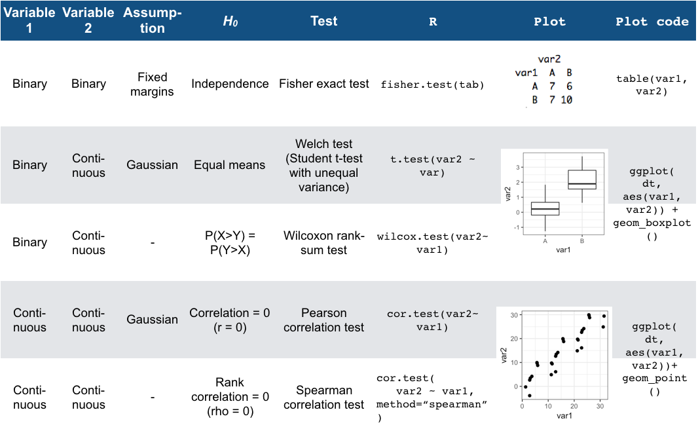

--- 
title: "Data Analysis and Visualization in R (IN2339)"
author: "Chair of Computational Molecular Medicine"
date: "`r Sys.Date()`"
output:
  html_document:
    df_print: paged
documentclass: krantz
bibliography:
- book.bib
- packages.bib
biblio-style: apalike
link-citations: yes
colorlinks: yes
lot: no
lof: no
graphics: yes
urlcolor: blue
geometry: left=1.5in, right=1.5in, top=1.25in, bottom=1.25in
description: TODO This book introduces concepts and skills that can help you tackle
  real-world data analysis challenges. It covers concepts from probability, statistical
  inference, linear regression and machine learning and helps you develop skills such
  as R programming, data wrangling with dplyr, data visualization with ggplot2, file
  organization with UNIX/Linux shell, version control with GitHub, and reproducible
  document preparation with R markdown.
site: bookdown::bookdown_site
header-includes: \usepackage{float} \floatplacement{figure}{H}
always_allow_html: yes
subtitle: A practical introduction to Data Science
---
```{r include=FALSE, cache=FALSE}
rm(list = ls(all = TRUE))
# library(maps)## load maps first to avoid map conflict with purrr
# library(MASS) ## load MASS and matrixStats first to avoid select and count conflict
# library(matrixStats) 
# library(tidyverse)
# library(dslabs)
# ds_theme_set()
# 
# ## Adapted from Hadley Wickham and Garrett Grolemund's r4ds
# options(digits = 3, width = 72, formatR.indent = 2)
# 
# knitr::opts_chunk$set(
#   comment = "#>",
#   collapse = TRUE,
#   cache = TRUE,
#   width = 72,
#   tidy.opts=list(width.cutoff=72, tidy=TRUE),
#   out.width = "70%",
#   fig.align = 'center',
#   fig.width = 6,
#   fig.height = 3.708,  # width * 1 / phi
#   fig.show = "hold")
# 
# options(dplyr.print_min = 5, dplyr.print_max = 5)
```


```{r include=FALSE}
# automatically create a bib database for R packages
knitr::write_bib(c(
  .packages(), 'bookdown', 'knitr', 'rmarkdown'), 'packages.bib')
```

# Preface {-}

This is the lecture script of the module Data Analysis and Visualization in R (IN2339).

This work is licensed under the [Creative Commons Attribution-NonCommercial-ShareAlike 4.0 International (CC BY-NC-SA 4.0)](https://creativecommons.org/licenses/by-nc-sa/4.0)

# Acknowledgments {-}

The script has been first put together in 2020 by Felix Brechtmann, Daniela Klaproth-Andrade, Alexander Karollus, Vangelis Theodorakis, Vicente Yepez, Ines Scheller, and Julien Gagneur.

We leverage work from colleagues in designing lecture slides since 2017: Žiga Avsec, Ines Assum, Daniel Bader, Jun Cheng, Bašak Eraslan, Mathias Heinig, Jan Krumsieck, Christian Mertes, and Georg Stricker.


# Prerequisites {-}
Basics in probabilities are required. Chapters 13-15 ("Introduction to Statistics with R", "Probability" and "Random variables") of the Book "Introduction to Data Science" https://rafalab.github.io/dsbook/ make a good refresher. Make sure all concepts are familiar to you. Check your knowledge by trying the exercises. 


<!--chapter:end:index.Rmd-->

---
output:
  pdf_document: default
  html_document: default
---
```{r include=FALSE, cache=FALSE}
rm(list = ls(all = TRUE))
# library(maps)## load maps first to avoid map conflict with purrr
# library(MASS) ## load MASS and matrixStats first to avoid select and count conflict
# library(matrixStats) 
# library(tidyverse)
# library(dslabs)
# ds_theme_set()
# 
# ## Adapted from Hadley Wickham and Garrett Grolemund's r4ds
# options(digits = 3, width = 72, formatR.indent = 2)
# 
# knitr::opts_chunk$set(
#   comment = "#>",
#   collapse = TRUE,
#   cache = TRUE,
#   width = 72,
#   tidy.opts=list(width.cutoff=72, tidy=TRUE),
#   out.width = "70%",
#   fig.align = 'center',
#   fig.width = 6,
#   fig.height = 3.708,  # width * 1 / phi
#   fig.show = "hold")
# 
# options(dplyr.print_min = 5, dplyr.print_max = 5)
```

```{r, include=FALSE, cache=F}
library(data.table)
library(gridExtra)
library(ggplot2)
library(magrittr)
library(patchwork)
mysize <- 15
mytheme <- theme(
    axis.title = element_text(size=mysize), 
    axis.text = element_text(size=mysize),
    legend.title = element_text(size=mysize),
    legend.text = element_text(size=mysize)
    ) + theme_bw()

```


# (PART) Conclude {-}

# Resampling-based Statistical Assessment {#resampling-stat}

<!-- We have so far based all our analyses on visualizations. Algorithms have been employed only for helping visualization of high-dimensional datasets.  -->

<!-- As described in the last Chapter, one of the main goal of data analysis is to identify interesting associations between variables.  -->

<!--
Suppose we have found a trend in a dataset, which leads us to think some property holds true. For example, while analyzing data on flight delays, we might discover that American Airlines has the worst delays:

```{r, out.width = "1000px", echo=TRUE}
flightsLAX <- fread('extdata/flights/flightsLAX.csv')
ggplot(flightsLAX[ARRIVAL_DELAY>30],aes(AIRLINE,ARRIVAL_DELAY))+geom_violin()
```

So, we might conclude that if we have the choice, we should not fly with American, correct?

Now, consider: another scenario. 
-->

Suppose a friend says she can correctly predict the winning team in any football game, due to her deep knowledge of the sport. To test this, we ask for her predictions for two Champions League games. She turns out to be right both times. On a first glance, this seems very impressive: she has a $100\%$ success rate! Should we hence bet a lot of money on her next prediction? What if she is just guessing and got lucky?

Someone who just flips a coin to decide the winner has a $25\%$ chance to get lucky and guess two games correctly. Accordingly, betting all our life savings that she will be right again next game may not be a very good idea. Hence, the danger is to conclude something based on a limited amount of data. Apparent trends can arise purely by chance, and if we are not careful this can lead us into making the wrong conclusions. Now, what if the friend had correctly predicted the outcome in 4 out of 5 games? What about 237 out of 286 games? When should we start taking her claim seriously?


<!--
Both of these examples have one thing in common: we are trying to conclude something based on a limited amount of data. The danger in doing this is that we can be "fooled by randomness". Because our data is noisy, apparent trends can arise purely by chance, and if we are not careful this can lead us into making the wrong conclusions.

Let us look at our examples again:

For the flights example, it is instructive to look at the median delays:
```{r, out.width = "1000px", echo=TRUE}
ggplot(flightsLAX[ARRIVAL_DELAY>30],aes(AIRLINE,ARRIVAL_DELAY)) + geom_boxplot() +
  scale_y_log10()
```
We see that in terms of the median delay, the airlines all look very similar. We see furthermore that the trend of extreme delays from AA seems to be driven by a small number of flights. Given this, we maybe should be skeptical of making strong conclusions.

For the football example, we can be equally skeptical. 
-->

This chapter introduces concepts and methods to answer these types of questions. We cover the concept of hypothesis testing and of statistical significance, which is another way of saying that a trend is unlikely to have arisen purely by chance. We also introduce the concept of confidence interval which models our uncertainty when estimating parameters such as the mean of a variable. To this end, we provide two largely applicable computational methods: permutation testing and case resampling. These methods are based on resampling the data at hand, thereby making little modeling assumptions.

## The yeast dataset {#yeast-dataset}

### The experiment
This section introduces a dataset that we will use throughout this chapter, and occasionally in the following chapters.

Yeast is a good old friend of humans. Thanks to yeast, we can make bread, wine, and (not the least for TUM and Munich) beer. Yeast is also very much studied by biologists. The yeast strain that is commonly used in research labs grows poorly on maltose compared to wild yeast strains. Hard to brew malt beer with the lab strain... One may wonder whether the lab strain has acquired a genetic mutation causing this poor fitness in maltose media. If so, on which chromosome, near which gene? 

Our dataset [@gagneur2013] allows addressing these questions (and further yeast genetic questions). The lab strain was crossed with a wild isolate growing well on maltose. Overall, 184 offsprings, also called segregants, were obtained. During a cross, parental chromosomes are recombined at discrete random locations in a process called cross-over ^[https://en.wikipedia.org/wiki/Chromosomal_crossover]. Consequently, the chromosomes of the segregants consist of alternated segments inherited from either parent. Yeast has 16 chromosomes. Figure \@ref(fig:yeast-cross) illustrates this crossing process for one chromosome.

```{r yeast-cross, out.width = "600px", echo=FALSE, fig.cap="Cross of the lab strain and wild isolate. Meiotic recombination implies that chromosomes of the offsprings consist of alternated segments inherited from either parent."}
knitr::include_graphics("assets/img/lec09-stat-testing/lec09_yeast_cross.png")
```

This shuffling of the genetic information is helpful to identify on which chromosomal location(s) genetic variations responsible for the growth rate difference could reside.

### Genotype 

The `genotype` table reports the genotype of each the 184 yeast strains at 1,000 genomic locations called genetic markers. At each marker, the genotype values are either "Lab strain" or "Wild isolate" (Figure \@ref(fig:genotype-matrix)).

```{r genotype-matrix, out.width = "800px", echo=FALSE, fig.cap="Sketch of the genotype of segregants (rows) across the 16 chromosomes. The genotypes are provided at 1,000 genomic positions (called markers, vertical line)."}
knitr::include_graphics("assets/img/lec09-stat-testing/lec09_genotype.png")
```

See below for a section of the data table:

```{r, out.width = "300px", echo=TRUE}
genotype <- fread("extdata/eqtl/genotype.txt")
genotype <- genotype %>% 
  melt(id.vars = 'strain', variable.name = 'marker', value.name = 'genotype')
genotype
```

If we want to know where the markers are located in the genome, we can consult the `marker` table. This table reports genomic coordinates of the markers (chromosome, start, and stop):
```{r, out.width = "300px", echo=TRUE}
marker <- fread("extdata/eqtl/marker.txt")
marker
```


### Growth rates

The `growth` table contains the growth rates expressed in generations per day for each strain in five different growth media. These growth media are YPD (glucose),  YPD_BPS (low iron), YPD_Rapa (Rapamycin), YPE (Ethanol), YPMalt (Maltose). 

```{r, out.width = "300px", echo=TRUE}
growth <- fread("extdata/eqtl/growth.txt")
growth <- growth %>% melt(id.vars = "strain", variable.name = 'media', value.name = 'growth_rate')
growth
```

### Genotype-growth rate association in maltose at a specific marker 

In this Chapter, we focus on a simple, targeted question. We know beforehand that the gene MAL13 is important for maltose metabolism. Could genetic variation between the lab strain and the wild isolate near the gene MAL13 be responsible for the growth difference in maltose? 

Marker 5211, which starts at positions 1069229 of chromosome 07, is the closest marker to the gene MAL13. We thus ask whether genotype at marker 5211 associates with growth rate in maltose.  
To assess this hypothesis, we first create a data table called `dt` that contains the relevant data and visualize with a boxplot how growth rates distributes depending on the genotype at marker 5211:

```{r, fig.height=4, fig.width=4, warning=FALSE}
mk <- marker[chrom == "chr07" & start == 1069229, id]

dt <- merge(
  growth[media == 'YPMalt'],
  genotype[marker == mk, .(strain, genotype)],
  by = 'strain'
  )

p <- dt%>% 
  ggplot(., aes(genotype, growth_rate)) +
  geom_boxplot() +
  xlab(paste0("Genotype at ", mk)) + 
  ylab("Growth rate in Maltose [Generations/day]") +
  mytheme

p
```


```{r}
dt[genotype == 'Wild isolate', median(growth_rate, na.rm=T)] - 
    dt[genotype == 'Lab strain', median(growth_rate, na.rm=T)]
```


We see that genotype at that marker indeed associates with a strong difference in growth rates in the Maltose media, with a difference between the medians of 2.17 generations per day.

But, as we already discussed in the motivating section, we need to be careful before making any conclusions. Maybe the pattern we see is an artifact of random variation and would disappear if we had more data. In the following we approach this issue with two concepts. We first look at statistical hypothesis testing, assessing whether the association could have arisen by chance. Next, we will consider parameter uncertainty, which will provide error bars around our difference of medians estimate.  


## Statistical hypothesis testing
Statistical hypothesis testing, often just referred to as hypothesis testing, is a method to assess whether an observed trend could have arisen by chance. We first describe intuitively a specific hypothesis testing method called permutation testing, to then describe the general concept.


### Permutation testing: An intuitive build-up {#permut-test-build-up}
We take the proverbial "Devil's Advocate" standpoint. We consider the possibility that such a large difference of growth rate medians could often arise by chance, would we make arbitrary groups of the same size than those defined by the genotype.

To simulate such random data, we permute the values of the genotype keeping the growth rate values fixed. To permute values of a vector we can use the R function `sample()` with default parameters as in the example below:
```{r}
LETTERS[1:8]
sample(LETTERS[1:8])
```

We now shuffle the genotype column. To keep the original data safe, we work on `dt_permuted`, a copy of the table `dt`. 

```{r, out.width = "300px"}
dt_permuted <- copy(dt)
set.seed(0) # the seed of the random number generator
dt_permuted[ , genotype:=sample(genotype)]
```

For this simulated data, the boxplot looks less impressive:
```{r, fig.height=4, fig.width=4, warning=FALSE}
# The %+% operator updates the dataset of a ggplot object
# convenient, isn't it?
p <- p %+% dt_permuted 
p
```

We can also recompute the difference of medians. To not have repeated code, let us define a function (See Appendix \@ref(appendix-r-programming)) that takes a table as input. We check immediately that our function properly returns the original difference of medians when applied to `dt`.

```{r}
diff_median <- function(tab){
  tab[genotype == 'Wild isolate', median(growth_rate, na.rm=T)] - 
    tab[genotype == 'Lab strain', median(growth_rate, na.rm=T)]
} 
T_obs <- diff_median(dt)
T_obs
```

The difference of medians in this permuted dataset is now only 0.21 generations per day:

```{r}
diff_median(dt_permuted)
```
 
This is not fully convincing yet. Maybe our "devil's advocate" has been unlucky with this one randomization. However, we can easily repeat this operation many times, e.g. 1,000 times. We denote the number of permutations $m$. We iterate $m$ times using a for loop (See Appendix \@ref(appendix-r-programming)). We record the difference of medians of the i-th iteration in a vector called `T_permuted`.

```{r}
# number of permutations
m <- 1000 

# initialize T_permuted with missing values
# (safer than with 0's)
T_permuted <- rep(NA, m)

# iterate for i=1 to m
for(i in 1:m){
  # permute the genotype column in place 
  dt_permuted[ , genotype:=sample(genotype)]
  # store the difference of medians in the i-th entry of T_permuted
  T_permuted[i] <- diff_median(dt_permuted)
} 
```

Let us look at how these values distribute with a histogram and mark our original observation with a vertical line:

```{r, fig.width=5, fig.height=4, warning=FALSE}
ggplot( data.table(T_permuted), aes(x = T_permuted) ) + 
  geom_histogram() + 
  geom_vline( aes(xintercept=T_obs, color = "T_obs") )
```

The observed difference of medians stands far out from the distribution of the permuted data. We never observed a difference equal or larger than the original one among 1,000 permutations. We can conclude it is unlikely that such a large difference could have arisen by chance.

This empirical approach is quite intuitive. Let us now formalize it and precisely specify the underlying assumptions in order to understand when and how we can apply it.


### Concepts of Statistical Hypothesis Testing  
We just implemented one type of Hypothesis test. Figure \@ref(fig:hypothesis-test-overview) provides an overview of Hypothesis testing.

```{r hypothesis-test-overview, out.width = "800px", echo=FALSE, fig.cap="We assume an underlying random process (i.e. 'Nature'). We collected data which is a particular realization of this random process, and from this data we computed a test statistic. In the bottom row, we now play the role of the Devil's Advocate and assume that the underlying random process conforms to the null hypothesis. Based on this assumption, diffrent realization datasets could arise as different realizations of the random process, for which the test statistics would get different values. Then we compute how likely it is to see the test statistics as, or more, extreme as the ones we got from our actual data. We use this probability to reject or not the null hypothesis."}
knitr::include_graphics("assets/img/lec09-stat-testing/lec10_Stat-testing-overview.png")
```

#### Test statistic

To develop our test, we first need to define a **test statistic** (Figure \@ref(fig:hypothesis-test-overview)). This is a single number that summarizes the data and captures the trend. The more extreme the test statistic, the stronger the trend.

The test statistic is often denoted $T$.

Here we have considered the difference of the medians:  
$$ T = \operatorname{median}_{i \in \text{Wild}} (y_i) - \operatorname{median}_{i \in \text{Lab}} (y_i)$$ 

We could equally consider the difference of the means, or the difference of the means divided by the within-group standard deviation, etc. Some statistics are more useful than others, because one can work analytically with them (see next chapter) or because they are more sensitive. Clearly, if we had considered as test statistics the difference between just two random values of each group rather than the difference of medians, discriminating the observed data from the permuted ones would have been more difficult.   


#### The Null Hypothesis

Our test statistic is calculated from a limited number of observations. In our data we see a large difference in median growth rates, but maybe if we had much more data, this difference would disappear, or even change sign. To assess this, we need a negative control. We get such a negative control by setting a **null hypothesis** $H_0$, i.e by assuming that the trend we observe is *not* real and arose purely by chance (Figure \@ref(fig:hypothesis-test-overview)).

The null hypothesis can be compared to the proverbial "Devil's Advocate". To test whether a trend is real, we take the skeptical position and assume it is not. It is the same thing we also did in the football example, when we assumed that the friend was just guessing the outcome of the games.

The exact null hypothesis depends on the problem. In our example, the null hypothesis was statistical independence of genotype and growth rate. It can also be that a mean is 0, a Pearson correlation is 0, etc.


#### The P-value

Under the null hypothesis $H_0$, the test statistic $T$ follows a certain distribution $p(T|H_0)$. The $P$-value is the probability of obtaining a test statistic the same as or more extreme than the one we actually observed, under the assumption that the null hypothesis is true (See Figure \@ref(fig:hypothesis-test-overview)).

The formal definition of the $P$-value depends on whether we take "more extreme" to mean greater, less, or either way: 

 * For right-tail events: $P = p(T \geq T_\text{obs}| H_0)$
 * For left-tail events: $P = p(T \leq T_\text{obs}| H_0)$
 * For double tail events: $P = 2\min \{p(T \leq T_\text{obs}| H_0), p(T \geq T_\text{obs}| H_0) \}$

The null hypothesis is said to be **rejected** for sufficiently small $P$-values. In this case we say the result is **statistically significant**. It is common practice in the scientific literature to set a significance level of $\alpha=0.05$ and rejecting the null hypothesis if $P<\alpha$.

We can explore this definition visually. Assume $p(T|H_0)$, the distribution of the test statistic under the null hypothesis, looks like this:

```{r, fig.width=4, fig.height=3,echo=FALSE}
lims <-  c(0,30)
bks <- seq(lims[1], lims[2], 5)
df <- 8
ggplot(data.frame(x = lims), aes(x = x)) + 
  stat_function(fun = dchisq, args = list(df = df)) +
  scale_x_continuous(name = "T", breaks = bks) +
  ylab("p(T|H0)")
```

Now assume the test statistic we observe is $T_\text{obs}=15$. Then the one-sided $P$-value is given by the shaded area which corresponds to $p(T \geq T_\text{obs}| H_0)$:

```{r, fig.width=4, fig.height=3, echo=FALSE}
t_obs <- 15
ggplot(data.frame(x = lims), aes(x = x)) + 
    stat_function(fun = dchisq, args = list(df = df)) + 
    stat_function(fun = dchisq, args = list(df = df), xlim = c(t_obs, lims[2]),
                  geom = "area", fill = "grey25", alpha = .2) +
    geom_vline(aes(xintercept=t_obs, color = "T_obs")) +
    scale_x_continuous(name = "T", breaks = bks) +
    ylab("p(T|H0)")
```

For the two-tailed test, we are not expecting the test statistic to be on the upper or the lower side a priori. We therefore consider where it turned out to be (upper or lower) and double the probability. Graphically, we are summing up the area under the curve on the tail of the observed test statistic (upper or lower) with the equi-probable one of the other tail.

```{r, fig.width=4, fig.height=3, echo=FALSE}
t_obs_low <- qchisq(1-pchisq(t_obs, df=df), df=df)

ggplot(data.frame(x = lims), aes(x = x)) + 
    stat_function(fun = dchisq, args = list(df = df)) + 
    stat_function(fun = dchisq, args = list(df = df), xlim = c(t_obs, lims[2]),
                  geom = "area", fill = "grey25", alpha = .2) +
    stat_function(fun = dchisq, args = list(df=df), xlim = c(lims[1], t_obs_low),
                  geom = "area", fill = "grey25", alpha = .2) +
    geom_vline(aes(xintercept=t_obs, color = "T_obs")) +
    scale_x_continuous(name = "T", breaks = bks) +
    ylab("p(T|H0)")
```

** When to apply one-sided or two-sided tests?**
Say we have as null hypothesis that the true growth rate difference is zero. There are two ways this can be violated: (1) if the true growth rate difference is > 0 or (2) if the true growth difference is < 0. In a one-tailed test, we only account for one of these possibilities. We test $H_0$: true difference is zero versus $H_1$ (alternative): true difference is > 0, in the first case.
In a two-tailed test, we allow both options. We test $H_0$: true difference is zero vs. $H_1$ (alternative): true difference is not zero, and we do not care if it ends up being smaller or larger.
In most scenarios the two-tailed test will be most appropriate, as generally there is no reason to privilege effects in one direction over another direction.
A one-tailed test will only make sense if you have very good reason (before looking at the data!) that only the effect in one direction is important.

#### Some intuition on Hypothesis Testing and the P-value

To get some intuition on how to interpret the $P$-value and this idea of rejecting the null hypothesis, think about a legal trial. Suppose a murder has been committed, and a man has been accused of being the murderer. Under German law he is considered innocent until proven guilty. So, our null hypothesis is that the man is innocent. But we also collect some evidence. For example, we discover that the murder weapon had his finger prints on it, that a witness saw him near the crime scene and that he bought chemicals used to dispose of corpses one day before the crime. None of these facts constitute hard proof that he did commit the crime, but assuming he was innocent, it would require a lot of unlikely coincidences. This corresponds to a scenario where the $P$-value is low. Thus, we reject the null hypothesis of innocence and convict him. 

Conversely, imagine another trial, where the only evidence we have is that an old lady, who sees rather badly, thinks she *maybe* saw the accused near the crime scene. This corresponds to a scenario where the $P$-value is high. The accused could be guilty, but it also does not seem implausible that he is innocent and the old lady is just mistaking him for someone else. If we start convicting people based on such flimsy evidence, the jail would quickly be full of innocent people. So we do not reject the null hypothesis of innocence.

#### What the P-value is not
The P-value is *not* the probability of the observed test statistic given that the null hypothesis is true:

$$p(T \geq T_\text{obs}| H_0) \neq p(T=T_\text{obs} | H_0)$$

The problem with basing a test on $p(T=T_\text{obs} | H_0)$ is that it is dependent on the space of possibilities. This is most apparent for continuous variables: if $T$ is continuous, then the probability of observing a specific value for the test-statistic, such as $T=0.34257385692956$, will be zero (recall that, for continuous variables, probabilities are nonzero for intervals only). So $p(T=T_\text{obs} | H_0) = 0$ for all $T$, thus this would not give useful $P$-values. 

Also, the $P$-value is *not* the probability that the null hypothesis is true given the data:

$$p(T \geq T_\text{obs}| H_0) \neq p(H_0 |T=T_\text{obs})$$

Consider again the example with the old lady witness. Surely we cannot convict someone of a murder on such weak evidence, thus we do not reject the null hypothesis of innocence. This being said, we also have no evidence to suggest the accused actually is innocent, so we should not conclude that this is definitely the case either! In other words: "absence of evidence is not evidence of absence". 

Related to this, it is important to note the terminology we used above: when the $P$-value is less than the chosen significance level, we **reject** the null hypothesis. But, in this framework, there is no mechanism to accept the null hypothesis. We can only *fail to reject* it.

### Permutation testing, formally
Formally, the strategy we implemented in Section (\@ref(permut-test-build-up)) is a permutation test.  

Generally a permutation test is used to test the statistical dependence between two variables $x$ and $y$. In our example, we had one quantitative and one qualitative but they can be of any kind.

The test statistics can be any measure that captures the dependence.

We assumed that the observations are **identically and independently distributed** (i.i.d). Denoting each observation (a row of the data table) $(x_i, y_i)$ with $i=1...n$. The data generating process is the same for all observations (identicallly distributed). Moreover, the observations are independent. In particular the order of the indexing (the order of the rows of the data table) can be considered arbitrary.

The i.i.d. assumption if often taken in Hypothesis testing. It is however a tricky one. For instance if you have longitudinal data ro confounders (hidden groups in the data). In our case, if the measurement of growth was done in separate day for the segregants of distinct genotypes, the i.i.d assumption could have not held. It sis important in real applications to question this assumption, and if possible, to address it, for instance by stratifying the data.

The null hypothesis of a permutation test is that the two variables $x$ and $y$ are statistically independent:

$$ H_0: x \perp y$$

Hence, under the $H_0$, the data generation process of $x$ is independent of the one of $y$. Combined with the $i.i.d$ assumption, this implies that the values of $x_i$ could have occurred in any other order with the very same likelihood. 

This gives us a mechanisms to simulate data under the null (Figure \@ref(fig:hypothesis-test-overview)). 

An exact permutation test considers all possible distinct permutation (See next chapter). With a large number of observations as here ($n=184$), we can also draw enough random permutations to have decent idea of the distribution of $p(T|H_0)$.

For a one-sided p-value we do:

* $m$ be the number of random (Monte Carlo) permutations
* $r = \#\{T^* \geq T_\text{obs}\}$ be the number of these random permutations that produce a test statistic greater than or equal to that calculated for the actual data.

Then the estimated one-sided P-value, $\hat P$ is [@davison_hinkley_1997; @Phipson2010]

\begin{align}
\hat P = \frac{r+1}{m+1}
(\#eq:permut-p-val)
\end{align}


Permutation P-values should never be zero [@Phipson2010]. Do not use $\frac{r}{m}$ as often done!

In our case, we observed no single permutation with larger test statistics. Hence $r=0$. We thus get:

$$ \hat P = \frac{1}{1001} \simeq 0.01$$
So, if we assume that the null hypothesis is true, the probability of observing a difference in median growth rates as, or more, extreme as the ones we actually observed, is less than one in one thousand. We would thus need to be quite unlucky to get results like this by chance. So, we reject the null hypothesis and we say that the association between genotype at marker 5211 and growth rates in maltose is statistically significant.


## Confidence intervals: Quantifying uncertainty in parameter estimates

Hypothesis testing is a very effective way to guard us from being fooled by random patterns in our data. But it only answers a very specific question.

For the yeast example, we observed a difference of median growth rates of about 2.2 between yeast strains with different genotypes at marker 5211. Based on our permutation test, we rejected the null hypothesis that growth rate in Maltose is independent of the genotype at marker 5211. In other words, we concluded that the true difference in growth rates is unlikely to be zero. But does that mean that 2.2 is a good estimate of the true difference of median growth rates? How certain are we about this number?

We often face scenarios like this one, where we would like to estimate a certain quantity and report on the uncertainty of this estimate. This framework is called parameter estimation, and it is summarized in the following diagram:

```{r, out.width = "800px", echo=FALSE}
knitr::include_graphics("assets/img/lec09-stat-testing/lec10_Parameter-estimation-overview.png")
```

As before, there is a random process which produced our data, on which we compute summary statistics. But rather than just rejecting a null hypothesis, we now want to *infer* a parameter from our summary statistics, and also get an idea how precise our inference is. The confidence interval is a method to quantify our uncertainty about a parameter estimate. note that in this scenario we do not need ways of assessing the distribution under a null data generation process, but rather under the actual data generation process.

### Repeating experiments to quantify uncertainty

We will first show the intuition behind the confidence interval and show how it can be computed in practice. Only then will we formally define it.

Imagine we have an unlimited budget and can repeat the entire yeast experiment 100 times. Every time we follow the same experimental protocol, and every time we compute the difference of median growth rates between yeast strains with different genotypes at marker 5211. This gives us a distribution of parameter estimates (note that, if the null hypothesis is true, this corresponds to the null distribution).

Assume we get the following distribution:

```{r, echo=FALSE}
set.seed(31)
rep_diff_median <- rnorm(100, mean=2.18, sd=0.25)
dt_rep_exp <- data.table(rep_diff_median = rep_diff_median)
ggplot(dt_rep_exp, aes(rep_diff_median)) +
  geom_histogram(bins=15) + geom_vline(aes(xintercept=T_obs, color = "T_obs")) +
  xlab("estimated difference of median growth rates")
```

We see that many estimates are quite close to the one we measured in our first experiment. However, we also see that we get a range of results. 

We do not know the true difference of medians, and in theory any of these estimates could be correct. So one way we could quantify our uncertainty is by reporting the full range of estimates we computed. However, this interval can quickly become very big. If we do the same experiment very often, it is quite plausible that we will have a bad day at some point and, for example, contaminate the samples, leading to an estimate that is very different than the others. We don't want the size of our interval to be entirely determined by one or two such outliers.

A more robust alternative is to report an interval that covers the central $95\%$ of the values we got:

```{r, echo=FALSE}
cbPalette <- c("#000000", "#E69F00", "#56B4E9", "#009E73", "#F0E442", "#0072B2", "#D55E00", "#CC79A7")
conf_int = quantile(rep_diff_median, c(0.025, 0.975))
dt_rep_exp[, in_interval := rep_diff_median >= conf_int[1] & rep_diff_median <= conf_int[2]]
ggplot(dt_rep_exp, aes(rep_diff_median, fill=in_interval)) +
  geom_histogram(bins=15) + 
  geom_vline(aes(xintercept=T_obs, color = "T_obs")) +
  geom_vline(aes(xintercept=conf_int[1], color="CI"), linetype="dashed") +
  geom_vline(aes(xintercept=conf_int[2], color="CI"), linetype="dashed") +
  scale_color_manual(values=cbPalette) +
  xlab("estimated difference of median growth rates")
```

This interval thus covers the estimates derived from 95 of our 100 experiments, and only excludes the 5 most extreme ones. It seems very plausible that the true difference of medians, whatever it is, is somewhere in this interval, unless we got quite unlucky.

### Simulating repeated experiments

The method of repeating experiments is a great way to quantify uncertainty. But in practice, we usually have to work with the data we actually have and cannot just rerun every experiment many times. This would be way too expensive and time consuming.

What we can do, however, is simulate reruns of the experiment by sampling from the data we already have. To this end, the concept of a cumulative distribution function will be useful.

#### Empirical distribution

Consider a random variable $X$ and a random sample of $n$ independent realizations drawn from it: $\{x_1, x_2,...x_n\}$. The empirical distribution is the distribution that gives equal probability to each of these observations. 

A single random draw from the empirical distribution amounts to picking one data point with probability $\frac{1}{n}$. Independent random draws of any size $m$ are thus equivalent to sampling **with replacement**.

In R this is obtained using the sample function:
```{r}
x <- rnorm(20) # 20 random numbers normally distributed 
xrnd <- sample(x, 15, replace = TRUE) # 15 random draws from the data in x 
xrnd
```

A fundamental result is that the empirical distribution converges to the underlying distribution. This is best seen when considering cumulative distribution function. The empirical cumulative distribution is a step function that jumps up by $1/n$ at each of the $n$ data points.

$$F_n(x) = \frac{1}{n}\sum_{i=1..n}I_{x_i \leq x}$$

In R, it is obtained by ecdf().

```{r}
plot(ecdf(x))
```

The empirical distribution function converges almost surely to the distribution function of $X$. This means that as $n$ goes to infinity, the empirical distribution and the actual distribution will become more and more alike:
```{r}
x_small <- rnorm(5)
x_middle <- rnorm(20)
x_big <- rnorm(200)
x_lbl <- c(rep("small_n", 5), rep("medium_n", 20), rep("large_n", 200))
x_combined <- c(x_small, x_middle, x_big)
dt_ecdf <- data.table(sample_size = x_lbl, x = x_combined)
ggplot(dt_ecdf) + stat_ecdf(aes(x, colour = sample_size)) +
  stat_function(fun = pnorm) + 
  ylab("Fn(x)")
```

The implication is that drawing from the empirical distribution is a justified proxy for drawing from the actual underlying distribution. It is more accurate with large sample sizes.

#### Case resampling bootstrap

Using this idea of drawing from the empirical distribution function, we can simulate experiments. After all, an experiment is like drawing from the true distribution, so if our empirical distribution is close enough to the true distribution, then drawing from it is comparable to doing a new experiment.

Concretely, we take a sample of size $n$, with replacement, from our observed data, to make a new dataset. This is called the case resampling bootstrap. 

Of course, this "new" data will resemble the old data. But, provided that $n$ is not extremely small, it will almost certainly not be the same. This is because we are sampling with replacement, meaning that we will select some data points several times, and other points may not be selected at all.

Let us perform one bootstrap for the yeast data and recompute the difference of median growth rates:

```{r}
dt_resampled <- 
  dt[sample(nrow(dt), replace = TRUE)]
diff_median(dt_resampled)
```

As we see, this value is indeed somewhat different from the one we computed from our original sample.

### Quantifying uncertainty using the case resampling bootstrap

Now let us do $R$ random simulations of the data by case resampling. Each gives a random value for the parameter denoted $T^*$. Let's rank them by increasing order and denote them:

$$T^*_1 \leq T^*_2 \leq ... \leq T^*_R$$
We can do this for our yeast data and visualize the result as a histogram of parameter estimates. 

```{r}
# number of random simulations
R <- 1000 

# initialize T_boot with missing values
# (safer than with 0's)
T_bootstrap <- rep(NA, 1000)

# iterate for i=1 to R
for(i in 1:R){
  # sample the original data with same size with replacement
  dt_boot <- dt[sample(nrow(dt), replace=TRUE)]
  # store the difference of medians in the i-th entry of T_permuted
  T_bootstrap[i] <- diff_median(dt_boot)
} 
```

The 95% bootstrap percentile confidence interval can now be obtained using the quantiles.


More concretely, we use the same idea as we had in the beginning when we actually repeated experiments: we again try to cover the central $(1-\alpha)*100\%$ of the distribution of estimates, where we can choose $(1-\alpha)*100\%$ to be bigger or smaller to depending on how conservative we want to be.

This is achieved by using the interval:

$$ ( T^*_{(R+1)\alpha/2}, T^*_{(R+1)(1-\alpha/2)} )$$
In R, we can use the quantile function to compute this. For $(1-\alpha)*100\% = 95\%$ interval, we do:


```{r}
conf_int <- quantile(T_bootstrap, c(0.025, 0.975))
conf_int
```

The following plot shows the entire distribution along with the observed value and the 95% bootstrap percentile confidence interval. 
```{r, fig.width=4,fig.height=4}

ggplot(data.table(T_bootstrap), aes(T_bootstrap)) +
  geom_histogram(bins=30) + 
  geom_vline(aes(xintercept=T_obs, color = "T_obs")) +
  geom_vline(aes(xintercept=conf_int[1], color="CI"), linetype="dashed") +
  geom_vline(aes(xintercept=conf_int[2], color="CI"), linetype="dashed") +
  scale_color_manual(values=cbPalette) +
  xlab("estimated difference of median growth rates")
```

### Confidence Intervals: Formal definition

Let us now define a confidence interval formally.

A **confidence interval** of confidence level $1-\alpha$ for a parameter $\theta$ is an interval $C = (a,b)$, which would the data generation process be repeated, would contain the parameter with probability $1-\alpha$, i.e. $p(\theta \in C)=1-\alpha$. A typical value is $\alpha=0.05$ which leads to 95% confidence intervals.

Note that $a$ and $b$ are functions of the data and thus $C$ is the random variable here, not $\theta$!

To get some intuition for this, consider again the scenario where we repeat the yeast experiment 100 times. But instead of computing one $95\%$ interval from all the experiments, we instead compute a separate $95\%$ interval for each of the experiments (using, for example, the case resampling bootstrap). Then the true difference of medians, whatever it is, will be contained in about 95 of the computed intervals. In other words, it will happen relatively rarely (about 5% of the time) that we get an interval that happens not to include the true difference of medians.

But note carefully what this means. It means that before we do an experiment, we have a 95% chance to end up with an interval that contains the true value. It does not mean that the specific interval we compute after the experiment has been done has a 95% chance of including the true value. This statement would not even make sense. The true value is a fixed number, so either it is in the interval, or it is not. There is no notion of probability there.

It should be noted that the $(1-\alpha)$ case resampling bootstrap interval is only an approximate $(1-\alpha)$ confidence interval. This means it does not guarantee that $p(\theta \in C)=1-\alpha$, but only that $p(\theta \in C)\approx1-\alpha$.

<!-- NB: the only proof I found that the case resampling is a confidence interval assumes the existence of a monotone normalizing transformation. The author adds "an exact normalizing distribution will rarely exist but there may exist approximate normalizing transformations". So, in effect, I am a bit unsure of the theoretical basis of this  -->

There are other ways to compute confidence intervals, which usually require making further assumptions, such as that the data is normally distributed. See Davison AC, Hinkley DV (1997) for an overview.

### Visualizing the formal definition of Confidence Intervals

To visualize the meaning of this definition, we will now consider an example where we know the true value of the parameter. Specifically we assume that we are trying to use the sample mean as estimate of the true mean of a standard normal distribution. Thus, the true mean is zero.

Firstly, let us run the experiment:

```{r, echo=TRUE, fig.height=3}
set.seed(100)
exp_1 <- rnorm(30) # original data (30 values drawn from the standard normal distribution)
```

Now we compute the sample mean and do a bootstrap resampling:
```{r, echo=TRUE, fig.height=3}
# Compute observed sample mean
observed_mean <- mean(exp_1)

# Do bootstrap and compute sample mean for each simulation
boot <- lapply(1:1000, function(i){sample(exp_1, 30, replace = TRUE)})
sample_means <- sapply(boot, mean)
```

This creates a distribution of estimates. We build our $95\%$ case resampling bootstrap confidence interval:

```{r, echo=TRUE}
# 95% C.I. is given by the 2.5% and the 97.5% quantile
conf_int = quantile(sample_means, c(0.025, 0.975))
# Plot histogram 
bootstrap_tbl = data.table(means = sample_means)
ggplot(data = bootstrap_tbl, aes(x = means)) + 
  geom_histogram() + 
  geom_vline(aes(xintercept=observed_mean, color="observed"))  + 
  geom_vline(aes(xintercept=0, color="true"))  + 
  geom_vline(aes(xintercept=conf_int[1], color="CI"), linetype="dashed") +
  geom_vline(aes(xintercept=conf_int[2], color="CI"), linetype="dashed") +
  scale_color_manual(name = "Legend", values = c(true="black", observed = "blue", CI = "red"))
```

We see that our interval covers all but the most extreme estimates (the tails of the distribution). It also covers the true value, which is slightly lower than the observed value.

It now remains to show that this interval keeps what it promises, namely that we capture the true value about $95\%$ of the time if we repeat the "experiment".

```{r, echo=TRUE, fig.height=3}
rerun_experiment <- function(j) {
  exp <- rnorm(30)
  boot <- lapply(1:1000, function(i){sample(exp, 30, replace = TRUE)})
  sample_means <- sapply(boot, mean)
  conf_int = quantile(sample_means, c(0.025, 0.975))
  return(conf_int)
}

rerun <- sapply(1:100, rerun_experiment)
```

```{r, echo=TRUE}
intervals <- data.table(t(rerun))
intervals[, idx := 1:100]
intervals[, mid := (`97.5%` + `2.5%`)/2]
intervals[, contains_true := ((`97.5%` >= 0) & (`2.5%` <= 0))]
ggplot(data = intervals, aes(mid, idx, color=contains_true)) + 
  geom_errorbar(aes(xmin=`2.5%`, xmax=`97.5%`)) +
   geom_vline(aes(xintercept=0)) + xlab("estimated mean") + ylab("experiment number")
```

We see that most of the time, our interval does indeed capture the true value.

In fact we capture the true value $92\%$ of the time. This is slightly worse than what we expected, but that is not too surprising because the simulation procedure we have used above is approximate. If we use more bootstrap samples, and replicate our experiment more often, we will reach the $95\%$.

### Hypothesis testing with the Confidence Interval

It is relatively common in the scientific literature to perform hypothesis tests using the confidence interval. If our null hypothesis is that a given parameter, e.g. a mean, is zero, and our $(1-\alpha)*100\%$ confidence interval for this parameter does not include zero, we could say that we reject the null hypothesis at a significance level of $\alpha$. In that sense, hypothesis tests and confidence intervals are related. 

This being said, in this chapter we have used approximate methods to compute $P$-values and confidence intervals. Thus it need not necessarily be the case that if one of them rejects, the other will too (although, most of the time, they should agree).

In analyses where two groups are compared, as in our yeast example where median growth rates are compared between genotypes, people will often use a different procedure to test hypotheses using the confidence interval. In this procedure, we construct a $95\%$ confidence interval for the median growth rate of each genotype separately. We then reject the null hypothesis if and only if the confidence intervals do not overlap. 

It is important to note that this is *not* the same as rejecting if and only if the confidence interval for the difference of medians does not include zero, even if it may seem so intuitively. In fact, this "overlap" procedure is too conservative, and will fail to reject more often than the confidence level suggests.
In the next chapter, we will give a technical reason for this.

## Discussion

In this chapter we explored ways to avoid being fooled by randomness. Specifically, we discussed hypothesis testing, which is our go-to method to distinguish statistically significant results from noise, and we discussed confidence intervals, which help us to know how uncertain we are about quantities we estimate from our data.

Cares should be taken though. Many misuses of p-values in the scientific literature have been reported, the most obvious being to repeat an experiments until one finally gets P<0.05 and only report this observation in a publication. See @Wasserstein2016 for an extensive discussion.

We have looked only at resampling strategies: permutation testing as Hypothesis testing when assessing statistical dependence of variables, and case resampling for confidence intervals. Resampling methods have the advantage that they are simple to implement and make little assumptions about the underlying distribution. However, they are compute intensive. We finally noticed that the i.i.d assumption may be violated in practice. Therefore, careful thinking of possible hidden dependencies (such as confounders) shall be done when applying these methods.  

<!-- This being said, we are not always fooled randomly. In fact, frequently, we will be fooled *systematically*. This can happen due to **confounding**, which was not addressed in this chapter. Confounding occurs when there is some other variable, which we did not consider in our analysis, which drives our results. -->

<!-- As an example, we might find a statistically significant relationship between the amount of ice cream consumed on a given day and the number of people who receive a sunburn. We could then spend a lot of time interpreting this. Maybe eating ice cream makes people more susceptible to sunburn? Or maybe people who get sunburn are likely to eat ice cream to help get over the pain? But there is a confounder here, namely the season. On a hot summer day, people eat ice cream and get sunburned. On a cold winter day, people do not ice cream and they also do not get sunburned. The statistically significant relationship is explained by this confounder.  -->

<!-- Thus, even if a relationship is statistically significant, this does not mean that it is causal. To assess whether a relationship we observe could be causal, we need to account for confounding, which requires conditioning on further variables. -->

<!-- Another limit that we should keep in mind is that statistical significance does not necessarily imply *practical* importance. If a study says that "there is a statistically significant relationship between drinking coffee and all-cause mortality", it sounds scary. But it makes a big difference whether this means that drinking a cup a day leads to an average life-span reduction of several years, or whether it means that drinking 10 cups a day leads to an average life-span reduction of several days. -->

<!-- Thus, to assess whether a significant trend we observe actually matters in practice, we need to determine the effect size. This will also be discussed in a later chapter.  -->

## Conclusion
By now you should be able to:

* Understand what we mean when we say a result is statistically significant
* Understand the terms test statistic, null hypothesis, $P$-value and confidence interval and explain their purpose
* Understand that the $P$-value is *not* the probability that the null hypothesis is true
* Use permutation to perform Hypothesis testing of associations
* Use case resampling to compute bootstrap confidence intervals


<!--chapter:end:../topic07_Statistical-Testing-I/script/script_07.Rmd-->

```{r include=FALSE, cache=FALSE}
rm(list = ls(all = TRUE))
# library(maps)## load maps first to avoid map conflict with purrr
# library(MASS) ## load MASS and matrixStats first to avoid select and count conflict
# library(matrixStats) 
# library(tidyverse)
# library(dslabs)
# ds_theme_set()
# 
# ## Adapted from Hadley Wickham and Garrett Grolemund's r4ds
# options(digits = 3, width = 72, formatR.indent = 2)
# 
# knitr::opts_chunk$set(
#   comment = "#>",
#   collapse = TRUE,
#   cache = TRUE,
#   width = 72,
#   tidy.opts=list(width.cutoff=72, tidy=TRUE),
#   out.width = "70%",
#   fig.align = 'center',
#   fig.width = 6,
#   fig.height = 3.708,  # width * 1 / phi
#   fig.show = "hold")
# 
# options(dplyr.print_min = 5, dplyr.print_max = 5)
```
<!-- Things I am unsure about: -->
<!-- 1) The fixed margins assumption of fisher seems almost always wrong in practice, but we never seem to care -->
<!-- Does it matter? I wrote that "Note that this assumption is often violated in practice, as in the example above where we randomly sampled patients rather than sampling a fixed amount from each subgroup. But Fisher's exact test is nevertheless applied because we usually assume that the margin totals do not contain information about the relationship of interest."  -->
<!-- Is this a correct summary? -->
<!-- 2) I am not 100% sure I understand the distinction of parametric/non-parametric super well. I would be happy if someone could check the section "Parametric and Non-Parametric Tests" to make sure it is correct. -->
<!-- It makes sense in the abstract, but I find it a bit hard to distinguish them in practice. The binomial test is one example. It looks parametric (it assumes that the underlying data is iid bernoulli and the null hypothesis is framed in terms of the bernoulli parameter p) but the sign test is also a binomial test and its definetely nonparametric. So it sort of depends on how you frame it?  -->


```{r, include=FALSE, cache=F}
library(data.table)
library(gridExtra)
library(ggplot2)
library(magrittr)
library(patchwork)
mysize <- 15
mytheme <- theme(
    axis.title = element_text(size=mysize), 
    axis.text = element_text(size=mysize),
    legend.title = element_text(size=mysize),
    legend.text = element_text(size=mysize)
    ) + theme_bw()

```


# Analytical Statistical Assessment {#analytical-stat}

In the last chapter we discussed how trends in data can arise by chance, leading us to wrong conclusions. We saw that statistical hypothesis testing can help to guard us from being fooled by randomness in this way. We developed the permutation test as an empirical way to perform hypothesis tests.

While permutation testing is very general and requires few assumptions, it has its limitations, as we will see shortly. In this chapter, we will therefore discuss a more analytical approach to testing. We will see several classical tests, such as the binomial test and the t-test. These tests often make stronger assumptions about the underlying data. Thus, it is important to understand when they can and cannot be used. We will discuss the quantile-quantile plot (Q-Q plot) as a method to check some of these assumptions.

In the last chapter we also touched on the topic of confidence intervals, which help us quantify the uncertainty of our estimates, and also developed an empirical way to compute them. In this chapter, we will briefly describe how to compute them analytically. 


## Motivation: Hypothesis testing in large datasets

We have already discussed how to test specific hypotheses, for instance considering the association between a marker and growth rate in the yeast dataset (See Chapter \@ref(resampling-stat)). However, in the era of big data, we often do not restrict ourselves to testing just one single hypothesis. Molecular biologists can nowadays measure RNA abundance of all genes of a cell population. So what if we test the association of the RNA abundance of all ~8,000 yeast genes with every single marker? For 1,000 markers, this means we will have to do more than 8 million tests! 

Doing this many tests can lead to misleading results. Let us assume, for the sake of argument, that our null hypothesis is always true and there is never an association between RNA abundance and markers. If we reject this null hypothesis every time we observe $P\leq 0.05$, we will falsely reject the null hypothesis in roughly 5% of the tests we do. With 8 million tests, we will then falsely reject the null hypothesis 400,000 times!

This issue is called **multiple testing** and strategies to deal with this problem will be discussed in detail in Chapter \@ref(big-data-stat). For now, it suffices to say that when we do many tests, we will usually require far lower $P$-values to reject the null hypothesis, to guard against the problem described above.

With permutation testing, we estimated $P$-values using $P=\frac{r+1}{m+1}$, where $m$ is the number of permutations (Equation \@ref(eq:permut-p-val)). It follows that, with this method, the $P$-values we can compute will never be smaller than $\frac{1}{m+1}$. If we now say that we will only reject the null hypothesis if, for example, $P\leq 0.001$, then we will need at least $m=1,000$ permutations, otherwise our test simply cannot reject the null hypothesis, regardless of the true associations in the data. Since we are doing 8 million tests, this means we will end up doing more than 8 billion permutations. Hence, permutation testing can become very costly in terms of computing power and time. We thus require more scalable ways to estimate p-values for large datasets. This Chapter provides methods for which p-values are computed from the observed test statistics directly.

## The Binomial Test: testing hypotheses for a single binary variable

The first test we will look at is the binomial test. We use it when we want to test hypotheses concerning one binary variable.

### Abstraction: Tossing a coin

To develop the binomial test, we consider an abstract example, namely testing whether a coin is biased. 

We first introduce some notation. Let:

* $N$: the total number of independent random tosses of the coin.
* $X_i$: the value of the i-th toss, with $X_i=1$ if the result is head and $X_i=0$ if it is tail. 
* $\mu = E(X_i) = p(X_i=1)$: the probability of getting a head.

We assume the $X_i$ to be i.i.d.

As we will see again and again in this chapter, to develop a statistical test we require three "ingredients":

* A null hypothesis $H_0$ (and a suitable alternative hypothesis $H_1$, either one or two-sided)
* A test statistic $T$
* The distribution of this test statistic under the null hypothesis, $p(T|H_0)$

(Note that in permutation testing the sampling procedure simulated the distribution of our test statistic under the null hypothesis.)

To test whether a coin is biased, our null hypothesis is that the coin is fair: 

$H_0: \mu=0.5$

And our alternative is that it is biased (either towards heads or tails):

$H_1: \mu\neq0.5$

As test statistic, we will use the total number of heads, i.e. $T=\sum_i(X_i)$.

#### A single coin toss

Now assume, for the sake of argument, we toss the coin only once ($N=1$) and get a head ($T_\text{obs}=1$). What is the two-sided $P$-value in this case?

In this scenario, there are of course only 2 possible outcomes. Either we get one head or we get one tail. Under the null hypothesis, both outcomes are equally likely. Therefore, the distribution of the test statistic under the null hypothesis is given by:

$$p(T = 0 | H_0) = 0.5 = p(T = 1 | H_0)$$ 
The two-sided $P$-value is then given by:

$$P = 2\min \{p(T \leq T_\text{obs}| H_0), p(T \geq T_\text{obs}| H_0) \}$$

$$= 2\times0.5$$

$$= 1$$

Thus, if we only performed a single coin toss, the data cannot provide sufficient evidence for rejecting the null hypothesis in a two-sided test. This, of course, does **not** allow us to conclude that the null hypothesis is correct. In particular, we cannot write that "$p(H_0) = p(\mu=0.5) = 1$". After all, we could have generated the same data with a coin that has heads on both sides, for which the null hypothesis clearly does not hold. Another way to look at it, is to state that the data does not provide sufficient evidence to conclude that the coin is biased.

#### Tossing the coin several times

Now assume we toss the coin $N \gt 1$ times and observe $T_\text{obs}$ heads. What is the distribution of the test statistic under the null hypothesis now?

We can easily simulate data under this assumption in R. One can do by sampling with replacement from a vector ```c(0, 1)``` where 0 represents the outcome tail and 1 head. The probability for each outcome can be provided with the ```prob``` argument.  Here is one such simulation of $n=10$ trials under the null hypothesis $\mu=0.5$.   

```{r}
# set.seed is optional
# we just pick an arbitrary seed of the random number generator to ensure reproducibility
set.seed(7)  
n <- 10
x <- sample(c(0,1), n, replace=TRUE, prob=c(0.5,0.5))
x
```

Our test statistic $T$ is the sum of heads:

```{r}
t <- sum(x)
t
```

The probability of observing $T$ heads after tossing a coin $N$ times is given by the binomial distribution, which is the binomial coefficient, i.e. the number of possible sequences of events with the same total number of heads, times the probability of a given sequence, which is itself the product of the probability of each individual realization (i.i.d assumption):

$$p(T|N, \mu) = \binom{N}{T}\mu^T(1-\mu)^{N-T}$$
Hence, assuming the null distribution is true, we get that:

$$p(T|N, \mu=0.5) = \binom{N}{T}0.5^N$$
This is implemented in R with the function ```dbinom```^[R typically provides 4 functions per distribution starting with the letters r, d, p, and q and standing for random draws (rbinom, rnorm,...), density or probability mass (dbinom, dnorm,...), cumulative distribution (pbinom, pnorm,...), and quantile (qbinom, qnorm,...)]. The probability to have observed exactly `r t` heads is therefore:

```{r}
dbinom(x=t, size=n, prob=0.5)
```


We recall that the $P$-value is defined as the probability, under the null hypothesis, of observing a test statistic as or more extreme as the one we actually observed. Since we just want to know whether the coin is biased, we need a two sided p-value. This is given by (Figure \@ref(fig:binom-test)):

$$P = 2\min \{p(T \leq T_\text{obs}| H_0), p(T \geq T_\text{obs}| H_0) \}$$

$$= 2\min\{\sum_{T \leq T_\text{obs}}\binom{N}{T}0.5^N, \sum_{T \geq T_\text{obs}}\binom{N}{T}0.5^N \}$$

```{r binom-test, echo=FALSE, fig.cap="Two-sided p-value for the coin tossing example. The two-sided p-value equals to the sum of the probabilities (total red area) under the null hypothesis of the realizations equal or more extreme than the observed one (vertical line).", fig.width=5, fig.height=4}
p_T_H0 <- dbinom(x=0:n, size=n, prob=0.5)
dt  <- data.table(t_rnd=0:n, p_T_H0)
dt [, reject:= (t_rnd>=t | t_rnd <= n-t)]

dt %>% ggplot(aes(x=t_rnd,y=p_T_H0, fill=reject)) + geom_bar(stat="identity") + 
  xlab("T") + ylab(expression(paste("p(T | ", H[0], ")"))) +
  scale_x_continuous(breaks=0:n, labels=0:n) + 
  scale_fill_manual("legend", values=c("FALSE" ="darkgrey", "TRUE" = "red")) +
  geom_vline(xintercept=t) +
   geom_text(aes(t,Inf,label="T observed", hjust=-0.1, vjust=+2)) +
  theme_bw() +
  theme(legend.position = "none") 
```


### Computing a binomial test with R

In actual applications, we use the `binom.test` function of R. For the example above, we do:

```{r, echo=TRUE}
binom.test(t, n, p = 0.5, alternative = c("two.sided") )
```

We see that the function has three parameters, which correspond to $T_{obs}$, $N$ and the $\mu$ under $H_0$ respectively (R calls the last one $p$). Additionally, we can specify whether we want a two-sided or one-sided test using the "alternative" option. The options are "two.sided", "greater" and "less".

We also see that the function returns an object, which summarizes the test that was performed. If we want to just get the $P$-value, we do:
```{r, echo=TRUE}
tst <- binom.test(t, n, p = 0.5, alternative = c("two.sided") )
tst$p.value
```

Note that `binom.test` also returns sample estimates of the probability of success and confidence intervals. See section \@ref(analytical-conf-int) for details. 


## Fisher's exact test: Testing the association between two binary variables {#fisher-test}

<!-- I changed the example here (old example: "does genotype at marker 5091 significantly associate with genotype at marker 5211") because without the case study I think it is not clear what underlying scientific question we would need to be asking that this test would be the answer -->

Suppose we are trying to determine whether people who smoke are more likely to develop severe symptoms if they contract a respiratory virus than non-smokers. For this we collect data from $n=100$ randomly sampled patients.

Assume we receive the following table as a result:

```{r, echo=FALSE, results='asis'}
library(knitr)
suppressPackageStartupMessages(
  library(data.table)
)
tbl = data.frame(
  severe = c(10, 10),
  mild = c(20, 70)
)
colnames(tbl) <- c("Severe", "Mild")
row.names(tbl) <- c("Smoker", "Non-smoker")
kable(tbl)
```

We see that 30 of the patients were smokers, whereas 80 were non-smokers. We further observe that only $\frac{1}{8}$th of non-smokers developed severe symptoms, whereas $\frac{1}{3}$rd of those who smoked did. The **odds** are 1:2 (10 severe versus 20 mild) for infected smokers to develop severe symptoms against 1:7 (10 severe versus 70 mild) for non-smokers. Hence, these data suggests a relationship with odds about 3.5 times higher for smokers than for non-smokers.     

Once again, we need to make sure that these results are statistically significant. We cannot use the binomial test, because now we are not just considering one binary variable, but rather we are investigating the relationship between two binary variables. ^[It would also be inappropriate to use the binomial test on the smoker data by fixing the probability under the null to the probability estimated on the non-smokers, because that probability would be a noisy estimate] 

### Permutation testing and the hypergeometric distribution

It is enlightening to approach first this problem with permutation testing (See Chapter \@ref(resampling-stat)). To this end, one shall first consider the underlying, not aggregated, dataset of individual cases. Such tidy dataset, where one row is one patient and each column one variable, would look like this:

```{r, echo=FALSE, results='asis'}
set.seed(0)
tbl_long = data.table(
  Patient = c(paste0("patient_",1:5), "..."),
  Smoker = c(sample(c("yes", "no"), 5, repl=TRUE), "..."),
  Symptoms = c(sample(c("severe", "mild"), 5, repl=TRUE), "...")
)
kable(tbl_long)
```

For permutation testing, the null hypothesis is the independence of the Smoker and the Symptoms variables. With permutation testing, data under the null hypothesis are simulated by permuting values in one column (say "Symptoms") keeping the order of the other column (say "Smoker") fixed. For each permutation, we get a different 2x2 *contingency table* which we will denote as:

```{r, echo=FALSE, results='asis'}
conttbl = data.frame(
  severe = c("a", "c", "a + c"),
  mild = c("b", "d", "b + d"),
  rowtotal = c("a + b", "c + d", "N = a + b + c + d")
)
colnames(conttbl) <- c("Severe", "Mild", "Row total")
row.names(conttbl) <- c("Smoker", "Non-smoker", "Column total")
kable(conttbl)
```

Note that any such permutation keeps the size of the dataset, the total number of smokers as well as the total number of patients with severe symptoms constant. We say that these permutations keep the margins (row and column totals) of the contingency table constant.

<!-- To determine our test statistic we make the assumption that the column and row totals, also called the "margins", of our table are fixed. That means that we do not consider $n$, $a+b$, $b+d$, $a+b$ and $c+d$ as random variables, but instead take these quantities as given (we "condition" on them). Note that this assumption is often violated in practice, as in the example above where we randomly sampled patients rather than sampling a fixed amount from each subgroup. But Fisher's exact test is nevertheless applied because we usually assume that the margin totals do not contain information about the relationship of interest.  -->

Consequently, one cell in the 2x2 contingency table suffices to characterize the entire table because all other counts can then be derived using the margins. Therefore, we can use any cell in the table as test statistic, but we usually use $a$, i.e. the upper left corner.

The good news is that the distribution of $a$ under the null hypothesis (i.e. its frequency among all possible distinct permutations) can be exactly computed. It is given by the hypergeometric distribution ^[More details at https://en.wikipedia.org/wiki/Hypergeometric_distribution]:

$$p(k=a|H_0) = \frac{(a+b)!(c+d)!(a+c)!(b+d)!}{a!b!c!d!n!}$$

<!-- not so useful, and would need re-plotting for notation consistency and showing relevant values (small N and a) --> 
<!-- The shape of this distribution, for different values of the parameters, is illustrated in Figure \@ref(fig:hypergeom). -->


<!-- ```{r hypergeom, out.width = "250px", echo=FALSE, fig.cap="Hypergeometric distribution. Source: https://en.wikipedia.org/wiki/Hypergeometric_distribution".} -->
<!-- knitr::include_graphics("assets/img/lec11-stat-testing-II/lec11-HypergeometricPDF.png") -->
<!-- ``` -->

### Fisher's exact test

Using the hypergeometric distribution, we can now derive $P$-values, in the same way as we did before, namely by summing the probability of observing a test statistic as, or more, extreme as the one we observed. So, to compute the one-sided $P$-value, we would use:

$$P = \sum_{i \geq a}p(k=i|H_0)$$

This is called Fisher's exact test.

For our application purposes, we do not need to know the formula of the hypergeometric distribution, nor how it is derived. However, it is important to know that a formula exists and what the underlying assumptions are, i.e. that the margins of the 2x2 contingency table are considered to be fixed. That means that we do not consider $n$, $a+b$, $b+d$, $a+b$ and $c+d$ as random variables, but instead take these quantities as given (we "condition" on them). Note that this assumption is often violated in practice, as in the example above where we randomly sampled patients rather than sampling a fixed amount from each subgroup. But Fisher's exact test is nevertheless applied as an exact instance of permutation testing.

There are alternatives to Fisher's exact test that do not need all margins fixed assumptions. One is the formerly popular Chi-squared test, which is based on large number approximations. It is rarely needed nowadays, as Fisher's exact test is exact and fast to compute. Another approach is based on logistic regression and will be addressed in a later Chapter.

### Fisher's exact test in R

In R, we can perform Fisher's exact test using `fisher.test`. This requires a contingency table as input (See the base R function `table` to create them). For our contingency table, we get:
```{r, echo=TRUE}
tbl = data.table(
  severe = c(10, 10),
  mild = c(20, 70)
)
tst <- fisher.test(tbl,  alternative = "greater")
tst
```
The one-sided p-value is `r tst$p.value`. At the level $\alpha=0.05$, one would therefore reject the null hypothesis of independence of symptom severity and smoking status.

As for the binomial test, the p-value can be extracted with `$p.value`. The function `fisher.test` also returns an estimate of the odds ratio and its confidence interval. The estimate of the odds ratio is based on a estimation procedure robust for low counts, giving close yet slightly different estimates than the sample odds ratio (we obtained 3.5 at the start of Section \@ref(fisher-test)).

## Testing the association between one quantitative and one binary variable

We asked earlier on the yeast dataset (Section \@ref(yeast-dataset)) whether the genotype at marker 5211 significantly associates with growth rates in Maltose media. We saw that yeast strains which have the wild isolate genotype seemed to generally grow faster than those which had the lab strain genotype at this particular marker:

```{r, echo=TRUE}
genotype <- fread("extdata/eqtl/genotype.txt")
genotype <- genotype %>% 
  melt(id.vars = 'strain', variable.name = 'marker', value.name = 'genotype')
marker <- fread("extdata/eqtl/marker.txt")
growth <- fread("extdata/eqtl/growth.txt")
growth <- growth %>% melt(id.vars = "strain", variable.name = 'media', value.name = 'growth_rate')
```


```{r, fig.height=4, fig.width=4, warning=FALSE}
mk <- marker[chrom == "chr07" & start == 1069229, id]

dt <- merge(
  growth[media == 'YPMalt'],
  genotype[marker == mk, .(strain, genotype)],
  by = 'strain'
  )

p <- dt%>% 
  ggplot(., aes(genotype, growth_rate)) +
  geom_boxplot() +
  xlab(paste0("Genotype at ", mk)) + 
  ylab("Growth rate in Maltose [Generations/day]") +
  mytheme

p
```

Here we are evaluating the association between a binary variable (the genotype at marker 5211) and a quantitative variable (the growth rate in Maltose media). This scenario does not fit the tests we have seen previously. We have to develop a new one.

To formalize this problem, we first note that the binary variable splits the quantitative data into two groups. Let $X = x_1, ..., x_{n_x}$ be the real values of the first group (i.e. the growth rates of yeast strains with lab strain genotype), and $Y = y_1, ..., y_{n_y}$ be the real values of the second group (i.e. the growth rates of yeast strains with wild isolate genotype).

To develop a test, we again need a null hypothesis, a test statistic and a distribution of the test statistic under the null hypothesis. For this problem, we will consider two different tests.

### The t-test

The first test statistic we will look at is Student's $t$, defined as:

\begin{align}
t = c\frac{\bar x -\bar y}{s}
(\#eq:t-stat)
\end{align}

where $\bar{x}$ and $\bar{y}$ are the sample means of $X$ and $Y$ respectively, $s$ is the pooled standard deviation, and $c$ is a constant that depends on the sample size of each group. In details:

\begin{align}
\bar x &= \frac{1}{n_x}\sum_i x_i \\
\bar y &= \frac{1}{n_y}\sum_i y_i \\
s_p &= \sqrt \frac{\sum_i (x_i-\bar x )^2 + \sum_i (y_i-\bar y )^2}{n_x + n_y -2} \\
c &= \sqrt{\frac{n_xn_y}{n_x+n_y}}
\end{align}

While the details can always be looked up, understanding Equation \@ref(eq:t-stat) is useful. Intuitively, the $t$-statistic compares, up to the constant $c$, the "signal" of group difference, namely the estimated difference of the means of the two groups, to the "noise", i.e. how uncertain we are about our estimate of this difference. One can thus interpret it as a signal to noise ratio. If the $t$-statistic is large, then we see a clear difference in means. By contrast, if the $t$-statistic is small, then the difference in means we observe is small compared to typical variations within the groups.

#### Student's t-distribution

Before we can derive the distribution of this test statistic under the null hypothesis, we need to make some additional assumptions about the data, namely:

* All observations $x_1, ..., x_{n_x}, y_1, ..., y_{n_y}$ are independent of each other
* we assume that $X$ and $Y$ both follow Gaussian distributions
* $X$ and $Y$ have the same unknown variance

A consequence of these assumptions is that our null hypothesis simplifies. If both $X$ and $Y$ are Gaussian with the same variance, the only way the two groups can differ is if the Gaussians have different means. Therefore, the null hypothesis reads:

$H_0: \operatorname{E}(X) = \operatorname{E}(Y)$

Under $H_0$, our test statistic $t$ follows a Student t-distribution with $n_x + n_y -2$ degrees of freedom. The plot below shows the shape of the Student $t$-distribution for different degrees of freedom.

```{r, fig.width = 3, echo=FALSE, fig.cap="Students' t-distribution for various degrees of freedom. Source:https://en.wikipedia.org/wiki/Student%27s_t-distribution"}
knitr::include_graphics("assets/img/lec11-stat-testing-II/lec11-Student_t_pdf.svg.png")
```

We can make two observations. Firstly,the distribution of the $t$-statistic under $H_0$ does not depend on the (unknown) variance. Secondly, the Student $t$-distribution has heavier tails than the Gaussian. This intuitively comes from the fact that, while the numerator of the $t$-statistic is normally distributed, the estimate of the standard deviation in the denominator is noisy. The smaller the sample size $n$, the noisier the estimate. Hence, the smaller the degrees of freedom, the heavier the tails. For infinite degrees of freedom, Student's $t$-distribution equals the normal distribution.

#### Student's t-test in R

In R we can perform a t-test using the t.test function. Since in the basic Student's t-test we assume equal variances, we have to set the argument `var.equal` to True. One can extract the values for each group and perform the test. Rather than manually extracting the two groups, we use the formula syntax ("growth_rate ~ genotype" reads as "growth_rate *by* genotype") and let the `t.test` function do it for us:

```{r, echo=TRUE}
t.test(growth_rate ~ genotype, data=dt, var.equal=TRUE)
```

Note that the function reports the $t$-statistic and the degrees of freedom, the confidence intervals for the difference of the means, in addition to the $p$-value. Note also that the function helpfully reminds us what null hypothesis we are testing against.


#### Unequal variance (Welch's test) in R

In practice, we generally do not assume equal variances. This is called Welch's test and slightly changes the degrees of freedom. This test is performed in R by default if we do not set `var.equal` to True.
```{r, echo=TRUE}
t.test(growth_rate ~ genotype, data=dt)
```


### Wilcoxon rank-sum test: An alternative to the t-test for non-Gaussian data

#### Assumptions
As we saw, the $t$-test assumes the data follows a specific distribution, namely a Gaussian. There are many situations where this is reasonable, but in general we cannot guarantee that this assumption holds. Using the $t$-test if the data is not normal can lead to wrong conclusions.

The Wilcoxon Rank-Sum test is a popular alternative to the t-test. It makes very few assumptions about the data, namely that:

* All observations $x_1, ..., x_{n_x}, y_1, ..., y_{n_y}$ are independent of each other
* The responses are ordinal, i.e. we can rank them

Specifically, we assume that under the null hypothesis $H_0$, the probability of an observation from the population X exceeding an observation from the second population Y equals the probability of an observation from Y exceeding an observation from X: 

$$H_0: p(X > Y) = p(Y > X)$$

In other words, if we randomly take observations $x\in X$ and $y \in Y$, we would expect that $x > y$ occurs as often as $y > x$ (ignoring ties).

A stronger null hypothesis commonly used is "The distributions of both populations are equal" which implies the previous hypothesis.

For a two-sided test, the alternative hypothesis is "the probability of an observation from the population X exceeding an observation from the second population Y is different from the probability of an observation from Y exceeding an observation from X: $p(X > Y) \neq p(Y > X)$." The alternative may also be stated in terms of a one-sided test, for example: $p(X > Y) > p(Y > X)$. This would mean that if we randomly take observations $x\in X$ and $y \in Y$, we would expect that $x > y$ occurs more often than $y > x$.

#### The Mann-Whitney U statistic and the Wilcoxon rank-sum test

Consider first that we rank all observed values (and ignore ties), e.g.: 
$$ x_5 < y_{10} < y_{12}< y_3 < x_4 < x_{17} < ... $$

The idea of the the Wilcoxon rank-sum test is that under the null hypothesis, the $x_i$'s and $y_i$'s should be well interleaved in this ranking. In contrast, if say $X$ tend to be smaller than $Y$, then the $x_i$'s will get lower ranks. The test statistics is therefore based on the sum of the ranks of the realizations of one the two variables.

Specifically, we define the quantity $U_x$ as:

$$U_x = R_x -\frac{n_x(n_x+1)}{2}$$

where $R_x$ is the sum of the ranks of the $x_i$'s. In the example above, $R_x = 1 + 5 + 6 + ...$ , and $n_x$ is the number of observations of set $X$. The term $\frac{n_x(n_x+1)}{2}$ (this is the famous Gauss sum) is a constant so that $U_x = 0$ when all the first values are from $X$.

$U_y$ is defined analogously.

The Mann-Whitney U statistic is defined as:

$$U= \min\{U_x, U_y\}$$
P-values are then based on the distribution of Mann-Whitney U statistic under the null hypothesis. It combines tabulated values for small sample sizes and Central Limit Theorem approximation for large sample sizes (exploiting that the expectation and the variance of $U$ under the null can be analytically derived ^[https://en.wikipedia.org/wiki/Mann%E2%80%93Whitney_U_test].)


<!-- Under the null hypothesis, it can be shown that: -->
<!-- $$\operatorname{E}(U) = \frac{n_x n_y}{2}$$ -->
<!-- The intuition behind this is as follows. It is clear that, whatever $R_x$ and $R_y$ are, it will always be the case that $R_x + R_y = \frac{(n_x+n_y)(n_x+n_y+)}{2}$ (this is again the Gauss sum). It follows that $U_x + U_y = n_xn_y$. As we stated before, under the null hypothesis the ranks are random, and thus $U_x$ and $U_y$ have on average approximately the same size. Thus, on average, $U=\frac{n_x n_y}{2}$. -->

<!-- It can also be shown that: -->

<!-- $$\operatorname{Var}(U) = \frac{(n_x n_y)(n_x + n_y+1)}{12}$$ -->

<!-- As a consequence of the Central Limit Theorem, the distribution of $U$ under the null hypothesis is approximated by a Gaussian distribution. Thus, we can compute $P$-values by constructing a z-score: -->

<!-- $$z = \frac{U - \operatorname{E}(U)}{\sqrt{\operatorname{Var}(U)}}$$ -->

<!-- Then, for a one-sided test, we can compute the $P$-value as $P=p(Z>z)$, where $Z \sim N(0,1)$. Note that in practice, corrections are applied to account for the possibilities of ties. -->

<!-- For small $n$, where the Central Limit Theorem need not apply, the distribution under $H_0$ is tabulated.  -->

#### Wilcoxon rank-sum test in R

In R we can perform the Wilcoxon rank-sum test using wilcox.test:
```{r, echo=TRUE}
wilcox.test(growth_rate ~ genotype, data=dt)
```


### Why bother with the Wilcoxon rank-sum test?
<!-- New section! -->

The Wilcoxon rank-sum test makes less assumptions than the $t$-test, specifically because it does not require that the data follows a Gaussian distribution. We will now see an example to illustrate this.

We construct a highly pathological example:

```{r, echo=TRUE, error=FALSE, message=FALSE}
set.seed(10)
x1 <- rnorm(100, 10)
x2 <- c(rnorm(99, 5), 500)
grp_tbl <- data.table(
  group = rep(c("group1", "group2"), each=100),
  x = c(x1,x2)
  )
ggplot(data = grp_tbl, aes(x=x, color=group)) + geom_boxplot() + scale_x_log10()
```

In this example, the groups are sampled from normal distributions with a different mean. However, we add a non-normal outlier to the second group, which ensures that the overall mean looks the same.

Recall that, as a consequence of assuming that the data is Gaussian, the null hypothesis of the $t$-test is that the difference in means is zero. There is no difference in means here, so the $t$-test cannot reject the null hypothesis:
```{r, echo=TRUE, error=FALSE, message=FALSE}
t.test(x1, x2)
```

But clearly, these groups are overall quite different, and their means only appear similar due to this one outlier. The null hypothesis of the Wilcoxon rank-sum test is not about the means. Instead, the Wilcoxon rank-sum test uses the rank distribution, and in our example most observations of the second group will rank above the observations of the first. The one outlier will not affect the ranking much. Thus, the Wilcoxon rank-sum test will reject here:

```{r, echo=TRUE, error=FALSE, message=FALSE}
wilcox.test(x1, x2)
```

This is a rather synthetic example, but the underlying point is very general: if we are unsure whether the distributional assumption is met, a test like the Wilcoxon rank-sum test will generally be more robust than a test making distributional assumptions like the $t$-test. But do note that there is a flip side to this: if the data is indeed Gaussian, then the t-test will be more powerful (i.e. more sensitive in detecting violations of the null hypothesis) than the more generally applicable Wilcoxon rank-sum test.

## Association between two quantitative variables

The last scenario we will consider in this chapter concerns the dependence between two quantitative variables. That is, we assume we have data in the form of tuples $(X,Y)$ : $(x_1,y_1),...,(x_n,y_n)$ and we want to see if knowing one of the values in such a tuple gives us information about the other one.

As a visual example, we consider a synthetic dataset, namely Anscombe's first dataset: 

```{r, echo=FALSE, out.width=400}
ggplot(anscombe, aes(x1, y1)) + geom_point(size=4) + theme(text=element_text(size = 30)) + labs(x= "X", y="Y")
```

Looking at the plot above, it sure seems that there is a positive relationship between $X$ and $Y$ in this data. Specifically, if we know that $x_i$ is relatively high, it seems that we can usually assume that $y_i$ will be high too (and vice-versa). But once again, we need a test to prevent us from being fooled by randomness.

This means we again need null and alternative hypotheses, a test statistic and a distribution of the test statistic under the null hypothesis. 

We will consider two different tests which are based on different notions of the concept of correlation.

### The Pearson correlation test

An important property is that when two variables (X,Y) form a bivariate Gaussian distribution ^[https://en.wikipedia.org/wiki/Multivariate_normal_distribution], their independence is equivalent to their population Pearson correlation coefficient $\rho_{X,Y}$ equals 0 (See Appendix \@ref(appendix-probabilities)). This motivates for a Hypothesis test, called the Pearson correlation coefficient test.

#### Pearson's correlation coefficient
The Pearson correlation coefficient test is based on the sample estimate of the population Pearson correlation coefficient, defined as:

\begin{align}
r =\frac{\sum ^n _{i=1}(x_i - \bar{x})(y_i - \bar{y})}{\sqrt{\sum ^n _{i=1}(x_i - \bar{x})^2} \sqrt{\sum ^n _{i=1}(y_i - \bar{y})^2}}
(\#eq:pearson-r)
\end{align}

where $\bar{x}=\frac{1}{n}\sum_{i=1}^n x_i$ is the sample mean, and analogously for $\bar{y}$.

Let us look at the components of this. The numerator compares the deviation of the $x_i$ and $y_i$ to their respective means. Terms of the sum are positive if both $x_i$ and $y_i$ vary in the same direction (larger or lesser) compared to their mean and negative otherwise. Hence, the numerator is largely positive when deviations from the means agree in direction, largely negative when they are opposite, and about 0 when deviations are independent of each other. More formally it is proportional to the sample covariance (See Appendix \@ref(appendix-probabilities)). The terms in the denominator is proportional to the individual sample standard deviations of $X$ and $Y$ (See Appendix \@ref(appendix-probabilities)). Hence, $r$ compares how much the $X$ and $Y$ vary together to the product of how much they vary individually. 

The Pearson correlation coefficient is symmetric. Moreover, it is invariant to affine transformations of the variables. It ranges from -1 to 1, where:

* $r=1$ implies that x and y are perfectly linearly related with a strictly positive slope
* $r=-1$ implies that that x and y are perfectly linearly related with a strictly negative slope

#### The test

The assumptions of the Pearson correlation test are:

* $(X,Y)$ is a bivariate Gaussian distribution 
* The observations $(X_i,Y_i)$ are i.i.d.

The null hypothesis is that the two variables are statistically independent, which under the above assumptions amounts to state that:
$$H_0: \rho_{(X,Y)} = 0$$

The test statistic is given by:

$$t = r\sqrt{\frac{n-2}{1 - r^2}}$$


Under $H_0$, the test statistic $t$ defined above follows a Student's $t$-distribution with degrees of freedom $n-2$.


In R, we can use cor.test with method="pearson" to perform a Pearson correlation test.

```{r, echo=TRUE}
cor.test(anscombe[,1], anscombe[,5], method="pearson")
```

### The Spearman rank correlation test

#### Motivation
Pearson's correlation captures linear relationship between variables, which is quite restrictive. For instance, on may have consider one of the variable in log-scale or quadratic scale and loses the linear relationship. Here is a constructed example:


```{r, echo=TRUE, fig.width=4, fig.height=4}
x_vec <- seq(-1.55,1.55,0.05)
tan_x <- tan(x_vec)
dt_tan <- data.table(x = x_vec, tan_x = tan_x)
ggplot(data=dt_tan, aes(x=x, y=tan_x)) + geom_point() + mytheme
```

These two constructed variables relate exactly to each other by a monotonic relationship (the tangent function). However their Pearson correlation is modest:

```{r, echo=TRUE}
cor(x_vec, tan_x, method="pearson")
```

Conversely Pearson' correlation can be excessively large in presence of outliers. Anscombe's quartet provides an example:

```{r, echo=FALSE, fig.width=4, fig.height=3}
ggplot(anscombe, aes(x4, y4)) + geom_point(size=4) + theme(text=element_text(size = 30)) + labs(x= "X", y="Y") + mytheme
```

```{r, echo=TRUE}
cor.test(anscombe[,4], anscombe[,8], method="pearson")
```

We see there is a high Pearson correlation between $X$ and $Y$. Furthermore, if we use a significance level $\alpha = 0.05$, we reject the null hypothesis that $H_0:r=0$ and conclude there is a statistically significant association between $X$ and $Y$. The plot however tells us this is driven by a single outlier ^[always give a plot along with your stats!]. The data is probably not Gaussian.


#### Spearman's correlation coefficient

Spearman's correlation (or rank-correlation, denoted $\rho$) addresses those issues by computing the correlation not on the original scale but on rank-transformed values. To compute $\rho$, we rank the variables $X$ and $Y$ separately, yielding rankings such as:

$$x_7<x_3<x_5<x_1<...$$

and

$$y_3<y_5<y_7<y_2<...$$

We then compute the position of each data point in the ranking, yielding the transformed dataset:

\newcommand{\rank}{\operatorname{rank}} 
$$\rank_x(X),\rank_y(Y)=(\rank_x(x_1), \rank_y(y_1)),...,(\rank_x(x_n),\rank_y(y_n))$$

For the rankings above, we would have for example that $(rank_x(x_7),rank_y(y_7)) = (1,3)$.

Spearman's $\rho$ is then computed as the Pearson correlation of the rank-transformed data.

In R we can compute it using:

```{r, echo=TRUE}
cor(rank(anscombe[,4]), rank(anscombe[,8]), method="pearson")
```

Or more directly, by specifying method="spearman".

```{r lecture-11-9-1, echo=TRUE}
cor(anscombe[,4], anscombe[,8], method="spearman")
```


<!-- The advantage of the Spearman correlation over the Pearson correlation is that the Spearman correlation also allows for non-linear relationships between the variables, as long as the relationship is monotonic. -->

<!-- Let us look at an example: -->

<!-- ```{r, echo=TRUE} -->
<!-- x_vec <- seq(-1.55,1.55,0.05) -->
<!-- tan_x <- tan(x_vec) -->
<!-- dt_tan <- data.table(x = x_vec, tan_x = tan_x) -->
<!-- ggplot(data=dt_tan, aes(x=x, y=tan_x)) + geom_point() -->
<!-- ``` -->

<!-- ```{r, echo=TRUE} -->
<!-- cor(x_vec, tan_x, method="pearson") -->
<!-- cor(x_vec, tan_x, method="spearman") -->
<!-- ``` -->

<!-- Obviously, these two variables are positively related. However, the relationship is not linear, and because of this, the Pearson correlation is only about 0.56. By contrast, because the relationship is perfectly monotonic increasing, the ranks of $X$ and $Y$ always agree, and thus the Spearman correlation is 1. -->

#### The test
Based on the Spearman correlation, we can also define a test for the relationship between two variables.

This test does not make distributional assumptions.

The null hypothesis is:

$H_0$: population rank-correlation is 0.

R implements a statistical test based on tabulated exact permutations for small sample sizes and approximations for larger sample sizes. 

Applied to the Anscombe's dataset we get:

<!-- As noted above, the Spearman correlation is simply a Pearson correlation of the ranks. Thus, we can do the same t-test we did for the Pearson correlation also for the Spearman correlation. This is what R will do for large $n$ or if we set exact=FALSE: -->

<!-- ```{r, echo=TRUE} -->
<!-- cor.test(rank(anscombe[,1]), rank(anscombe[,5]), method="pearson") -->
<!-- cor.test(anscombe[,1], anscombe[,5], method="spearman", exact=FALSE) -->
<!-- ``` -->

<!-- For small $n$, R will use an exact test. -->

<!-- ```{r lecture-11-9-3, echo=TRUE} -->
<!-- cor.test(anscombe[,1], anscombe[,5], method="spearman") -->
<!-- ``` -->


```{r, echo=TRUE}
cor.test(anscombe[,4], anscombe[,8], method="spearman")
```
We see that the Spearman test would not reject, which makes sense, as the rank is less likely to be mislead by the outlier data point. ^[This being said, the test rightfully warns of the large number of ties, so in this case the Spearman $P$-value may not be the last word on the matter either. With data like this, we should always take a step back and think carefully whether it can really answer the questions we are trying to ask of it.] Generally, the Spearman test is less powerful than Pearson when the data is actually Gaussian, but it is more robust to outliers and captures monotonic, yet non-linear, relationships. In practice, the Spearman test is often used.

<!-- ### The Spearman test is more robust to outliers -->

<!-- Imagine we are confronted with the following result of a Pearson test: -->
<!-- ```{r, echo=TRUE} -->
<!-- cor.test(anscombe[,4], anscombe[,8], method="pearson") -->
<!-- ``` -->
<!-- We see there is a high correlation between $X$ and $Y$. Furthermore, if we use a significance level $\alpha = 0.05$, we reject the null hypothesis that $H_0:r=0$ and conclude there is a statistically significant association between $X$ and $Y$. Right? -->

<!-- Well, we can plot the data: -->

<!-- ```{r, echo=FALSE, fig.width=4} -->
<!-- ggplot(anscombe, aes(x4, y4)) + geom_point(size=4) + theme(text=element_text(size = 30)) + labs(x= "X", y="Y") + mytheme -->
<!-- ``` -->

<!-- Looking at the plot, it seems that our "association" between the variables is heavily driven by the rather strange structure of this data. If we see data like this, we should ask whether the assumptions of the test we are using are met. In this case, we should worry that: -->

<!-- * The Gaussian assumption of the Pearson test is false -->
<!-- * The point in the upper left corner is an outlier -->
<!-- * $X$ is not truly a quantitative variable -->

<!-- To address the first point, we can do a Spearman test instead: -->

<!-- ```{r, echo=TRUE} -->
<!-- cor.test(anscombe[,4], anscombe[,8], method="spearman") -->
<!-- ``` -->
<!-- We see that the Spearman test would not reject, which makes sense, as the rank is less likely to be mislead by outliers. -->

<!-- This being said, the test rightfully warns of the large number of ties, so in this case the Spearman $P$-value may not be the last word on the matter either. With data like this, we should always take a step back and think carefully whether it can really answer the questions we are trying to ask of it. -->

## Testing associations of two variables: Overview

The table below summarizes the different tests we have seen for the association of two variables:

```{r, out.width = "750px", echo=FALSE}

```

Note that for each test we also have a corresponding way to visualize the data.

## Q-Q Plots can be used to assess distributional assumptions

As we saw in this chapter, several tests assume that the data follows a particular distribution. We will now explore a plot which we can use to check whether such an assumption is reasonable.

### Histograms are not the right plot

We already know a plot which can be used to visualize distributions, namely the histogram. We might think that it could be used to check distributional assumptions. However, this is somewhat complicated by the difficulty of choosing the right bin size. Consider, for example, the following histogram, visualizing a sample taken from a uniform distribution on the interval 0 to 1.:

```{r, out.width = "300px", echo=TRUE}
x <- runif(50) ## uniformly distributed data points
par(cex=2)
hist(x, breaks=20)
```

Just looking at the histogram, it is hard to see that the underlying data comes from the uniform distribution. 

### Q-Q plot: Comparing empirical to theoretical quantiles 

What could be a better approach here? One thing we can do is look at the quantiles.

The basic idea here is as follows: if the data actually follows a uniform distribution on the interval 0 to 1, then we expect 10% of the data in the interval [0,0.1], 20% in the interval [0,0.2], and so on...

We can now compute whether our data conforms to this expectation. We get that:
```{r, echo=TRUE, out.width = "300px"}
dec <- quantile(x, seq(0,1,0.1))
dec
```

Here we implicitly chose to always make jumps of $10\%$. These quantiles are therefore called deciles.

We can make a scatter plot which compares the expected and the theoretical deciles:

```{r, echo=TRUE}
par(cex=2)
plot(seq(0,1,0.1),
     dec,
     xlim=c(0,1), ylim=c(0,1),
     xlab="Deciles of the uniform distribution",
     ylab="Deciles of the dataset")
abline(0,1) ## diagonal y=x
```

We see that they match quite well.

For a finite sample we can estimate the quantile for every data point. One way is to use as expected quantile $(r-0.5)/N$ (Hazen, 1914), where $r$ is the rank of the data point. The R function `ppoints` gives more accurate values.  

```{r, echo=TRUE}
par(cex=2)
plot( ppoints(length(x)), sort(x),   
     xlim=c(0,1), ylim=c(0,1),
     xlab="Quantiles of the uniform distribution",
     ylab="Quantiles of the dataset")
abline(0,1) ## diagonal y=x
```

This is called a Q-Q plot, which is short for Quantile-Quantile plot. When the distribution matches the data, as above, the points should be close the diagonal.

Let us now recall the example we used to justify the Wilcoxon test. There we added an extreme outlier to a gaussian, which mislead the $t$-test. Can we discover, using a Q-Q plot, that this data violates an assumption of normality?


```{r, echo=TRUE}
group_qq <- c(rnorm(99, 0), 100)
qq_tbl <- data.table(sample = group_qq)
ggplot(data = qq_tbl, aes(sample = sample)) + geom_qq() + stat_qq_line()
```

Our artificially injected outlier shows up very clearly in the Q-Q plot as a strong deviation from what we expect from a normal distribution.

### More examples of Q-Q plots

<!-- --- -->
<!-- ## Q-Q plot examples -->

<!-- ```{r, echo=FALSE, warning=FALSE, fig.width=10, fig.height=6, out.width="870px"} -->
<!-- library(ggplot2) -->
<!-- library(patchwork) -->
<!-- library(data.table) -->

<!-- n <- 1000 -->
<!-- q <- qnorm(ppoints(n)) -->

<!-- vals <- data.table( -->
<!--   qn = qnorm(ppoints(n)), -->
<!--   "Normal / H0" = sort(rnorm(n)), -->
<!--   "Shift"  = sort(rnorm(n, mean=5)), -->
<!--   "Broad"  = sort(rnorm(n, sd=2)), -->
<!--   "Narrow" = sort(rnorm(n, sd=0.5)), -->
<!--   "NBinom" = sort(rnbinom(n, mu=100, size=2)/100) -->
<!-- ) -->

<!-- ggvals <- melt(vals, id.vars = "qn") -->

<!-- gg_qq <- ggplot(ggvals, aes(qn, value)) +  -->
<!--   geom_point() +  -->
<!--   geom_abline(col="firebrick") +  -->
<!--   xlab("Theoretical quantile") +  -->
<!--   ylab("Observed quantile") +  -->
<!--   facet_wrap("variable", nrow=1) +  -->
<!--   ggtitle("Q-Q plots") -->

<!-- gg_hist <- ggplot(ggvals, aes(value)) +  -->
<!--   geom_histogram(bins=20) + -->
<!--   xlab("Observed value") +  -->
<!--   geom_vline(xintercept=0, col="firebrick", linetype=2) +  -->
<!--   facet_wrap("variable", nrow=1) + -->
<!--   ggtitle("Histograms") -->

<!-- patchwork::wrap_plots(gg_hist, gg_qq, ncol=1) -->

<!-- ``` -->

We see below some more examples. These show how different violations of the distributional assumption translate to different deviations from the diagonal in a Q-Q plot.

```{r, out.width = "900px", echo=FALSE}
include_graphics("assets/img/lec11-QQ-plots.png")
```

The middle three plots show what happens when one particular aspect of the distributional assumption is incorrect. The second from the left shows what happens if the data has a mean higher than we expected, but otherwise follows the distribution. The middle one shows what happens if the data has fatter tails (i.e. more outliers) than we expected - this occurs frequently in practice. The second from the right shows what happens if the distribution is narrower than expected.

The last plot shows a combination of these phenomena. There we expected our data to be normal, but actually it was binomial (and $n$ was not large enough for the CLT to hold). Since the binomial is only defined for positive values, but the Gaussian also allows for negative values, the entire left side of the Q-Q plot is shifted upwards compared to the diagonal. Because the shape of the binomial deviates from the bell curve, the Q-Q plot is curved rather than linear. 

## Analytical Confidence intervals {#analytical-conf-int}
Remember the definition of confidence intervals:
A **confidence interval** of confidence level $1-\alpha$ for a parameter $\theta$ is an interval, which would the data generation process be repeated, would contain the parameter with probability $1-\alpha$.

For instance, a 95% confidence interval for the expectation $\mu$, would be an interval $[a, b]$ such that:

$$
p(a \leq \mu \leq b) = 0.95
$$

Remember also that here, $a$ and $b$ are random, $\mu$ is not!

We have seen how to approximate confidence intervals using the case-resampling bootstrap in the previous chapter. But, confidence intervals can also be computed analytically under some assumptions. We will see this in detail for the binomial case first.

### Binomial case

We use the same setup as previously: 

* We make $N$ independent random tosses of a coin.
* $X_i$ : the value of the i-th toss. $X_i=1$ for head $X_i=0$ for tail. 
* $\mu = E(X_i) = p(X_i=1)$ the probability of getting a head (same for all tosses). 

The sample mean is then given by:

$$
\bar X = \frac{1}{N}\sum_i X_i
$$

And the estimated standard deviation is given by:

$$
\hat{\mbox{SE}}(\bar{X}) = \sqrt{\frac{\bar X (1 - \bar X)}{N}}
$$

We want to know the probability that the interval $[\bar{X} - \hat{\mbox{SE}}(\bar{X}), \bar{X} + \hat{\mbox{SE}}(\bar{X})]$ contains the true proportion $\mu$. (And do not forget that $\bar{X}$ and $\hat{\mbox{SE}}$ are random variables, whereas $\mu$ is not!)

<!-- I belabored that point in the previous lecture -->
<!-- # ```{r} -->
<!-- # mu <- 0.45 -->
<!-- # N <- 1000 -->
<!-- # ``` -->
<!-- # And note that the interval here: -->
<!-- # ```{r} -->
<!-- # x <- sample(c(0, 1), size = N, replace = TRUE, prob = c(1-mu, mu)) -->
<!-- # x_hat <- mean(x) -->
<!-- # se_hat <- sqrt(x_hat * (1 - x_hat) / N) -->
<!-- # c(x_hat - se_hat, x_hat + se_hat) -->
<!-- # ``` -->
<!-- # is different from this one: -->
<!-- # ```{r} -->
<!-- # x <- sample(c(0,1), size=N, replace=TRUE, prob=c(1-mu, mu)) -->
<!-- # x_hat <- mean(x) -->
<!-- # se_hat <- sqrt(x_hat * (1 - x_hat) / N) -->
<!-- # c(x_hat - se_hat, x_hat + se_hat) -->
<!-- # ``` -->

To determine the probability that the interval includes $\mu$, we need to compute this:
$$
p\left(\bar{X} - \hat{\mbox{SE}}(\bar{X}) \leq \mu \leq \bar{X} + \hat{\mbox{SE}}(\bar{X})\right)
$$

By subtracting and dividing the same quantities in all parts of the equation, we
get that the above is equivalent to:
 
$$
p\left(-1 \leq \frac{\bar{X}- \mu}{\hat{\mbox{SE}}(\bar{X})} \leq  1\right)
$$


#### Normal approximation interval using the Central Limit Theorem

The Central Limit Theorem implies that the sample mean distributes for large $N$ as a Normal distribution with mean $E(X)$ and variance $\operatorname{Var}(X)/N$:

$$
p( \bar X ) = N (\mu, \operatorname{Var}(X)/N)
$$
It is known that $\operatorname{Var}(X_i) = \mu(1-\mu)$ (this is because the underlying data is bernoulli).

Hence,
$$
p\left(-1 \leq \frac{\bar{X}- \mu}{\hat{\mbox{SE}}(\bar{X})} \leq  1\right) = p\left(-1 \leq Z \leq  1\right)
$$

where Z is normally distributed with mean 0 and variance 1.

This can be computed in R using the cumulative distribution function of the normal distribution:

```{r}
pnorm(1) - pnorm(-1)
```

proving that we have approximately 68% probability. 

#### Defining the interval for a predefined confidence level 

If we want to have a larger probability, say 99%, we need to multiply by whatever `z` satisfies the following:

$$
\mbox{Pr}\left(-z \leq Z \leq  z\right) = 0.99
$$

This is obtained using the quantile function of the normal distribution. In R, using:

```{r}
z <- qnorm(0.995)
z
```

will achieve this because by definition `pnorm(qnorm(0.995))` is 0.995 and by symmetry `pnorm(1-qnorm(0.995))` is 1 - 0.995.  As a consequence, we have that:


```{r}
pnorm(z) - pnorm(-z)
```

is `0.995 - 0.005 = 0.99`.


#### Boundaries of equi-tailed 95% confidence interval

We can use this approach for any confidence level $\alpha$.

To obtain an equi-tailed confidence interval of level $\alpha$ we set `z = qnorm(1 - (1 - alpha)/2)` because $1 - (1 - \alpha)/2 + (1 - \alpha)/2 = \alpha$. 

For $\alpha=0.95$, $(1-\alpha)/2 = 0.975$ and we get the typically used 1.96 factor:

```{r}
qnorm(0.975)
```

### Confidence intervals in R

Most statistical tests in R provide confidence intervals for the relevant statistics. This is reported as part of the returned test object. For example, for the binomial test we get: 

```{r}
mu <- 0.45
N <- 1000
x <- sample(c(0, 1), size = N, replace = TRUE, prob = c(1-mu, mu))
binom.test(sum(x), length(x))
```
You can see that the binom.test function automatically gives us a 95 percent confidence interval. It is reported in the conf.int slot. So we can extract it using:

```{r}
binom.test(sum(x), length(x))$conf.int
```

We can set the confidence level with the `conf.level` parameter. So if we want a $99\%$ interval, we do:

```{r}
binom.test(sum(x), length(x), conf.level=0.99)$conf.int
```

For some tests, you first need to set conf.int to TRUE to recieve a confidence interval:

```{r, echo=TRUE}
wilcox.test(growth_rate ~ genotype, data=dt, conf.int=TRUE)
```

Sometimes R will use more accurate estimations than the Normal approximation we have just described. Details can usually be found in the documentation.

### Advanced: A note on overlapping confidence intervals

Consider again a scenario where we are comparing two groups, $X$ and $Y$, in terms of their means, $\bar{X}$ and $\bar{Y}$. Assume, for simplicity, that:

$$X \sim N(\mu_x, \sigma^2)$$

$$Y \sim N(\mu_y, \sigma^2)$$

with $\sigma^2$ known. Assume further that we have samples of each group of size $n_y=n_x=n$. We then know that:

$$\bar{x} \sim N(\mu_x, \frac{\sigma^2}{n})$$

$$\bar{y} \sim N(\mu_y, \frac{\sigma^2}{n})$$

We can now construct two analytical $95\%$ confidence intervals, one for each mean. We use the same procedure as previously. We set up an interval:

$$
\mbox{Pr}\left(\bar{x}-z\frac{\sigma}{\sqrt{n}} \leq \mu_x\leq  \bar{x}+z\frac{\sigma}{\sqrt{n}}\right) = 0.95
$$
And rearrange to get:

$$
\mbox{Pr}\left(-z \leq \frac{\bar{x} - \mu_x}{\frac{\sigma}{\sqrt{n}}} \leq  z\right) = \mbox{Pr}\left(-z \leq Z \leq  z\right) = 0.95
$$

As before, $Z \sim N(0,1)$ and thus we get $z \approx 1.96$.

We round $1.96 \approx 2$, to make the math nicer, yielding us the intervals:

$$\bar{x} \pm 2\frac{\sigma}{\sqrt{n}}$$
$$\bar{y} \pm 2\frac{\sigma}{\sqrt{n}}$$

Now assume we want to test the null hypothesis that the true mean difference is zero. In the literature it is quite common practice to say that we reject this null hypothesis if and only if the two confidence intervals do not overlap. 

It is important to note that this is *not* the same as constructing a $95%$ confidence interval for the difference in means $\bar{x} - \bar{y}$ and rejecting if and only if that interval does not include zero. The difference comes from how we add standard errors. 

In our overlap test, we would reject whenever $\bar{y} + 2\frac{\sigma}{\sqrt{n}} < \bar{x} - 2\frac{\sigma}{\sqrt{n}}$ (assuming $\bar{y} < \bar{x}$). We can rearrange to get that we reject whenever:

$$4\frac{\sigma}{\sqrt{n}} < \bar{x} - \bar{y}$$
Now let us construct a confidence interval for $\bar{x} - \bar{y}$. A basic property of normal random variables tells us that:

$$\bar{x} - \bar{y} \sim N\left(\mu_x-\mu_y,2\frac{\sigma^2}{n}\right)$$

Thus the correct confidence interval for $\bar{x} - \bar{y}$ is (using again $1.96 \approx 2$):

$$(\bar{x} - \bar{y}) \pm 2\sqrt{2}\frac{\sigma}{\sqrt{n}}$$

Thus we reject whenever:

$$2\sqrt{2}\frac{\sigma}{\sqrt{n}} < \bar{x}-\bar{y}$$

Now $2\sqrt{2} < 4$, thus this will reject more often than the "overlap" test. in other words, the overlap test is too conservative.

Nevertheless, this sort of overlap test is very often used in the literature. When you see it being used, or when you use it yourself, keep in mind that it generally will fail to reject more often than the confidence level indicates.

## Conclusions

In the last chapter, we saw Permutation-based testing, which is very general: we can use it to test for any ad hoc statistics such as mean difference, median difference and so on. However, in the beginning of this chapter, we saw that Permutation-based testing is computationally intensive and not always appropriate in the context of big data. This is why we discussed a number of classical tests which can serve as alternatives, to compute $P$-values and confidence intervals.

We saw that for many scenarios, non-parametric tests exist that make little assumptions on the distributions. Examples of such non-parametric tests are the Fisher and the Wilcoxon test. In general, these should be preferred to their parametric counterparts, unless we have good reason to believe that the more restrictive assumptions of the parametric test are met. We can check distributional assumptions using Q-Q plots.

In any case, we should always report:

* a $P$-value
* a confidence interval
* Plots which show that the assumptions of our test are met and that support the conclusions of our analysis


### A note on causality

We may be tempted to conclude from the data above that smoking is a cause of severe symptoms, but our study design unfortunately cannot guarantee this. People who smoke could, for example, on average be older, have a less healthy diet, or have other risk-factors, compared to non-smokers. In other words, there could be confounders.

Fisher's exact test, and all tests encountered in this chapter, only test if there is a statistically significant relationship between variables. By themselves, they cannot tell whether this relationship is causal and, if so, what the direction of causality is. 


### Parametric and Non-Parametric Tests

<!-- New Section! -->

To perform the t-test, we had to make specific assumptions about the distribution of our data. Specifically we assumed $X$ and $Y$ followed Gaussian distributions. As we saw, by making this assumption, the null hypothesis became a hypothesis concerning a parameter of the Gaussian distribution, namely the mean:

$H_0: \operatorname{E}(X) = \operatorname{E}(Y)$

Because of this, we call the t-test a *parametric* test. A *parametric* test is any test where we assume that the *data* follows a specific distribution with a fixed set of parameters, and then test hypotheses concerning these parameters. 

Non-parametric tests do not assume that the data follows a specific distribution. Note, however, that a non-parametric test still may have a specific distribution for the test statistic under the null hypothesis. Fisher's exact test, for example, is non-parametric, since it does not assume that the data itself follows any particular distribution. It does however assume fixed margins, which yields a hypergeometric distribution of the test statistic under the null hypothesis.


<!--chapter:end:../topic08_Statistical-Testing-II/script/script_08.Rmd-->

```{r include=FALSE, cache=FALSE}
rm(list = ls(all = TRUE))
# library(maps)## load maps first to avoid map conflict with purrr
# library(MASS) ## load MASS and matrixStats first to avoid select and count conflict
# library(matrixStats) 
# library(tidyverse)
# library(dslabs)
# ds_theme_set()
# 
# ## Adapted from Hadley Wickham and Garrett Grolemund's r4ds
# options(digits = 3, width = 72, formatR.indent = 2)
# 
# knitr::opts_chunk$set(
#   comment = "#>",
#   collapse = TRUE,
#   cache = TRUE,
#   width = 72,
#   tidy.opts=list(width.cutoff=72, tidy=TRUE),
#   out.width = "70%",
#   fig.align = 'center',
#   fig.width = 6,
#   fig.height = 3.708,  # width * 1 / phi
#   fig.show = "hold")
# 
# options(dplyr.print_min = 5, dplyr.print_max = 5)
```
# Statistical Assessments for Big Data {#big-data-stat}

In the last two chapters, we took an in depth look at how to assess the statistical significance of patterns in our data. We know how to compute and interpret $P$-values to test specific hypotheses in the context of relatively small datasets.

In this chapter, we will look at what happens when we move to a world where we have large datasets, and are not sure beforehand which specific hypothesis we want to test. 
After reading this chapter, you should:

* Understand what an effect size is
* Be able to explain the difference between statistical significance and practical importance
* Understand the problem of multiple testing
* Define the terms FWER and FDR
* Apply the Bonferroni and Benjamim-Hochberg corrections and understand the difference between them

## Motivation: Statistical Significance in a Big Data context

Imagine a huge consortium of scientists gathers a variety of different demographic, social and health data from millions of Germans. After many days of analysis, they report that:

"There is a statistically signficant association ($P<0.05$) between drinking coffee and all-cause mortality in university students aged 19-25 whose birthday falls in an odd-numbered month"

If you are a coffee drinking university student aged 19-25 who was born in an odd-numbered month, should you be worried?

In this chapter, we will see some reasons why the sentence above - without further information - is not a convincing reason to swear off Espresso forever.

## Effect Size: Actually important or just significant?

The first issue we encounter in a big data world is the problem that statistical significance need not imply actual significance. To understand this distinction, we first need to introduce the notion of effect size.

The **effect size** is a quantitative measure of the magnitude of a phenomenon. Examples of effect sizes are the correlation between two variables, the regression coefficient in a regression, the mean difference, or even the risk with which something happens, such as how many people survive after a heart attack for every one person that does not survive.

The effect size determines whether an effect is actually important. If we discover that drinking one cup of coffee per day decreases life expectancy by two years on average, this is a substantial effect with large implications for millions of people. If, by contrast, we find that life expectancy is only decreased if you drink 20 cups or more per day, then this is largely irrelevant, as probably no sane person would do this.

### The relationship of sample size and significance

Assume now that we have a very small effect size. For instance, assume we have two groups, $X$ and $Y$, that are both normally distributed with variance 1. But $E[X] = 0$ whereas $E[Y]=0.01$. We sample from these distribution and do a $t$-test to try to reject the null hypothesis that $E[X]=E[Y]$ (i.e. the effect size is exactly 0).

If our sample size is small, e.g. $n_x=n_y=10$, the difference in means is unlikely to be statistically significant.

```{r, echo=FALSE}
set.seed(0)
```

```{r, echo=TRUE, fig.width=3, fig.height=3}
mu_x  <- 0
mu_y  <- 0.01
n <- 10
x <- rnorm(n, mu_x)
y <- rnorm(n, mu_y)
boxplot(data.frame(x,y), main="n=10")
```
```{r, echo=TRUE, fig.width=3, fig.height=3}
t.test(x,y)$p.value
```

But things change as we start to increase the sample size:

```{r, echo=TRUE, fig.width=4, fig.height=4.5}
Ns <- round(10^seq(1,6, length.out=100)) # a exponential grid of values of n 
pvs <- sapply( Ns,  # for each N... 
  function(N){
    x <- rnorm(N, mu_x) # draw N values of x according to N(mu_x, 1) 
    y <- rnorm(N, mu_y) # draw N values of y according to N(mu_y, 1) 
    t.test(x, y)$p.value # Welch t-test 
  }
)
plot(Ns, pvs)
```

We see that as the sample size gets bigger and bigger, the $P$-values quickly drop.

Once we have a million observations, we can easily reject the null hypothesis that the true effect is zero:
```{r, echo=FALSE, fig.width=3.5, fig.height=3.5}
mu_x  <- 0
mu_y  <- 0.01
N <- 1e6
x <- rnorm(N, mu_x)
y <- rnorm(N, mu_y)
boxplot(data.frame(x,y), main=paste("N=",N, ", P=", sprintf("%0.1g",t.test(x,y)$p.value)))
```

The conclusion is that, as the sample size grows, any true effect, no matter how small, will be detected.

This creates a problem. In reality, the null hypothesis, will seldom be literally true. Because we live in a complex and interconnected world, many variables will be somewhat correlated, even if the correlation is very weak. The effect size will rarely be exactly $0.0$.

This means, if our dataset is big enough (i.e. many hundreds of thousands of datapoints), it is likely that whatever association we test, it will be significant. But many of these associations will likely be too small to be of any practical importance. 

### Report P-value, effect size, and plot

Because of this, only reporting that an association is statistically significant is misleading and not particularly helpful. To avoid this problem, we should always report the $P$-value, an estimate of the effect size and a plot of our data that supports our conclusions.

Also, we should use common sense when reporting effect sizes. It is a lot more understandable if we report the effect of coffee consumption in terms of cups per day, rather than in terms of hectolitre per decade.

## Multiple Testing: On jelly beans and acne

In addition to the problem of detecting very small effects, big data also poses the problem of detecting false effects due to **multiple testing**. The following xkcd comic illustrates the issue: 

```{r, out.width = "700px", echo=FALSE}
knitr::include_graphics("assets/img/lec11-stat-testing-II/lec11_f1.png")
```


```{r, out.width = "450px", echo=FALSE}
knitr::include_graphics("assets/img/lec11-stat-testing-II/lec11_f2.png")
```

```{r, out.width = "500px", echo=FALSE}

```

What is happening here? Do green jelly beans really cause acne? To explore this question, we first need to note a very important fact about $P$-values: under the null hypothesis, we have that $p(P<\alpha|H_0) = \alpha$.

To see why, let us first recall the definition of the $P$-value: it is the probability of obtaining a test statistic the same as or more extreme than the one we actually observed, under the assumption that the null hypothesis is true. Assume, for simplicity, we are doing a right-tailed one-sided test. The $P$-value is:

$P = p(T \geq T_\text{obs}| H_0)$

Let $T_{0.05}$ be a test statistic just big enough so that:

$0.05 = p(T \geq T_\text{0.05}| H_0)$

Now, given this definition, what is the probability under the null hypothesis of getting $P<0.05$? 

Well, to get a $P$-value smaller than $0.05$, we need to observe a test statistic $T$ bigger than $T_\text{0.05}$. And under the null hypothesis the probability of that happening is:

$p(T \geq T_\text{0.05}| H_0)$

which we just said is equal to $0.05$! So $p(P<0.05|H_0) = 0.05$, and the same logic generalizes for any other $\alpha \in [0,1]$.

What does this mean? It means that, even if the null hypothesis that jelly beans do not associate with acne is *always* true, if we keep doing experiments on different types of jelly beans, we will eventually get a $P<0.05$. 

In other words, if we test 20 colours, we expect on average one of them to be signficantly associated with acne. If we test a hundred colours, we will get about 5 significant results. And if we test 20,000 colours, we get 1,000.

This example with the jelly beans may seem rather comical, but this same problem appears in reseach often. Say we want to test the effect of a new medication. We find it has no effect in the general population. But maybe it only works in women? Maybe it affects people of different ages differently? Maybe smokers metabolize it differently to non-smokers? If we keep stratifying our data in subgroups, we are bound to find one where $P<0.05$. 

### Controlling for multiple testing

Clearly, if we test 20,000 hypotheses, we don't want 1,000 garbage results. So we need some way to control for the number of tests we are doing, to keep our overall error rate low. 

Before we can discuss ways of doing that, we first need to introduce some notation:

```{r, out.width = "500px", echo=FALSE}
knitr::include_graphics("assets/img/lec11-stat-testing-II/lec11_table_FDR.png")
```

We will discuss two notions of multiple testing error:

**Family-wise error rate:** $p(V>0)$, the probability of one or more false positives. For large $m_0$, this is difficult to keep small.

**False discovery rate:** $E[\frac{V}{\max(R,\ 1)}]$, the expected fraction of false positives among all discoveries.

We will see a method to control each notion of error.

### Family-wise error rate: Bonferroni correction

First we will discuss the Bonferroni correction, which aims to control the Family-wise error rate, i.e. $p(V>0)$. 

The idea of the Bonferroni correction is very simple: under ther null hypothesis, if we do $m$ tests, and reject if $P<\alpha$, then we will falsely reject about $m\alpha$ times. So we just get a lot more demanding, and only reject if $P<\frac{\alpha}{m}$. 

More formally, suppose we conduct our $m$ hypothesis tests for each $g=1,...,m$ , producing each a p-value $P_g$. Then the Bonferroni-adjusted $P$-values are:
$$\tilde P_g = \min \{mP_g,\ 1\}$$

Selecting all tests with $\tilde P_g \le \alpha$ controls the FWER at level $\alpha$ , ie., $p(V>0)\le \alpha$ .

We can prove this using Boole's inequality:
$$\text{FWER} = p\left\{ \bigcup_{i=1}^{m_0}\left(P_i\leq\frac \alpha m \right) \right\} \leq\sum_{i=1}^{m_0}\left\{p\left(P_i\leq\frac \alpha m\right)\right\} = m_0 \frac \alpha m\leq m \frac \alpha m = \alpha.$$

This control does not require any assumptions about dependence among the p-values or about how many of the null hypotheses are true. It is also very conservative. If we run 20,000 tests at $\alpha=0.05$, we will only reject if the $P$-value is smaller than $0.0000025$. 

In R we do:

``p.adjust(p_values, method = "bonferroni")``

### False Discovery Rate: Benjamini-Hochberg correction

We showed before that $p(P<\alpha|H_0) = \alpha$. This is another way of saying that, if the null hypothesis is true, the $P$-value has a uniform distribution on the interval from 0 to 1:

```{r, echo=FALSE}
pv = c( 
      runif(1000)                      ## 1000 true nulls (uniform)
      )
hist(pv, breaks=20, xlab="P-value", main="", cex.axis=2, cex.lab=2)
abline(h=1000/20, lwd=2) ## expected counts per bin if all nulls
```

If the null hypothesis is not true, then it becomes more likely to get a smaller $P$-value.

Deviations from this uniform distribution thus indicate that there are at least some tests where the null hypothesis was not true. In other words, we see an excess of true rejections, compared to what we would expect if the null is always true:

```{r, echo=FALSE}
set.seed(100)
pv = c( 
      runif(800),                      ## 800 true nulls (uniform)
      rbeta(200, shape1 = 1, shape2 = 10)  ## 200 alternative (use the beta for the sake of simulation)  
      )
hist(pv, breaks=20, xlab="P-value", main="", cex.axis=2, cex.lab=2)
abline(h=1000/20, lwd=2) ## expected counts per bin if all nulls
```

The idea of the BH correction is to account for the deviations from the uniform distribution, so as to control for multiple testing, without throwing away too many true rejections in the process. We do this by controlling the false discovery rate.

Assume you perform m=1,000 independent tests, and find 200 tests with $P \leq 0.05$. If all tests were truly under the null hypothesis, then one would expect $0.05 * 1,000 = 50$ rejected tests. Therefore there is an expected excess of rejected hypotheses of about 150 among these 200. The corresponding false discovery rate is $50/200=0.25$. The goal of the Benjamini Hochberg correction is to now adjust the number of rejections until we get a false discovery rate $\leq \alpha$. 

To do this, we first order our (unadjusted) $P$-values. Let the ordered unadjusted p-values be: $P_1 \le P_2 \le \ ... \ \le P_m$

To control $FDR = E[V/R]$ at level $\alpha$, we let:

$$j^* = \max\{j:P_j \le \frac{j\alpha}{m}\}$$

And we reject the hypotheses $H_{0,j}$ for $j=1,...,j^*$ .

Why does this control the FDR?

We say there are $m_0$ hypotheses where $H_{0,i}$ is true. As we discussed, when $H_0$ is true, the corresponding $P$-value follows a uniform distribution (assuming independence).

This means that on average $m_0 \frac{j^*\alpha}{m}$ $P$-values of true null hypotheses will fall into the interval $[0, \frac{j^*\alpha}{m}]$. In other words, we expect:

$$m_0 \frac{j^*\alpha}{m}$$

false rejections. Overall, we reject $j^*$ times. Thus we get an FDR of:

$$\frac{ m_0 \frac{j^*\alpha}{m}}{j^*} = \frac{m_0}{m} \alpha \leq \alpha$$

The Benjamini-Hochberg correction is valid for independent test statistics and some types of dependence.

In R we do:

``p.adjust(p_values, method = "BH")``


Let us see some worked examples to get an intuition how this works. Firstly, we will assume the null hypothesis is always true and we have $P$-values which perfectly follow the uniform distribution:

```{r, echo=TRUE}
sorted_p <- seq(0.025, 1, 0.025)
sorted_p
```

Here $m=40$, meaning we expect 2 false rejections at the $\alpha=0.05$ level, which is exactly what we get. Our fdr thus would be $2/2=1$. Now, let us see whether any $P$-value satisfies: $p_j \le \frac{j\alpha}{m}$, which is equivalent to checking whether:

$$\frac{mp_j}{j} \le \alpha$$

For $j=1$ the $P$-value is $0.025$, which is smaller than $\alpha=0.05$. But we expect two rejections, so this is not surprising. When we adjust, we get that $(0.025*40)/1=1$, so this is now bigger than $\alpha=0.05$. We next check for $j=2$. Here we have $0.05$ which would be equal to $\alpha$. But again, we also expect this one to be a rejection, so we adjust to get $(0.05*40)/2=1$, which is again 1. For $j=3$, the unadjusted $P$-value is already bigger than $\alpha$, so we can give up at this point.

The idea here is quite simple: when the $P$-values (perfectly) follow the uniform, the $j$-th $P$-value is equal to $j/m$. So, we need to account for this by multiplying with $m/j$. In this way we have eliminated the two false rejections.

Now let us consider a case where the null hypothesis is not always true. Specifically, we will set the first 20 $P$-values to all be 0.025, thus deviating from the uniform. These represent tests where the null actually was false. The other 20 $P$-values we again make perfectly uniform. These represent tests where the null actually was true.

```{r, echo=TRUE}
sorted_p_new <- c(rep(0.025, 20), seq(0.05, 1, 0.05))
sorted_p_new
```

For $j=1$ we again have $(0.025*40)/1=1$. But for $j=2$, we now have $(0.025*40)/2=0.5$ and and for $j=3$ we have $(0.025*40)/3 \simeq 0.33$. We see that the adjusted $P$-values are decreasing. This is because these $P$-values are smaller than what we would expect under the uniform. 

We continue this until we get to $j=20$. There we have finally get $(0.025*40)/20=0.05 \leq \alpha$. 

When we reach $j=21$, we are back to the uniform and our adjusted $P$-value is $(0.05*40)/21 \simeq 0.095 \geq  \alpha$. From there on out, it only gets bigger, so we can stop here. Thus $j^*=20$, and we reject the first 20 hypotheses, but not the rest.

### A graphical view of Bonferroni and Benjamini-Hochberg

We can also perform the multiple testing correction methods we just saw graphically. For this, we use 1000 $P$-values we generate from the normal and beta, as before before. We plot them according to their rank:
```{r, echo=TRUE}
set.seed(0)
pv = c( 
      runif(800),                      ## 800 true nulls (uniform)
      rbeta(200, shape1 = 0.3, shape2 = 10)  ## 200 alternative (use the beta for the sake of simulation)  
      )
j <- seq(1,1000,1)
dt_bh <- data.table(j=j, p_values=sort(pv))
ggplot(data=dt_bh, aes(x=j,y=p_values)) + geom_point() +   
  geom_abline(aes(intercept=0, slope=1/1000))
```

We notice the massive deviation from the assumption of a uniform distribution. Let us now zoom into the area where we would normally reject the null hypothesis:

```{r, echo=TRUE}
ggplot(data=dt_bh[p_values <= 0.05], aes(x=j,y=p_values)) + geom_point() +   
  geom_hline(aes(yintercept=0.05, color="alpha"))
```

We see there are many $P$-values which are smaller than $\alpha=0.05$.

The Bonferroni correction imposes a very stringent criterion: we only accept those $P$-values less than $\alpha/m = 0.00005$. We do this by drawing a horizontal line at $y=0.00005$ and rejecting only for those tests where the corresponding $P$-value falls below the line:

```{r, echo=TRUE}
dt_bh$bonferroni_rejected <- dt_bh$p_values < 0.05/1000
ggplot(data=dt_bh[p_values <= 0.05], aes(x=j,y=p_values, color=bonferroni_rejected)) + geom_point() +   
  geom_hline(aes(yintercept=0.05, color="alpha"))  + 
  geom_hline(aes(yintercept=0.05/1000, color="Bonferroni: alpha/m"))
```

The Benjamini-Hochberg is less stringent. What we do is we draw a line with slope:

$$\frac{\alpha}{m}$$
We find the largest $P$-value that falls below this line and then we reject for this test and all those with smaller $P$-values:

```{r, echo=TRUE}
dt_bh$bh_rejected <- p.adjust(dt_bh$p_values, method="BH") < 0.05
ggplot(data=dt_bh[p_values <= 0.05], aes(x=j,y=p_values, color=bh_rejected)) + geom_point() +   
  geom_hline(aes(yintercept=0.05, color="alpha"))  + 
  geom_abline(aes(intercept=0, slope=0.05/1000, color="BH: (j*alpha)/m"))
```

## A Multiple Testing Fairytale

The preceeding discussion of multiple testing was very abstract, to demonstrate how it works mathematically. We will now see what it means more concretely, through a parable:

```{r, include=FALSE}
knitr::opts_chunk$set(echo = TRUE)
```

### The Land of Counterfeit (fake) coins

Long, long ago, in a country far far away, a king suspected counterfeit coins were circulating in his kingdom.
Original coins were fair: When tossed, each coin has an equal chance to come up heads or tails. Counterfeits instead were more biased towards more heads. The king requested each one of his 1,000 subjects to toss his or her coin (subjects owned only one coin) 20 times.

### Simulation

Here we simulate data for this scenario. We (not the king/queen) know that in reality 90% of the subjects own a fair coin. For simplicity, we assume that all counterfeits have probability 0.8 for the head.

```{r, warning=FALSE}
library(data.table)
library(ggplot2)
library(magrittr)
library(ggbeeswarm)

set.seed(10)
m = 1e3 
m0 = 0.9*m 
n = 20 
fair = c(rep("fair", m0), rep("unfair", m-m0)) 
heads = rbinom(m,n,ifelse(fair=="fair",0.5,0.8)) 

dt = data.table(fair=fair, heads=heads)  
```

```{r}
dt
```

We look now at the distribution of heads for the fair and the unfair coins.  
```{r}
dt2 = dt[, .N, by=.(fair,heads)]
dt2 %>% ggplot(aes(heads,N)) + 
  geom_bar(stat="identity")  + 
  facet_wrap(~ fair, nrow=2) +
  scale_x_continuous("Heads", 0:n) +
  scale_y_continuous("Coins")
```


### Nominal p-values

The king declares: "I presume innocence, i.e. I will consider the null hypothesis that each coin is fair. I will reject this hypothesis using a one-sided binomial test at p-value <=0.05."

The king computes the p-values.

```{r}
dt$p.value = sapply(dt$heads, function(x) binom.test(x,n = n, alternative = "greater")$p.value)
dt
```

Since we (simulators) know the truth, we can compute the contingency table:
```{r}
table(dt[,.(fair, rejected = p.value<=0.05)])
```

The king is furious. There are `r sum(dt$p.value<=0.05)` declared guilty. He requests the death penalty for all of them.

### Family-wise error rate
The queen states: "If they were all innocent, you would declare 0.05*1000=50 subjects guilty and falsely sentance them to death. We shall not accept that **any** innocent person is killed".
King: "Mmmh, good point. But we cannot be 100% sure. What if I make sure that there is **at most** 5% chance that an **innocent person is mistakenly killed**?"
Queen: "Fine."

Now the King must control such that the probability that one or more innocent is killed is smaller than 5%. He uses Bonferroni correction, which amounts to multiplying the p-values by m=1,000 or 1 whichever is smaller, because probabilty can't be larger than 1.

```{r}
dt[ , bonferroni := p.adjust(p.value, method="bonferroni")]
dt
```

Here is the new contingency table. In this case, no innocent person was killed (He did kill 9 guilty people). It could have happened, though, but with less than 5% chance.

```{r}
table(dt[,.(fair, rejected = bonferroni<=0.05)])
```


### False Discovery Rate
The king sleeps on it and comes back angry to the queen.

King:" If they were all innocent as you assumed, there should have been 50 with a p-value less than 0.05 in the first place. But they were instead `r sum(dt$p.value<=0.05)`. There are still a lot of counterfeiters unpunished. What if I introduced a fine rather than the death penalty?"

Queen: "That is more reasonable. It would be tolerable that **no more** than 5% of fined subjects are **actually innocent**."

The king now needs to control for the proportion of innocent people among the subjects called guilty (rejected = True). He uses the False Discovery Rate with Benjamini-Hochberg correction. This controls the expected value of that proportion.

```{r}
dt[ , BH := p.adjust(p.value, method="BH")]
dt
```

Here is the new contingency table:
```{r}
table(dt[,.(fair, rejected = BH<=0.05)])
```

A higher number of counterfeiters were discovered, while the proportion of innocents among the subjects declared guilty (2 out of 46) remained lower than about 5%.

### Overview figure

```{r}
cutoffs = data.table(
  method = c("p.value", "bonferroni", "BH")
)
cutoffs$cutoff = sapply(cutoffs$method, function(me) dt[dt[[me]]<=0.05,min(heads)] - 0.5)

dt2 %>% ggplot(aes(heads,N)) + 
  geom_bar(stat="identity")  + 
  facet_wrap(~ fair, nrow=2) +
  scale_x_continuous("Heads", 0:n) +
  geom_vline(data=cutoffs, aes(xintercept= cutoff, colour = method), show.legend = TRUE)
```

## Conclusions

In this chapter, we saw some reasons why we need to be careful when we apply hypothesis testing procedures in a big data context. Specifically we saw that as the sample size increases, even very small effects may become significant, but that does not mean that they actually *matter*. Moreover, we saw that when we run many tests, some are bound to reject the null, even if the null is always true. We thus need to apply a correction.

Given what we learnt, let us return to the original question:

```
Scientists report that:

"There is a statistically signficant association ($P<0.05$) between drinking coffee and all-cause mortality in TUM students aged 19-25 whose birthday falls in an odd-numbered month"

If you are a coffee drinking TUM student aged 19-25 who was born in an odd-numbered month, should you be worried?
```

We now know that we should be skeptical, and ask two questions:

* What is the effect size? After all, there are many thousands of university students in Germany. If enough of them were sampled, then even a small effect may have been detectable
* Was a multiple testing correction applied? The statement refers to some very specific subgroups (by occupation, by age, by birthday), so likely this hypothesis was not the only one which was tested. Thus the mere fact that $P<0.05$ is not convincing.

## References
* Introduction to Data Science, Rafael Irizarry, Confidence intervals chapter
https://rafalab.github.io/dsbook/confidence-intervals.html

* Modern dive An Introduction to Statistical and Data Sciences via R, Imay & Kim Confidence intervals and Hypothesis testing chapters
https://moderndive.com/index.html

<!--chapter:end:../topic09_Statistical-Testing-III/script/script_09.Rmd-->

```{r include=FALSE, cache=FALSE}
rm(list = ls(all = TRUE))
# library(maps)## load maps first to avoid map conflict with purrr
# library(MASS) ## load MASS and matrixStats first to avoid select and count conflict
# library(matrixStats) 
# library(tidyverse)
# library(dslabs)
# ds_theme_set()
# 
# ## Adapted from Hadley Wickham and Garrett Grolemund's r4ds
# options(digits = 3, width = 72, formatR.indent = 2)
# 
# knitr::opts_chunk$set(
#   comment = "#>",
#   collapse = TRUE,
#   cache = TRUE,
#   width = 72,
#   tidy.opts=list(width.cutoff=72, tidy=TRUE),
#   out.width = "70%",
#   fig.align = 'center',
#   fig.width = 6,
#   fig.height = 3.708,  # width * 1 / phi
#   fig.show = "hold")
# 
# options(dplyr.print_min = 5, dplyr.print_max = 5)
```
# (APPENDIX) Appendix {-}

# Importing data

This chapter is largely adopted from "Introduction to Data Science" by Rafael A. Irizarry (https://rafalab.github.io/dsbook/) and covers the reading of files.

 
Usually the first step a data scientist has to do is to import data into R from either a file, a database, or other sources. Currently, one of the most common ways of storing and sharing data for analysis is through electronic spreadsheets. A spreadsheet stores data in rows and columns. It is basically a file version of a data frame. When saving such a table to a computer file, one needs a way to define when a new row or column ends and the other begins. This in turn defines the cells in which single values are stored. 

When creating spreadsheets with text files, like the ones created with a simple text editor, a new row is defined with return and columns are separated with some predefined special character. The most common characters are comma (`,`), semicolon (`;`), space ( ), and tab (a preset number of spaces or `\t`). Here is an example of what a comma separated file looks like if we open it with a basic text editor (for example using the command `less` on Linux or Mac-OS systems):


```{r, echo=FALSE}
knitr::include_graphics(file.path("assets/img/lec01_csv_file.png"))
```

The first row contains column names rather than data. We call this a _header_, and when we read-in data from a spreadsheet it is important to know if the file has a header or not. Most reading functions assume there is a header. To know if the file has a header, it helps to look at the file before trying to read it. This can be done with a text editor or with RStudio. In RStudio, we can do this by either opening the file in the editor or navigating to the file location, double clicking on the file, and hitting _View File_.

However, not all spreadsheet files are in a text format. Google Sheets, which are rendered on a browser, are an example. Another example is the proprietary format used by Microsoft Excel. These can't be viewed with a text editor. Despite this, due to the widespread use of Microsoft Excel software, this format is widely used. 

We start this chapter by describing the difference between text (ASCII), Unicode, and binary files and how this affects how we import them. We then explain the concepts of file paths and working directories, which are essential to understand how to import data effectively. We then introduce the __readr__ and __readxl__ package and the functions that are available to import spreadsheets into R. Finally, we provide some recommendations on how to store and organize data in files. More complex challenges such as extracting data from web pages or PDF documents are left for the Data Wrangling part of the book.


## Paths and the working directory

The first step when importing data from a spreadsheet is to locate the file containing the data. Although we do not recommend it, you can use an approach similar to what you do to open files in Microsoft Excel by clicking on the RStudio "File" menu, clicking "Import Dataset", then clicking through folders until you find the file. We want to be able to write code rather than use the point-and-click approach. The keys and concepts we need to learn to do this are described in detail in the Productivity Tools part of this book. Here we provide an overview of the very basics.

The main challenge in this first step is that we need to let the R functions doing the importing know where to look for the file containing the data. The simplest way to do this is to have a copy of the file in the folder in which the importing functions look by default. Once we do this, all we have to supply to the importing function is the filename. 

A spreadsheet containing the US murders data is included as part of the __dslabs__ package. Finding this file is not straightforward, but the following lines of code copy the file to the folder in which R looks in by default. We explain how these lines work below.

```{r, eval=FALSE}
filename <- "murders.csv"
dir <- system.file("extdata", package = "dslabs") 
fullpath <- file.path(dir, filename)
file.copy(fullpath, "murders.csv")
```

This code does not read the data into R, it just copies a file. But once the file is copied, we can import the data with a simple line of code. 
Here we use the `fread` function from the __data.table__ package.

```{r, eval=FALSE}
library(data.table)
dt <- fread(filename)
```

Here the data is read into a `data.table` called `dt`. 

Currently fread is the fasted option and suitable for large data sets. However, there are alternative options like the `read_csv` function from the __readr__ package, which is part of the tidyverse.

```{r, eval=FALSE}
library(tidyverse)
dat <- read_csv(filename)
```

The data is imported and stored in `dat`. The rest of this section defines some important concepts and provides an overview of how we write code that tells R how to find the files we want to import. Rafael A. Irizarry's Chapter on Productivity Tools covers this in depth. 

### The filesystem

You can think of your computer's filesystem as a series of nested folders, each containing other folders and files.  Data scientists refer to folders as _directories_. We refer to the folder that contains all other folders as the _root directory_. We refer to the directory in which we are currently located as the _working directory_. The working directory therefore changes as you move through folders: think of it as your current location. 


### Relative and full paths

The _path_ of a file is a list of directory names that can be thought of as instructions on what folders to click on, and in what order, to find the file. If these instructions are for finding the file from the root directory we refer to it as the _full path_. If the instructions are for finding the file starting in the working directory we refer to it as a _relative path_.

To see an example of a full path on your system type the following:

```{r, eval = FALSE}
system.file(package = "dslabs")
```

The strings separated by slashes are the directory names. The first slash represents the root directory and we know this is a full path because it starts with a slash. If the first directory name appears without a slash in front, then the path is assumed to be relative. We can use the function `list.files` to see examples of relative paths.

```{r}
dir <- system.file(package = "dslabs")
list.files(path = dir)
```

These relative paths give us the location of the files or directories if we start in the directory with the full path. For example, the full path to the `help` directory in the example above is `/Library/Frameworks/R.framework/Versions/3.5/Resources/library/dslabs/help`. 

**Note**: You will probably not make much use of the `system.file` function in your day-to-day data analysis work. We introduce it in this section because it facilitates the sharing of spreadsheets by including them in the __dslabs__ package. You will rarely have the luxury of data being included in packages you already have installed. However, you will frequently need to navigate full and relative paths and import spreadsheet formatted data.

### The working directory

We highly recommend only writing relative paths in your code. The reason is that full paths are unique to your computer and you want your code to be portable. 
You can get the full path of your working directory without writing out explicitly by using the `getwd` function.

```{r, eval=FALSE}
wd <- getwd()
```

If you need to change your working directory, you can use the function `setwd` or you can change it through RStudio by clicking on "Session".

### Generating path names

Another example of obtaining a full path without writing out explicitly was given above when we created the object `fullpath` like this:

```{r}
filename <- "murders.csv"
dir <- system.file("extdata", package = "dslabs") 
fullpath <- file.path(dir, filename)
```

The function `system.file` provides the full path of the folder containing all the files and directories relevant to the package specified by the `package` argument. By exploring the directories in `dir` we find that the `extdata` contains the file we want:

```{r}
dir <- system.file(package = "dslabs") 
filename %in% list.files(file.path(dir, "extdata")) 
```

The `system.file` function permits us to provide a subdirectory as a first argument, so we can obtain the fullpath of the `extdata` directory like this:

```{r}
dir <- system.file("extdata", package = "dslabs") 
```

The function `file.path` is used to combine directory names to produce the full path of the file we want to import.

```{r}
fullpath <- file.path(dir, filename)
```


### Copying files using paths

The final line of code we used to copy the file into our home directory used  
the function `file.copy`. This function takes two arguments: the file to copy and the name to give it in the new directory. 


```{r}
file.copy(fullpath, "murders.csv")
```

If a file is copied successfully, the `file.copy` function returns `TRUE`. Note that we are giving the file the same name, `murders.csv`, but we could have named it anything. Also note that by not starting the string with a slash, R assumes this is a relative path and copies the file to the working directory.

You should be able to see the file in your working directory and can check by using:

```{r, eval=FALSE}
list.files()
```

## The readr and readxl packages

In this section we introduce the main tidyverse data importing functions. We will use the `murders.csv` file provided by the __dslabs__ package as an example. To simplify the illustration we will copy the file to our working directory using the following code:

```{r, eval=FALSE}
filename <- "murders.csv"
dir <- system.file("extdata", package = "dslabs") 
fullpath <- file.path(dir, filename)
file.copy(fullpath, "murders.csv")
```


### readr

The __readr__ library includes functions for reading data stored in text file spreadsheets into R. __readr__ is part of the __tidyverse__ package, or you can load it directly:

```{r, warning=FALSE, message=FALSE}
library(readr)
```


The following functions are available to read-in spreadsheets:

| Function  | Format                                           | Typical suffix |
|-----------|--------------------------------------------------|----------------| 
| read_table| white space separated values | txt |
| read_csv | comma separated values |  csv |
| read_csv2 | semicolon separated values | csv |
| read_tsv | tab delimited separated values | tsv |
| read_delim | general text file format, must define delimiter | txt |


Although the suffix usually tells us what type of file it is, there is no guarantee that these always match. We can open the file to take a look or use the function `read_lines` to look at a few lines:

```{r}
read_lines("murders.csv", n_max = 3)
```

This also shows that there is a header. Now we are ready to read-in the data into R. From the .csv suffix and the peek at the file, we know to use `read_csv`:

```{r, message}
dat <- read_csv(filename)
```
Note that we receive a message letting us know what data types were used for each column. 
Also note that `dat` is a `tibble`, not just a data frame. This is because `read_csv` is a __tidyverse__ parser. We can confirm that the data has in fact been read-in with:

```{r, eval=FALSE}
View(dat)
```
Finally, note that we can also use the full path for the file:

```{r, eval=FALSE}
dat <- read_csv(fullpath)
```

### readxl

You can load the __readxl__ package using

```{r, eval=FALSE}
library(readxl)
```

The package provides functions to read-in Microsoft Excel formats:

| Function  | Format                                           | Typical suffix |
|-----------|--------------------------------------------------|----------------| 
| read_excel | auto detect the format | xls, xlsx|
| read_xls | original format |  xls |
| read_xlsx | new format | xlsx |

The Microsoft Excel formats permit you to have more than one spreadsheet in one file. These are referred to as _sheets_. The functions listed above read the first sheet by default, but we can also read the others. The `excel_sheets` function gives us the names of all the sheets in an Excel file. These names can then be passed to the `sheet` argument in the three functions above to read sheets other than the first.

## Exercises


1\. Use the `read_csv` function to read each of the files that the following code saves in the `files` object: 

```{r, eval=FALSE}
path <- system.file("extdata", package = "dslabs")
files <- list.files(path)
files
```

  
2\. Note that the last one, the `olive` file, gives us a warning. This is because the first line of the file is missing the header for the first column. 

Read the help file for `read_csv` to figure out how to read in the file without reading this header. If you skip the header, you should not get this warning. Save the result to an object called `dat`.

  
3\. A problem with the previous approach is that we don't know what the columns represent. Type:

```{r, eval=FALSE}
names(dat)
```

to see that the names are not informative.

Use the `readLines` function to read in just the first line (we later learn how to extract values from the output). 


## Downloading files

Another common place for data to reside is on the internet. When these data are in files, we can download them and then import them or even read them directly from the web. For example, we note that because our __dslabs__ package is on GitHub, the file we downloaded with the package has a url:

```{r, echo=FALSE}
url <- 
  "https://raw.githubusercontent.com/rafalab/dslabs/master/inst/extdata/murders.csv"
```

```{r, eval=FALSE}
url <- "https://raw.githubusercontent.com/rafalab/dslabs/master/inst/
extdata/murders.csv"
```

The `read_csv` file can read these files directly:

```{r, message = FALSE}
dat <- read_csv(url)
```

If you want to have a local copy of the file, you can use the `download.file` function: 

```{r}
download.file(url, "murders.csv")
```

This will download the file and save it on your system with the name `murders.csv`. You can use any name here, not necessarily `murders.csv`. Note that when using `download.file` you should be careful as __it will overwrite existing files without warning__.

Two functions that are sometimes useful when downloading data from the internet are `tempdir` and `tempfile`. The first creates a directory with a random name that is very likely to be unique. Similarly, `tempfile` creates a character string, not a file, that is likely to be a unique filename. So you can run a command like this which erases the temporary file once it imports the data:

```{r, eval=FALSE}
tmp_filename <- tempfile()
download.file(url, tmp_filename)
dat <- read_csv(tmp_filename)
file.remove(tmp_filename)
```

## R-base importing functions

R-base also provides import functions. These have similar names to those in the __tidyverse__, for example `read.table`, `read.csv` and `read.delim`. However, there are a couple of important differences. To show this we read-in the data with an R-base function:

```{r}
dat2 <- read.csv(filename)
```

An important difference is that the characters are converted to factors:

```{r}
class(dat2$abb)
class(dat2$region)
```

This can be avoided by setting the argument `stringsAsFactors` to `FALSE`. 

```{r}
dat <- read.csv("murders.csv", stringsAsFactors = FALSE)
class(dat$state)
```

In our experience this can be a cause for confusion since a variable that was saved as characters in file is converted to factors regardless of what the variable represents. In fact, we **highly** recommend setting `stringsAsFactors=FALSE` to be your default approach when using the R-base parsers. You can easily convert the desired columns to factors after importing data.

### `scan`  {-}

When reading in spreadsheets many things can go wrong. The file might have a multiline header, be missing cells, or it might use an unexpected encoding^[https://en.wikipedia.org/wiki/Character_encoding]. We recommend you read this post about common issues found here: [https://www.joelonsoftware.com/2003/10/08/the-absolute-minimum-every-software-developer-absolutely-positively-must-know-about-unicode-and-character-sets-no-excuses/](https://www.joelonsoftware.com/2003/10/08/the-absolute-minimum-every-software-developer-absolutely-positively-must-know-about-unicode-and-character-sets-no-excuses/). 

With experience you will learn how to deal with different challenges. Carefully reading the help files for the functions discussed here will be useful. With scan you can read-in each cell of a file. Here is an example:

```{r}
path <- system.file("extdata", package = "dslabs")
filename <- "murders.csv"
x <- scan(file.path(path, filename), sep=",", what = "c")
x[1:10]
```

Note that the tidyverse provides `read_lines`, a similarly useful function.

## Text versus binary files

For data science purposes, files can generally be classified into two categories: text files (also known as ASCII files) and binary files. You have already worked with text files. All your R scripts are text files and so are the R markdown files used to create this book. The csv tables you have read are also text files. One big advantage of these files is that we can easily "look" at them without having to purchase any kind of special software or follow complicated instructions. Any text editor can be used to examine a text file, including freely available editors such as RStudio, Notepad, textEdit, vi, emacs, nano, and pico. To see this, try opening a csv file using the "Open file" RStudio tool. You should be able to see the content right on your editor. However, if you try to open, say, an Excel xls file, jpg or png file, you will not be able to see anything immediately useful. These are binary files. Excel files are actually compressed folders with several text files inside. But the main distinction here is that text files can be easily examined. 

Although R includes tools for reading widely used binary files, such as xls files, in general you will want to find data sets stored in text files. Similarly, when sharing data you want to make it available as text files as long as storage is not an issue (binary files are much more efficient at saving space on your disk). In general, plain-text formats make it easier to share data since commercial software is not required for working with the data.

Extracting data from a spreadsheet stored as a text file is perhaps the easiest way to bring data from a file to an R session. Unfortunately, spreadsheets are not always available and the fact that you can look at text files does not necessarily imply that extracting data from them will be straightforward. In the Data Wrangling part of the book we learn to extract data from more complex text files such as html files.

## Unicode versus ASCII

A pitfall in data science is assuming a file is an ASCII text file when, in fact, it is something else that can look a lot like an ASCII text file: a Unicode text file. 

To understand the difference between these, remember that everything on a computer needs to eventually be converted to 0s and 1s. ASCII is an _encoding_ that maps characters to numbers. ASCII uses 7 bits (0s and 1s) which results in $2^7 = 128$ unique items, enough to encode all the characters on an English language keyboard. However, other languages use characters not included in this encoding. For example, the é in México is not encoded by ASCII. For this reason, a new encoding, using more than 7 bits, was defined: Unicode. When using Unicode, one can chose between 8, 16, and 32 bits abbreviated UTF-8, UTF-16, and UTF-32 respectively. RStudio actually defaults to UTF-8 encoding. 

Although we do not go into the details of how to deal with the different encodings here, it is important that you know these different encodings exist so that you can better diagnose a problem if you encounter it. One way problems manifest themselves is when you see "weird looking" characters you were not expecting. This StackOverflow discussion is an example: [https://stackoverflow.com/questions/18789330/r-on-windows-character-encoding-hell](https://stackoverflow.com/questions/18789330/r-on-windows-character-encoding-hell).

## Organizing data with spreadsheets

Although this book focuses almost exclusively on data analysis, data management is also an important part of data science. As explained in the introduction, we do not cover this topic. However, quite often data analysts needs to collect data, or work with others collecting data, in a way that is most conveniently stored in a spreadsheet. Although filling out a spreadsheet by hand is a practice we highly discourage, we instead recommend the process be automatized as much as possible, sometimes you just have to do it. Therefore, in this section, we provide recommendations on how to organize data in a spreadsheet. Although there are R packages designed to read Microsoft Excel spreadsheets, we generally want to avoid this format. Instead, we recommend Google Sheets as a free software tool. Below 
we summarize the recommendations made in paper by Karl Broman and Kara Woo^[https://www.tandfonline.com/doi/abs/10.1080/00031305.2017.1375989]. Please read the paper for important details.

* __Be Consistent__ - Before you commence entering data, have a plan. Once you have a plan, be consistent and stick to it. 
* __Choose Good Names for Things__ - You want the names you pick for objects, files, and directories to be memorable, easy to spell, and descriptive. This is actually a hard balance to achieve and it does require time and thought. One important rule to follow is **do not use spaces**, use underscores `_` or dashes instead `-`. Also, avoid symbols; stick to letters and numbers.
* __Write Dates as YYYY-MM-DD__ -  To avoid confusion, we strongly recommend using this global ISO 8601 standard.
* __No Empty Cells__ - Fill in all cells and use some common code for missing data. 
* __Put Just One Thing in a Cell__ - It is better to add columns to store the extra information rather than having more than one piece of information in one cell.
* __Make It a Rectangle__ - The spreadsheet should be a rectangle. 
* __Create a Data Dictionary__ - If you need to explain things, such as what the columns are or what the labels used for categorical variables are, do this in a separate file.
* __No Calculations in the Raw Data Files__ - Excel permits you to perform calculations. Do not make this part of your spreadsheet. Code for calculations should be in a script.
* __Do Not Use Font Color or Highlighting as Data__ - Most import functions are not able to import this information. Encode this information as a variable instead.
* __Make Backups__ - Make regular backups of your data. 
* __Use Data Validation to Avoid Errors__ - Leverage the tools in your spreadsheet software so that the process is as error-free and repetitive-stress-injury-free as possible. 
* __Save the Data as Text Files__ - Save files for sharing in comma or tab delimited format.

```{r, message=FALSE, echo=FALSE}
tmp <- file.remove("murders.csv")
```


<!--chapter:end:../appendix01_Data-Importing/script/appendix_01.Rmd-->

```{r include=FALSE, cache=FALSE}
rm(list = ls(all = TRUE))
# library(maps)## load maps first to avoid map conflict with purrr
# library(MASS) ## load MASS and matrixStats first to avoid select and count conflict
# library(matrixStats) 
# library(tidyverse)
# library(dslabs)
# ds_theme_set()
# 
# ## Adapted from Hadley Wickham and Garrett Grolemund's r4ds
# options(digits = 3, width = 72, formatR.indent = 2)
# 
# knitr::opts_chunk$set(
#   comment = "#>",
#   collapse = TRUE,
#   cache = TRUE,
#   width = 72,
#   tidy.opts=list(width.cutoff=72, tidy=TRUE),
#   out.width = "70%",
#   fig.align = 'center',
#   fig.width = 6,
#   fig.height = 3.708,  # width * 1 / phi
#   fig.show = "hold")
# 
# options(dplyr.print_min = 5, dplyr.print_max = 5)
```
```{r include=FALSE}
options("width"=80)
knitr::opts_chunk$set(echo=TRUE, warning=FALSE, message=FALSE, cache=T, 
    results="show",
    out.width="400px", out.height="250px",
    fig.align="center",
    dpi=200, tidy = TRUE, tidy.opts=list(width.cutoff=80))

error_hook <- knitr::knit_hooks$get("error")
knitr::knit_hooks$set(
  error = function(x, options) {
    if (!is.null(n <- options$linewidth)) {
      x = knitr:::split_lines(x)
      if (any(nchar(x) > n))
        x = strwrap(x, width = n)
      x = paste(x, collapse = '\n')
    }
    error_hook(x, options)
  }
)
```

\newcommand{\Var}{\operatorname{Var}} 
\newcommand{\Cov}{\operatorname{Cov}} 
\newcommand{\E}{\operatorname{E}}


# Probabilities {#appendix-probabilities}

This Appendix covers basic definitions and results of probabilities. It does not aim to replace a lecture on probabilities.

## Probability, conditional probability, and dependence 

We indistinguishably denote $p(a)$:

* the probability of a logical event $A$ to occur
*  the probability of a discrete random variable $A$ to take the value $a$
*  the probability mass density of a continuous random variable $A$ at the value $a$

The **joint probability** of two events to occur (two random variables to take particular values) is denoted $p(a,b)$.

<!-- The probability of either event $a$ or $b$ occur, denoted $p(a \vee b)$, equals to: -->
<!-- \begin{align} -->
<!-- p(a \vee b) = p(a) + p(b) - p(a,b) -->
<!-- \end{align} -->

The **conditional probability** of an event $a$ given that $b$ occurs, denoted $p(a|b)$ and said "probability of a given b", is defined as:

\begin{align}
p(a|b):=\frac{p(a,b)}{p(b)}
\end{align}

The random variables $a$ and $b$ are **independent**, denoted $a \perp b$, if and only if 
\begin{align}
p(a,b) = p(a)p(b)
\end{align}
This equivalent to say that $p(a|b) = p(a)$ and that $p(b|a) = p(b)$.

Otherwise, the random variables $a$ and $b$ are dependent, denoted $a \not\perp b$.


<!-- It follows the Bayes theorem: -->
<!-- \begin{align} -->
<!-- p(b|a)=\frac{p(a|b)p(b)}{p(a)} -->
<!-- \end{align} -->

<!-- These results are easy to recollect from an ensemblist point of view. Consider the union and intersection sets in Figure \ref{fig:probs}. -->

<!-- ```{r, out.width = "200px", echo=FALSE, fig.cap="\\label{fig:probs}Probability basics - Ensemblist point of view"} -->
<!-- knitr::include_graphics("../assets/img/lec02-probs-fundamentals.png") -->
<!-- ``` -->

These results generalize to discrete random variables and to probability densities of continuous random variables.

## Expected value, variance, and covariance

If $X$ is a random variable with a probability density function $p(x)$, then the **expected value** is defined as the sum (for discrete random variables) or integral (for univariate continuous random variables) ^[This lose definition suffices for our purposes. Correct mathematical definitions of the expected value are involved. See https://en.wikipedia.org/wiki/Expected_value]:
$$\operatorname{E}[X] = \int x p(x)\, dx$$


The **variance** is defined as:

$$\Var[X]=\E[(X - \E[X])^2]$$
The **standard deviation** is the squared root of the variance:

$$\operatorname{SD}(X) = \Var(X)$$


The **covariance** of two random variables $X$ and $Y$ is defined as: 

$$\Cov[(X,Y)]=\E[(X - \E[X])(Y - \E[Y])]$$
The **Pearson correlation coefficient** $\rho_{X,Y}$ of two random variables $X$ and $Y$ is defined as the ratio of the:

$$\rho_{X,Y} = \frac{\Cov[(X,Y)]}{\operatorname{SD}[X]\operatorname{SD}[Y]}$$

The expected value of multidimensional random variables is defined per component. That is,

$$\E[(X_1,\ldots,X_n)]=(\E[X_1],\ldots,\E[X_n])$$

The **covariance matrix** of a multidimensional random variables $X$ is the matrix of all pairwise covariances, namely:

$$(\textbf{Cov}[X])_{i,j}=\Cov[(X_i,X_j)]$$ 


## Sample estimates
Consider a finite sample of size $n$ $x_1,...,x_n$ of a independent realizations of a random variable $X$. Considered as random variables, the $x_i$ are independently and identically distributed (i.i.d.).

The **sample mean**, often denoted $\bar x$, is defined as:

$$\bar x = \frac{1}{n}\sum_i x_i$$
The sample mean is an unbiased estimator of the expected value. That is, $\E[\bar x] = \E[X]$.

The **sample variance** is defined as:

$$\sigma^2_x = \frac{1}{n}\sum_i (x_i-\bar x)^2$$
The sample variance is not an unbiased estimator of the variance. One therefore often rather uses the **unbiased sample variance**, defined as

$$s_x^2 = \frac{1}{n-1}\sum_i (x_i-\bar x)^2$$
for which we have $\E[s^2_x] = \Var[X]$.

The **sample standard deviation** and the **unbiased sample standard deviation** are defined as the squared root of their variance counterparts.

## Resources

The chapters on probability and random variables of Rafael Irizzary's book Introduction to Data Science Chapters gives related primer material [https://rafalab.github.io/dsbook/]. 


<!--chapter:end:../appendix04_Probabilities/script/appendix_04.Rmd-->

