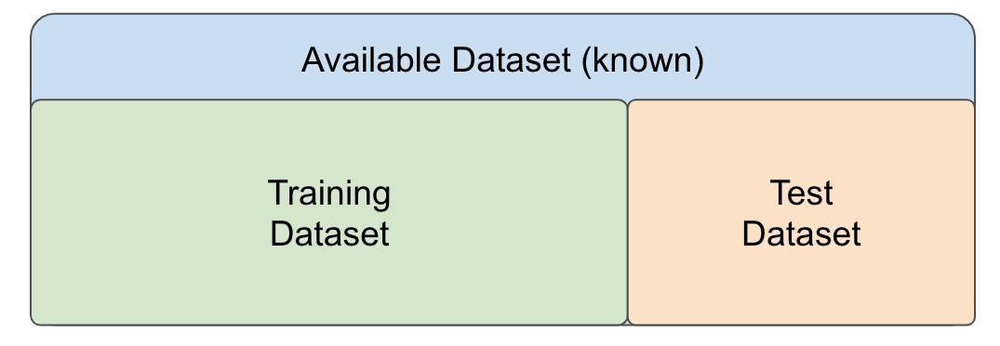
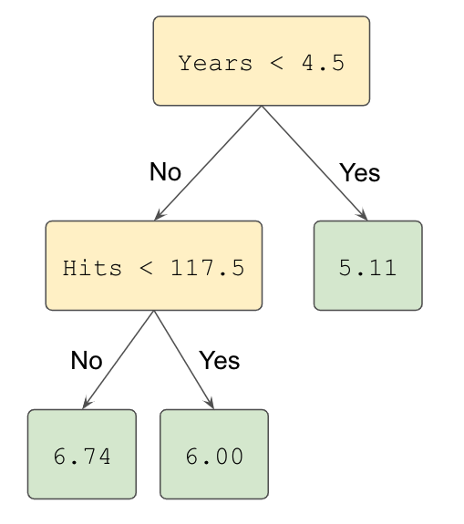
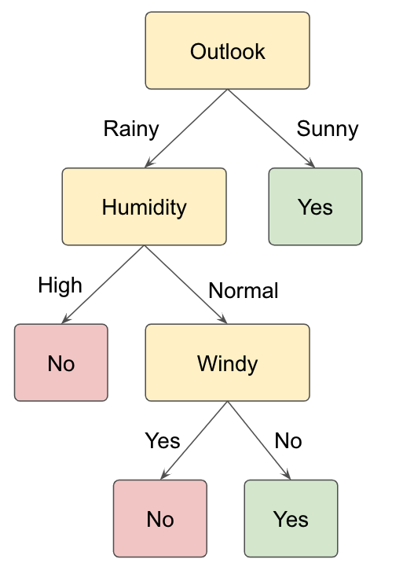

```{r, include=FALSE} 
knitr::opts_chunk$set(warning = FALSE, message = FALSE,
                      fig.align='center') 
```


# Supervised Learning

```{r, echo=F}
library(data.table)
library(magrittr)
library(caret)
library(dplyr)
library(ggplot2)
library(tidyr)
```


## Introduction

### Motivation

In the last two chapters we introduced linear and logistic regression models. The primary motivation lied in the interpretation of the coefficients, seen as the effect of explanatory variables on the response adjusted for the effects of other, potentially correlated, variables. Under some assumptions this even allowed us -- holy grail -- to conclude about conditional independence. Often, these models were considered as interpretable data generative models, supposed to reflect the underlying process.

In this chapter, we will take a supervised machine learning angle. Here, we are interested in good predictions rather than identifying the most predictive features or drawing conclusions about statistical independence. On the one hand, the goal is less ambitious. On the other hand, focusing on prediction accuracy alone allows unleashing a wide variety of modeling techniques. The application area is immense and contains the most prominent successes of today's artificial intelligence including medical diagnosis, image recognition, automatized translation, etc. We will learn how to evaluate the prediction performance on an independent test set and avoid problems related to poor generalization of a model to an independent test set. Additionally, we will introduce random forests as an alternative machine learning model for both regression and classification tasks.

### Supervised learning vs. unsupervised learning

Machine learning is the study of computer algorithms that improve automatically through experience^[https://en.wikipedia.org/wiki/Machine_learning].
Most machine learning problems can be mainly categorized into two: supervised or unsupervised problems. In **supervised learning**, the goal is to build a powerful algorithm that takes feature values as input and returns a prediction for an outcome, even when we do not know the value for the actual outcome. For this, we _train_ an algorithm using a data set for which we know the outcome, and then use this trained model to make predictions. In particular, for building the model, we associate each set of feature values to a certain outcome. In **unsupervised learning**, we do not associate feature values to an outcome. The situation is referred to as unsupervised because we lack an outcome variable that can supervise our analysis and model building. Instead, unsupervised learning algorithms identify patterns in the distribution of data. Typically, clustering problems and dimensionality reduction are attributed to unsupervised machine learning problems. 

A powerful framework to study supervised and unsupervised learning is statistical learning, which express these problems in statistical terms. Supervised learning then maps to the task of fitting conditional distribution $p(y|\x)$ where $y$ is the outcome and $\x$ are the features (or fitting aspects of the conditional distribution: the expectation, etc.). Linear regression is one method we already saw. Unsupervised learning in contrast refers to the task of fitting the distribution of the data $p(\x)$, or some aspects of it (covariance: PCA, mixture components: clustering, etc.)

This chapter focuses on supervised learning. In fact, logistic and linear regression are two classical methods in supervised learning for solving classification and regression tasks. 

### Notation

In this chapter, we will use the classical machine learning nomenclature:

  * $y$ denotes the _outcome_ (or response) that we want to predict 
  * $x_1, \dots, x_p$ denote the _features_ that we will use to predict the outcome.

<!-- The data set used for training is usually referred to as training data set.  -->


### Basic approach in supervised machine learning

In regression and classification tasks, we have a series of features and an unknown numeric or categorial outcome we want to predict:


```{r, echo=FALSE, message=FALSE, warning=FALSE}
library(tidyverse)
library(dslabs)
n <- 1
tmp <- data.table(outcome=rep("?",n),
                  feature_1 = paste0("$x_1$"),  
                  feature_2 = paste0("$x_2$"),
                  feature_3 = paste0("$x_3$"),
                  feature_4 = paste0("$x_4$"),
                  feature_5 = paste0("$x_5$"))
tmp %>% knitr::kable(align="c")
```

To _build a model_ that provides a prediction for any set of observed values $x_1, x_2, \dots x_5$, we collect data for which we know the outcome:

```{r, echo=FALSE}
n <- 10
tmp <- data.frame(outcome = paste0("$y_{", 1:n,"}$"),
                  feature_1 = paste0("$x_{",1:n,",1}$"),
                  feature_2 = paste0("$x_{",1:n,",2}$"),
                  feature_3 = paste0("$x_{",1:n,",3}$"),
                  feature_4 = paste0("$x_{",1:n,",4}$"),
                  feature_5 = paste0("$x_{",1:n,",5}$"))
tmp %>% knitr::kable()
```

We use this data to train the model and then use the trained model to apply to our (new) data for which we do not know the outcome.

Now... how do we evaluate our model? And how do we make sure our model will perform well on our (new) data?


## Over- and Under-fitting 

Analyzing whether our built model is generalizing well and capturing the trend of the data is an essential aspect of supervised machine learning. Two situations should be avoided: (1) that the model does not capture the trends of the data resulting in a high measured error between actual and predicted outcomes (under-fitting) and (2) that the model does not generalize well but fits the data used for training the model too well (over-fitting). 

### Example: polynomial curve fitting

As an example, we consider a polynomial curve fitting as a regression task with a dataset of $n =10$ points shown in Figure \@ref(fig:poly1) , each comprising an observation of the input variable $x$ along with the corresponding outcome variable $y$. In this example, the data is generated from the function $$f(x)=\sin(2πx)$$ (shown in blue) with added random noise from a normal distribution.

```{r poly1, echo=F, fig.cap="Data set of $N =10$ points  with a blue curve showing the function $sin(2πx)$ used to generate the data"}
set.seed(13)
N <- 9
x <- seq(0, 1, length.out = N)
y <- sin(2*pi*x) + rnorm(N,sd=0.2)
poly_dt <- data.table(x=x, y=y)

x_real <- seq(0, 1, length.out = 1000)
y_real <- sin(2*pi*x_real)
real_poly_dt <- data.table(x_real=x_real, y_real=y_real)

p <- ggplot(poly_dt,  aes(x,y)) + geom_point()
p <- p + geom_line(data=real_poly_dt, aes(x=x_real, y=y_real), color="blue") + theme_bw()
p
```


<!-- ```{r poly1, out.width = "300px", echo=FALSE, fig.cap="Data set of $N =10$ points (blue circles) with a green curve showing the function $sin(2πx)$ used to generate the data"} -->
<!-- knitr::include_graphics("assets/img/topic12_supervised_learning/overfitting_ex.png") -->
<!-- ``` -->


Assuming that we do not know the function plotted in the blue curve, the goal is to predict the value of $y$ for some new arbitrary value of $x$. For this, we want to exploit the given dataset of $n$ data points in order to make predictions of the value $y$ of the outcome variable for some new value $x$, which involves implicitly trying to discover the underlying function $f(x)=\sin(2πx)$. This is a difficult problem considering that we have to generalize from a finite dataset of only $n$ points. Furthermore, the given data points are include noise, and so for a given $x$, there is a certain uncertainty regarding the correct value for $y$.

We consider a simple approach based on curve fitting to make predictions for a given value of $x$. More precisely, we fit the data using a polynomial function of the form:

$$
y(x, \bs\beta) = \beta_0 + \beta_1x + \beta_2x^2 + ... + \beta_mx^m = \sum_{j=0}^m w_j x^j
$$


Here, $m$ is the order of the polynomial function and $x^j$ denotes $x$ raised to the power of $j$. The polynomial coefficients $\beta_0,...,\beta_m$ are denoted by the vector $\bs\beta$. Note that, the polynomial function $y(x, \bs\beta)$ is a nonlinear function of $x$ but it is a linear function of the coefficients $\bs\beta$. Hence, a linear regression model (see Chapter \@ref(chap-lin-reg)) can be applied to find optimal values of $\bs\beta$ assuming that we have selected a value for the order $m$ of the polynomial fit.  

As described in Chapter  \@ref(chap-lin-reg), an optimal linear model (with optimal $\bs\beta$ values) can be found by minimizing an error function (sum of squared errors) that measures the misfit between the function $y(x, \bs\beta)$ and the data points in the considered dataset. 

Selecting different values for the order $m$ of the polynomial has a huge impact on the resulting model. In Figure \@ref(fig:poly2), we show four examples of the results of fitting polynomials with different orders $m = 0, 1, 3$ and $9$ to our dataset of $n=10$ points.

```{r poly2, echo=F, fig.cap="Plots of polynomials having various orders $M$, shown as green curves, fitted to the considered data set with underlying expected value function in blue."}
## Trick for m=9 add one more point
## Somehow needed for poly() because number of unique points cannot be smaller than degree of polynomial 
library(patchwork)

x <- c(x, x[1]+0.001)
y <- c(y, y[1])

poly_0 <- lm( y~offset(x) ) 
poly_1 <- lm( y~x )
poly_3 <- lm( y~poly(x,3) )
poly_9 <- lm( y~poly(x,9) )

real_poly_dt[, m_0 := rep(poly_0$coefficients["(Intercept)"], nrow(real_poly_dt))]
real_poly_dt[, m_1 := predict(poly_1, data.frame(x=x_real))]
real_poly_dt[, m_3 := predict(poly_3, data.frame(x=x_real))]
real_poly_dt[, m_9 := predict(poly_9, data.frame(x=x_real))]

real_line <- geom_line(data=real_poly_dt, aes(x=x_real, y=y_real), color="blue") 

melted_dt <- melt(real_poly_dt, id.vars = "x_real")[variable!="y_real"]

p2 <- p + real_line +
 geom_line(data=melted_dt, aes(x=x_real, y=value), color="green")  + 
 facet_wrap(~variable) +
 theme_bw()
print(p2)
```


<!-- ```{r poly2, out.width = "300px", echo=FALSE, fig.cap="Plots of polynomials having various orders $M$, shown as red curves, fitted to the considered data set"} -->
<!-- knitr::include_graphics(c("assets/img/topic12_supervised_learning/overfitting_ex_all.png")) -->
<!-- ``` -->


We can clearly see that the constant ($m = 0$) and first order ($m = 1$) polynomials give rather poor fits to the data and consequently rather poor representations of the function $\sin(2πx)$. These two polynomial fits fail to capture the underlying trend of the data. A high error can be computed between the predicted and the actual data samples. These are examples of under-fitting. 

The third order ($m = 3$) polynomial seems to give the best fit to the function $\sin(2πx)$. By selecting $m=3$ in the previous example, we observe an appropriate balance between capturing the trends in the data to achieve good generalization and making accurate predictions for outcome values. 

When we go to a much higher order polynomial ($m = 9$), we obtain a polynomial that passes exactly through each data point. However, the fitted polynomial fails to give a good representation of
the function $\sin(2πx)$. The fitted curve considers each deviation in the data points (including noise). The model is too sensitive to noise and captures random patterns which are present only in the current dataset. Poor generalization to other datasets is expected. This latter behavior is known as over-fitting.

It is particularly interesting to examine the behavior of a given model as the size of the data set varies. We can see that, for a given model complexity, the over-fitting problem become less severe as the size of the data set increases.  In our example, by considering not only $10$, but $n=15$ or $n=100$ data points, we observe that increasing the size of the data set reduces the over-fitting problem (see Figure \@ref(fig:poly3)).

```{r poly3, echo=FALSE, fig.cap="Polynomial curve fitting with $n=15$ and $n=100$ data points and polynomial order $m=9$ in green and $\\sin(2πx)$ in blue."}
set.seed(13)
get_poly_dt <- function(N, x_pred){
  x <- seq(0, 1, length.out = N)
  y <- sin(2*pi*x) + rnorm(N,sd=0.2)
  poly_dt <- data.table(x=x, y=y)
  poly <- lm( y~poly(x,9) )

  dt_pred <- data.table(x_pred =x_pred)                                          
  dt_pred[, paste0("n_", N) :=  predict(poly, data.frame(x=dt_pred$x_pred)) ]
  
  p <- ggplot() + geom_point(data=data.table(x=x, y=y), aes(x,y)) + 
    geom_line(data=dt_pred, aes_string(x="x_pred", y=paste0("n_", N)), color="green") + 
    labs(title=paste0("N = ", N)) + theme_bw()
  return(p)
}
                                     
p_15 <- get_poly_dt(N=15, x_pred=x_real) + real_line
p_100 <- get_poly_dt(N=100, x_pred=x_real) + real_line
p_15 + p_100

```


This example, borrowed from the Christopher Bishop's textbook, is very informative about the approach taken in and the issues faced by supervised learning. 

First, supervised learning methods are more or less agnostic of the underlying processes. In our example, the underlying function is a sine. We may be looking at tides, an oscillating spring, etc. A physicist could come up with a model that leads to the right class of mathematical function. In supervised learning, we simply work with a generic class of flexible mathematical functions (here the polynomials, but there are many others), which can in principle approximate any function. One implication is that we will not aim at interpreting the coefficients. We would not pretend that the coefficient of say $x^4$ has any physical meaning. A physicist would (and could!) in contrast interpret the amplitude or the period of the sine. In supervised learning, what guides our choice of the fit is data and only data. In particular, the  complexity of the function we chose (here the order of polynomials) depends on how much data we have and not on theoretical considerations about the underlying process. 

Second, the key issue is that it is easy with flexible mathematical functions to fit extremely well to a dataset.  The challenge is not reducing the error on data at hand but the error on unseen data. Expected error on unseen data is called the **generalization error**. We will now investigate practical techniques to control the generalization error.


## Splitting the dataset for performance assessment 


As previously stated, a supervised learning task starts with an available dataset that we use to build a model so that this model will eventually be used in completely independent datasets, as shown in Figure \@ref(fig:dataset1). 

```{r dataset1, out.width = "500px", echo=FALSE, fig.cap="Illustration of an available set (in blue), whose outcome values are known and which is used to train a model, and an independent dataset (in grey), whose outcome values are unknown."}
knitr::include_graphics("assets/img/topic12_supervised_learning/dataset.png")
```

The first challenge arises when we do not know these independent datasets. However, in such cases, we still want to make sure that our model is not only working well when applied to the available dataset but can generalize well to independent unknown datasets. In particular, we want to make sure that we are not over-fitting to the dataset that the model was trained on.  

How to minimize error on data we have never seen? We will make the following assumption:

> We assume that the observations $\x_i, i=1...n$ of our dataset and of unseen data are i.i.d., meaning they are independent obsvervations of the same population.

Under this assumption, one common strategy to evaluate the performance of the model on independent datasets is to select a subset of our dataset and pretend it is an independent dataset. As illustrated in Figure  \@ref(fig:dataset2), we divide the available dataset into a training set and a test set. We will train our algorithm exclusively on the training set and use the test set only for evaluation purposes.

```{r dataset2, out.width = "500px", echo=FALSE, fig.cap="Separation of an available dataset into a training dataset (in green) and a test dataset (in orange) for building and evaluating a model."}

```

Typically, we select a small piece of the dataset so that we have as much data as possible to train. However, we also want the test set to be large enough to obtain a stable estimate of the performance of the model on independent datasets. Common choices for the size of the train set are to use 10\%-30\% of the data for testing. 

### Over-fitting to the training dataset

Over-fitting can be detected when the measured error computed from a defined error function is notably larger for the test dataset than for the training dataset. Alternatively, one can use performance measurements such as precision or recall or visualize the performance of the model on the training vs. test dataset with ROC or precision-recall curves. Notable differences with the measurements or the plotted curves are signs of over-fitting. 

In the previous example of the polynomial curve fitting, we can split the data consisting of $n=10$ data points into train and test datasets and compare the computed error for different polynomial orders $n$. For $m=9$, the computed root-mean-squared error for the test dataset notably increases while the error for the training dataset decreases.

<!-- Wesee in Figure \@ref(fig:poly4) that for $M=9$, the computed root-mean-squared error $E_{RMS}$ for the test dataset notably increases while the error for the training dataset decreases: -->

<!-- ```{r poly4, out.width = "500px", echo=FALSE, fig.cap="Graphs of the root-mean-square error, evaluated on the training set and on an test set for various values of M for the polynomial curve fitting example."} -->
<!-- knitr::include_graphics("assets/img/topic12_supervised_learning/overfitting_ex_error.png") -->
<!-- ``` -->

<!-- In practice, there are several approaches to avoid over-fitting. These include: -->

<!-- * increasing the size of the dataset (which is not always possible), -->
<!-- * hyper-parameter tuning (i.e. manipulating parameters that are specific to a model type, e.g. number of trees in a random forest), -->
<!-- * removing features, -->
<!-- * regularization techniques (out of scope of this lecture),  -->
<!-- * early stopping (or early termination) and -->
<!-- * cross-validation (which will be introduced in the following section). -->

<!-- More precisely, early termination is referred to stopping the the training process before the model’s ability to generalize weakens as it begins to over-fit the training data. Graphically, this can be explained with the following figure: -->

<!-- ```{r early stopiing, out.width = "300px", echo=FALSE, fig.cap="Graphical explanation of early-termination, meaning to stop the training process when the difference between the testing and training error starts to increase notably."} -->
<!-- knitr::include_graphics("assets/img/topic12_supervised_learning/early_stopping.png") -->
<!-- ``` -->


<!-- Now, splitting the dataset into train and test, presents a new problem because for most machine learning algorithms we need to select hyper-parameters, for example the number of neighbors  k  in k-nearest neighbors. Here, we will refer to the set of hyper-parameters as  $\lambda$. We need to optimize hyper-parameters without using our test set and we can imagine that if we optimize and evaluate on the same dataset, we will probably overfit. This is where cross-validation is useful. Furthermore, if not sufficient data is available to create train and test sets cross-validation is often used as a strategy to assess the performance of a machine learning model.  -->


### Cross-validation

Cross-validation is often used as a strategy to assess the performance of a machine learning model that can help to prevent over-fitting. 

In cross-validation the data is randomly split into a number k of folds (e.g. 3, 5 or 10), as illustrated in Figure \@ref(fig:crossval1).

```{r crossval1, out.width = "700px", echo=FALSE, fig.cap="Schematic Illustration of cross-validation with $k=3$ folds."}
knitr::include_graphics("assets/img/topic12_supervised_learning/c_val.png")
```

Then, a model is repeatedly trained on $k-1$ folds and evaluated on the fold not used for training. In this manner, we train $k$ models with a different training dataset on each fold $i$ with $i\in\{1,...,k\}$. After the $k$ models have been trained and evaluated on the respective left-out folds, evaluation metrics can be summarized into a combined evaluation metric. 

Now, how do we pick $k$ for the number of folds? Large values of $k$ are preferable because the training data better imitates the original dataset. However, larger values of $k$  will have much slower computation time: for example, 100-fold cross-validation will be 10 times slower than 10-fold cross-validation. For this reason, the choices of $k=5$  and $k=10$ are usually considered in practice. 

#### Pitfalls of cross-validation

For considering cross-validation one fundamental assumption has to be met, namely that the training samples and the test samples are independently and identically distributed (i.i.d.). As a trivial example, we would consider a non identical distribution if our training set consisted of red apples and green pears, but our test set also contained green apples. The issue of having non independent distributions may arise if we have data coming in clusters that we are not aware of (e.g: repeated measures, people from same families, homologous genes). 

As an example of this issue, we consider a simulated dataset `simulated_dt` consisting of a feature variable `x` and an outcome variable `y`:

```{r, echo=F}
sim_dt <- data.table(x=seq(1,8), y=c(0,2,2.5,5,7,6,8.5,7))
for(i in 1:10){
  c_name <- paste0("y_noise_", i)
  sim_dt[, c_name := y + rnorm(1, sd=0.3), with=F]  
}

simulated_dt <- melt(sim_dt, id.vars = "x", value.name = "y")
simulated_dt[, variable:=NULL]
simulated_dt<- simulated_dt[order(x)]
```

```{r}
head(simulated_dt, n=10)
```

We observe that the dataset contains repeated measures and that the between replicate simulated trend is `x=y`

```{r, echo=F}
ggplot(simulated_dt, aes(x,y)) + geom_point(alpha=0.7) + theme_bw()
```

Performing cross-validation at the level of individual data points will favor models that learn the clusters:

```{r, echo=F}
ggplot(simulated_dt, aes(x,y)) + geom_point(alpha=0.7) + geom_smooth(span = 0.15) + theme_bw()
```

We need to perform cross-validation at the cluster level to learn the trend across clusters. However, this is difficult without application knowledge. Visualization techniques can help. Application areas may have their own strategies. In genetics, models are required to be replicated on independent populations (genetic associations on say Swedes must be replicated among say Germans). The issue also arises with temporal data. Cross-validation cannot be done by taking random subsets of past data points. For temporal data, it is common practice (and common sense) to test models my mimicking predictions of future time points. See a broader discussion of this issue by @Roberts2017.

```{r, echo=F}
ggplot(simulated_dt, aes(x,y)) + geom_point(alpha=0.7) + geom_smooth(span = 0.15, se=FALSE) +
  geom_smooth(method='lm', se = FALSE, color="grey") + theme_bw()
```


#### Cross-validation in R

In R, one approach to implement a cross validated model is using the `caret` package. The `caret` package consolidates different machine learning algorithms and tools from different authors into one library. It conveniently provides a function that performs cross-validation.

As an example, we implement a logistic regression model to solve the binary classification task from Chapter \@ref(chap-log-reg), which consists in predicting the gender of a person based on height values of him/herself and his/her parents. First, we load the heights dataset: 

```{r}
heights_dt <- fread("extdata/height.csv") %>% na.omit() %>%
  .[, sex:=as.factor(toupper(sex))]
heights_dt
```

Then, we define the validation specification with the help of the function `trainControl()`. Here, we set the method as `cv` for cross-validation with `k=5` folds as the `number` argument. Additionally, we define `twoClassSummary` as the summary function for computing the sensitivity, specificity and the area under the ROC curve for performance measurement in binary classification tasks.

```{r}
# install.packages("caret")
library(caret)

# generate control structure
k <- 5    # number of folds
fitControl <- trainControl(method = "cv", # cv for cross-validation
                           number = k, 
                           classProbs=TRUE, # compute class probabilities 
                           summaryFunction = twoClassSummary
                           )
```

Next, we can train the model with the `train()` function. Here, we set the previously defined `fitControl` as the training control for implementing cross-validation:

```{r}
# run CV
lr_fit <- train(## formula and dataset definition
                sex~., 
                data = heights_dt,
                ## model specification
                method = "glm",
                family = "binomial",
                ## validation specification
                trControl = fitControl,
                ## Specify which metric to optimize
                metric = "ROC",
                )
lr_fit
```

As we can observe, the `lr_fit` object returns the average values for the computed values of sensitivity, specificity and the area under the ROC curve of the `k=5` trained models. The performance measurements for each model can be obtained as follows:

```{r}
lr_fit$resample
```

Additionally, the final model can be obtained by accessing the attribute `finalModel` from the `lr_fit` object:

```{r}
lr_fit$finalModel
```

## Random Forests as alternative models

There is a plethora of supervised learning algorithms out there. Providing a reasonable survey of them is out of the scope of this module. We therefore introduce here a single supervised learning method beyond linear and logistic regression which is working well in many situations: Random forests. Just as linear and logistic regression, should be the first baseline models to try, random forests can be seen as the first non-interpretable supervised learning model to give a shoot for. From this basis, many other options can be considered, often depending on the application areas.

Random forests can be applied to both regression and classification tasks in supervised learning. In this section, we introduce random forests as a further type of model for solving both tasks, as these are easy to understand and achieve state-of-the-art performance in many prediction tasks. 

Random forests are based on decision trees. More precisely, they are an instance of tree-based ensemble learning, which is a strategy robust to over-fitting and allows fitting very flexible functions. Each random forest is an ensemble of several decision trees, which are machine learning models for both classification and regression tasks and will be introduced in the following section. 

### The basics of decision trees

A decision tree is a method that involves partitioning or segmenting the training data set into a number of simple regions. Typically, once the input space of the training dataset has been segmented, we can make a prediction for a new input sample by using the mean or the mode of the training observations in the region to which the new input sample is assigned to. 

#### Decision trees for regression tasks

As an example for a decision tree model for a regression task, we consider the `Hitters` dataset ^[https://rdrr.io/cran/ISLR/man/Hitters.html] to predict a baseball player’s (log-transformed) `Salary` based on the feature `Years` (the number of years that he has played in the major leagues) and on the feature `Hits` (the number of hits that he made in the previous year). A regression tree for this dataset is shown in Figure \@ref(fig:dt1) The constructed tree consist of 3 splitting rules. First, observations having `Years<4.5` get passed to the right branch and observations having `Years>=4.5` to the left branch. The predicted log-transformed salary for these players in the right is given by the mean log-transformed salary of all training samples in this node, which is in this case `5.11`. Players assigned to the left  branch are further subdivided by the feature `Hits`. 

```{r dt1, out.width = "300px", echo=FALSE, fig.cap="Illustration of a decision tree for predicting the logarithmic salary of a baseball player based on the features Years and Hits."}

```

After the training is finalized, the tree regions the players into three regions: players who have played for four or fewer years, players who have played for five or more years and who made fewer than 118 hits last year, and players who have played for five or more years and who made at least 118 hits last year. A graphical representation of this resulting segmentation can be observed in Figure \@ref(fig:dt2). 

```{r dt2, echo=FALSE, fig.cap="Illustration of the resulting three regions from the trained decision tree based on Hits and Years."}
#knitr::include_graphics("assets/img/topic12_supervised_learning/dt_reg2.png")

rf_sim <-data.table( x = rnorm(500, sd=8, mean=1),
                      y = rnorm(500, sd=100, mean=117) )
region_labels <- data.table(labels=c("R1", "R2", "R3"),
                            x = c(2, 14, 14),
                            y = c(117.5, 60, 180) )

ggplot(rf_sim, aes(x,y)) + geom_point(color="grey") + 
  geom_segment(aes(x = 4.5, y = 4.5, xend = 4.5, yend = 238)) + # vertical line segment
  geom_segment(aes(x = 4.5, y = 117.5, xend = 24, yend = 117.5)) + # horizontal line segment
  xlim(1, 24) + ylim(1,238) +
  geom_text(data=region_labels, aes(x,y, label=labels), size=6) + 
  theme_bw()

```

Formally, the three resulting regions can be written as:

$$
\begin{align}
R_1 &=\{X | \text{Years}<4.5\} \\
R_2 &=\{X | \text{Years}>=4.5,\text{Hits}<117.5\}\\
R_3 &=\{X | \text{Years}>=4.5, \text{Hits}>=117.5\}
\end{align}
$$

Here, $X$ is the dataset consisting of all training samples and the regions $R_1$, $R_2$ and $R_3$ are the leaf nodes of the tree. All other nodes are denoted as internal nodes of the constructed decision tree.  

Decision trees are easy to interpret. In our example, we can interpret the tree as follows:

* `Years` is the most important feature for predicting the log-transformed salary of a player. Players with less experience earn lower salaries than more experienced players. 

* If a player is more experienced, the number of hits that he made in the previous year is important for determining his salary.

Now... why and how did we choose the feature `Years` and the threshold of `4.5` for the top split? Overall, the goal of a decision tree for regression tasks is to find the optional regions $R_1, R_2, ..., R_J$ that minimize the residual residual sum of squares (RSS) given by:

$$
\sum_{j=1}^J \sum_{i\in R_j} (y_i - \hat{y}_{R_j})^2,
$$

where $\hat{y}_{R_j}$ is the prediction for all samples in region $R_j$, which is computed from the mean of the outcome value for the training samples in region $R_j$^[Show that sample mean minimizes the least square errors to a set of observations.]. 

Unfortunately, it is computationally unfeasible to consider every possible partition of the training dataset. This is why decision trees follow a top-down greedy approach to build the tree. The approach is top-down because it begins at the top of the tree with the complete dataset and then successively splits the dataset. Here, each split results into two new branches further down on the tree. Note that the approach is greedy because at each step of the process, the best split is made at that particular step.

In order to perform recursive binary splitting, we first select the feature $X_j$ and a threshold $s$ such that splitting the samples into the regions $R_1(j,s) = {X|X_j < s}$ and $R_2(j,s) = {X|X_j ≥ s}$ results into the greatest possible reduction in RSS. For this, we consider all possible features $X_1,...,X_p$, and all possible values threshold values $s$ for each feature. In greater detail, for any $j$ and $s$, we want to minimize the equation:

$$
\sum_{i\in R_1(j,s)} (y_i - \hat{y}_{R_{1}})^2 + \sum_{i\in R_2(j,s)} (y_i - \hat{y}_{R_{2}})^2,
$$
Note that finding optimal values for thresholds and features can be achieved quickly with the current advances in computer science assuming that the number of features is not too large. 

The iterative process of finding features and thresholds that define splitting rules continues until a stopping criterion is met. This prevents to consider every possible partition of the training dataset. Stopping criteria include setting a minimum number of samples in a region or defining a maximum number of resulting regions. 

Once the regions $R_1,...,R_J$ have been created, we can predict the outcome of any given sample (from the test set) by assigning this sample to a region and returning the the mean of the training observations in the region to which that (test) sample belongs.

#### Decision trees for classification tasks

As stated before, decision trees can be applied for both regression and classification tasks. The construction process of classification decision trees is very similar to the one that we previously described for regression tasks. One difference is that for a regression tree, the predicted outcome for an observation is given by the mean response of the training observations that belong to the same leaf node. In contrast, for a classification tree, we predict that each observation belongs to the most commonly occurring class of training observations in the region to which it belongs.

Additionally, in contrast to regression scenarios, RSS cannot be used as a criterion for making the tree splits for classification tasks. Typically, cross-entropy is used to fit the model (See Section \@ref(ML-CE)).

<!-- A suitable alternative to RSS is the classification error rate $E$, which is simply the fraction of the training samples in a region that do not belong to the most common class in the region: -->

<!-- $$ -->
<!-- 1 - \max_k \hat{p}_{R_jk} -->
<!-- $$ -->

<!-- Here,  $\hat{p}_{jk}$ is the proportion of training samples in the region $R_j$ that belong to the class $k$. Alternatives to this classification error rate are the Gini Index $G$ and the cross entropy $CE$ which are more sensitive for tree-growing and are preferred in practice. These are defined by: -->

<!-- $$ -->
<!-- \begin{align} -->
<!-- G &= \sum_{k=1}^K \hat{p}_{R_jk} \cdot (1 - \hat{p}_{R_jk}) \\ -->
<!-- CE &= \sum_{k=1}^K \hat{p}_{R_jk} \cdot \log \hat{p}_{R_jk} -->
<!-- \end{align} -->
<!-- $$ -->

As an example we consider the binary classification task of deciding whether a person should play tennis on a given day or not. We consider the simulated data for training a model. The data contains four feature variables (`"Outlook"`, `"Temperature"`, `"Humidity"` and `"Windy"`) and the outcome variable `"Play.Tennis"`.

```{r, echo=F}
set.seed(123458)
n <- 10
play_tennis_dt <- data.table(Day=seq(1,n),
                             Outlook = sample(c("Sunny", "Rainy"), n, replace=T),
                             Temperature = sample(seq(15, 30, 0.5), n), #sample(c("Hot","Cold"), n, replace=T),
                             Humidity = sample(c("High","Normal"), n, replace=T),
                             Windy = sample(c("Yes","No"), n, replace=T)
                             #Play.Tennis = sample(c("Yes","No"), n, replace=T)
                             )


play_tennis_dt[, Play.Tennis:= ifelse(Outlook=="Sunny", "Yes",
                                      ifelse(Humidity=="High", "No", "Yes"))]

play_tennis_dt[Day==1, Play.Tennis := "No"] 
play_tennis_dt[Day==1, Outlook := "Sunny"] 
```

```{r}
play_tennis_dt
```

Figure \@ref(fig:dt3) shows an example of a decision tree for solving the described classification task.The initial splitting rule tests whether the value of the `Outlook` feature of each sample is either sunny or rainy. Samples with the feature value being sunny are passed to the right node. If the outlook is rainy for a subset of the initial samples in the dataset, these samples are passed to the left node. Here, a second feature test is performed. This test involves checking the humidity feature for all samples. If the humidity value is normal, a third splitting rule is defined for checking whether the day is windy or not. In total, four regions results from the training process of the decision tree. 

```{r dt3, out.width = "300px", echo=FALSE, fig.cap="Example of a decision tree for the binary classification task of deciding whether to play tennis or not based on the features Outlook, Humidity and Windy."}

```


Note that decision trees for classification tasks can be constructed with both numerical and categorical features, even though our tennis example only contains categorical data. Feature tests for numerical features can be formulated with an (un)equality for a certain feature, as described before for regression trees. For instance, a node in a decision tree could test whether the temperature feature is higher than 20 degrees Celsius (`Temperature>20`).


<!-- #### Decision trees in R -->


<!-- In R, we can use the `rpart` function from the `rpart` package to train decision trees (for both classification and regression problems). -->

<!-- ```{r} -->
<!-- #install.packages("rpart") -->
<!-- library(rpart) -->

<!-- dt_classifier <- rpart(Play.Tennis ~ ., data = play_tennis_dt) -->
<!-- dt_classifier -->
<!-- ``` -->

<!-- We can plot the resulting decision tree as follows: -->

<!-- ```{r} -->
<!-- plot(dt_classifier, margin = 0.1) -->
<!-- text(dt_classifier, cex = 0.75) -->
<!-- ``` -->

### Random Forests for classification and regression tasks

For constructing a random forest, the first step is called aggregation (or bagging), which involves generating many predictors, each using regression or classification trees. To ensure that the individual trees are not the same, we use bootstrap to induce randomness. These two features combined explain the name: the bootstrap makes the individual trees randomly different, and the combination of trees is the forest. In a random forest for classification tasks, the predicted output is the majority vote of the contained decision trees. In contrast, the predicted value of a random forest regressor is the mean of the predictions from each decision tree in the random forest. 

```{r rf, out.width = "500px", echo=FALSE, fig.cap="Illustration of a random forest for classification tasks. Source: By Venkata Jagannath - https://community.tibco.com/wiki/random-forest-template-tibco-spotfirer-wiki-page, CC BY-SA 4.0, https://commons.wikimedia.org/w/index.php?curid=68995764"}
knitr::include_graphics("assets/img/topic12_supervised_learning/rf_wiki.png")
```

The specific steps for building a random forest can be formulated as follows: 

1. Build  $B$ decision trees using the training set. We refer to the fitted models as $T_1,T_2,...,T_B$.

2. For every observation in the test set, form a prediction $\hat{y}_j$ using tree $T_j$

3. For continuous outcomes, form a final prediction with the average  $\hat{y} =\frac{1}{B}\sum_{j=1}^B \hat{y}_j$. For categorical outcomes, predict $\hat{y}$ with majority vote (most frequent class among  $\hat{y}_1, ..., \hat{y}_B$.

Now... how do we assure that the decision trees are different in the random forest, even if they are trained on the same training dataset? For this, we use randomness in two ways. Let $N$ be the number of observations in the training set. To create the trees $T_1,T_2,...,T_B$ from the training set we do the following with the feature and sample selection:

1. Create a bootstrap training set by sampling $N$ observations from the training set with replacement. In this manner, each tree is trained on a different dataset.

2. Randomly select a subset of the features to be included in the building of each tree so that not all features are considered for each tree. A different random subset is selected for each tree. This reduces correlation between trees in the forest and prevents over-fitting.

### Random Forests in R

We use function `randomForest` from the package `randomForest` for training random forests in R. 

```{r}
# install.packages("randomForest")
library(randomForest)
```

As an example, we train a random forest classifier for predicting the gender of each person in the `heights_dt` data table given the height values of the person and the person's parents as before. We define the values for a few hyper parameters such as the number of trees in the random forest (`ntree`), the minimum number of samples in a leaf node (`nodesize`) and the maximum number of leaf nodes in a tree (`maxnodes`). 

```{r}
rf_classifier <- randomForest(## Define formula and data
                              sex~.,
                              data=heights_dt,
                              
                              ## Hyper parameters
                              ntree=100,     # Define number of trees
                              nodesize = 5,  # Minimum size of leaf nodes
                              maxnodes = 30 # Maximum number of leaf nodes
                              )

rf_classifier
```

We remark that the number of threes (`ntree`), the minimum size of leaf nodes (`nodesize`) and the maximum amount of leaf nodes (`maxnodes`) in each tree are hyper parameters of random forests. These should be optimized (or tuned) for each application to achieve a better performance of the models. Two popular approaches are grid search and random reach. Hyper-parameter tuning is out the scope of this lecture. We refer the interested reader to the practical methodology chapter of the Deep learning book [@Goodfellow-et-al-2016].


For predicting the gender of an input sample using the trained model stored in the variable `rf_classifier`, we can use the function `predict` as follows: 

```{r}
heights_dt[, sex_predicted:= predict(rf_classifier,
                                     heights_dt[,-c("sex")])]
heights_dt
```


## Conclusion

This chapter introduced concepts from supervised machine learning for prediction tasks. Here, the main focus is to build and evaluate models that identify trends in the training dataset but are still able to generalize to (new) independent datasets. We described cross-validation as a strategy to prevent over-fitting. 

Additionally, we introduced random forests as alternative machine learning models to linear and logistic regression for regression and classification tasks, since they are easy to understand and interpret and still show good performance in many application tasks. However, there are many more algorithms for solving regression and/or classification tasks in supervised learning. A few of the most popular methods include support vector machines (SVMs), (Deep) Neural Networks, k-Nearest Neighbors and Naive Bayes classifiers. 

## Resources

* Christopher M. Bishop. 2006. Pattern Recognition and Machine Learning (Information Science and Statistics). Springer-Verlag, Berlin, Heidelberg.

* Rafael A. Irizarry. 2019. Introduction to Data Science. Data Analysis and Prediction Algorithms with R . 

* Gareth James, Daniela Witten, Trevor Hastie & Robert Tibshirani. 2013. An Introduction to Statistical Learning with Applications in R.

* The caret package manual:
https://topepo.github.io/caret/

* The Datacamp machine learning courses:
https://www.datacamp.com/courses/machine-learning-toolbox


